# Full Text Search with Elasticsearch

## Table of Contents

- [Introduction](#introduction)
- [The Problem: Traditional Database Search](#the-problem-traditional-database-search)
- [The Solution: Inverted Index](#the-solution-inverted-index)
- [Understanding Elasticsearch](#understanding-elasticsearch)
- [Search Relevance & Scoring](#search-relevance--scoring)
- [Real-World Use Cases](#real-world-use-cases)
- [Elasticsearch vs PostgreSQL](#elasticsearch-vs-postgresql)
- [Getting Started](#getting-started)
- [Best Practices](#best-practices)

---

## Introduction

### The Search Problem Evolution

**2005 Context:**

- E-commerce companies growing rapidly
- Number of products: thousands → millions
- Search requirements becoming more complex
- Speed and relevance now matter

**The Question:**

> How do we search through millions of products blazingly fast while returning relevant results?

The answer led to the invention of **full-text search engines** like Elasticsearch, powered by an elegant concept: the **inverted index**.

---

## The Problem: Traditional Database Search

### Traditional LIKE Query

```sql
SELECT * FROM products
WHERE name LIKE '%laptop%'
   OR description LIKE '%laptop%'
```

**How It Works:**

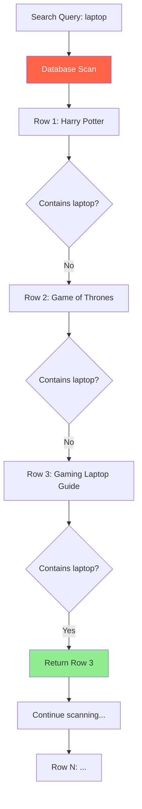

### The Library Analogy

Imagine a librarian looking for books about "Machine Learning":

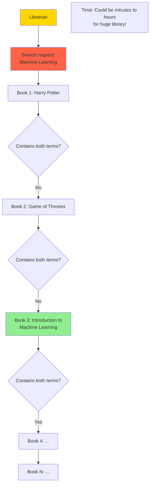

### Problems with LIKE Queries

| Problem                  | Impact                                     |
| ------------------------ | ------------------------------------------ |
| **Full Table Scan**      | Every row examined one by one              |
| **No Relevance**         | Just returns matching rows in random order |
| **Slow with Large Data** | 30 seconds+ for millions of products       |
| **No Typo Tolerance**    | "lapto" returns 0 results                  |
| **Poor User Experience** | Users leave frustrated                     |

**Performance Degradation:**

```
Products: 5,000        → Query time: 50ms  ✓
Products: 50,000       → Query time: 500ms ✓
Products: 100,000      → Query time: 2.5s  ⚠
Products: 1,000,000    → Query time: 30s   ✗
Products: 10,000,000   → Query timeout    ✗✗
```

---

## The Solution: Inverted Index

### The Revolutionary Idea

**Traditional Approach (Forward Index):**

```
Document 1 → Contains: [machine, learning, algorithms, ...]
Document 2 → Contains: [the, machine, age, innovation, ...]
Document 3 → Contains: [deep, learning, fundamentals, ...]
```

Problem: Must search every document to find a term.

**Revolutionary Approach (Inverted Index):**

```
Term: "machine"
  → Document 1 (page 1, 15, 23)
  → Document 2 (page 5, 89)
  → Document 3 (page 1)

Term: "learning"
  → Document 1 (page 1, 16, 24)
  → Document 3 (page 5, 12)
```

Solution: Go directly to term, find all documents containing it!

### Inverted Index Visualization

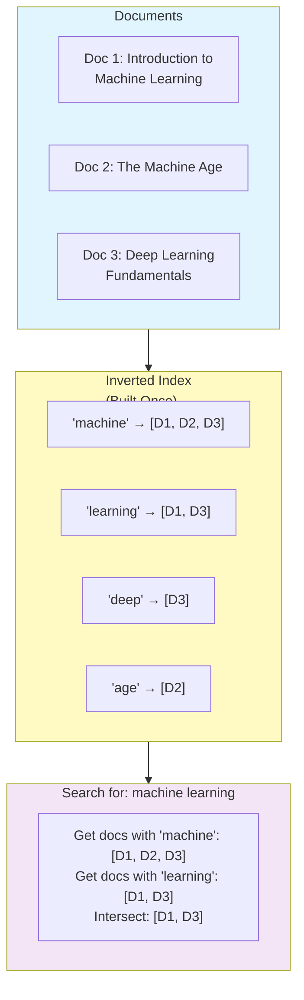

### How Inverted Index Works

**Step 1: Index Creation (One-time)**

```
Book: "Introduction to Machine Learning"
↓
Extract terms: [introduction, to, machine, learning]
↓
Store mapping:
  introduction → page 1, 5, 12
  machine → page 1, 15, 23
  learning → page 1, 16, 24
  to → page 1
```

**Step 2: Search (Fast lookup)**

```
Query: "machine learning"
↓
Look up "machine" → [page 1, 15, 23]
Look up "learning" → [page 1, 16, 24]
↓
Combine results → Return documents
```

### Key Advantage: Speed

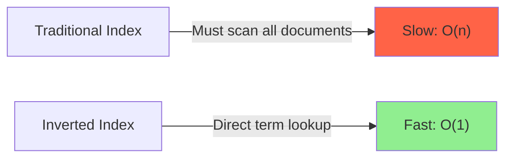

**Real Numbers:**

- Traditional: 30 seconds for 1M products
- Inverted Index: 50 milliseconds for 1M products
- **Difference: 600x faster!**

---

## Understanding Elasticsearch

### What is Elasticsearch?

**Definition:**
Open-source search and analytics engine built on top of Apache Lucene, using inverted indices for blazingly fast full-text search.

**Why Elasticsearch?**

- Not just for search: also used for logging (ELK stack)
- Fast and scalable
- Distributed architecture
- Advanced features (typo tolerance, fuzzy matching, etc.)

### Architecture

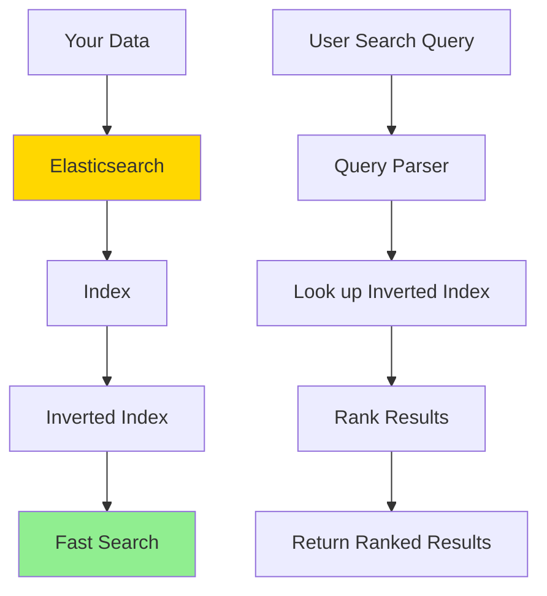

### Document Structure

```javascript
{
  "id": 1,
  "title": "Gaming Laptop Pro",
  "description": "High-performance laptop for gaming and work",
  "price": 1299,
  "category": "Electronics",
  "sentiment": "positive"
}
```

**Similar to MongoDB, but optimized for search!**

---

## Search Relevance & Scoring

### The Relevance Problem

**Scenario:** Search for "machine learning"

```
Result 1: Document titled "Introduction to Machine Learning"
  → Contains both words in title
  → Mentioned 500+ times throughout
  → Very relevant

Result 2: "Coffee Machine Manual"
  → Contains "machine"
  → "Learning" mentioned once on last page
  → Not relevant
```

Without relevance scoring, both appear equally.

### BM25 Relevance Algorithm

Elasticsearch uses **BM25 algorithm** to score results.

**Scoring Factors:**

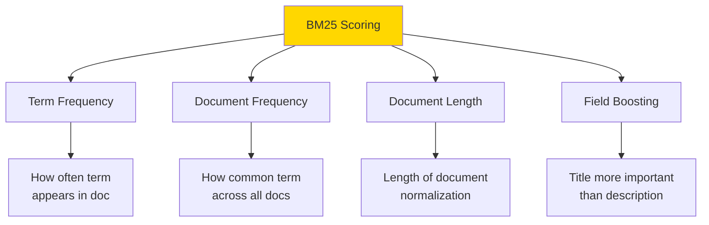

### Relevance Scoring Example

**Query: "machine learning"**

```
Document 1: Introduction to Machine Learning
├─ Term frequency: Appears 100+ times ✓✓✓
├─ In title: YES ✓✓✓
├─ Document frequency: 0.5 (common term)
└─ Score: 8.5 (HIGHEST)

Document 2: The Machine Age
├─ Term frequency: Appears 2 times
├─ In title: YES ✓✓
├─ Document frequency: 0.8 (very common)
└─ Score: 3.2

Document 3: Coffee Machine Manual
├─ Term frequency: Appears 1 time
├─ In title: NO
├─ Document frequency: 0.9 (very common)
└─ Score: 0.8 (LOWEST)

Results sorted by score (highest first)
```

### Field Boosting

Weight different fields based on importance:

```javascript
Title mentioned: 3x weight
Description mentioned: 2x weight
Content mentioned: 1x weight
```

**Effect on Scoring:**

- Same term in title = much higher score
- Customizable: control relevance behavior

---

## Real-World Use Cases

### Use Case 1: E-commerce Product Search

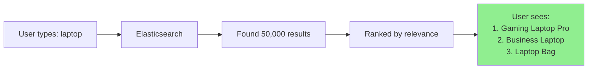

**Features:**

- Typo tolerance: "lapto" → suggests "laptop"
- Autocomplete/type-ahead
- Faceted search (filter by price, brand, etc.)

### Use Case 2: Log Management (ELK Stack)

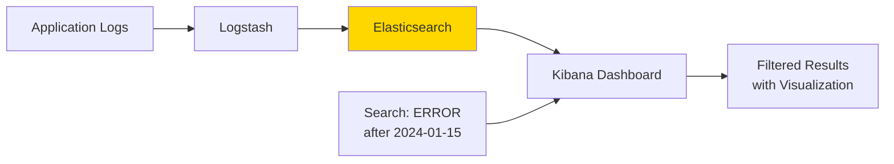

**Where logs go:**

1. **Elasticsearch** - stores and indexes logs
2. **Kibana** - visualizes data
3. Together = powerful log analysis

### Use Case 3: Type-Ahead/Autocomplete

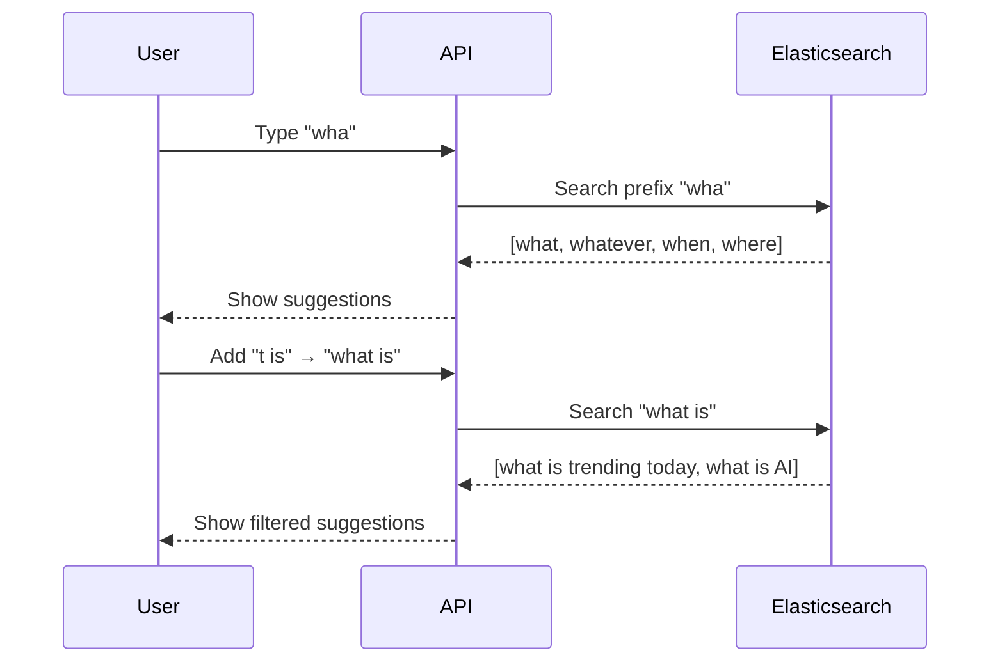

### Use Case 4: Typo Tolerance

```
User types: "treanding"
↓
Elasticsearch fuzzy match: "trending"
↓
Returns: "What is trending today"
↓
User sees corrected results
```

**How it works:**

- Edit distance: measures how many changes needed
- Fuzzy search: finds "close enough" matches
- Configurable tolerance

---

## Elasticsearch vs PostgreSQL

### Speed Comparison

**Test Setup:**

- 50,000 product reviews
- Same query on PostgreSQL (LIKE) and Elasticsearch
- Fair comparison: same region, same setup

**Results:**

| Query              | PostgreSQL          | Elasticsearch    | Difference   |
| ------------------ | ------------------- | ---------------- | ------------ |
| Search "laptop"    | 3,000ms             | 1,000ms          | 3x faster    |
| Search "something" | 7,500ms             | 500ms            | 15x faster   |
| Multiple queries   | Consistent slowness | Consistent speed | 5-15x faster |

**Performance Graph:**

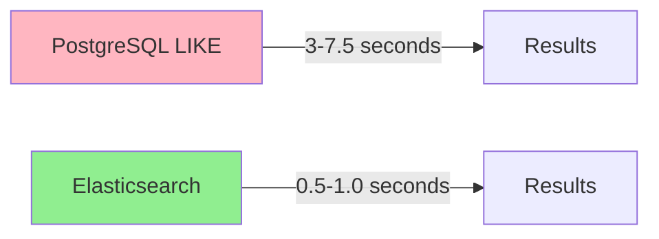

### Feature Comparison

| Feature               | PostgreSQL | Elasticsearch |
| --------------------- | ---------- | ------------- |
| **Full-text search**  | ✓ Basic    | ✓✓ Advanced   |
| **Relevance scoring** | ✗          | ✓✓ BM25       |
| **Typo tolerance**    | ✗          | ✓             |
| **Autocomplete**      | ✗          | ✓             |
| **Faceted search**    | ✗          | ✓             |
| **Performance**       | O(n) scan  | O(1) lookup   |
| **Setup complexity**  | Simple     | Moderate      |

### When to Use What

**Use PostgreSQL Full-Text Search when:**

- Search is secondary feature
- Limited resources
- Already using PostgreSQL
- Simplicity is priority
- Low data volume

**Use Elasticsearch when:**

- Search is core feature
- High data volume
- Need advanced ranking
- Typo tolerance required
- Building ELK stack anyway
- Performance critical

---

## Getting Started

### Setup Options

#### Option 1: Elastic Cloud (Managed)

```bash
# Simplest - no infrastructure management
# Sign up at cloud.elastic.co
# Get instant Elasticsearch instance
```

#### Option 2: Docker (Local Development)

```bash
docker run -d \
  -e "discovery.type=single-node" \
  -p 9200:9200 \
  docker.elastic.co/elasticsearch/elasticsearch:8.0.0
```

#### Option 3: Self-Hosted (Production)

```bash
# Download and configure Elasticsearch
# Requires infrastructure management
# More control, more responsibility
```

### Basic Operations

#### Index a Document

```javascript
// Using Elasticsearch Node.js client
const { Client } = require("@elastic/elasticsearch");
const client = new Client({ node: "http://localhost:9200" });

// Index a document
await client.index({
  index: "products",
  id: "1",
  document: {
    title: "Gaming Laptop Pro",
    description: "High-performance laptop for gaming",
    price: 1299,
    category: "Electronics",
  },
});
```

#### Bulk Index (Faster)

```javascript
// Insert 50,000 documents efficiently
const body = products.flatMap((doc) => [
  { index: { _index: "products", _id: doc.id } },
  doc,
]);

await client.bulk({ body });
```

#### Search Query

```javascript
const response = await client.search({
  index: "products",
  query: {
    multi_match: {
      query: "gaming laptop",
      fields: ["title^3", "description", "category"], // title boosted 3x
    },
  },
  size: 20,
});

console.log(response.hits.hits); // Top 20 results ranked
```

#### Fuzzy Search (Typo Tolerance)

```javascript
const response = await client.search({
  index: "products",
  query: {
    match: {
      title: {
        query: "lapto",
        fuzziness: "AUTO", // Autocorrect
      },
    },
  },
});

// Returns results for "laptop" even though user typed "lapto"
```

---

## Practical Demo

### Challenge: Search 50,000 Reviews

**Dataset:**

- 50,000 product reviews
- Each with: text, sentiment (positive/negative)
- PostgreSQL vs Elasticsearch comparison

### Setup

**PostgreSQL Schema:**

```sql
CREATE TABLE reviews (
  id SERIAL PRIMARY KEY,
  review TEXT NOT NULL,
  sentiment VARCHAR(20)
);
-- Loaded with 50,000 reviews
```

**Elasticsearch Mapping:**

```javascript
{
  "mappings": {
    "properties": {
      "review": { "type": "text" },
      "sentiment": { "type": "keyword" }
    }
  }
}
```

### Results

**Test 1: Search "laptop"**

```
PostgreSQL: 3,000ms (3 seconds)
Elasticsearch: 1,000ms (1 second)
Winner: Elasticsearch (3x faster)
```

**Test 2: Search "something"**

```
PostgreSQL: 7,500ms (7.5 seconds)
Elasticsearch: 500ms (0.5 seconds)
Winner: Elasticsearch (15x faster)
Results: 8,000 matches found by both
```

**Test 3: Same query repeated**

```
PostgreSQL: Still 7,500ms (not cached)
Elasticsearch: Still 500ms (consistent)
Winner: Elasticsearch (reliability)
```

### Why the Speed Difference?

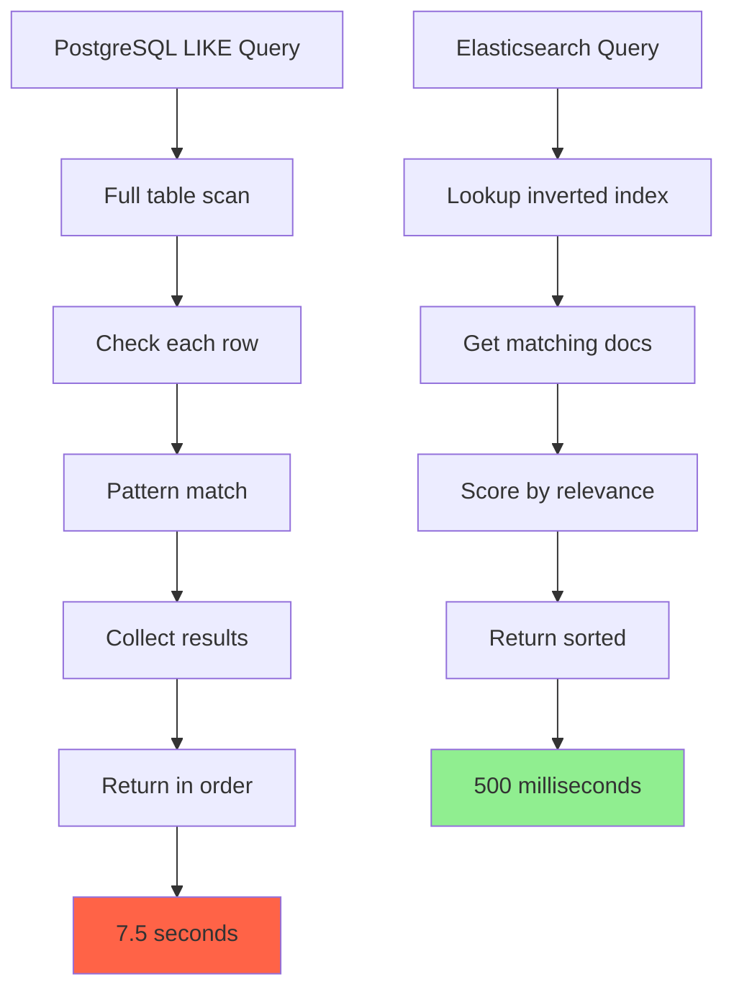

---

## Best Practices

### 1. Field Boosting

```javascript
// Title more important than description
fields: [
  "title^3", // 3x weight
  "description^2", // 2x weight
  "content", // 1x weight (default)
];
```

### 2. Relevance Tuning

```javascript
// Customize BM25 parameters
"similarity": {
  "custom_bm25": {
    "type": "BM25",
    "k1": 1.2,    // Term frequency saturation point
    "b": 0.75     // Field length normalization
  }
}
```

### 3. Filtering + Scoring

```javascript
// Filter first (fast), score second (results)
query: {
  bool: {
    must: [
      { match: { title: 'laptop' } }  // Must contain
    ],
    filter: [
      { range: { price: { gte: 500, lte: 2000 } } },
      { term: { category: 'Electronics' } }
    ]
  }
}
```

### 4. Pagination

```javascript
// Use from/size for pagination
from: 20,      // Skip first 20
size: 20,      // Return next 20
```

### 5. Monitoring

```javascript
// Monitor cluster health
GET / _cluster / health;

// Check index stats
GET / products / _stats;

// Monitor indexing performance
GET / _cat / indices;
```

---

## Key Takeaways

1. **Inverted Index is Revolutionary** - Flip the search problem for amazing speed

2. **LIKE queries don't scale** - Full table scans become unbearable with millions of records

3. **Speed Gains Are Massive** - 5-15x faster than traditional database searches

4. **Relevance Matters** - BM25 scoring returns meaningful results first

5. **Typo Tolerance Improves UX** - Users don't have to type perfectly

6. **Easy to Start** - Copy-paste examples from docs work for most cases

7. **Choose Right Tool**:
   - Simple search? PostgreSQL full-text is fine
   - Advanced search? Go with Elasticsearch
   - Already using logs? Elasticsearch makes sense

8. **Real-World Performance** - Tested and proven on millions of documents

9. **Field Boosting is Powerful** - Control relevance with title/description weights

10. **Not Just for Search** - Elasticsearch powers ELK stack for log management

---

## When to Use Full-Text Search

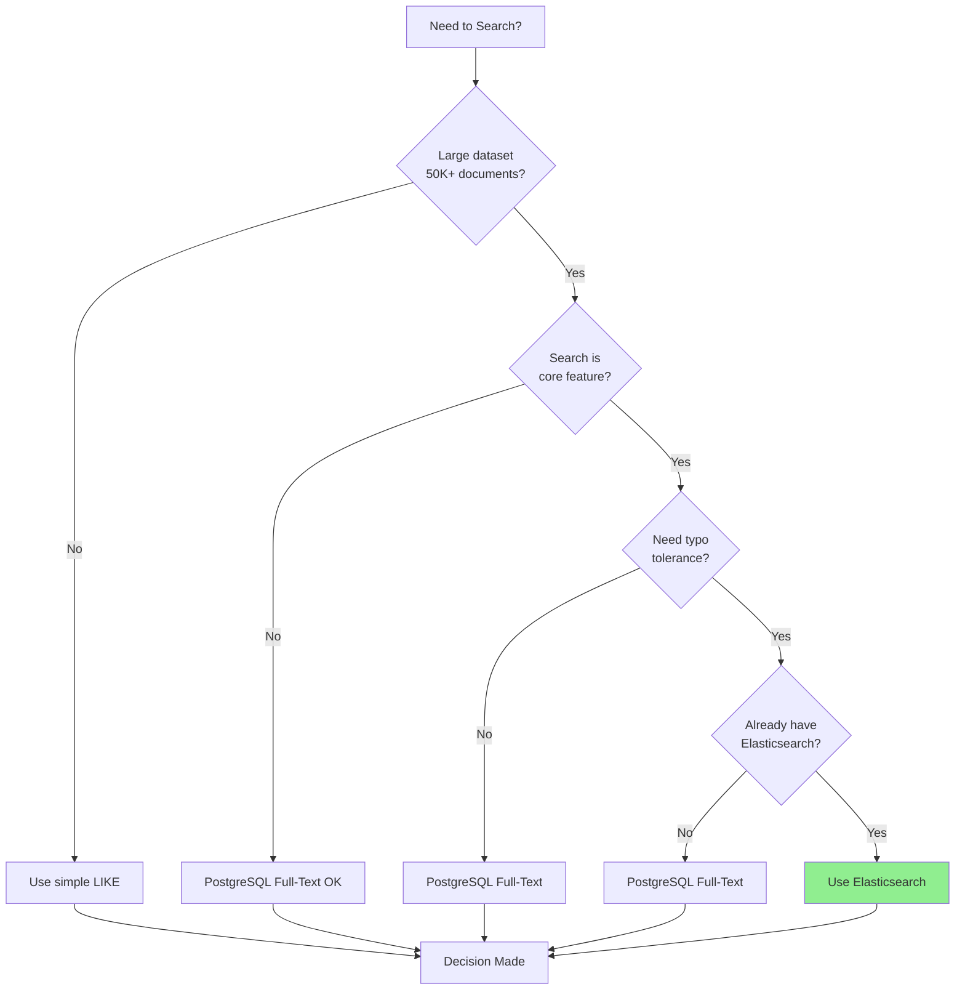

---

## Resources

- **Official Docs:** [Elasticsearch Documentation](https://www.elastic.co/guide/en/elasticsearch/reference/current/index.html)
- **Learn:** [Elasticsearch Labs](https://www.elastic.co/search-labs)
- **Alternatives:** Solr, Apache Lucene, MeiliSearch
- **PostgreSQL Full-Text:** Built-in, no external dependency
