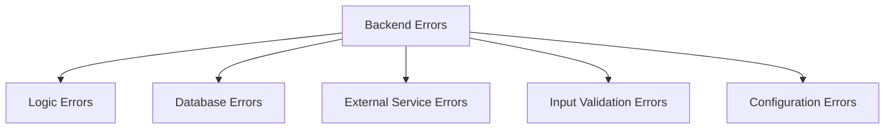
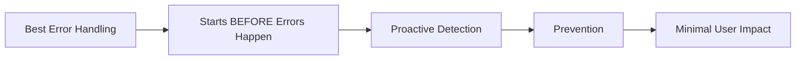
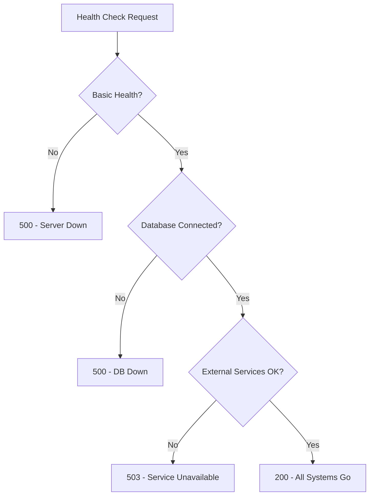
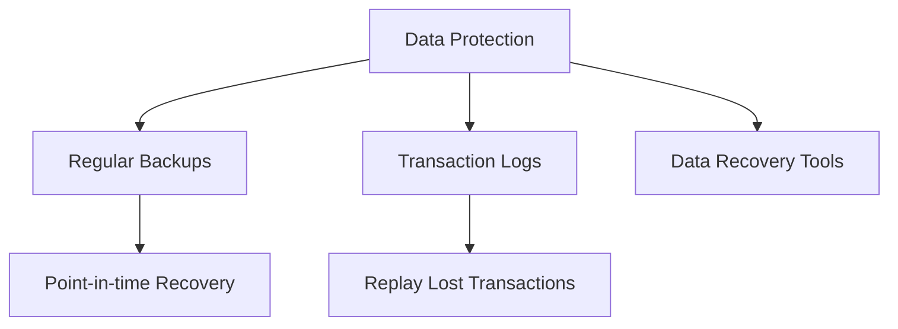
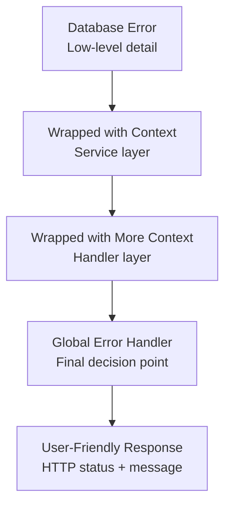
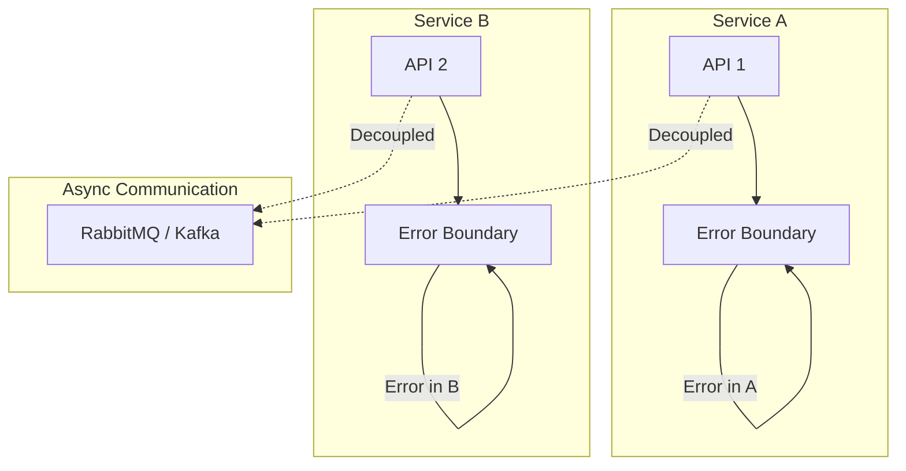
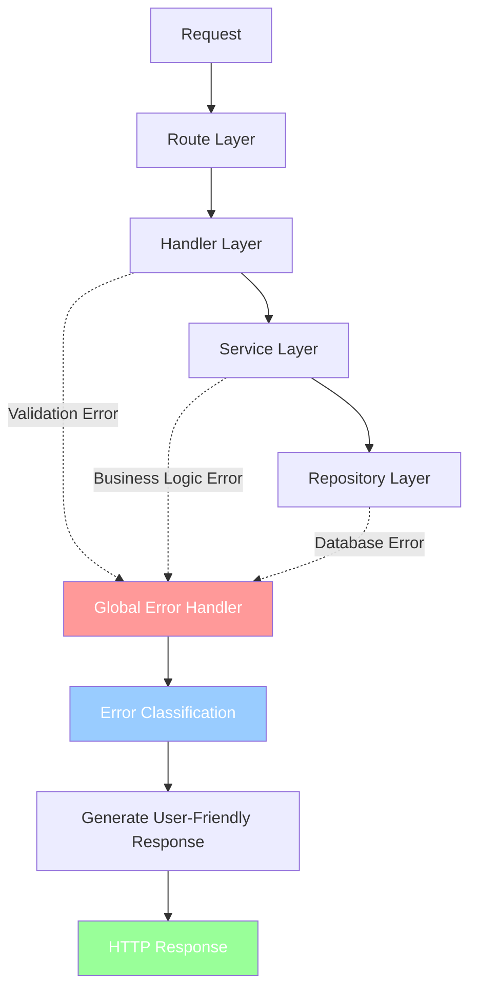
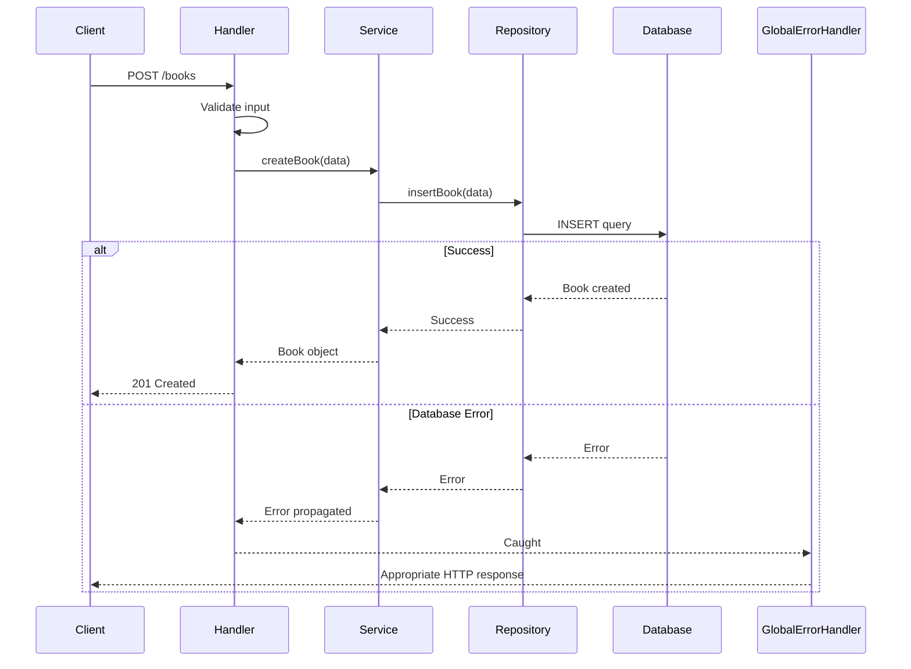

# Error Handling & Building Fault Tolerant Systems

## Table of Contents
- [Introduction](#introduction)
- [Types of Errors](#types-of-errors)
- [Error Prevention Strategies](#error-prevention-strategies)
- [Monitoring & Observability](#monitoring--observability)
- [Error Handling Philosophies](#error-handling-philosophies)
- [Global Error Handler Pattern](#global-error-handler-pattern)
- [Security Considerations](#security-considerations)

---

## Introduction

### The Core Mindset

In backend development, **errors are not problems to solve—they're normal**. Every developer must understand:

1. **Errors will happen** - It's not a matter of if, but when
2. **Preparation is key** - You need to be ready to detect, prevent, and fix them
3. **Your responsibility** - As a backend engineer, you're responsible for:
   - Executing core business logic seamlessly
   - Ensuring every transaction and user activity flows without interruption
   - Building a **fault-tolerant mindset**

### Common Error Scenarios

```
✗ Database queries sometimes fail
✗ External APIs sometimes time out
✗ Users sometimes send bad data
✗ Business logic hits unexpected edge cases
```

**The question isn't whether errors will happen—it's how you'll handle them when they do.**

---

## Types of Errors

### Error Classification



---

### 1. Logic Errors

**What are they?**
The sneakiest and most dangerous type because they don't crash your app—they just make it do the wrong thing.

**Characteristics:**
- Code runs fine, but results are incorrect
- Can go unnoticed for weeks or months
- Quietly cause damage while you're unaware
- Can lead to significant financial loss

**Real-World Example: E-commerce Disaster**

```
Scenario: Discount applied twice
Result: Customers receive negative shipping costs
Impact: Platform loses money on every single order
Detection: Weeks or months later (if discovered at all)
```

**Common Causes:**

| Cause | Impact |
|-------|--------|
| Misunderstood requirements | Wrong feature implemented |
| Incorrect algorithms | Wrong calculations (especially with discounts/payments) |
| Unhandled edge cases | Unexpected user behavior breaks logic |

**Prevention:**
- Clarify requirements during sprint planning
- Write comprehensive tests
- Consider edge cases during design
- Monitor business metrics for anomalies

---

### 2. Database Errors

Database errors can bring your entire system down since most backends rely heavily on their database.

#### 2.1 Connection Errors

**What happens:**
- Backend cannot communicate with database
- Frontend shows empty screens everywhere
- API calls fail with 500 errors

**Common Causes:**
- Network is down
- Database server is overloaded
- Connection pool is exhausted

**Connection Pooling Context:**

```
Without Pooling:
Each request → TCP handshake → Query → Close
(Expensive, slow)

With Pooling:
Pre-established connections (TCP already open)
Each request → Reuse connection → Query
(Efficient, fast)
```

#### 2.2 Constraint Violations

**Unique Constraint Violation:**
```sql
-- User tries to create account with existing email
INSERT INTO users (email, name) VALUES ('john@example.com', 'John');
-- Error: Unique constraint violation
-- Email 'john@example.com' already exists
```

**Foreign Key Violation:**
```sql
-- User tries to create order with non-existent customer
INSERT INTO orders (customer_id, amount) VALUES (999, 100);
-- Error: Foreign key constraint violation
-- Customer ID 999 doesn't exist in customers table
```

**Prevention:**
- Strengthen validation layer on frontend and backend
- Handle database-level errors gracefully
- Return user-friendly error messages

#### 2.3 Query Errors

**Causes:**
- Typos in SQL (table/column names don't exist)
- Malformed queries
- Complex queries that timeout
- Deadlocks

**Deadlock Example:**
```
Transaction A: Locks Table 1, wants Table 2
Transaction B: Locks Table 2, wants Table 1
Result: Circular dependency → Deadlock
```

---

### 3. External Service Errors

**Why External Dependencies Are Critical:**

Modern SaaS applications depend on many external services:
- Payment processors (Stripe, PayPal)
- Email providers (SendGrid, Resend)
- Cloud storage (AWS S3, Azure Blob)
- Authentication (Auth0, Clerk)

**Each external dependency = Point of Failure**

You don't control them, but you must prepare for their failure.

#### 3.1 Network Issues

| Issue | Impact |
|-------|--------|
| Connection timeouts | Request hangs indefinitely |
| DNS failures | Cannot resolve domain |
| Network partitions | Temporary disconnection |
| Routing problems | Packets don't reach destination |

#### 3.2 Authentication Errors

From external auth providers (Clerk, Auth0):
- Bad credentials (wrong username/password)
- Expired tokens
- Insufficient permissions

**Security Note:** Using external auth doesn't eliminate your responsibility—you can still expose sensitive data in logs.

#### 3.3 Rate Limiting (429 - Too Many Requests)

**Why Services Rate Limit:**
- Prevent abuse from malicious users
- Protect infrastructure
- Fair resource allocation

**When You Hit Rate Limits:**
- Your platform sends abnormal requests (due to bug or user activity)
- External service blocks further requests
- You receive 429 status code

**Solution: Exponential Backoff**

```
First failure → Wait 1 minute → Retry
Second failure → Wait 2 minutes → Retry
Third failure → Wait 4 minutes → Retry
Continue doubling until success
```

#### 3.4 Service Outages

**Reality Check:**
- Major cloud providers face outages
- Sometimes due to incidents, sometimes due to maintenance
- Your app needs graceful degradation

**Example: Redis Service Down**
```
Solution 1: In-memory fallback cache
Solution 2: Secondary Redis node
Solution 3: Cache layer backup
```

---

### 4. Input Validation Errors

**What are they?**
Errors from users sending data that doesn't meet your system requirements.

**Your First Line of Defense**

The validation layer is where you detect bad data at the entry point before it spreads.

#### Common Validation Rules

| Rule Type | Example |
|-----------|---------|
| **Format** | Email format, phone number format, date format |
| **Range** | Text length: 1-500 characters |
| **Range** | Numbers: min value, max value |
| **Range** | Array: must have 3-100 items |
| **Required Fields** | Email must be provided (non-nullable) |
| **Custom Rules** | Age must be 18+ |

**HTTP Status Code:**
- Validation fails → Return `400 Bad Request`
- Clear error messages help users fix their data

**Why Validation is Easy to Handle:**
Unlike external dependencies or logic errors:
- You know your requirements beforehand
- You can enforce rules at the entry point
- You control the response format

---

### 5. Configuration Errors

**What are they?**
Missing or incorrect environment variables and configuration settings.

#### When Configuration Errors Occur

Usually when moving between environments:
- Development → Staging → Production

**Common Scenario:**
```
Development: .env file with OPENAI_API_KEY=sk-xxx
Production: Forgot to add OPENAI_API_KEY to env vars

Result: App starts but fails when it tries to use the key
```

#### Two Scenarios

**Scenario 1: Good Configuration Checking ✓**

```javascript
// At app startup, validate all required variables
if (!process.env.OPENAI_API_KEY) {
    throw new Error('OPENAI_API_KEY is required');
}
// App crashes immediately
// Previous deployment still running (blue-green deployment // blue-green: deploy new version alongside old version, switch traffic when ready)
// Operator configures the variable and deploys again
```

**Scenario 2: Bad—No Configuration Validation ✗**

```javascript
// App starts fine, no validation
// Configuration error ignored

// Later, when user hits AI feature API:
GET /api/generate-image
// Fails with 500 Internal Server Error
// User gets bad experience
```

#### Best Practice: Fail Fast

```javascript
// startup.ts
function validateConfiguration() {
    const required = [
        'DATABASE_URL',
        'OPENAI_API_KEY',
        'JWT_SECRET',
        'REDIS_URL'
    ];
    
    for (const key of required) {
        if (!process.env[key]) {
            throw new Error(`Missing required config: ${key}`);
        }
    }
    
    console.log('✓ All configuration validated');
}

// Call this before starting server
validateConfiguration();
app.listen(3000);
```

**Why This Matters:**
- App fails at startup, not during production traffic
- Easy to diagnose and fix
- Prevents 500 errors for users

---

## Error Prevention Strategies

### Core Philosophy: Proactive Error Detection



**Key Insight:** The best error handling is preventing errors from happening in the first place.

---

### 1. Health Checks

Health checks continuously monitor your system's status.

#### Endpoint Health Checks

**Basic HTTP Health Check:**
```javascript
GET /health
Response: 200 OK
```

**What it tells you:**
- ✓ Server is running (200 = success)
- ✗ Server is down (500 = failure)

**Limitation:** Only checks if server is running, not if it's actually working.

#### Enhanced Health Checks

**Database Health:**
```javascript
GET /health/db

// Check:
// 1. Can we connect to database?
// 2. How long do queries take?
// 3. Is data integrity maintained?

Response: {
    status: "healthy",
    database: {
        connected: true,
        queryTime: "45ms", // was 500ms, now it's 4 seconds - something's wrong!
        dataIntegrity: "ok"
    }
}
```

**External Service Health:**
```javascript
GET /health/services

// For payment processor:
// - Test transaction (doesn't charge)
// - Verify connectivity

// For email service:
// - Send test email to internal address
// - Verify delivery

// For auth service:
// - Generate test token
// - Validate token against auth endpoints
```

**Core Functionality Health:**
```javascript
GET /health/config

// Verify:
// 1. All required environment variables loaded
// 2. Default caches populated
// 3. Data structures consistent
```

**Comprehensive Health Check Tool:**



---

### 2. Monitoring & Observability

This is a deep topic covered in subsequent videos, but key points:

#### What to Monitor

**Error Tracking:**
- HTTP errors (4xx, 5xx)
- Database errors
- External service failures
- Business logic errors

**Performance Metrics:**
- Response times
- Resource usage (CPU, memory)
- Throughput (requests/second)

**Business Metrics:**
- Successful transactions
- Failed authentications
- Revenue-impacting failures

#### Early Warning Signs

**Performance degradation often precedes failures:**

```
Timeline:
T0: Normal performance
T1-T2: Response times increase
T3: Some requests timeout
T4: Service crashes
```

**Key Insight:** Monitor performance trends, not just failures. If you see performance degrading, fix it before it crashes.

#### Logging Best Practices

**Structured Logging (JSON):**
```json
{
    "timestamp": "2024-05-01T10:30:45Z",
    "level": "error",
    "service": "payment-service",
    "error": "stripe_api_timeout",
    "duration_ms": 30000,
    "user_id": "user_123",
    "transaction_id": "txn_999"
}
```

**Tools:**
- **Grafana** - Visual dashboards
- **Loki** - Log aggregation
- Search, filter, and explore error patterns

---

## Error Handling Philosophies

### Philosophy 1: Immediate Error Response

**How you respond immediately determines whether an error becomes a minor issue or a major failure.**

#### Recoverable Errors

**Definition:** Errors that might succeed if retried

**Examples:**
- Email sending failed (network timeout)
- Database connection pool exhausted
- Temporary network partition

**Solution: Retry with Exponential Backoff**

```javascript
async function sendEmailWithRetry(email, maxRetries = 3) {
    let lastError;
    
    for (let attempt = 1; attempt <= maxRetries; attempt++) {
        try {
            await sendEmail(email);
            return success;
        } catch (error) {
            lastError = error;
            
            // Calculate backoff time
            const waitTime = Math.pow(2, attempt) * 1000; // 2s, 4s, 8s
            console.log(`Retry ${attempt} in ${waitTime}ms`);
            
            await delay(waitTime);
        }
    }
    
    throw lastError;
}
```

**Caution:** Don't overwhelm stressed systems
- Use exponential backoff (increases wait time)
- Set maximum retry attempts
- Monitor retry rates

#### Non-Recoverable Errors

**Definition:** Errors that won't succeed no matter how many times you retry

**Examples:**
- Invalid user input
- Resource not found (404)
- Insufficient permissions

**Solution: Containment & Graceful Degradation**

```javascript
// Example: Image storage service down

// Approach 1: Use cached image
app.get('/api/product/:id', async (req, res) => {
    try {
        const product = await getProduct(req.params.id);
        const image = await getLatestImage(product.id); // May fail
        res.json({ product, image });
    } catch (error) {
        // Storage failed, serve cached version
        const cachedImage = getCachedImage(product.id);
        res.json({ product, image: cachedImage });
    }
});

// Approach 2: Disable non-essential feature
if (imageServiceDown) {
    return res.json({
        product,
        message: "Images temporarily unavailable"
    });
}
```

**Strategy:**
- Switch to cached data
- Disable non-essential features
- Provide fallback functionality
- Contain scope of damage

---

### Philosophy 2: Error Recovery Strategies

#### Automatic Recovery

**Effective recovery mechanisms:**

| Strategy | When to Use |
|----------|------------|
| **Auto-restart service** | Service stops responding |
| **Clear corrupted caches** | Cache data is invalid |
| **Failover to backup system** | Primary system down |

**Important:** Test these strategies ahead of time. Some might make problems worse.

#### Manual Recovery

**When automatic recovery won't work:**
- Complex state corruption
- Data integrity issues
- Security breaches

**Best Practices:**
1. Document incident response procedures
2. Train team members on procedures
3. Test procedures regularly
4. Execute quickly when needed

### Philosophy 3: Data Recovery Strategies

**Most Important Principle: Protect Your Data**

Your data is the most critical asset—code and services are replaceable, but data loss is catastrophic.

**Data Protection Strategies:**



**Implementation:**
```javascript
// Automated daily backups
backup.schedule('0 2 * * *', () => {
    database.backup(`backup-${Date.now()}.sql`);
});

// Transaction logging
transactionLog.record({
    timestamp: new Date(),
    operation: 'payment',
    userId: 'user_123',
    amount: 100,
    status: 'pending'
});

// Recovery process
async function recoverFromBackup(backupDate) {
    const backup = await loadBackup(backupDate);
    await restoreDatabase(backup);
    await replayTransactionLogs(backupDate, 'now');
}
```

---

### Philosophy 4: Error Propagation Control

**Not all errors should be handled immediately—sometimes errors need context.**

#### Exception Hierarchy



**Benefits:**
- Accumulate context at each level
- Log detailed information for debugging
- Return user-friendly messages
- Prevent data/system damage

#### Error Boundaries

**Service Architecture Protection:**



**Key Principle:** Errors in one service should NOT crash another service

**Implementation:**
- Separate processes for each service
- Implement timeouts
- Use message queues for decoupling
- Create service boundaries

---

## Global Error Handler Pattern

### The Final Safety Net

The global error handler is your application's last line of defense. It's the most important error handling mechanism you can implement.



### Typical Backend Architecture



### Real-World Example: Book Management API

#### Scenario 1: Validation Error

**Request:**
```json
POST /books
{
    "name": "This is a very long book name that exceeds 500 characters...",
    "description": "Book description"
}
```

**Flow:**
1. Handler receives request
2. Validates: name length > 500 characters
3. Validation fails → throws ValidationError
4. Global error handler catches it
5. **Response:** `400 Bad Request`
   ```json
   {
       "code": 400,
       "message": "Validation failed",
       "errors": [{
           "field": "name",
           "message": "Must not exceed 500 characters"
       }]
   }
   ```

#### Scenario 2: Unique Constraint Violation

**Request:**
```json
POST /books
{
    "name": "Existing Book Title",
    "description": "Book description"
}
```

**Flow:**
1. Validation passes
2. Handler calls Service
3. Service calls Repository
4. Repository executes: `INSERT INTO books(name, description) VALUES (...)`
5. Database error: Unique constraint violation
6. Repository throws DatabaseError
7. Service propagates error up
8. Handler propagates error up
9. Global error handler catches DatabaseError
10. **Response:** `400 Bad Request`
    ```json
    {
        "code": 400,
        "message": "Book already exists"
    }
    ```

#### Scenario 3: Resource Not Found

**Request:**
```json
GET /books/999
```

**Flow:**
1. Handler receives request
2. Calls Service to get book
3. Service calls Repository
4. Repository executes: `SELECT * FROM books WHERE id = 999`
5. Database returns: No rows found
6. Repository throws NotFoundError
7. Error propagates up
8. Global error handler catches NotFoundError
9. **Response:** `404 Not Found`
    ```json
    {
        "code": 404,
        "message": "Book with ID 999 does not exist"
    }
    ```

#### Scenario 4: Foreign Key Violation

**Request:**
```json
POST /books
{
    "name": "New Book",
    "author_id": 999  // Non-existent author
}
```

**Flow:**
1. Validation passes (author_id is a number)
2. Repository executes: `INSERT INTO books(name, author_id) VALUES (...)`
3. Database error: Foreign key constraint violation
4. Global error handler catches ForeignKeyError
5. **Response:** `400 Bad Request`
    ```json
    {
        "code": 400,
        "message": "Author with ID 999 does not exist"
    }
    ```

---

### Global Error Handler Implementation Pattern

#### Error Classification

```javascript
class GlobalErrorHandler {
    handle(error, req, res) {
        if (error instanceof ValidationError) {
            return this.handleValidationError(error, res);
        } else if (error instanceof UniqueConstraintError) {
            return this.handleUniqueConstraintError(error, res);
        } else if (error instanceof NotFoundError) {
            return this.handleNotFoundError(error, res);
        } else if (error instanceof ForeignKeyError) {
            return this.handleForeignKeyError(error, res);
        } else {
            // Unknown error - don't leak internal details
            return this.handleUnknownError(error, res);
        }
    }
    
    handleValidationError(error, res) {
        res.status(400).json({
            code: 400,
            message: 'Validation failed',
            errors: error.details
        });
    }
    
    handleUniqueConstraintError(error, res) {
        res.status(400).json({
            code: 400,
            message: `${error.field} already exists`
        });
    }
    
    handleNotFoundError(error, res) {
        res.status(404).json({
            code: 404,
            message: `${error.resource} not found`
        });
    }
    
    handleUnknownError(error, res) {
        // Don't expose internal details
        res.status(500).json({
            code: 500,
            message: 'Something went wrong. Please try again later.'
        });
    }
}
```

### Advantages of Global Error Handler

#### 1. **Robustness & Security**
- Centralized location for all error handling
- Consistent error responses
- No forgotten error cases
- Prevents information leakage

#### 2. **Reduced Redundancy**
- Without global handler: repeat error handling in every layer
- With global handler: DRY principle applied

```javascript
// Without global handler (Bad)
// Every repository method looks like:
async function insertBook(data) {
    try {
        return database.insert(data);
    } catch (error) {
        if (error.code === 'UNIQUE_VIOLATION') {
            return { error: 'Book already exists' };
        }
        // Repeat this logic everywhere
    }
}

// With global handler (Good)
// Repository just throws, handler deals with it
async function insertBook(data) {
    return database.insert(data);
    // That's it!
}
```

---

## Security Considerations

### Critical: Error Message Exposure

**Never expose internal system details to users.**

#### Security Risk: Database Details Leakage

**Bad Example ✗**
```json
{
    "error": "ERROR: table 'users' does not have column 'email_addr' at line 5 in /backend/queries/user.sql"
}
```

**Why it's bad:**
- Exposes table names
- Exposes column names
- Reveals internal query structure
- Attackers can craft SQL injection attacks

**Good Example ✓**
```json
{
    "error": "Something went wrong. Please try again later."
}
```

#### When to Filter Details

| Scenario | User Sees | Logs Contain |
|----------|-----------|--------------|
| Validation error | Clear field messages | Same as user |
| Database error | Generic message | Full SQL error + stack trace |
| Auth error | Generic message | Detailed failure reason |

#### Implementation

```javascript
globalErrorHandler.handleDatabaseError = (error, res) => {
    // Log the real error for debugging
    logger.error('Database error:', {
        message: error.message,
        code: error.code,
        query: error.query,
        stack: error.stack
    });
    
    // Return generic message to user
    res.status(500).json({
        error: 'A database error occurred. Please try again.'
    });
};
```

---

### Critical: Authentication & Authorization Errors

**OWASP Guidance:** Be careful with error messages in auth endpoints.

#### Login Endpoint Security

**Bad Approach ✗**
```javascript
POST /login
{
    "email": "user@example.com",
    "password": "wrong"
}

Response: "User not found" // or "Password incorrect"
```

**Why it's bad:**
- Attackers can enumerate valid email addresses
- With "User not found" → email exists
- With "Password incorrect" → email exists, now try other passwords

**Good Approach ✓**
```javascript
POST /login
{
    "email": "user@example.com",
    "password": "wrong"
}

Response: "Invalid email or password" // Same for both cases
```

**Why it's good:**
- Doesn't reveal which credential was wrong
- Attackers can't enumerate users
- Generic response protects user database

#### Sensitive Data in Logs

**Bad ✗**
```javascript
logger.info('User login attempt', {
    email: req.body.email,
    password: req.body.password,  // NEVER log passwords
    ip: req.ip
});
```

**Good ✓**
```javascript
logger.info('User login attempt', {
    email: req.body.email,
    ip: req.ip,
    timestamp: new Date()
    // Password is never logged
});
```

---

### OWASP Security Guidelines

For comprehensive security practices, consult:
- **OWASP Cheat Sheets** - Authentication, Authorization, API Security
- **OWASP Top 10** - Common vulnerabilities

Key areas relevant to error handling:
- Authentication errors
- Authorization errors
- API security
- Input validation

---

## Summary: Fault Tolerant Systems Checklist

```mermaid
checklist
    ✓ Understand error types (logic, database, external, input, config)
    ✓ Implement health checks (basic and enhanced)
    ✓ Monitor performance metrics, not just error rates
    ✓ Use structured logging (JSON format)
    ✓ Validate configuration at startup
    ✓ Implement retry with exponential backoff for recoverable errors
    ✓ Use graceful degradation for non-recoverable errors
    ✓ Build global error handler middleware
    ✓ Protect against error message leakage
    ✓ Handle auth errors securely
    ✓ Test incident recovery procedures
    ✓ Document all error handling strategies
```

---

## Key Takeaways

1. **Errors are inevitable** - Embrace this reality and prepare accordingly

2. **Prevention starts before errors happen** - Use health checks and monitoring

3. **Global error handler is your safety net** - Centralize error handling logic

4. **Know your error types**:
   - Logic errors (hardest to detect)
   - Database errors (critical)
   - External service errors (unpredictable)
   - Input validation errors (easiest to handle)
   - Configuration errors (prevent at startup)

5. **Graceful degradation > Crashes** - Maintain service even if features degrade

6. **Security matters** - Never expose internal details in error messages

7. **Monitor everything** - Error rates, performance metrics, business metrics

8. **Document and test** - Recovery procedures should be known and practiced

9. **Team preparation** - All engineers should understand error strategies

10. **Data integrity first** - Protect data above all else
