# Logging, Monitoring and Observability

## Table of Contents

1. [Introduction](#introduction)
2. [Why These Practices Matter](#why-these-practices-matter)
3. [Core Concepts](#core-concepts)
4. [The Three Pillars of Observability](#the-three-pillars-of-observability)
5. [Logging Detailed Guide](#logging-detailed-guide)
6. [Monitoring Detailed Guide](#monitoring-detailed-guide)
7. [Observability Detailed Guide](#observability-detailed-guide)
8. [Practical Implementation](#practical-implementation)
9. [Tools & Solutions](#tools--solutions)
10. [Best Practices](#best-practices)

---

## Introduction

Logging, monitoring, and observability are three interconnected practices that form the foundation of understanding, debugging, and maintaining production backend systems. However, these are not binary features—they exist on a **spectrum of implementation**.

### Important Perspective

> There is no such thing as a perfectly observable system at 100% capability. Organizations implement these practices at varying degrees based on their needs, resources, and complexity. It's a continuous journey, not a destination.

---

## Why These Practices Matter

### The Challenge of Modern Backend Systems

Modern backend applications operate in complex, distributed environments:

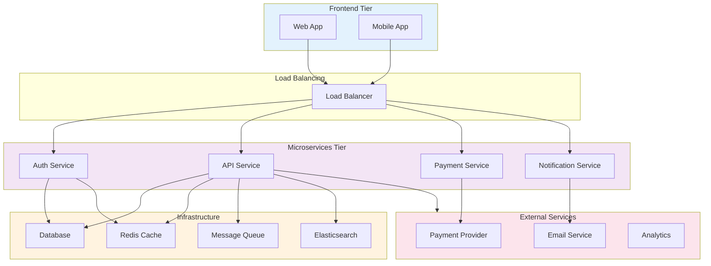

**Without proper logging, monitoring, and observability:**

- ❌ You know something is wrong but not what
- ❌ You can't reproduce issues in production
- ❌ Debugging takes hours instead of minutes
- ❌ Security incidents go unnoticed
- ❌ Performance degradation is hidden

---

## Core Concepts

### What is Logging?

**Logging** is the practice of recording all important events that occur throughout your application's lifecycle.

**What gets logged:**

- User authentication/authorization events
- Database operations
- API calls and responses
- Business transactions
- Errors and exceptions
- Security-related events
- Performance milestones

**Key metadata captured:**

- Timestamp
- User ID / Request ID
- Service name
- Function/method name
- Log level
- Error details
- Stack traces

### What is Monitoring?

**Monitoring** is the continuous process of observing the health and performance of your system over time.

**What gets monitored:**

- Server CPU and memory usage
- Request throughput (requests per second)
- Database connection pool status
- Error rates
- Response times
- Disk usage
- Network latency

**Characteristics:**

- Near real-time data (10-15 second delay is typical)
- Aggregated metrics
- Historical trends and patterns
- Alert thresholds

### What is Observability?

**Observability** is the ability to determine the internal state of a system by examining its external outputs. A system is observable when you can understand what happened, why it happened, and how different components interacted.

---

## The Three Pillars of Observability

Observability is built on three pillars. A system can only be called fully observable when all three are implemented:

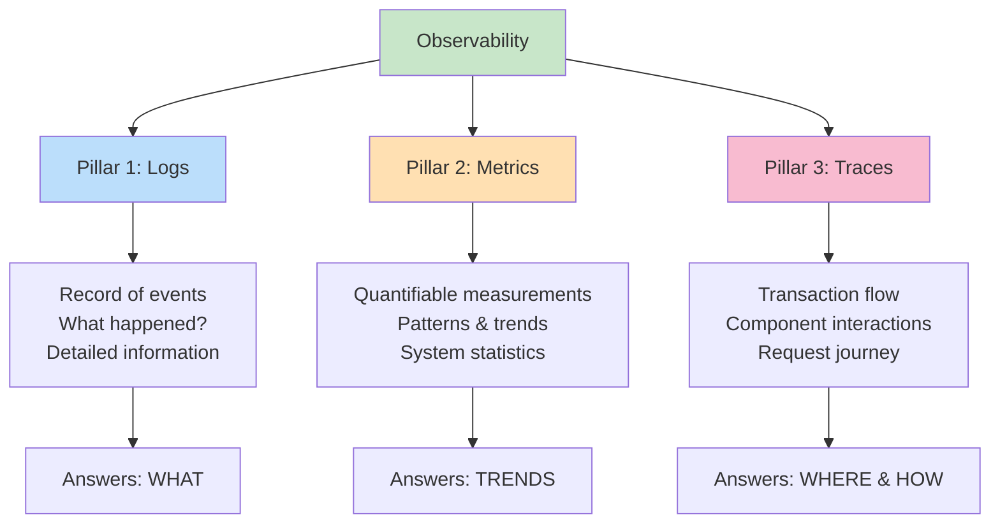

### Pillar 1: Logs

- **Purpose**: Record discrete events
- **Level of detail**: High
- **Query pattern**: Search by specific attributes
- **Use case**: Root cause analysis

### Pillar 2: Metrics

- **Purpose**: Track quantifiable system measurements
- **Level of detail**: Aggregated
- **Query pattern**: Time-series analysis
- **Use case**: Pattern recognition and trends

### Pillar 3: Traces

- **Purpose**: Track request flow through system
- **Level of detail**: Complete transaction path
- **Query pattern**: Follow distributed transactions
- **Use case**: Performance analysis and bottleneck identification

---

## Logging Detailed Guide

### Log Levels

Different log levels serve different purposes and should be used appropriately:

#### DEBUG

```
Purpose: Development and troubleshooting
Usage: During active debugging
Environment: Development only
Verbosity: Highest
Example: "Attempting to fetch user from database with ID: 12345"
```

#### INFO

```
Purpose: General application operations and business events
Usage: Important successful operations
Environment: All (but usually filtered in production)
Verbosity: Medium
Example: "User 12345 successfully logged in", "Created new todo with ID: 789"
```

#### WARN

```
Purpose: Events that are not errors but warrant attention
Usage: Recoverable issues or unexpected conditions
Environment: All
Verbosity: Low-Medium
Example: "Authentication failed for user (wrong password)", "Cache miss on key: user:123"
```

#### ERROR

```
Purpose: Error conditions that need investigation
Usage: Recoverable problems with user/system impact
Environment: All
Verbosity: Low
Example: "Database connection failed", "Validation error: email format invalid"
```

#### FATAL

```
Purpose: Critical issues causing application shutdown
Usage: Unrecoverable errors
Environment: All (usually triggers restart)
Verbosity: Very Low
Example: "Cannot connect to primary database", "Out of memory"
Note: Application typically exits after fatal log
```

### Log Level Strategy by Environment

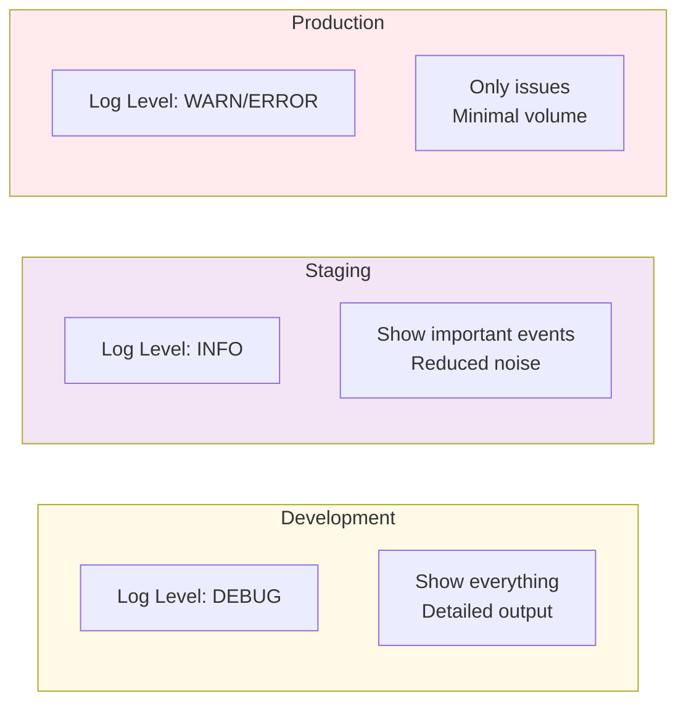

### Structured vs Unstructured Logging

#### Unstructured Logging (Development)

```
Connected to database
Started background job server
Server running on port 3000
User 123 logged in successfully
```

**Pros:**

- ✓ Human-readable
- ✓ Easy to spot issues visually
- ✓ Developer-friendly

**Cons:**

- ✗ Hard to parse programmatically
- ✗ Difficult for log aggregation tools
- ✗ Not suitable for searching at scale

#### Structured Logging (Production)

```json
{
  "timestamp": "2024-05-02T14:23:45.123Z",
  "level": "ERROR",
  "service": "api-service",
  "environment": "production",
  "correlation_id": "req-abc123",
  "user_id": 12345,
  "method": "POST",
  "route": "/todos",
  "error_code": 500,
  "error_message": "Database connection failed",
  "duration_ms": 1250,
  "ip_address": "192.168.1.100"
}
```

**Pros:**

- ✓ Machine-readable
- ✓ Easy to parse and index
- ✓ Enables advanced searching
- ✓ Integrates with log aggregation tools

**Cons:**

- ✗ Not human-friendly to read
- ✗ Verbose
- ✗ Requires tools to visualize

### Logging Workflow

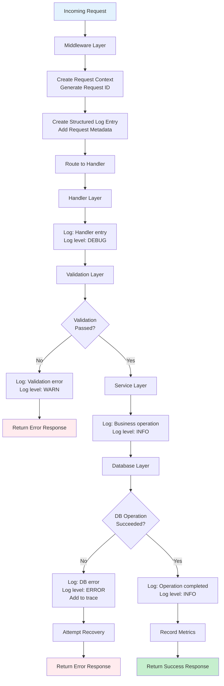

---

## Monitoring Detailed Guide

### What Are Metrics?

Metrics are quantifiable measurements of your system's behavior over time. They answer: "What is the state and performance of our system?"

### Types of Metrics

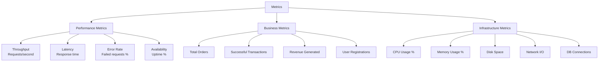

### Key Performance Indicators (KPIs)

For an e-commerce application, you might track:

| Metric                   | Definition                    | Alert Threshold          | Frequency  |
| ------------------------ | ----------------------------- | ------------------------ | ---------- |
| **Request Throughput**   | Requests processed per second | < 100 RPS during peak    | Real-time  |
| **Error Rate**           | Percentage of failed requests | > 1%                     | 1 minute   |
| **P99 Latency**          | 99th percentile response time | > 500ms                  | 1 minute   |
| **Database Connections** | Active DB connections         | > 80% of pool            | 30 seconds |
| **Cache Hit Rate**       | Percentage of cache hits      | < 85%                    | 5 minutes  |
| **Orders Completed**     | Business metric               | Baseline deviation > 50% | 5 minutes  |

### Monitoring Workflow: From Alert to Resolution

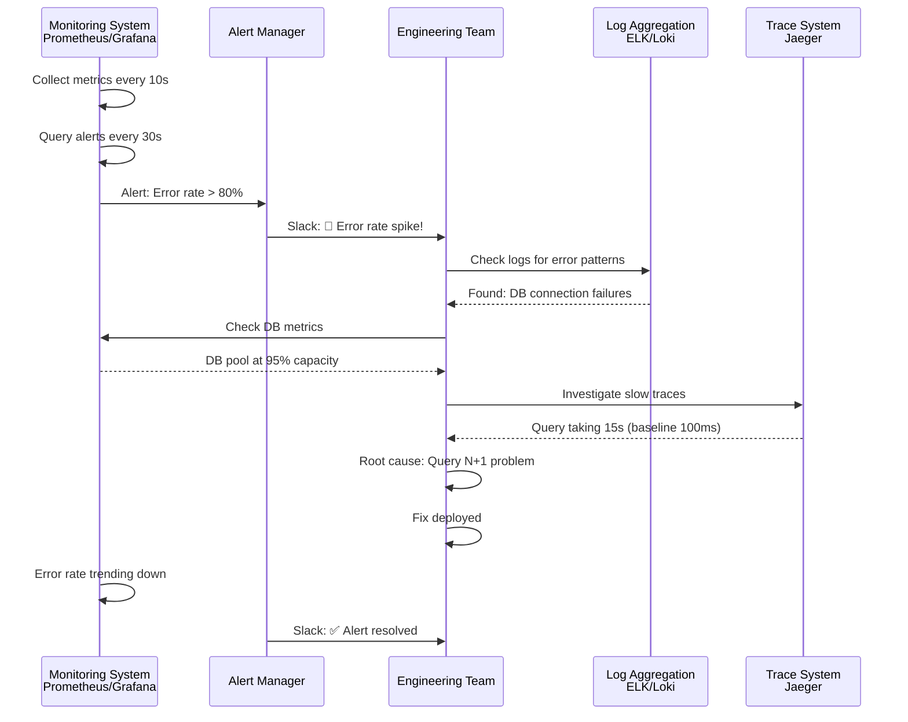

---

## Observability Detailed Guide

### Instrumentation

**Instrumentation** is the practice of measuring and collecting data about your application's behavior. It's the foundation of observability.

**What to instrument:**

- Function entry and exit points
- Important business logic
- External API calls
- Database operations
- Error conditions
- Latency-sensitive operations

### OpenTelemetry: The Industry Standard

OpenTelemetry is an open-source standard and ecosystem for observability data collection:

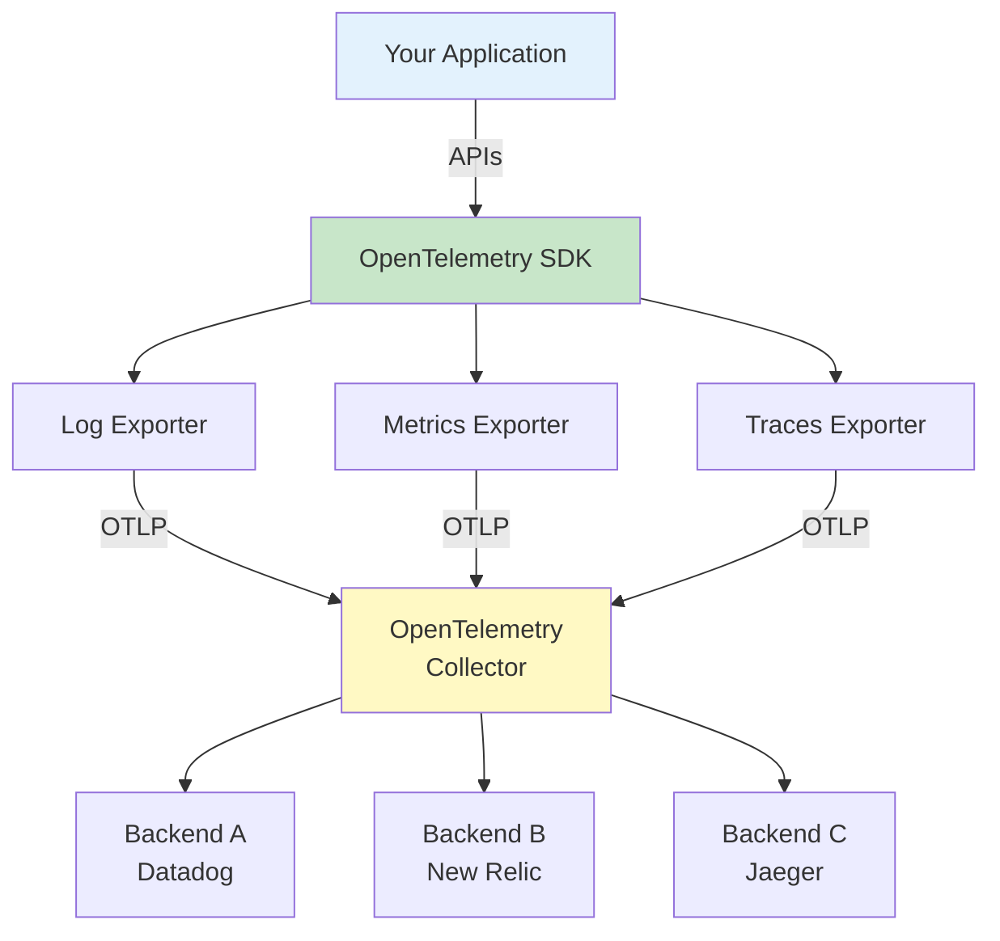

**Benefits:**

- ✓ Unified standard across languages
- ✓ Vendor-agnostic
- ✓ Can send data to multiple backends
- ✓ Reduces vendor lock-in
- ✓ Community-driven development

### Traces: Distributed Transaction Tracking

A trace represents a complete transaction flow through your distributed system.

#### Trace Structure

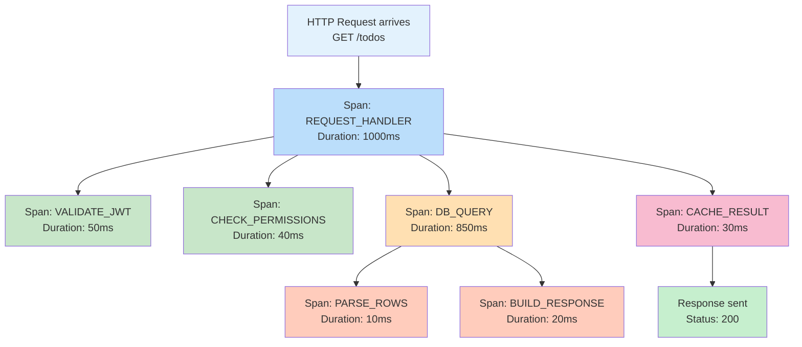

#### Trace Anatomy

```json
{
  "trace_id": "abc123xyz789",
  "timestamp": "2024-05-02T14:23:45.000Z",
  "root_span": {
    "span_id": "root-001",
    "operation": "GET /todos",
    "duration_ms": 1000,
    "status": "COMPLETED",
    "child_spans": [
      {
        "span_id": "span-001",
        "operation": "VALIDATE_JWT",
        "duration_ms": 50,
        "status": "COMPLETED"
      },
      {
        "span_id": "span-002",
        "operation": "DB_QUERY",
        "duration_ms": 850,
        "status": "COMPLETED",
        "attributes": {
          "query": "SELECT * FROM todos WHERE user_id = ?",
          "rows_returned": 15,
          "db_host": "db.prod.internal"
        }
      }
    ]
  }
}
```

---

## Practical Implementation

### Example: To-Do Application Service

#### Setting Up Logging

**Logger Configuration:**

```typescript
// logger.ts
function getLogLevel(env: string): string {
  if (env === "development") {
    return "DEBUG"; // Verbose for development
  }
  return "INFO"; // Less verbose for production
}

function getLogFormat(env: string): string {
  if (env === "development") {
    return "console"; // Human-readable
  }
  return "json"; // Machine-readable for production
}

const logger = createLogger({
  level: getLogLevel(process.env.NODE_ENV),
  format: getLogFormat(process.env.NODE_ENV),
  service: "todo-api",
  environment: process.env.NODE_ENV,
});
```

#### Creating a To-Do with Full Observability

```typescript
// Middleware: Create transaction context
app.use((req, res, next) => {
  // Create trace transaction
  const transaction = newRelic.startTransaction({
    name: req.method + " " + req.path,
    service: "todo-api",
    environment: process.env.NODE_ENV,
    request_id: generateUUID(),
    user_id: req.user?.id,
    ip_address: req.ip,
    user_agent: req.headers["user-agent"],
  });

  // Add transaction to context
  req.context = { transaction };
  next();
});

// Service: Create To-Do with instrumentation
async function createTodo(
  title: string,
  userId: string,
  context: RequestContext,
): Promise<Todo> {
  const { transaction } = context;

  // Create segment for this operation
  const segment = transaction.createSegment("create_todo");

  try {
    // Add attributes to trace
    segment.addAttribute("user_id", userId);
    segment.addAttribute("title", title);

    // Log operation start
    logger.info("Creating new todo", {
      user_id: userId,
      title: title,
      timestamp: new Date().toISOString(),
    });

    // Validate input
    validateTodoInput({ title });

    // Execute database operation
    const dbSegment = segment.createChild("database_insert");
    const todo = await database.todos.create({
      title,
      user_id: userId,
    });
    dbSegment.end();

    // Log success
    logger.info("Todo created successfully", {
      todo_id: todo.id,
      user_id: userId,
      title: title,
    });

    // Add to trace metadata
    segment.addAttribute("todo_id", todo.id);
    segment.addAttribute("status", "success");

    return todo;
  } catch (error) {
    // Log error with full context
    logger.error("Failed to create todo", {
      error: error.message,
      stack_trace: error.stack,
      user_id: userId,
      title: title,
    });

    // Add error to trace
    segment.addAttribute("status", "error");
    segment.addAttribute("error_message", error.message);
    newRelic.noticeError(error);

    throw error;
  } finally {
    // Always end segment
    segment.end();
  }
}
```

### Development vs Production Logging

#### Development Logs (Console, Unstructured)

```
✓ Connecting to database: localhost:5432
✓ Started background job server
→ Starting server on port 3000
[DEBUG] Request: GET /todos, user_id: 123, duration: 45ms
[INFO] Todo created: id=456, title="Buy milk", user_id=123
[DEBUG] Database query took 23ms
```

#### Production Logs (JSON, Structured)

```json
{"timestamp":"2024-05-02T14:23:45.123Z","level":"INFO","service":"todo-api","environment":"production","user_id":123,"request_id":"req-abc123","message":"Todo created","todo_id":456,"title":"Buy milk","duration_ms":145}

{"timestamp":"2024-05-02T14:23:46.450Z","level":"ERROR","service":"todo-api","environment":"production","user_id":124,"request_id":"req-def456","message":"Database query failed","error_code":"TIMEOUT","error_message":"Query exceeded 30s timeout","stack_trace":"...","duration_ms":30000}
```

---

## Tools & Solutions

### Open-Source Stack

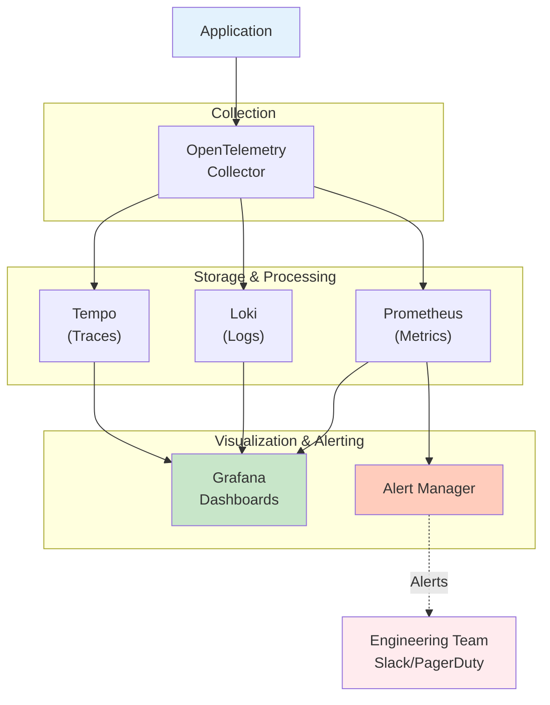

**Cost:** Free (self-hosted)
**Maintenance:** High (requires DevOps expertise)
**Scalability:** Excellent for large systems

### Commercial Solutions

| Solution                    | Best For                 | Pricing              | Setup    |
| --------------------------- | ------------------------ | -------------------- | -------- |
| **New Relic**               | All-in-one observability | Per ingested GB      | Simple   |
| **Datadog**                 | Enterprise teams         | Per host/metric      | Moderate |
| **Dynatrace**               | AI-powered insights      | Per environment      | Moderate |
| **Elastic (Observability)** | Large-scale deployments  | Self-hosted or cloud | Complex  |
| **Sumo Logic**              | Cloud-native apps        | Per GB ingested      | Simple   |

**Advantages:**

- ✓ Fully managed
- ✓ Reduced operational overhead
- ✓ Built-in integrations
- ✓ Professional support
- ✓ Advanced analytics

---

## Best Practices

### 1. Structured Logging

**✓ DO:**

```json
{
  "timestamp": "2024-05-02T14:23:45Z",
  "level": "ERROR",
  "service": "payment-api",
  "request_id": "req-123",
  "user_id": 456,
  "operation": "process_payment",
  "amount": 99.99,
  "currency": "USD",
  "error_code": "INSUFFICIENT_FUNDS",
  "error_message": "User account has insufficient funds"
}
```

**✗ DON'T:**

```
Sorry, payment failed for user. Please try again later.
```

### 2. Add Context to Every Log

```typescript
// ✗ BAD: No context
logger.error("Database error");

// ✓ GOOD: Rich context
logger.error("Database query failed", {
  query: "SELECT * FROM users WHERE id = ?",
  user_id: 123,
  database: "postgres",
  host: "db.prod.internal",
  duration_ms: 5000,
  error_code: "TIMEOUT",
});
```

### 3. Use Request/Correlation IDs

```typescript
// Every request gets a unique ID
const requestId = generateUUID();
const correlationId = req.headers["x-correlation-id"] || requestId;

// Include in all logs and traces
logger.info("Processing request", {
  request_id: requestId,
  correlation_id: correlationId,
  trace_id: traceId,
});
```

### 4. Log at Appropriate Levels

```typescript
// DEBUG: Detailed diagnostic info for developers
logger.debug("Database connection pool status", {
  available: 8,
  total: 10,
});

// INFO: Important business events
logger.info("User registered", { user_id: 123, email: "user@example.com" });

// WARN: Recoverable issues
logger.warn("Retry attempt 2/3 for API call", { service: "payment-api" });

// ERROR: Actionable errors needing investigation
logger.error("Failed to send email", {
  user_id: 123,
  error: "SMTP timeout",
});

// FATAL: Application-stopping errors
logger.fatal("Cannot connect to primary database", {
  error: "Connection refused",
});
```

### 5. Monitor Key Metrics

Establish baseline metrics for your application:

```yaml
# Example: E-commerce API
critical_metrics:
  - name: error_rate
    threshold: 1%
    alert_if_exceeds: true

  - name: p99_latency
    threshold: 500ms
    alert_if_exceeds: true

  - name: db_connection_pool
    threshold: 80%
    alert_if_exceeds: true

  - name: cache_hit_rate
    threshold: 85%
    alert_if_below: true

business_metrics:
  - orders_per_minute
  - payment_success_rate
  - user_signup_rate
```

### 6. Trace Request Flow

```typescript
// Enter trace at HTTP layer
function requestMiddleware(req, res, next) {
  const trace = startTrace({
    name: `${req.method} ${req.path}`,
    attributes: {
      http_method: req.method,
      http_path: req.path,
      http_version: req.httpVersion,
    },
  });

  req.trace = trace;
  next();
}

// Continue trace through business logic
async function validateUser(userId, trace) {
  const span = trace.startSpan("validate_user");
  try {
    // User validation logic
    span.end();
  } catch (error) {
    span.recordException(error);
  }
}

// End trace at response
function responseMiddleware(req, res, next) {
  res.on("finish", () => {
    req.trace.addAttribute("http_status", res.statusCode);
    req.trace.end();
  });
  next();
}
```

### 7. Alert on Meaningful Events

```yaml
alerts:
  # ✓ GOOD: Actionable alerts
  - name: Error rate spike
    condition: error_rate > 5%
    duration: 5 minutes
    action: Page on-call engineer

  - name: Database connection exhaustion
    condition: db_connections > 90%
    duration: 2 minutes
    action: Auto-scale or trigger warning

  - name: Payment processing failures
    condition: payment_error_rate > 2%
    duration: 10 minutes
    action: Page payment platform owner

  # ✗ POOR: Too many false positives
  - name: Single error occurred
    condition: error_count > 0
    action: Page engineer

  - name: Any latency increase
    condition: p50_latency > baseline * 1.01
    action: Page engineer
```

### 8. Implement Log Retention Policies

```yaml
log_retention:
  development:
    duration: 7 days
    reason: Short-lived, low priority

  staging:
    duration: 30 days
    reason: For testing and debugging

  production:
    critical_errors:
      duration: 1 year
      reason: Compliance and auditing

    debug_logs:
      duration: 7 days
      reason: Quick debugging, verbose

    business_events:
      duration: 2 years
      reason: Business analytics and compliance

    security_events:
      duration: 5 years
      reason: Compliance requirements
```

### 9. Security: Protect Sensitive Data

**✗ DON'T log:**

```typescript
logger.info("User login", {
  password: user.password, // ✗ Never
  credit_card: cc.number, // ✗ Never
  ssn: user.ssn, // ✗ Never
  api_key: process.env.API_KEY, // ✗ Never
});
```

**✓ DO log:**

```typescript
logger.info("User login", {
  user_id: user.id,
  username: user.username,
  ip_address: req.ip,
  success: true,
  timestamp: new Date().toISOString(),
});
```

### 10. Monitor Cost

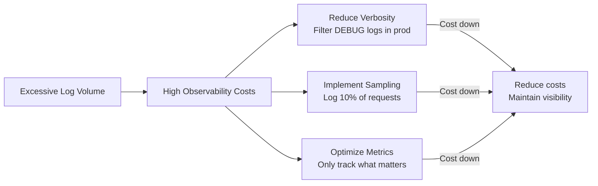

---

## Observability Workflow: Complete Example

### Scenario: Payment Processing Failure

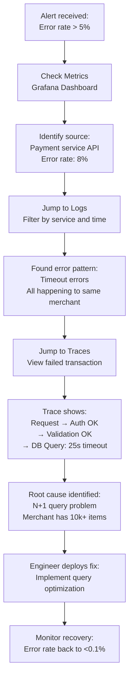

**Total time to resolution: 8 minutes (without observability: 2+ hours)**

---

## Summary Table

| Aspect                 | Logging          | Monitoring          | Observability             |
| ---------------------- | ---------------- | ------------------- | ------------------------- |
| **Purpose**            | Record events    | Track trends        | Understand system state   |
| **Data Type**          | Events           | Metrics             | Events + Metrics + Traces |
| **Time Resolution**    | Per event        | 10-30 seconds       | Per request               |
| **Volume**             | High             | Medium              | Medium-High               |
| **Query Type**         | Full-text search | Time-series         | Graph traversal           |
| **Questions Answered** | What happened?   | Trends? Patterns?   | Why & Where?              |
| **Tools**              | ELK, Loki        | Prometheus, Grafana | Jaeger, Tempo             |
| **Effort**             | Moderate         | High                | High                      |

---

## Implementation Roadmap

### Phase 1: Basic Logging (Week 1-2)

- [ ] Implement logger with level support
- [ ] Add structured logging format
- [ ] Log errors and business events
- [ ] Set up log aggregation

### Phase 2: Core Metrics (Week 3-4)

- [ ] Set up metrics collection
- [ ] Define critical KPIs
- [ ] Create Grafana dashboards
- [ ] Implement alerting rules

### Phase 3: Instrumentation (Week 5-6)

- [ ] Integrate OpenTelemetry
- [ ] Add tracing to request flow
- [ ] Instrument external calls
- [ ] Set up trace visualization

### Phase 4: Advanced Observability (Week 7+)

- [ ] Implement correlations between logs/metrics/traces
- [ ] Optimize cost
- [ ] Fine-tune alerts
- [ ] Establish SLOs/SLIs

---

## Key Takeaways

1. **Logging, monitoring, and observability are interconnected** — They work best together
2. **Structured logging is essential** — JSON format enables automation and integration
3. **Metrics reveal patterns** — Trends highlight problems before they become failures
4. **Traces show the complete picture** — Understand component interactions
5. **It's a spectrum, not binary** — Start simple and evolve
6. **Invest in observability early** — It pays dividends when debugging production
7. **Use industry standards** — OpenTelemetry is becoming the de facto standard
8. **Security matters** — Never log sensitive data
9. **Cost management is important** — Balance visibility with overhead
10. **Automate alert response** — Use observability data to trigger automated actions

---

## Resources & Further Reading

- **OpenTelemetry**: https://opentelemetry.io/
- **Grafana**: https://grafana.com/
- **Prometheus**: https://prometheus.io/
- **Jaeger**: https://www.jaegertracing.io/
- **New Relic**: https://newrelic.com/
- **Datadog**: https://www.datadoghq.com/
- **ELK Stack**: https://www.elastic.co/what-is/elk-stack
- **12 Factor App Logs**: https://12factor.net/logs
