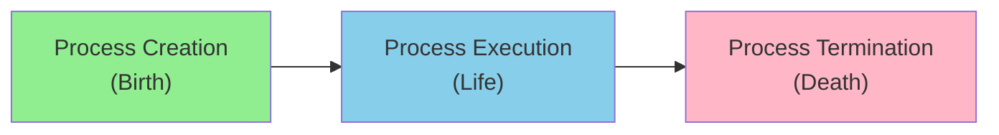
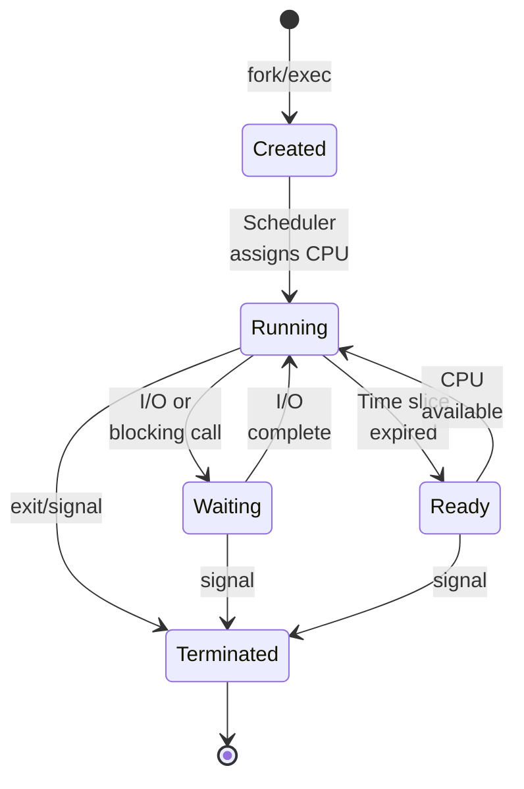
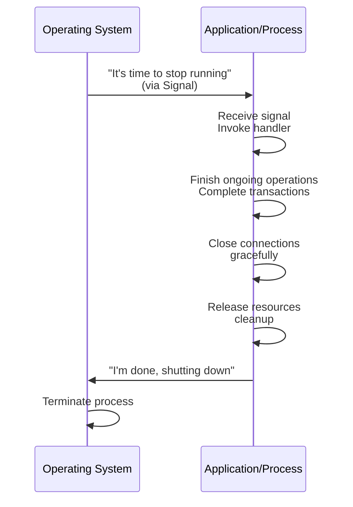
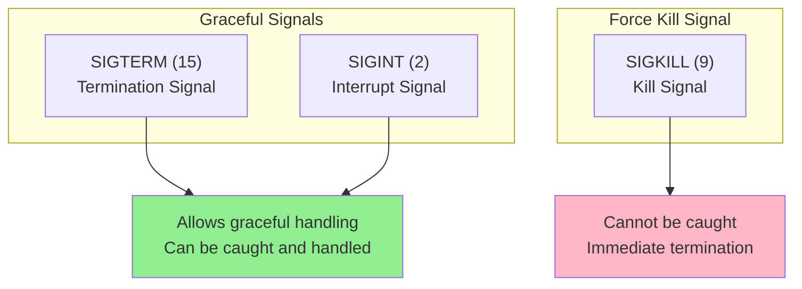
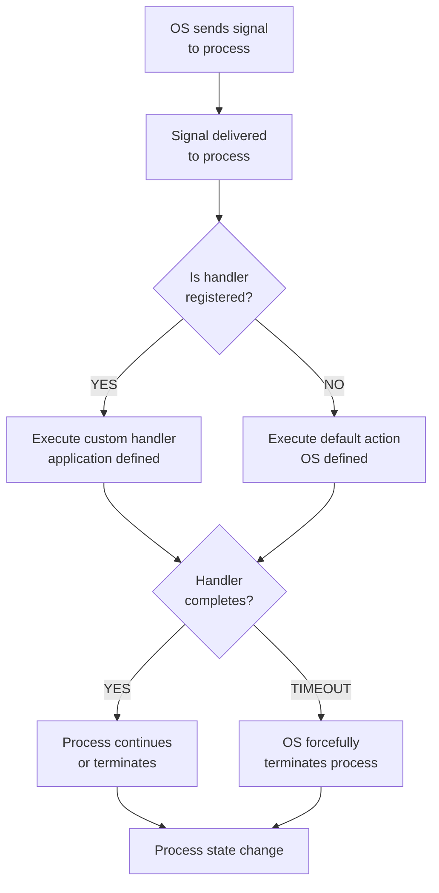
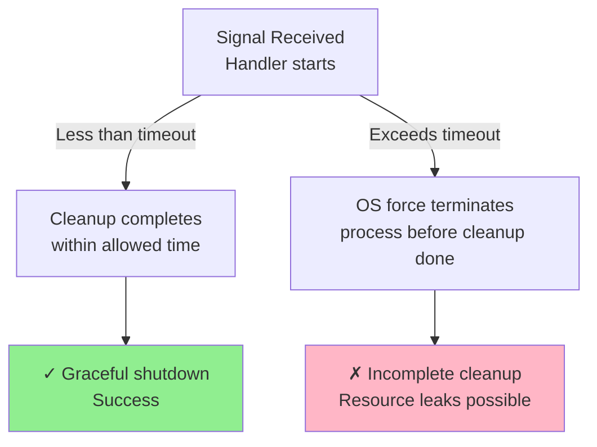
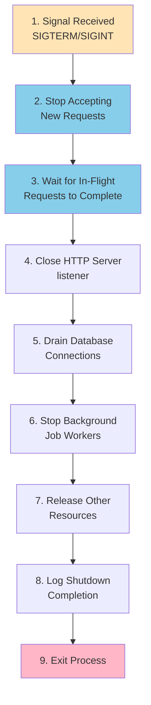
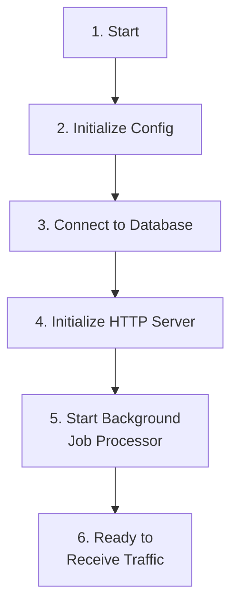
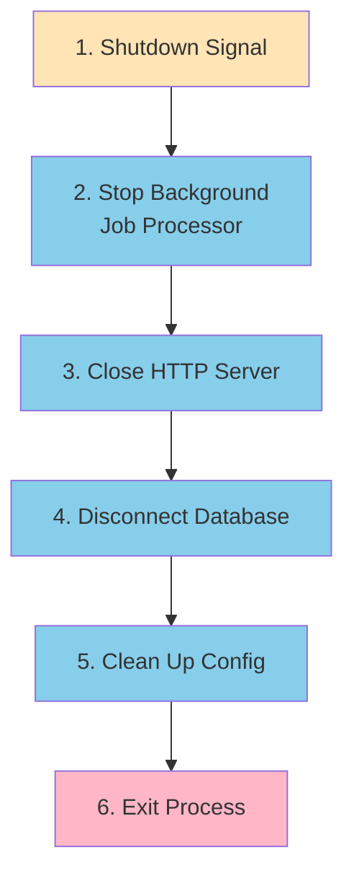
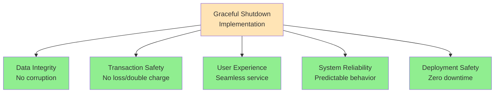

# Graceful Shutdown: A Complete Guide

## Table of Contents
1. [Introduction](#introduction)
2. [The Problem Statement](#the-problem-statement)
3. [What is Graceful Shutdown?](#what-is-graceful-shutdown)
4. [Process Lifecycle Management](#process-lifecycle-management)
5. [Operating System Signals](#operating-system-signals)
6. [Signal Types and Handlers](#signal-types-and-handlers)
7. [Implementation Steps](#implementation-steps)
8. [Resource Management](#resource-management)
9. [Practical Example](#practical-example)
10. [Best Practices](#best-practices)

---

## Introduction

In modern backend development, handling server shutdowns gracefully is a critical concern that directly impacts user experience, data integrity, and system reliability. This guide explores the art and science of implementing graceful shutdown in backend applications.

### Why Graceful Shutdown Matters

Graceful shutdown ensures that your application:
- Maintains data integrity during deployment transitions
- Prevents customer data loss or corruption
- Avoids double-charging in payment transactions
- Provides seamless service to end users
- Handles infrastructure changes elegantly

---

## The Problem Statement

### Real-World Scenario: Payment Transaction During Deployment

Imagine this scenario:

```
Customer: Purchasing an item from an e-commerce platform (e.g., Amazon, Flipkart)
Current State: Payment transaction in progress
Event: Server deployment triggered, causing server restart
Critical Questions:
  - What happens to the payment transaction?
  - Is the payment lost in the digital void?
  - Does the customer get charged twice due to race conditions?
  - How is data consistency maintained?
```

### Zero Downtime Deployment Context

Modern deployment techniques like **zero downtime deployment** ensure:
- New servers are fully ready before old servers shut down
- Load is gradually shifted from old to new servers
- No service interruption to users

**However**, at the critical moment when the new server is ready and the old server must shut down, the old server may have in-flight requests (like our payment transaction) that need proper handling.

### The Consequences of Improper Shutdown

Without graceful shutdown mechanisms, you risk:
- **Data Corruption**: Incomplete transactions left in inconsistent states
- **Payment Issues**: Double charges or lost transactions
- **Refund Processing**: Unnecessary refunds for already-completed transactions
- **Poor User Experience**: Service disruptions and unexplained errors
- **System Instability**: Cascading failures across dependent services

---

## What is Graceful Shutdown?

### Definition

**Graceful Shutdown** is the process of stopping a server application in a controlled, orderly manner that ensures all in-flight operations complete successfully and all resources are properly released.

### The Analogy: Good Manners

Think of graceful shutdown like hosting guests at home:

```
Abrupt Shutdown (Bad):
- At 9 PM when guests should leave, you push them out
- You slam the door in their face
- Result: Conflict, damaged relationships, unfinished conversations

Graceful Shutdown (Good):
- You finish your conversation politely
- You walk your guests to the door
- You say goodbye properly
- You clean up after them
- Only then do you lock the door
```

### Core Principle

A graceful shutdown means your backend application:
1. **Stops accepting new requests** immediately
2. **Completes ongoing operations** with existing clients
3. **Closes all active connections** properly
4. **Cleans up all resources** (files, database connections, etc.)
5. **Exits cleanly** without abruptly terminating

---

## Process Lifecycle Management

### Understanding Process Lifecycle

Every application runs as a **process** in an operating system. Like living organisms, processes have a complete lifecycle:



### Process Lifecycle States



### The OS-Application Communication Protocol

When an operating system decides it's time for an application to stop, it follows an established protocol rather than abruptly killing the process:



---

## Operating System Signals

### What are Signals?

**Signals** are a fundamental Unix/Linux mechanism for inter-process communication (IPC) between the operating system and running processes. They represent asynchronous events.

### Signal Characteristics

- **Asynchronous**: Can arrive at any time during process execution
- **Lightweight**: Simple integer notifications (not data-heavy)
- **Standard Protocol**: Unified across Unix-like systems
- **Interruption-based**: Interrupt normal execution flow

### Common Signals for Graceful Shutdown



### Signal Details

#### SIGTERM (Signal 15) - Termination Signal

```
Purpose: Request graceful termination
Behavior: 
  - Sent by kill command by default
  - Sent by systemd/container orchestration
  - Application can catch and handle
  - Application has time to clean up
  
Typical Usage: Deployment shutdowns, maintenance
```

#### SIGINT (Signal 2) - Interrupt Signal

```
Purpose: Request immediate attention (usually termination)
Triggered by: Ctrl+C on terminal
Behavior:
  - Interrupts running process
  - Can be caught and handled
  - Default action: Terminate
  - Commonly used for graceful local shutdowns
```

#### SIGKILL (Signal 9) - Kill Signal

```
Purpose: Force immediate termination
Behavior:
  - Cannot be caught or ignored
  - No cleanup possible
  - Emergency use only
  - Last resort when graceful signals fail
  
Analogy: Pulling the power cord from a computer
```

---

## Signal Types and Handlers

### How Signal Handling Works



### Signal Handler Registration Pattern

```
Step 1: Register Handler
- Application sets up handler for SIGTERM/SIGINT
- Specifies what code to execute when signal arrives

Step 2: Signal Arrives
- OS interrupts application execution
- Delivers signal to running process

Step 3: Handler Execution
- Application's custom handler code runs
- Performs graceful shutdown operations
- Has limited time window

Step 4: Handler Completion
- Handler completes and returns control
- Application exits normally (or continues if needed)
- All cleanup is finished
```

### Timeout Considerations



**Typical Timeout**: 30 seconds (configurable)

---

## Implementation Steps

### The Graceful Shutdown Workflow



### Detailed Shutdown Sequence

#### Step 1: Signal Handler Registration

```
Before receiving shutdown signal:
- Application registers handlers for SIGTERM and SIGINT
- Uses framework-provided signal handling utilities
- Example: os.signal() in Python, signal package in Node.js
```

#### Step 2: Stop Accepting New Requests

```
Upon signal reception:
- Close the HTTP server listener port
- Reject all new incoming connections
- Existing connections continue to be served
```

#### Step 3: Wait for In-Flight Requests

```
Graceful draining process:
- All current HTTP requests continue processing
- No timeout interruption for legitimate operations
- Wait for all request handlers to complete
- Each framework typically provides timeout (e.g., 30 seconds)
```

#### Step 4: Close HTTP Server

```
Shutdown HTTP server:
- Stop accepting any new connections
- Finalize all open HTTP connections
- Release network resources
- Allow framework to complete cleanup internally
```

#### Step 5: Close Database Connections

```
Database cleanup:
- Stop accepting new queries on connection pool
- Wait for existing queries/transactions to complete
- Close database connection pool
- Release TCP connections to database server
```

#### Step 6: Stop Background Workers

```
Background job processing:
- Signal background job queue (e.g., Redis-based queue)
- Wait for current jobs to complete
- Drain job queue gracefully
- Release queue connections
```

#### Step 7: Release Other Resources

```
Additional cleanup:
- Close file handles
- Release memory caches
- Disconnect external service connections
- Clean up temporary files
```

#### Step 8: Log Completion

```
Logging:
- Log successful graceful shutdown
- Record shutdown duration
- Note any issues encountered
```

#### Step 9: Exit Process

```
Final step:
- Exit process with success code (0)
- OS cleans up any remaining process resources
```

---

## Resource Management

### Resource Acquisition and Release Order

#### Acquisition Order

When starting your application, resources are typically acquired in this sequence:



#### Release Order (LIFO - Last In First Out)

**Critical Principle**: Resources must be released in **reverse order** of acquisition.



### Why Reverse Order?

**Dependency Relationships:**
- HTTP Server depends on Database
- Background Jobs depend on HTTP Server and Database
- If HTTP Server tries to shutdown before Database is ready, requests may fail

**Example Scenario:**
```
Incorrect Order (causes problems):
1. Close Database first
2. Try to close HTTP Server
   → In-flight requests try to query database
   → Connections fail
   → Data corruption

Correct Order (prevents problems):
1. Close HTTP Server first (stop new requests)
2. Wait for existing requests using database
3. Then close Database (all connections are idle)
4. Clean shutdown guaranteed
```

### Resource Dependency Graph

```mermaid
graph TB
    APP["Application<br/>Process"]
    HTTP["HTTP Server<br/>Listener"]
    CONNS["Active Client<br/>Connections"]
    DBPOOL["Database<br/>Connection Pool"]
    JOBS["Background<br/>Job Queue"]
    
    APP --> HTTP
    HTTP --> CONNS
    CONNS --> DBPOOL
    HTTP --> DBPOOL
    JOBS --> DBPOOL
    
    classDef resource fill:#87CEEB
    class HTTP CONNS DBPOOL JOBS resource
```

---

## Practical Example

### Example: Backend Application Stack

Typical backend application components:

```
┌─────────────────────────────────────────┐
│     Backend Application                 │
│  (Node.js, Go, Python, etc.)            │
├─────────────────────────────────────────┤
│ - HTTP Server (Express, Gin, Flask)     │
│ - Database (PostgreSQL, MySQL)          │
│ - Cache (Redis)                         │
│ - Queue Processor (Bull, Celery, etc.)  │
│ - External Services (APIs, Logging)     │
└─────────────────────────────────────────┘
```

### Shutdown Procedure Logs (Real Example)

#### Startup Phase

```
[INFO] 09:15:23 - Connecting to database
[INFO] 09:15:24 - Database connection established
[INFO] 09:15:24 - Starting background job server
[INFO] 09:15:24 - Background job server running
[INFO] 09:15:24 - HTTP server listening on port 3000
[INFO] 09:15:24 - Application ready to receive traffic
```

#### Shutdown Phase (User presses Ctrl+C)

```
[WARN] 09:16:45 - SIGINT signal received
[INFO] 09:16:45 - Initiating graceful shutdown
[INFO] 09:16:45 - Stopping background job processor
[INFO] 09:16:45 - Starting graceful shutdown of job queue
[INFO] 09:16:46 - Waiting for all workers to finish
[INFO] 09:16:47 - All workers have finished
[INFO] 09:16:47 - Closing database connections
[INFO] 09:16:47 - Database pool closed
[INFO] 09:16:47 - HTTP server shutdown complete
[INFO] 09:16:47 - Graceful shutdown complete
[INFO] 09:16:47 - Server exited successfully
```

### Code Structure Pattern

```
┌──────────────────────────────────────────┐
│ 1. Register Signal Handlers              │
│    - Listen for SIGTERM/SIGINT           │
│    - Trigger shutdown function           │
└──────────────────────────────────────────┘
                    ↓
┌──────────────────────────────────────────┐
│ 2. Graceful Shutdown Function            │
│    - Structured cleanup sequence         │
│    - Reverse order of startup            │
└──────────────────────────────────────────┘
                    ↓
┌──────────────────────────────────────────┐
│ 3. Cleanup Handlers                      │
│    - HTTP Server shutdown                │
│    - Database pool drain                 │
│    - Queue worker shutdown               │
│    - Resource release                    │
└──────────────────────────────────────────┘
                    ↓
┌──────────────────────────────────────────┐
│ 4. Exit Process                          │
│    - Exit with success code              │
│    - OS cleanup                          │
└──────────────────────────────────────────┘
```

---

## Best Practices

### 1. Implement Signal Handlers Immediately

```
✓ Register handlers at application startup
✓ Use framework-provided utilities when available
✓ Don't rely on default OS behavior
```

### 2. Follow LIFO (Last In First Out) Principle

```
✓ Release resources in reverse acquisition order
✓ Document dependency relationships
✓ Test shutdown sequence thoroughly
```

### 3. Set Appropriate Timeouts

```
✓ Typical: 30 seconds for graceful shutdown
✓ Configurable based on workload
✓ Log timeouts and force shutdowns
✓ Monitor for repeated timeout issues
```

### 4. Handle In-Flight Requests Properly

```
✓ Complete existing operations
✓ Don't abruptly drop connections
✓ Respect database transaction consistency
✓ Ensure idempotent operations where possible
```

### 5. Implement Comprehensive Logging

```
✓ Log shutdown initiation
✓ Log each cleanup stage
✓ Record timing information
✓ Log any errors or warnings
✓ Monitor shutdown duration
```

### 6. Test Graceful Shutdown

```
✓ Test with active requests in flight
✓ Test with database transactions
✓ Test with background jobs running
✓ Test timeout scenarios
✓ Monitor logs for proper sequencing
```

### 7. Use Framework Features

```
Most modern frameworks provide:
- Built-in graceful shutdown support
- Signal handler registration
- Connection pool draining
- Example code for copy-paste implementation

Frameworks supporting graceful shutdown:
- Node.js: Express, Fastify, Next.js
- Go: Gin, Echo, net/http
- Python: Flask, Django, FastAPI
- Rust: Actix, Rocket, Axum
```

### 8. Container and Orchestration Considerations

```
Docker/Kubernetes:
✓ Set appropriate termination grace period
✓ Understand SIGTERM before SIGKILL sequence
✓ Configure liveness and readiness probes
✓ Monitor exit codes

Typical Kubernetes configuration:
- terminationGracePeriodSeconds: 30
- preStop hooks for early shutdown notification
- Health check endpoints for readiness
```

---

## Summary

### Key Takeaways

1. **Graceful Shutdown is Essential**: Prevents data loss, corruption, and provides excellent user experience

2. **Process Lifecycle**: All applications run as processes with defined lifecycles (creation, execution, termination)

3. **Operating System Signals**: OS communicates with processes via signals (SIGTERM, SIGINT) to initiate shutdown

4. **Signal Handlers**: Applications register handlers to catch signals and execute cleanup code

5. **Structured Cleanup**: Shutdown must follow organized steps in correct order

6. **Resource Management**: Release resources in reverse order of acquisition (LIFO principle)

7. **Timeout Protection**: Graceful shutdown has a timeout; if exceeded, OS forcefully terminates

8. **Framework Support**: Most modern frameworks provide built-in graceful shutdown mechanisms

9. **Testing is Critical**: Thoroughly test shutdown with various in-flight scenarios

10. **Logging and Monitoring**: Comprehensive logging helps diagnose shutdown issues

### Benefits of Graceful Shutdown



### Final Notes

- Graceful shutdown is not optional for production systems
- It's a foundational practice in backend engineering
- Most frameworks make implementation straightforward
- Understanding the "why" is as important as the "how"
- Regular testing ensures reliability
- Proper logging enables effective troubleshooting

---

## Additional Resources

### Framework Documentation
- Review your framework's graceful shutdown documentation
- Copy battle-tested examples from established projects
- Implement according to your specific requirements

### Monitoring and Observability
- Monitor shutdown duration metrics
- Alert on forceful terminations
- Track signal handling latency
- Correlate shutdowns with deployment events

### Related Concepts
- **Zero Downtime Deployment**: Parallel deployment before shutdown
- **Health Checks**: Readiness and liveness probes
- **Idempotency**: Enabling safe request retries
- **Distributed Transactions**: Consistency across services
