# Backend Security: Everything You Need to Know

## Table of Contents
1. [Introduction](#introduction)
2. [Security Mindset](#security-mindset)
3. [Security Domains](#security-domains)
4. [The Developer's Assumption Problem](#the-developers-assumption-problem)
5. [Injection Attacks](#injection-attacks)
6. [SQL Injection Deep Dive](#sql-injection-deep-dive)
7. [Other Injection Attacks](#other-injection-attacks)
8. [Authentication Security](#authentication-security)
9. [Password Storage](#password-storage)
10. [Hashing Techniques](#hashing-techniques)
11. [Session Management](#session-management)
12. [JWT (JSON Web Tokens)](#jwt-json-web-tokens)
13. [Cross-Site Request Forgery (CSRF)](#cross-site-request-forgery-csrf)
14. [Security Defense Layers](#security-defense-layers)
15. [Learning Resources](#learning-resources)

---

## Introduction

### The Importance of Security

Backend security is one of the most critical aspects of software development. Neglecting security doesn't just create technical debt—it has **destructive financial and business consequences**:

- **Financial Impact**: Data breaches, payment fraud, regulatory fines
- **Business Impact**: Reputation damage, customer trust loss
- **Legal Impact**: GDPR violations, compliance failures
- **Operational Impact**: System downtime, incident response costs

### What This Guide Covers

This guide focuses on **practical backend security** rather than comprehensive cryptography theory. We'll explore:
- Real-world vulnerabilities and attack patterns
- How attackers think and exploit assumptions
- Practical defense mechanisms
- Implementation best practices

### What This Guide Does NOT Cover

Due to scope limitations, we don't deeply cover:
- Browser security (HTML, cookies, local storage specifics)
- Network-level security (TLS/SSL specifics)
- Operating system security
- Advanced cryptographic theory

However, understanding the security mindset presented here will help you learn these topics independently.

---

## Security Mindset

### The Goal: Build Paranoia

The purpose of backend security training is **not** to teach you a checklist of techniques to implement. Instead, it's to build a **security mindset**—a paranoid way of thinking about your code.

This mindset means:
- Always questioning your assumptions
- Thinking about boundaries between systems
- Considering what could go wrong before it happens
- Never trusting user input blindly

### No Application is Truly Secure

A critical realization: **No application can ever be truly secure.**

As technology evolves:
- New vulnerabilities emerge
- Libraries get updated with security fixes
- Programming languages reveal new edge cases
- Attack techniques become more sophisticated

The goal is not perfection but **continuous improvement** and **layered defense**.

---

## Security Domains

### The Different Layers of Security

Security operates at multiple levels:

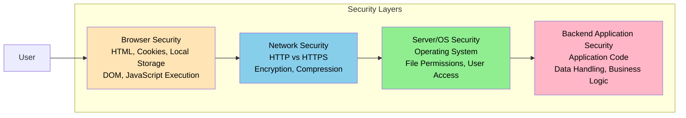

### Focus: Backend Application Security

For this guide, we focus primarily on **layer D** - backend application security, which deals with:
- Application code vulnerabilities
- Data handling security
- Business logic security
- User input validation
- Database interaction safety

---

## The Developer's Assumption Problem

### The Root Cause of All Vulnerabilities

Every single security vulnerability comes down to one question:

> **Where did the developer make an assumption?**

### Common Dangerous Assumptions

Developers frequently assume:

```
1. ✗ "User input will always be clean/valid"
   ✓ Reality: Users intentionally or accidentally send malicious input

2. ✗ "Users will only use the frontend interface"
   ✓ Reality: Attackers use network tools to bypass the frontend

3. ✗ "The user who claims to be X is actually user X"
   ✓ Reality: Identity spoofing is trivial without proper verification

4. ✗ "Requests come from my frontend"
   ✓ Reality: Attackers craft requests from anywhere

5. ✗ "No one will modify parameters in the request"
   ✓ Reality: Parameter tampering is the first thing attackers try
```

### Why Assumptions Seem Reasonable

Under startup pressure and deadlines:
- You focus on the "happy path" (normal usage)
- Feature implementation takes priority
- Security feels like optional polish
- Your users will "do the right thing"

**But attackers don't follow the happy path.**

---

## Injection Attacks

### Understanding Injection: The Multi-Language Problem

A fundamental insight: **Your application speaks multiple languages in different contexts.**

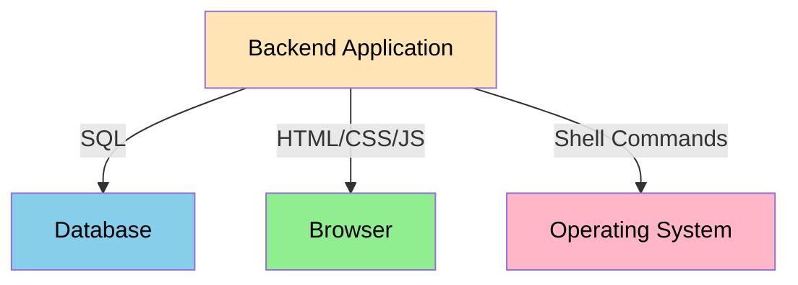

### Language Boundary Crossings

Each language has:
- Special characters (e.g., `'` in SQL, `<>` in HTML)
- Syntax and grammar rules
- Commands vs. data distinction
- Escape mechanisms

**Vulnerabilities occur when user input from one language crosses boundaries into another language without proper escaping.**

### The Injection Attack Pattern

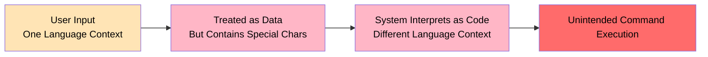

### Root Cause: Code/Data Confusion

All injection attacks boil down to this:

```
What we intended:  [SQL CODE] + [USER DATA]
What happened:     [SQL CODE] + [USER DATA CONTAINING SQL KEYWORDS]
                        = 
                   [MODIFIED SQL CODE]
```

The attacker injects code by providing data that looks like code in the target language.

---

## SQL Injection Deep Dive

### The Scenario: Login Page

```
Frontend:  Email input    Password input
           ↓              ↓
Backend:   Query database for matching user
           ↓
Database:  Execute SQL query
           ↓
Response:  User found / Login successful
```

### Vulnerable Code Pattern

```
// Dangerous: String concatenation
query = "SELECT * FROM users WHERE email = '" + userEmail + "'"
```

### Attack Example 1: Data Extraction

**Attacker Input:**
```
Email: ' OR '1'='1' --
```

**Query Becomes:**
```sql
SELECT * FROM users WHERE email = '' OR '1'='1' --'
```

**Analysis:**
- `''` - Empty string (false)
- `OR '1'='1'` - Always true (bypasses email check)
- `--` - Comments out the rest

**Result:** Returns ALL users instead of matching one user

### Attack Example 2: Data Destruction

**Attacker Input:**
```
Email: '; DROP TABLE users; --
```

**Query Becomes:**
```sql
SELECT * FROM users WHERE email = ''; DROP TABLE users; --'
```

**Result:** 
- First statement returns no results
- Second statement deletes the entire users table
- Third statement is commented out

### Impact of SQL Injection

Attackers can:
- Extract sensitive data (passwords, payment info, addresses)
- Modify or delete data
- Read files from the server filesystem
- In some configurations, execute operating system commands

### The Fix: Parameterized Queries

**Solution:**
```
// Safe: Parameterized query
statement = "SELECT * FROM users WHERE email = $1"
execute(statement, [userEmail])
```

### How Parameterized Queries Work

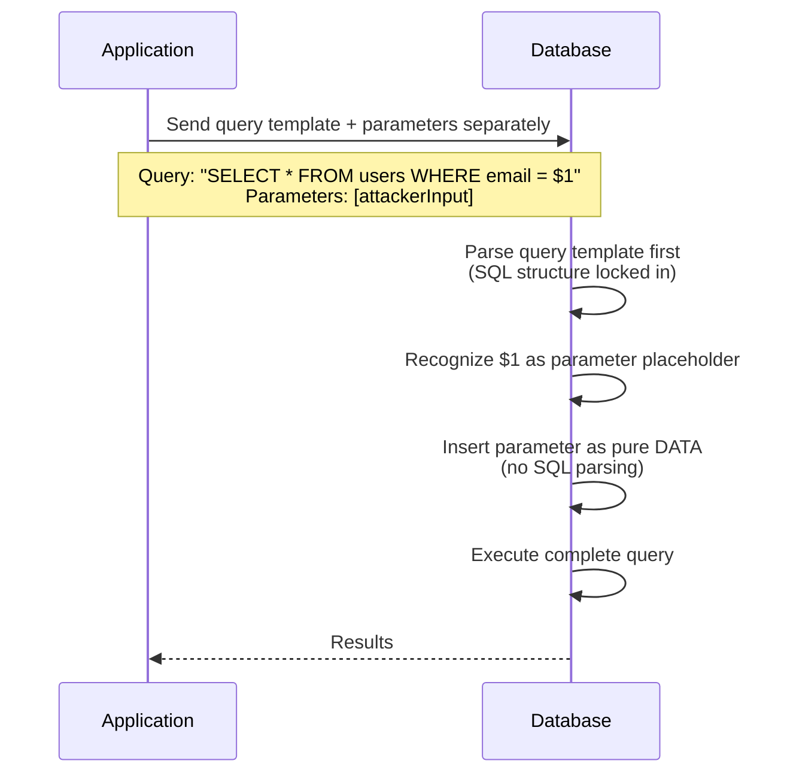

### Key Difference

**String Concatenation:**
- User input mixed with code during assembly
- Database receives: complete, interpreted string
- All content parsed as SQL

**Parameterized Queries:**
- Query structure sent separately from data
- Database receives: template + parameters
- Parameter always treated as data (never reparsed)

### Why Parameters Work

When using parameterized queries, even if user provides:
```
' OR '1'='1' --
```

The database treats it literally as a string value to search for, not as SQL code.

### Protection Layer: Database Permissions

Even if SQL injection succeeds, limit damage with:

```
CREATE USER app_user WITH RESTRICTED PERMISSIONS;
GRANT SELECT, INSERT, UPDATE ON users TO app_user;
REVOKE DROP, CREATE, ALTER FROM app_user;
```

**Why:** An attacker can only run commands the app user has permission for. If they can't `DROP TABLE`, the damage is limited.

---

## Other Injection Attacks

### OS Command Injection

**Scenario:** Application allows file operations based on user input

```
// Dangerous
filename = userInput
execute("rm " + filename)
```

**Attack:**
```
Input: "file.txt; rm -rf /"
Executes: rm file.txt; rm -rf /
```

**Fix:** Use framework APIs that don't shell out

```
// Safe: Direct API call
fileSystem.delete(filename)
```

### Cross-Site Scripting (XSS)

**When:** Application sends user input to browser without escaping

**Example:**
```html
<!-- Dangerous -->
<p>Welcome, <%= userName %></p>
```

If `userName` contains:
```
<script>alert('hacked')</script>
```

Browser executes the script.

**Fix:** Escape HTML special characters

```html
<!-- Safe -->
<p>Welcome, <%= escapeHTML(userName) %></p>
```

### Template Injection

**When:** User input directly embedded in templates

**Example:**
```
// Dangerous
template = "Hello " + userInput
execute(template)
```

**Fix:** Separate data from template structure

```
// Safe
template = "Hello {name}"
render(template, {name: userInput})
```

### LDAP Injection

**When:** Building LDAP queries with user input

```
// Dangerous
filter = "(uid=" + username + ")"
```

**Fix:** Use LDAP libraries with proper escaping

### Command Injection Summary

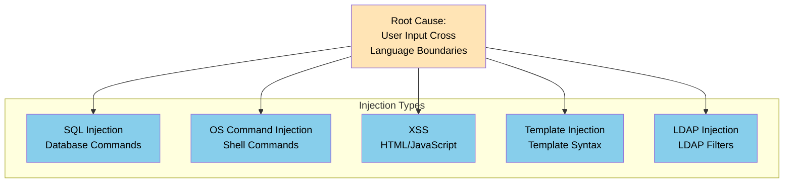

### Prevention Pattern for All Injections

1. **Never concatenate user input with code/commands**
2. **Always use framework-provided safe methods** (parameterized queries, template systems, APIs)
3. **Escape output appropriately** for the target context
4. **Validate and sanitize input** (defense in depth)
5. **Use prepared statements/parameterized queries** as default

---

## Authentication Security

### Beyond the Scope of This Guide

This guide assumes you're familiar with authentication concepts. For detailed coverage, see the dedicated authentication video/lecture.

### Authentication Providers: A Practical Recommendation

**Truth:** Building secure authentication from scratch is extremely complex.

#### Problems You'll Face

- Stateful vs. stateless authentication decisions
- OAuth flow implementation
- Session management across devices
- Password reset workflows
- Social login integration
- Duplicate account prevention
- Session revocation mechanisms
- Token refresh logic

#### Solution: Use Authentication Providers

Recommended services:
- **Clerk**
- **Auth0**
- **Okta**
- **Firebase Auth**

**Why:**
- Security team dedicated 24/7 to security
- Handles edge cases you won't think of
- Responds quickly to new attacks
- Provides better user experience
- Usually cheaper than building yourself

**When to build yourself:** When auth costs exceed $10k-20k/month and you have team capacity.

---

## Password Storage

### The Naive Approach (WRONG)

```
User sends: "myPassword123"
Server stores: "myPassword123" (in plaintext)

Problem:
- Database breach = all passwords leaked
- Internal employees can see passwords
- Users' other accounts compromised
  (70%+ reuse passwords across sites)
```

### Solution: Hashing

Hashing is a one-way function:

```
Input: "myPassword123"
↓ (Hash Function)
Output: "aF3x$9kL2mP@vQ1..." (fixed length, irreversible)

Properties:
1. One-way: Cannot reverse to get original password
2. Deterministic: Same input → same output
3. Fixed length: All outputs same size
4. Collision resistant: Different inputs → different outputs
```

---

## Hashing Techniques

### Hash Functions: Algorithm Comparison

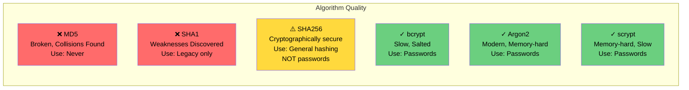

### Why NOT SHA256 for Passwords?

**Problem:** SHA256 is fast

```
- SHA256: 1 billion hashes/second on modern hardware
- Attacker can: Try dictionary attack in hours
- Time to crack 8-char password: ~1 hour
```

### Password Hashing Requirements

Algorithms must have these properties:

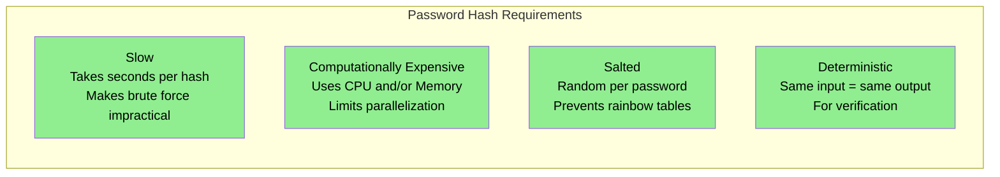

### Bcrypt Example

```
Input Password: "myPassword123"

Step 1: Generate random salt
Salt: $2b$10$N9qo8uLO

Step 2: Hash with salt
Hash: $2b$10$N9qo8uLOickgx2ZMRZoMye4RjZo

Step 3: Verify (during login)
bcrypt.compare("myPassword123", storedHash)
→ Rehashes with same salt, compares
```

### Salting: Why It Matters

**Without Salt:**
- Same password = same hash
- Creates rainbow tables (precomputed hashes)
- One breach of one user = compromise many

**With Salt:**
- Same password + different salt = different hash
- Makes rainbow tables impractical
- Doubles computation for attackers

> **Note:** Rainbow tables are precomputed hash lists for common passwords. Salting makes them ineffective, example: "password123" always hashes to the same value without salt, but with salt it hashes to different values for each user.

> **Note:** Bcrypt/Argon2/scrypt handle salting internally. Don't implement your own.

### Cost Factor (Work Factor)

```
bcrypt cost = 10 (default)
↓
Each increase costs 2x more computation
↓
Cost 11 = 2x slower than cost 10
Cost 12 = 4x slower than cost 10
```

**Strategy:** Increase cost over time as hardware improves

---

## Session Management

### Stateful vs. Stateless Authentication

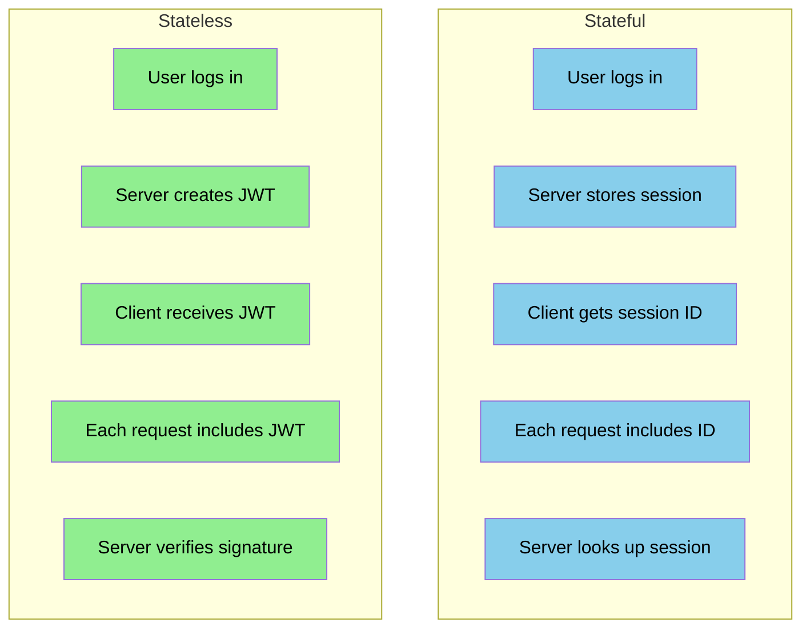

### Session ID Security

Session IDs must be:

```
1. Cryptographically Random
   - Not sequential
   - Not predictable
   - Sufficient entropy (128+ bits)

2. Secure Transport
   - Always HTTPS
   - Never HTTP

3. HttpOnly Flag (cookies)
   - JavaScript cannot access
   - Protects against XSS theft

4. Secure Flag (cookies)
   - Only sent over HTTPS
   - Not sent over HTTP

5. SameSite Flag (cookies)
   - Strict: Never cross-site
   - Lax: Only top-level navigations
   - None: All cross-site (requires Secure flag)
```

### Cookie SameSite Levels

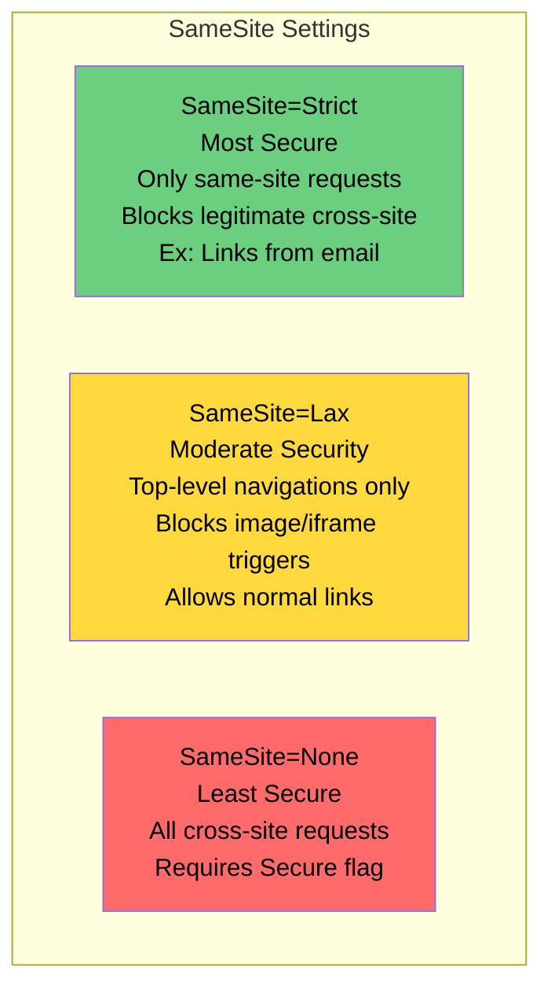

### Session Storage Considerations

**Server-Side Session Storage Options:**

```
1. Database
   ✓ Persistent across restarts
   ✓ Survives crashes
   ✗ Higher latency
   ✗ Database load

2. In-Memory Cache (Redis)
   ✓ Fast access
   ✓ Low latency
   ✗ Lost on restart
   ✗ Requires replication for HA

3. Hybrid (Cache + DB)
   ✓ Performance of cache
   ✓ Durability of database
   ✗ Complexity
   ✗ Consistency challenges
```

---

## JWT (JSON Web Tokens)

### JWT Structure

A JWT has three parts separated by dots:

```
header.payload.signature
```

### JWT Components Explained

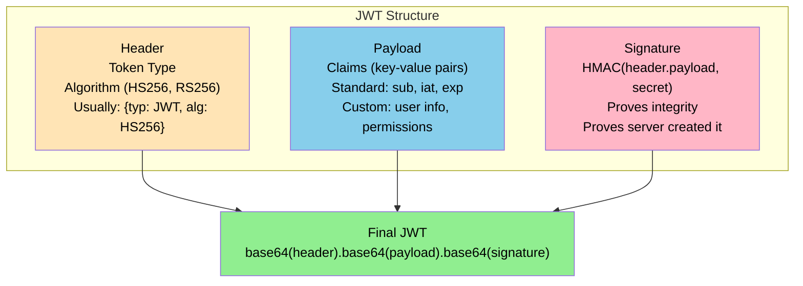

### JWT Claims

**Standard Claims (RFC 7519):**

```
sub (subject):  User ID
iat (issued at): Timestamp when created
exp (expiration): When token expires
iss (issuer):   Who issued it
aud (audience):  Who it's for
```

**Custom Claims:**

You can add any data:

```json
{
  "sub": "user123",
  "iat": 1704067200,
  "exp": 1704153600,
  "name": "Alice Johnson",
  "isAdmin": true
}
```

### JWT Verification Process

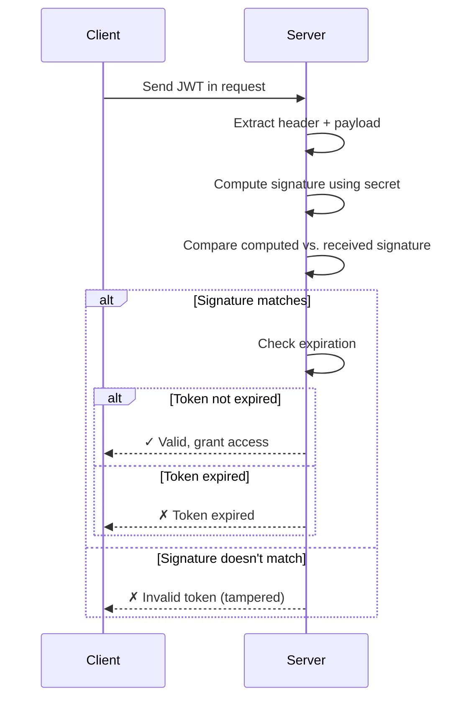

### JWT Key Advantage

**Stateless:** Server doesn't store anything about the user.

User contains their claims in the token itself.

**Disadvantage:** Can't instantly revoke a token (it's valid until expiry).

### JWT Vulnerabilities

**Common Mistakes:**

```
1. ❌ Algorithm: none
   Token without signature
   Attacker removes signature field
   Fix: Always require algorithm

2. ❌ Weak secret
   Secret predictable or short
   Attacker guesses/brute forces
   Fix: Cryptographically random 256+ bit secret

3. ❌ Expired token not checked
   Token stored longer than valid
   Fix: Always verify exp claim

4. ❌ Claims trusted blindly
   Assume isAdmin claim is correct
   Fix: Verify claims with database

5. ❌ Algorithm confusion
   Client specifies algorithm
   Server doesn't validate
   Fix: Server enforces expected algorithm
```

---

## Cross-Site Request Forgery (CSRF)

### The Problem: Unintended Actions

When a user visits a malicious website, that site can make requests to other sites using the user's logged-in session.

### CSRF Attack Flow

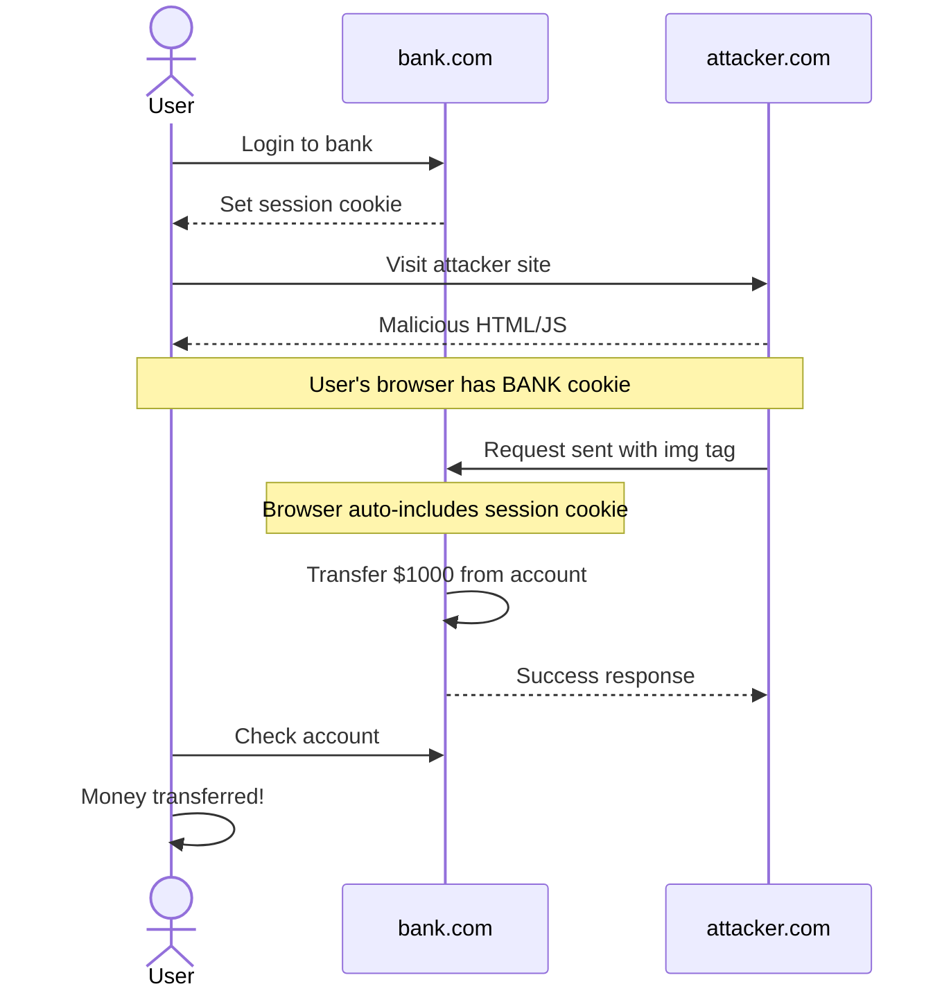

### CSRF Attack Example

**Malicious Website Code:**
```html

```

**Why it works:**
- Browser automatically includes cookies
- User is logged into their bank
- Bank sees valid session + valid request
- Transfer executes without user knowledge

### Prevention: SameSite Cookies

**Best Solution:**
```
Set-Cookie: sessionId=abc123; SameSite=Strict
```

**Effect:**
- Cookie NOT sent on cross-site requests
- Malicious site can't trigger bank requests
- Protects against CSRF automatically

### Prevention: CSRF Tokens (Traditional)

For older browsers without SameSite support:

```
1. Server generates random token
2. Server embeds token in form
3. User submits form with token
4. Server verifies token matches session
5. Attacker can't forge token (not same-site)
```

### Why CSRF is Browser-based

CSRF happens because:
1. Cookies are automatic (sent by browser)
2. Requests look legitimate (come from user's session)
3. Attacker can't see responses (CORS prevents it)
4. But the request still executes on the server

---

## Security Defense Layers

### Layered Defense (Defense in Depth)

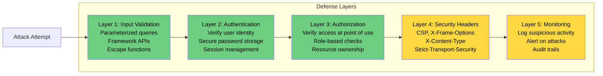

### Layer 1: Input Validation & Injection Prevention

```
✓ Use parameterized queries (not string concatenation)
✓ Use framework APIs (not OS commands)
✓ Escape output (HTML, JavaScript, SQL)
✓ Validate format (email, URL, phone, etc.)
✓ Validate length (prevent buffer overflow)
✓ Validate allowed values (enums, whitelists)
```

### Layer 2: Authentication

```
✓ Hash passwords with bcrypt/Argon2
✓ Implement rate limiting on login
✓ Require strong passwords
✓ Use HTTPS for all auth flows
✓ Implement account lockout
✓ Require verification (2FA when possible)
```

### Layer 3: Authorization

**Critical:** Verify authorization at point of access, not upstream

```
❌ Wrong approach:
   Check authorization at routing layer
   Trust throughout execution

✓ Correct approach:
   Check at routing layer
   Re-verify at data access layer
   Before reading/writing resource
```

**Why:** Business logic may change. Authorization checks in wrong place get bypassed.

### Layer 4: Security Headers & Policies

```
Content-Security-Policy: script-src 'self'
  → Limits script execution to same origin

X-Frame-Options: DENY
  → Prevents clickjacking via iframes

X-Content-Type-Options: nosniff
  → Browser won't guess content type

Strict-Transport-Security: max-age=31536000
  → Force HTTPS for all future requests

X-XSS-Protection: 1; mode=block
  → Browser XSS protection (legacy)
```

**Disclaimer:** These are NOT primary defenses. They're secondary protections if primary defenses fail.

### Layer 5: Monitoring & Logging

```
✓ Log authentication attempts (success and failure)
✓ Log authorization failures
✓ Log data access patterns
✓ Monitor for suspicious patterns:
  - Rapid failed logins
  - Unusual data access
  - Permission escalation attempts
✓ Alert on critical events
✓ Maintain audit trails for compliance
```

### Why Layered Defense Works

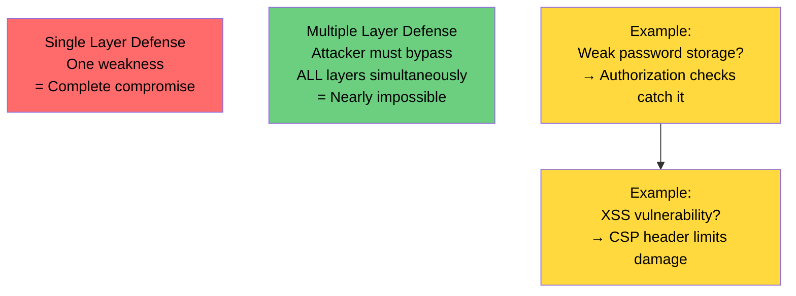

---

## Security Best Practices Summary

### Essential Rules

```
1. NEVER trust user input
   Always validate and sanitize

2. NEVER concatenate user input with code
   Use parameterized queries, framework APIs

3. NEVER store passwords in plaintext
   Use bcrypt, Argon2, or scrypt

4. NEVER skip authentication verification
   Always verify user identity

5. NEVER skip authorization checks
   Verify access at point of use

6. NEVER ignore security headers
   Configure CSP, CORS, X-Frame-Options

7. NEVER disable HTTPS
   Always use encryption

8. NEVER assume security is optional
   Security must be built in from start
```

### Implementation Checklist

```
Input Security:
☐ All user input validated
☐ Parameterized queries used
☐ Framework APIs for OS operations
☐ Output properly escaped

Authentication:
☐ Passwords hashed with bcrypt/Argon2
☐ Account lockout implemented
☐ Rate limiting on login
☐ HTTPS enforced

Authorization:
☐ Access verified at point of use
☐ Role checks implemented
☐ Resource ownership verified
☐ Sensitive operations logged

Session Management:
☐ Session IDs cryptographically random
☐ HttpOnly flag set
☐ SameSite=Strict or Lax
☐ Secure flag set (HTTPS only)
☐ Reasonable expiration time

Monitoring:
☐ Authentication logged
☐ Authorization failures logged
☐ Suspicious activity monitored
☐ Alerts configured
☐ Audit trails maintained

Infrastructure:
☐ HTTPS/TLS configured
☐ Security headers set
☐ Database permissions minimal
☐ Secrets managed securely
☐ Dependencies updated
```

---

## Learning Resources

### Recommended Reading

#### 1. PortSwigger Academy (FREE)
- **Website**: portswigger.net/academy
- **Content**: Comprehensive security labs with theory
- **Covers**: 
  - SQL Injection
  - Cross-site scripting (XSS)
  - CSRF
  - Clickjacking
  - SSRF
  - OS command injection
  - Authentication vulnerabilities
  - OAuth vulnerabilities
  - JWT attacks
  - And many more

**Why recommended:** Free, practical labs with real-world scenarios

#### 2. OWASP (Open Web Application Security Project)
- **Website**: owasp.org
- **Key Resource**: OWASP Top 10

**OWASP Top 10 (Current):**

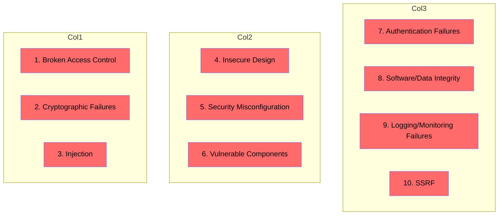

**OWASP Cheat Sheets:** owasp.org/cheatsheets

Detailed best practices for:
- Authentication
- Session Management
- Authorization
- Cryptography
- And more...

### Mindset Over Memorization

Remember: **Security is not about memorizing a list of vulnerabilities.**

It's about:
- Understanding attacker motivation
- Thinking about boundaries and assumptions
- Building layered defenses
- Staying paranoid about your code
- Continuously learning and adapting

### Apply This Mindset Always

Every time you write code, ask:

```
1. What assumptions am I making?
2. What if those assumptions are wrong?
3. How could an attacker exploit this?
4. What boundaries exist here?
5. What could go wrong?
6. How can I defend against it?
```

---

## Final Thoughts

### Security is a Journey, Not a Destination

- No application is truly secure
- New vulnerabilities emerge regularly
- Technology constantly evolves
- Your job is continuous improvement

### The Responsibility

As a backend engineer, you're trusted with:
- User credentials
- Personal data
- Financial information
- Business secrets
- User privacy

Treat this responsibility seriously.

### Recommended Next Steps

1. **Read:** Dive into PortSwigger Academy
2. **Practice:** Build a small app focusing on security
3. **Review:** Have security-minded peers review your code
4. **Learn:** Study OWASP resources in depth
5. **Stay Updated:** Follow security news and advisories
6. **Practice:** Take on security-focused side projects

### Remember

The goal of this guide was to make you paranoid about security in the best way possible. If every time you write code you ask "what could go wrong?", then this guide has succeeded.

**Security is everyone's responsibility.**

---

## Appendix: Quick Reference

### Vulnerable Pattern vs. Fix

```
VULNERABLE:
  query = "SELECT * FROM users WHERE id = " + userId

FIXED:
  query("SELECT * FROM users WHERE id = ?", [userId])


VULNERABLE:
  os.system("rm " + filename)

FIXED:
  fileSystem.delete(filename)


VULNERABLE:
  document.innerHTML = userContent

FIXED:
  element.textContent = userContent
  OR
  element.innerHTML = escapeHTML(userContent)


VULNERABLE:
  return plainPassword

FIXED:
  return bcrypt.hash(password, 10)


VULNERABLE:
  Set-Cookie: sessionId=abc123

FIXED:
  Set-Cookie: sessionId=abc123; HttpOnly; Secure; SameSite=Strict
```

### Common Vulnerability Checklist

- [ ] Any string concatenation with user input?
- [ ] Passwords stored in plaintext?
- [ ] Authorization checked at entry point only?
- [ ] No rate limiting on login?
- [ ] Cookies without HttpOnly flag?
- [ ] Missing HTTPS?
- [ ] No input validation?
- [ ] Using outdated libraries?
- [ ] No logging of security events?
- [ ] Exposed sensitive error messages?
