# Backend Scaling and Performance Engineering - Part 1

## Table of Contents
1. [Introduction](#introduction)
2. [Defining Performance](#defining-performance)
3. [Latency: The Core Metric](#latency-the-core-metric)
4. [Throughput: Request Processing Capacity](#throughput-request-processing-capacity)
5. [Utilization: System Capacity Usage](#utilization-system-capacity-usage)
6. [The Utilization-Latency Relationship](#the-utilization-latency-relationship)
7. [Identifying Bottlenecks](#identifying-bottlenecks)
8. [Database Performance Optimization](#database-performance-optimization)
9. [N+1 Query Problem](#n1-query-problem)
10. [Database Indexing](#database-indexing)
11. [Connection Pooling](#connection-pooling)
12. [Caching Fundamentals](#caching-fundamentals)
13. [Key Takeaways](#key-takeaways)

---

## Introduction

### Scope and Focus

Scaling and performance are critical concepts in backend engineering, but the definitions vary significantly across different domains:

- **Browser/Frontend Performance**: DOM rendering, JavaScript execution, asset loading
- **Network Performance**: Bandwidth, latency, packet loss, compression
- **Server/Infrastructure Performance**: Operating system, resource allocation, networking
- **Backend Application Performance**: Application code, data handling, business logic efficiency

This guide focuses specifically on **backend application performance** and the principles that help you understand system behavior under load.

### Learning Goals

By the end of this part, you will:
- Understand fundamental performance metrics (latency, throughput, utilization)
- Develop intuition for how systems behave under load
- Identify where bottlenecks hide in your architecture
- Learn practical optimization techniques for databases
- Build a mental model applicable to any system

**Important**: This guide teaches you how to think about performance, not just techniques to memorize.

---

## Defining Performance

### What Does "System is Fast" Mean?

When we say a system is fast, we're referring to a complete user journey:

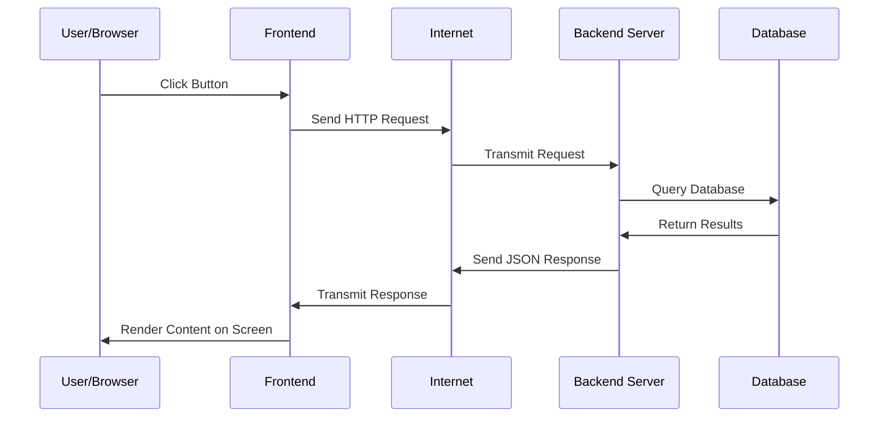

**Performance** = The total time from when a user initiates an action until they see the result.

### The User's Perspective

Users don't care about:
- How many milliseconds the database query takes
- How optimized your code is
- How many servers you have

Users only care about:
- How long until something appears on their screen
- Whether the app feels responsive
- Whether they can complete their task

---

## Latency: The Core Metric

### Definition

**Latency** is the time elapsed from when a request begins until the response completes. It's what users **feel** when they say "your app is slow."

### Key Insight: Latency Varies

Latency is **not** a single number. It varies from request to request:

```
Request 1: 50 milliseconds (cache hit)
Request 2: 200 milliseconds (database query)
Request 3: 85 milliseconds (partially cached)
Request 4: 300 milliseconds (complex computation)
```

### Why Does Latency Vary?

Several factors cause variation:

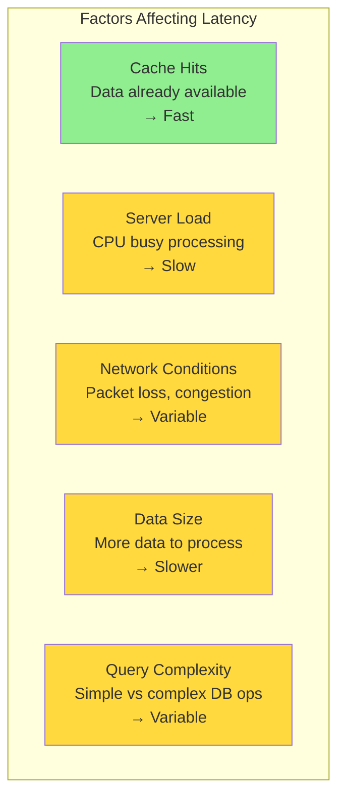

### Real-World Variations

**Best Case Scenario:**
- Data in cache
- Server idle
- Optimal network
- Small response
- Result: ~50ms

**Worst Case Scenario:**
- Cache miss
- Server fully loaded
- Poor network
- Large response
- Complex query
- Result: ~2000ms (2 seconds)

### Measuring Latency Properly

Instead of reporting a single number, report **distribution metrics**:

```
Minimum:     45ms
P50 (Median): 150ms
P95:          800ms
P99:          1500ms
Maximum:      3000ms
```

**Why P95/P99?** Most users experience these percentiles, and they're more representative of typical experience than just the average.

---

## Throughput: Request Processing Capacity

### Definition

**Throughput** is the number of requests your system can process per unit of time.

```
Throughput Examples:
- 100 requests per second (RPS)
- 1000 queries per minute (QPM)
- 6 million requests per day
```

### Throughput Affects Latency

A critical relationship: As throughput increases, latency increases.

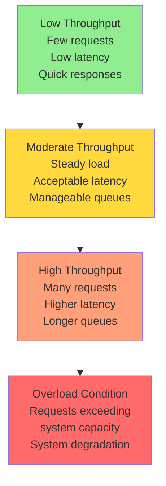

### Real-World Scenarios

**Can our system handle:**
- Black Friday traffic spikes?
- Email campaign surge?
- Featured in a popular podcast?
- Viral social media post?

All these questions require understanding throughput and latency together.

### The Queue Analogy

Think of your system like a service counter:

```
Low Traffic (Throughput):
Server is idle → Request arrives → Served immediately
                 Latency: ~50ms

High Traffic:
Server is busy → Request arrives → Joins queue → Waits → Served
                 Latency: ~500ms (service + wait time)
```

The **worker's speed doesn't change**, but your wait time increases because of the queue.

---

## Utilization: System Capacity Usage

### Definition

**Utilization** is the percentage of your system's capacity currently in use.

```
0% utilization   = System idle, no requests being processed
50% utilization  = Half capacity being used
100% utilization = Fully saturated, at maximum capacity
```

### The Utilization-Latency Curve

This is the **most important relationship** in performance engineering:

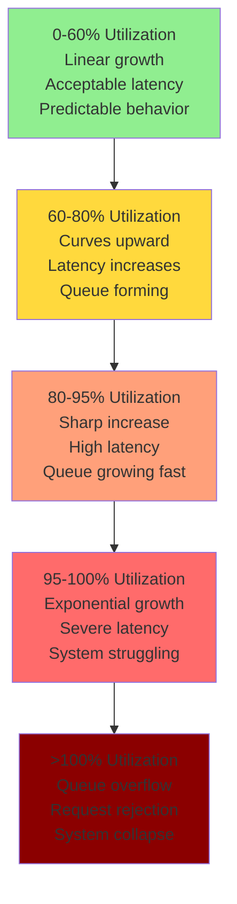

### The Counterintuitive Truth

Most people expect latency to grow linearly with utilization:

```
Expected (Linear):  Latency = Utilization × Constant
Actual (Exponential): Latency grows exponentially near 100%
```

**Why the exponential curve?**

At high utilization:
- Requests queue up waiting for resources
- Context switching increases overhead
- Contention for resources intensifies
- Small inefficiencies compound

### Highway Analogy

```
50% Capacity:
- Cars can change lanes freely
- Traffic flows smoothly
- Everyone maintains speed
- Predictable travel time

80% Capacity:
- Lane changes are risky
- Need to plan ahead
- Some slowdowns
- Mostly predictable

90% Capacity:
- Barely any space
- One delayed car affects everyone
- Unpredictable jams
- Ripple effects from any disruption

100% Capacity:
- No space to move
- Complete gridlock
- Nothing flows
- Total system failure
```

### The Buffer Requirement

**Critical Realization**: You cannot run systems at 100% utilization.

Production systems typically operate at:
- **60-80% normal utilization** (steady state)
- **20% buffer** (for traffic spikes)

**Why the buffer?**

1. **Traffic comes in bursts**, not smoothly
2. **Spikes can exceed average** by 10-20x
3. **Exponential relationship** means small increases cause large latency jumps

---

## The Utilization-Latency Relationship

### Visual Representation

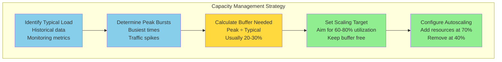

### Example: E-commerce Platform

```
Normal traffic:      1000 RPS (60% capacity)
Peak traffic:        1500 RPS (90% capacity)
Traffic spike:       2500 RPS (150% capacity) ← NEEDS SCALING

System capacity:     ~1667 RPS (100%)
Comfortable running: 1000 RPS (60%)
```

During a spike, the system auto-scales to handle additional load.

---

## Identifying Bottlenecks

### The Reality of Performance Issues

When someone says "the system is slow," it's almost always **one specific component** causing the slowness:

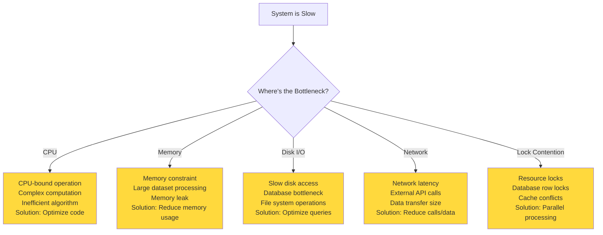

### How to Find Bottlenecks

```
1. Measure
   ↓ Collect metrics from all layers (frontend, network, backend, database)
   ↓
2. Analyze
   ↓ Identify which layer has the highest latency
   ↓
3. Focus
   ↓ Optimize the slowest layer first
   ↓
4. Verify
   ↓ Measure again to confirm improvement
   ↓
5. Repeat
   ↓ Move to next bottleneck
```

### The 80/20 Rule

> 80% of performance issues come from 20% of the code.

Focus optimization efforts on:
- Frequently called functions
- Operations affecting multiple requests
- Bottlenecks in critical paths

Don't optimize:
- Code that runs rarely
- Code that's already fast enough
- Code that doesn't affect user experience

---

## Database Performance Optimization

### Why Databases are Often the Bottleneck

Most systems follow this architecture:

```
Frontend → Backend Application → Database
```

Database is the bottleneck because:
- Network latency (request/response)
- Query parsing overhead
- I/O operations (disk access)
- Concurrency management

### Common Database Performance Issues

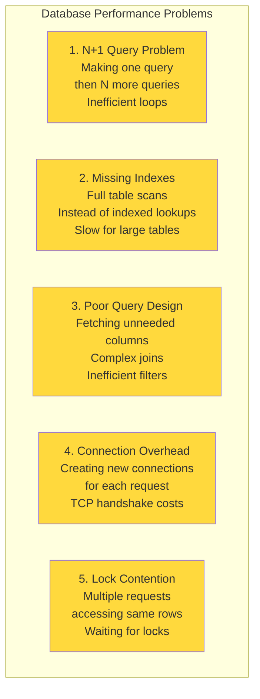

---

## N+1 Query Problem

### What is N+1?

The N+1 query problem occurs when you:
1. Make 1 query to fetch N items
2. Then make N more queries to fetch details about each item
3. Total: 1 + N queries (where it should be 1-2 queries)

### Example: Blog Post with Authors

**Inefficient Code (N+1):**

```
Query 1: SELECT * FROM posts WHERE user_id = 123
         Result: [20 posts]

Then in a loop:
Query 2: SELECT * FROM users WHERE id = 1
Query 3: SELECT * FROM users WHERE id = 2
Query 4: SELECT * FROM users WHERE id = 3
...
Query 21: SELECT * FROM users WHERE id = 20

Total Queries: 21
```

**Efficient Code (2 queries):**

```
Query 1: SELECT * FROM posts WHERE user_id = 123
         Result: [20 posts]

Query 2: SELECT * FROM users WHERE id IN (1, 2, 3, ..., 20)
         Result: All authors at once

Total Queries: 2
```

### The Cost of N+1

Each query has overhead:

```
Network latency:        1ms per round trip
TCP connection:         2ms (if pooled, ~0.1ms)
Database parsing:       2ms
Query execution:        5ms
Network return:         1ms
──────────────────────
Per query overhead:     ~11ms minimum

For 1000 items:
1000 queries × 11ms = 11 seconds
vs.
2 queries × 11ms = 22ms
```

**Impact**: 1000× slower performance!

### Preventing N+1

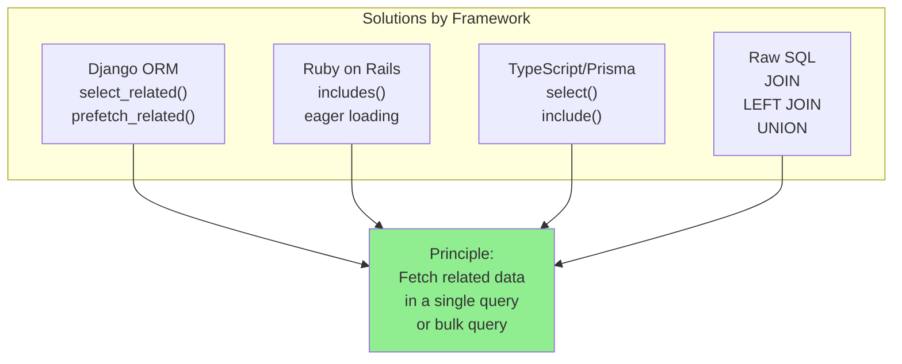

### Best Practice: Enable Query Logging

During development, enable SQL query logging to see what queries your ORM actually executes:

```
[DEBUG] SELECT * FROM posts WHERE user_id = 123
[DEBUG] SELECT * FROM users WHERE id = 1
[DEBUG] SELECT * FROM users WHERE id = 2
[DEBUG] SELECT * FROM users WHERE id = 3
← See the N+1 problem immediately!

vs.

[DEBUG] SELECT * FROM posts WHERE user_id = 123
[DEBUG] SELECT * FROM users WHERE id IN (1, 2, 3, ...)
← Optimized approach
```

---

## Database Indexing

### What is an Index?

An index is a data structure that allows fast lookups without scanning entire tables.

### Library Analogy

**Without Index (Full Table Scan):**

Imagine a library with 1 million books but **no catalog**:
- Customer wants all books by "John Green"
- Librarian must:
  1. Check every single book
  2. Write down locations of John Green books
  3. Walk to all locations and collect books
  4. Time needed: 3 days

**With Index (Using Catalog):**

Same library with a **catalog organized by author**:
- Customer asks for John Green
- Librarian checks catalog
- Catalog shows exact shelf locations
- Librarian walks directly to locations
- Time needed: 2-3 minutes

### How Indexes Work

Indexes typically use **B-Tree** data structure:

```
Index on author_id:
1 → [pointers to rows with author_id=1]
2 → [pointers to rows with author_id=2]
3 → [pointers to rows with author_id=3]
4 → [pointers to rows with author_id=4]
...

To find all posts by author 2:
1. Look up "2" in index (fast, O(log n))
2. Get list of row pointers (instant)
3. Fetch those specific rows (fast)

Without index:
1. Scan entire table (slow, O(n))
2. Check each row (very slow for large tables)
```

### Full Table Scan vs. Indexed Lookup

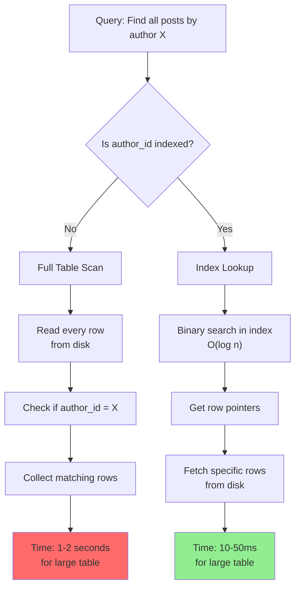

### When to Create Indexes

Create indexes on columns used in:

```
1. WHERE clauses
   WHERE author_id = X    → Index author_id

2. JOIN conditions
   JOIN users ON posts.user_id = users.id
                           → Index posts.user_id and users.id

3. ORDER BY
   ORDER BY created_at DESC
                           → Index created_at

4. Foreign keys
   Foreign key relationships
                           → Always index foreign keys

Don't index:
- Columns with low cardinality (few unique values)
- Columns rarely used in queries
- Columns with frequent updates (index maintenance overhead)
```

### Index Trade-offs

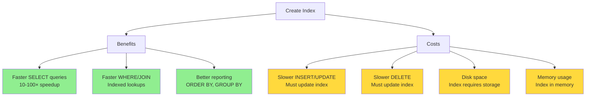

**Strategy**: Index columns used in frequent, performance-critical queries.

---

## Connection Pooling

### The Connection Overhead Problem

Creating a new database connection is expensive:

```
1. DNS lookup:              0-5ms
2. TCP connection setup:    5-10ms
3. Authentication:          2-5ms
4. Query execution:         5-50ms (actual work)
   ────────────────
   Total per query:         12-70ms

For 1000 queries:
- With pooling: 1000 × 10ms = 10 seconds
- Without pooling: 1000 × 50ms = 50 seconds (5x slower!)
```

### Connection Pooling Solution

Instead of creating a new connection for each request:

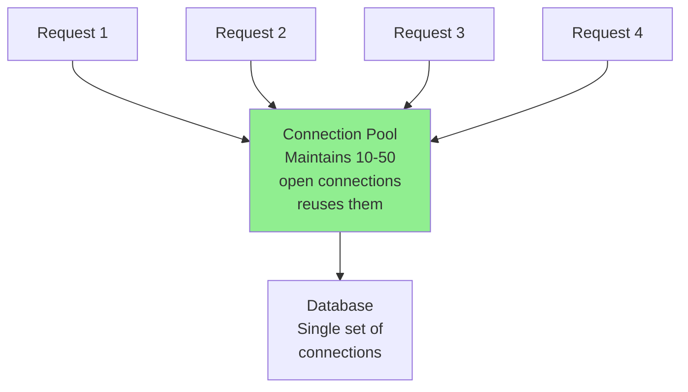

### Types of Pooling

#### Internal Pooling (Application-level)

```
Server 1 → Connection Pool (10 connections) ↘
Server 2 → Connection Pool (10 connections) → Database (capacity: 30 connections)
Server 3 → Connection Pool (10 connections) ↗

Problem: Multiple servers can exceed database capacity
```

#### External Pooling (Dedicated pooler)

```
Server 1 →┐
Server 2 →├→ External Pooler (25 connections) → Database (capacity: 30 connections)
Server 3 →┘

Benefit: Single pool prevents connection exhaustion
```

### When Pooling Becomes Critical

**Scenario: Traffic Spike with Auto-scaling**

```
Normal state:
- 1 server with 10-connection pool
- Database max: 30 connections
- Utilization: 10/30 = 33% ✓

Traffic spike detected:
- Kubernetes adds 2 more servers
- Now 3 servers × 10-connection pool = 30 connections
- Utilization: 30/30 = 100% (at capacity)

Traffic spikes again:
- Each server tries to grab 20 connections (high load)
- Total needed: 3 × 20 = 60 connections
- Database capacity: 30 connections
- Result: Connection pool exhausted! ✗ Database crash
```

**Solution**: Use external pooler (e.g., PgBouncer for PostgreSQL)

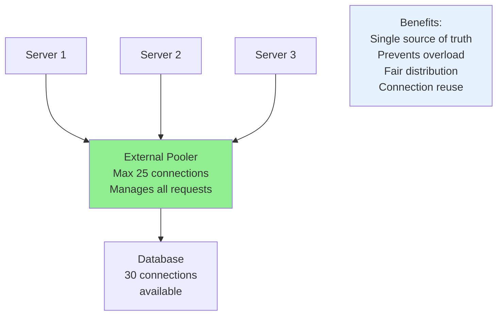

---

## Caching Fundamentals

### The Caching Principle

> Store results of expensive operations, reuse them instead of recomputing.

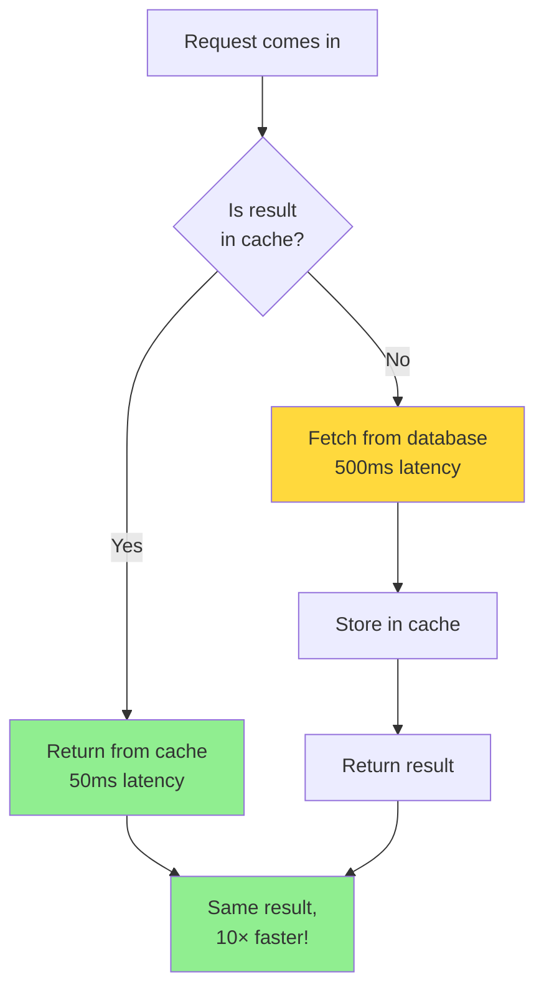

### Caching Impact

```
Without cache:
- All requests query database: 500ms each
- 1000 requests: 500 seconds total

With cache (80% hit rate):
- 800 requests from cache: 50ms each = 40 seconds
- 200 requests from database: 500ms each = 100 seconds
- Total: 140 seconds (71% faster!)
```

### Cache Invalidation

**The Hard Problem**: Keeping cache consistent with database.

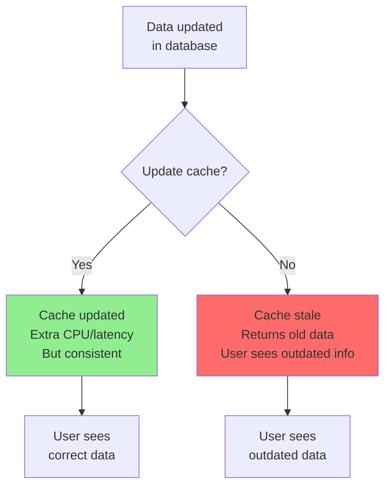

### Cache Invalidation Strategies

```
1. Time-based (TTL):
   Cache expires after 5 minutes
   Example: cache.set(key, value, ttl=300)
   ✓ Simple
   ✗ Data might be stale

2. Event-based:
   Update cache when data changes
   Example: On UPDATE, delete cache entry
   ✓ Consistent
   ✗ Complex to implement

3. Demand-based:
   Application checks and updates
   Example: Check timestamp, refresh if old
   ✓ Flexible
   ✗ Additional complexity

4. Hybrid:
   TTL + event-based + demand checks
   ✓ Most robust
   ✗ Most complex
```

---

## Key Takeaways

### Fundamental Concepts

1. **Performance is Measurable**
   - Latency: time for request to complete
   - Throughput: requests per unit time
   - Utilization: percentage of capacity in use

2. **Utilization Drives Latency Exponentially**
   - Linear from 0-60% utilization
   - Curves upward from 60-80%
   - Exponential from 80-100%
   - Never run at 100% utilization

3. **Bottleneck Mindset**
   - One component usually causes slowness
   - Find it, optimize it, measure improvement
   - Move to next bottleneck

### Database Optimization Priority

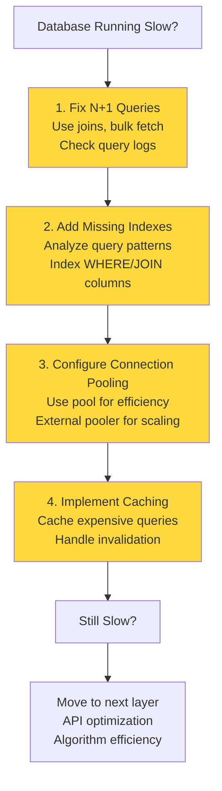

### Action Items

✓ **Measure everything** - Collect latency, throughput, utilization metrics
✓ **Find the bottleneck** - Use profiling and monitoring tools
✓ **Optimize iteratively** - Fix biggest impact first
✓ **Verify improvements** - Measure before and after
✓ **Monitor production** - Performance changes over time
✓ **Set performance budgets** - Define acceptable latency targets

### Remember

- **Performance is a feature**, not an afterthought
- **Premature optimization is bad**, but informed optimization is essential
- **Understand your system** before optimizing
- **Measure everything** - "You can't improve what you don't measure"
- **Keep buffer capacity** - 20-30% reserved for spikes

---

## Next Steps

This Part 1 covered foundational concepts and database optimization. Part 2 typically covers:
- Scaling strategies (vertical vs. horizontal)
- Load balancing
- Caching strategies in depth
- API optimization
- Message queues and async processing
- Infrastructure scaling

The mental models learned here apply to all these topics.
