# Backend Scaling and Performance Engineering - Part 1

## Table of Contents

1. [Introduction](#introduction)
2. [Defining Performance](#defining-performance)
3. [Latency: The Core Metric](#latency-the-core-metric)
4. [Throughput: Request Processing Capacity](#throughput-request-processing-capacity)
5. [Utilization: System Capacity Usage](#utilization-system-capacity-usage)
6. [The Utilization-Latency Relationship](#the-utilization-latency-relationship)
7. [Identifying Bottlenecks](#identifying-bottlenecks)
8. [Database Performance Optimization](#database-performance-optimization)
9. [N+1 Query Problem](#n1-query-problem)
10. [Database Indexing](#database-indexing)
11. [Connection Pooling](#connection-pooling)
12. [Caching Fundamentals](#caching-fundamentals)
13. [Key Takeaways](#key-takeaways)

---

## Introduction

### Scope and Focus

Scaling and performance are critical concepts in backend engineering, but the definitions vary significantly across different domains:

- **Browser/Frontend Performance**: DOM rendering, JavaScript execution, asset loading
- **Network Performance**: Bandwidth, latency, packet loss, compression
- **Server/Infrastructure Performance**: Operating system, resource allocation, networking
- **Backend Application Performance**: Application code, data handling, business logic efficiency

This guide focuses specifically on **backend application performance** and the principles that help you understand system behavior under load.

### Learning Goals

By the end of this part, you will:

- Understand fundamental performance metrics (latency, throughput, utilization)
- Develop intuition for how systems behave under load
- Identify where bottlenecks hide in your architecture
- Learn practical optimization techniques for databases
- Build a mental model applicable to any system

**Important**: This guide teaches you how to think about performance, not just techniques to memorize.

---

## Defining Performance

### What Does "System is Fast" Mean?

When we say a system is fast, we're referring to a complete user journey:

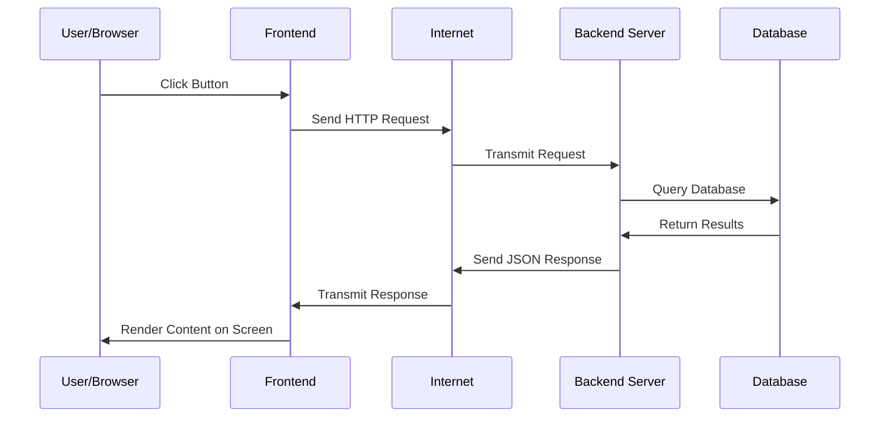

**Performance** = The total time from when a user initiates an action until they see the result.

### The User's Perspective

Users don't care about:

- How many milliseconds the database query takes
- How optimized your code is
- How many servers you have

Users only care about:

- How long until something appears on their screen
- Whether the app feels responsive
- Whether they can complete their task

---

## Latency: The Core Metric

### Definition

**Latency** is the time elapsed from when a request begins until the response completes. It's what users **feel** when they say "your app is slow."

### Key Insight: Latency Varies

Latency is **not** a single number. It varies from request to request:

```
Request 1: 50 milliseconds (cache hit)
Request 2: 200 milliseconds (database query)
Request 3: 85 milliseconds (partially cached)
Request 4: 300 milliseconds (complex computation)
```

### Why Does Latency Vary?

Several factors cause variation:

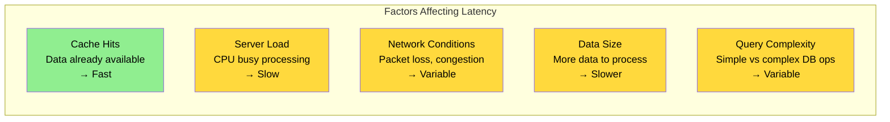

### Real-World Variations

**Best Case Scenario:**

- Data in cache
- Server idle
- Optimal network
- Small response
- Result: ~50ms

**Worst Case Scenario:**

- Cache miss
- Server fully loaded
- Poor network
- Large response
- Complex query
- Result: ~2000ms (2 seconds)

### Measuring Latency Properly

Instead of reporting a single number, report **distribution metrics**:

```
Minimum:     45ms
P50 (Median): 150ms
P95:          800ms
P99:          1500ms
Maximum:      3000ms
```

**Why P95/P99?** Most users experience these percentiles, and they're more representative of typical experience than just the average.

---

## Throughput: Request Processing Capacity

### Definition

**Throughput** is the number of requests your system can process per unit of time.

```
Throughput Examples:
- 100 requests per second (RPS)
- 1000 queries per minute (QPM)
- 6 million requests per day
```

### Throughput Affects Latency

A critical relationship: As throughput increases, latency increases.

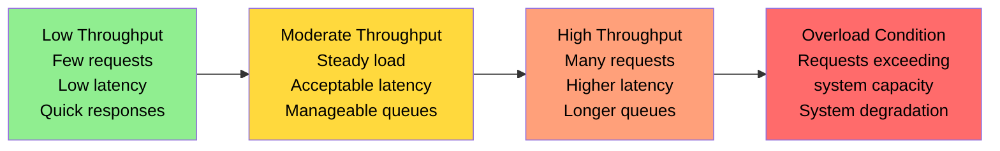

### Real-World Scenarios

**Can our system handle:**

- Black Friday traffic spikes?
- Email campaign surge?
- Featured in a popular podcast?
- Viral social media post?

All these questions require understanding throughput and latency together.

### The Queue Analogy

Think of your system like a service counter:

```
Low Traffic (Throughput):
Server is idle → Request arrives → Served immediately
                 Latency: ~50ms

High Traffic:
Server is busy → Request arrives → Joins queue → Waits → Served
                 Latency: ~500ms (service + wait time)
```

The **worker's speed doesn't change**, but your wait time increases because of the queue.

---

## Utilization: System Capacity Usage

### Definition

**Utilization** is the percentage of your system's capacity currently in use.

```
0% utilization   = System idle, no requests being processed
50% utilization  = Half capacity being used
100% utilization = Fully saturated, at maximum capacity
```

### The Utilization-Latency Curve

This is the **most important relationship** in performance engineering:

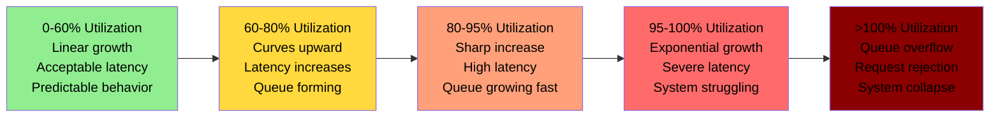

### The Counterintuitive Truth

Most people expect latency to grow linearly with utilization:

```
Expected (Linear):  Latency = Utilization × Constant
Actual (Exponential): Latency grows exponentially near 100%
```

**Why the exponential curve?**

At high utilization:

- Requests queue up waiting for resources
- Context switching increases overhead
- Contention for resources intensifies
- Small inefficiencies compound

### Highway Analogy

```
50% Capacity:
- Cars can change lanes freely
- Traffic flows smoothly
- Everyone maintains speed
- Predictable travel time

80% Capacity:
- Lane changes are risky
- Need to plan ahead
- Some slowdowns
- Mostly predictable

90% Capacity:
- Barely any space
- One delayed car affects everyone
- Unpredictable jams
- Ripple effects from any disruption

100% Capacity:
- No space to move
- Complete gridlock
- Nothing flows
- Total system failure
```

### The Buffer Requirement

**Critical Realization**: You cannot run systems at 100% utilization.

Production systems typically operate at:

- **60-80% normal utilization** (steady state)
- **20% buffer** (for traffic spikes)

**Why the buffer?**

1. **Traffic comes in bursts**, not smoothly
   - _Burst_: A sudden increase in request volume (e.g., user clicks "submit" button, thousands click at once)
   - Real traffic doesn't arrive evenly spread across time—it clusters

2. **Spikes can exceed average** by 10-20x
   - _Spike_: A temporary surge far above typical levels (e.g., morning rush, sale announcement, trending post)
   - Example: Average 100 RPS → sudden spike to 1,000 RPS during promotion

3. **Exponential relationship** means small increases cause large latency jumps
   - At 95% utilization, adding 5% more traffic doesn't cause 5% more latency—it causes 100%+ latency increase
   - The queue effects multiply at high utilization

---

## The Utilization-Latency Relationship

### Visual Representation

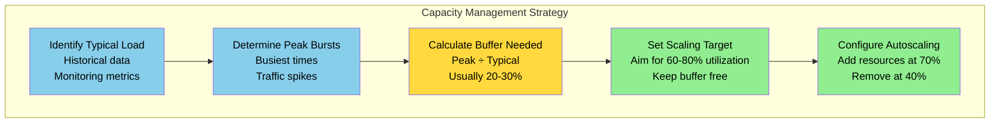

### Example: E-commerce Platform

```
Normal traffic:      1000 RPS (60% capacity)
Peak traffic:        1500 RPS (90% capacity)
Traffic spike:       2500 RPS (150% capacity) ← NEEDS SCALING

System capacity:     ~1667 RPS (100%)
Comfortable running: 1000 RPS (60%)
```

During a spike, the system auto-scales to handle additional load.

---

## Identifying Bottlenecks

### The Reality of Performance Issues

When someone says "the system is slow," it's almost always **one specific component** causing the slowness:

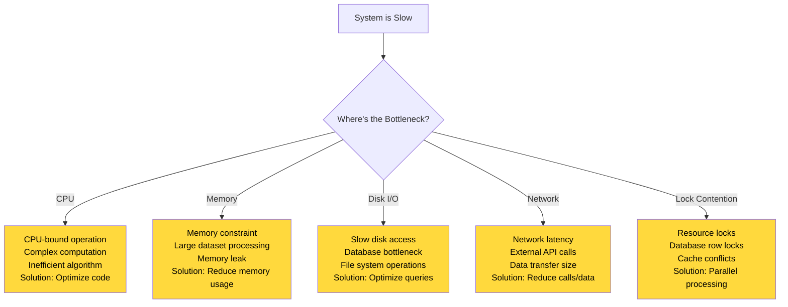

### How to Find Bottlenecks

```
1. Measure
   ↓ Collect metrics from all layers (frontend, network, backend, database)
   ↓
2. Analyze
   ↓ Identify which layer has the highest latency
   ↓
3. Focus
   ↓ Optimize the slowest layer first
   ↓
4. Verify
   ↓ Measure again to confirm improvement
   ↓
5. Repeat
   ↓ Move to next bottleneck
```

### The 80/20 Rule

> 80% of performance issues come from 20% of the code.

Focus optimization efforts on:

- Frequently called functions
- Operations affecting multiple requests
- Bottlenecks in critical paths

Don't optimize:

- Code that runs rarely
- Code that's already fast enough
- Code that doesn't affect user experience

---

## Database Performance Optimization

### Why Databases are Often the Bottleneck

Most systems follow this architecture:

```
Frontend → Backend Application → Database
```

Database is the bottleneck because:

- Network latency (request/response)
- Query parsing overhead
- I/O operations (disk access)
- Concurrency management

### Common Database Performance Issues

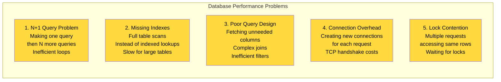

---

## N+1 Query Problem

### What is N+1?

The N+1 query problem occurs when you:

1. Make 1 query to fetch N items
2. Then make N more queries to fetch details about each item
3. Total: 1 + N queries (where it should be 1-2 queries)

### Example: Blog Post with Authors

**Scenario**: You want to display a list of posts with their author names.

**The Problem in Code:**

```
// Step 1: Fetch 20 posts
Query 1: SELECT * FROM posts LIMIT 20
         Result: [Post{id:1, author_id:5}, Post{id:2, author_id:7}, ...]

// Step 2: For each post, fetch the author (the loop creates N queries!)
for post in posts:
    Query 2: SELECT * FROM users WHERE id = 5
    Query 3: SELECT * FROM users WHERE id = 7
    Query 4: SELECT * FROM users WHERE id = 8
    ...
    Query 21: SELECT * FROM users WHERE id = 12

// Now you have all the data, but made 21 database round trips!
Total Queries: 21
```

**Inefficient Code (N+1):**

```
Query 1: SELECT * FROM posts WHERE user_id = 123
         Result: [20 posts]

Then in a loop:
Query 2: SELECT * FROM users WHERE id = 1
Query 3: SELECT * FROM users WHERE id = 2
Query 4: SELECT * FROM users WHERE id = 3
...
Query 21: SELECT * FROM users WHERE id = 20

Total Queries: 21
```

**Efficient Code (2 queries):**

Instead of fetching one author at a time, fetch all authors in one query:

```
Query 1: SELECT * FROM posts WHERE user_id = 123
         Result: [20 posts with author_ids: 1, 2, 3, ..., 20]

Query 2: SELECT * FROM users WHERE id IN (1, 2, 3, ..., 20)
         Result: All 20 authors at once

Total Queries: 2
```

**The Solution**: Use `IN` clause or `JOIN` to fetch all related data at once, instead of looping.

### The Cost of N+1

Each query has overhead:

```
Network latency:        1ms per round trip
TCP connection:         2ms (if pooled, ~0.1ms)
Database parsing:       2ms
Query execution:        5ms
Network return:         1ms
──────────────────────
Per query overhead:     ~11ms minimum

For 1000 items:
1000 queries × 11ms = 11 seconds
vs.
2 queries × 11ms = 22ms
```

**Impact**: 1000× slower performance!

### Preventing N+1

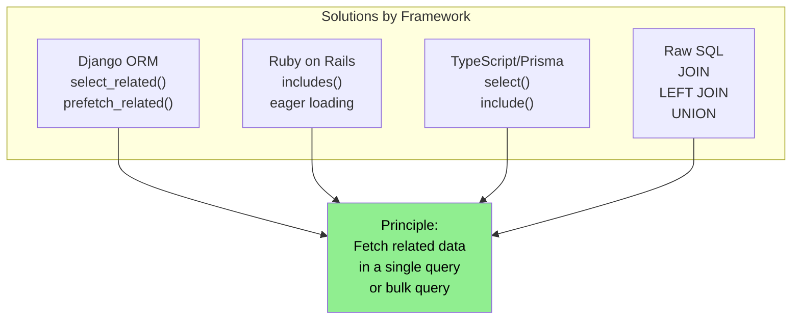

### Best Practice: Enable Query Logging

During development, enable SQL query logging to see what queries your ORM actually executes:

```
[DEBUG] SELECT * FROM posts WHERE user_id = 123
[DEBUG] SELECT * FROM users WHERE id = 1
[DEBUG] SELECT * FROM users WHERE id = 2
[DEBUG] SELECT * FROM users WHERE id = 3
← See the N+1 problem immediately!

vs.

[DEBUG] SELECT * FROM posts WHERE user_id = 123
[DEBUG] SELECT * FROM users WHERE id IN (1, 2, 3, ...)
← Optimized approach
```

---

## Database Indexing

### What is an Index?

An index is a **data structure** that enables the database to find data without scanning every row in a table. Think of it as a shortcut: instead of reading every page of a book to find a topic, you use the table of contents or index at the back.

**In database terms:**
- An index stores a **sorted copy of selected columns** from a table
- It maintains **pointers to the actual row locations**
- It allows the database to locate data in O(log n) time instead of O(n)

**Key insight**: Indexes speed up *reading* but slow down *writing* (because the index must be updated whenever data changes).

---

### The Real Cost of No Indexes

**Example: Finding a user by email in a table with 1 million rows**

Without index:
```
Database must scan ALL 1,000,000 rows
Check each row: "Is this email = 'john@example.com'?"
Takes 1-2 seconds for a simple query
```

With index:
```
Jump directly to the data using the index
Takes 10-50 milliseconds
100× faster!
```

---

### Library Analogy 

**Without Index (Full Table Scan):**

Imagine a library with 1 million books but **no catalog or organization**:

- Customer wants all books by "John Green"
- Librarian must:
  1. Walk to the first shelf
  2. Check every single book spine
  3. Write down locations of John Green books
  4. Walk to all locations and collect books
  5. Repeat for all 1 million books
  6. Time needed: **3 days** (or multiple days depending on library size)

**With Index (Using Catalog):**

Same library with a **catalog organized by author alphabetically**:

- Customer asks for John Green
- Librarian:
  1. Opens catalog book
  2. Does binary search: "G comes after F, before Z... found Green"
  3. Sees exact shelf locations: "Shelf 42, position 15-20"
  4. Walks directly to location
  5. Collects books
  6. Time needed: **2-3 minutes**

**Why?** The catalog is sorted, allowing binary search (O(log n)) instead of linear scan (O(n)).

---

### How Databases Store Indexes

Databases use a **B-Tree** (Balanced Tree) data structure for indexes. Here's why:

#### B-Tree Structure

A B-Tree maintains:
- **Sorted keys** (the indexed column values)
- **Pointers to disk locations** (where the actual rows live)
- **Balance guarantee** - all leaf nodes at same depth (fast lookups)

**Visual representation of a B-Tree index on author_id:**

```
                    [25 | 50 | 75]
                   /      |      \
              [10|20]  [30|40]  [60|70]  [80|90]
              /    \    /    \   /    \   /    \
            [1-9] [11-19] [21-29] [31-39] [41-59] [61-69] [71-79] [81-99]
```

**How it works:**
- Top nodes narrow down the search space
- Each level eliminates ~50% of remaining options
- Leaf nodes contain actual data pointers

**Search process for author_id = 35:**
1. Start at root: "35 is between 25 and 50, go middle branch"
2. Go to middle node: "35 is between 30 and 40, go right branch"
3. Go to leaf: "35 is in range 31-39, fetch row pointers"
4. Retrieve actual rows from disk
5. Total: ~4 disk reads instead of scanning 1 million rows

#### Why B-Tree?

- **Self-balancing**: Tree automatically stays balanced as data changes
- **Sorted**: Supports range queries ("WHERE id > 100 AND id < 200")
- **Cache-friendly**: Stores multiple keys per node, minimizing disk reads
- **Efficient**: O(log n) for both exact and range lookups

---

### Different Index Types

#### 1. **Unique Index**
- Enforces constraint that no two rows have same value
- Example: `CREATE UNIQUE INDEX idx_email ON users(email)`
- Useful for: Email, username, employee ID

#### 2. **Composite Index** (Multi-column)
- Index on multiple columns together
- Example: `CREATE INDEX idx_user_date ON posts(user_id, created_at)`
- Speed up queries like: `WHERE user_id = 5 AND created_at > '2024-01-01'`
- Order matters! Put frequently filtered columns first

#### 3. **Full-text Index**
- Special index for text search
- Supports searching within text content
- Example: Blog post search

#### 4. **Partial Index**
- Index only subset of rows
- Example: `CREATE INDEX idx_active_users ON users(id) WHERE status='active'`
- Saves space by not indexing inactive rows

#### 5. **Covering Index**
- Index contains all columns needed to answer query
- Database doesn't need to fetch actual row
- Example: Query needs only (user_id, email), index has both
- Very fast because it never touches main table

---

### Full Table Scan vs. Indexed Lookup (Deep Dive)

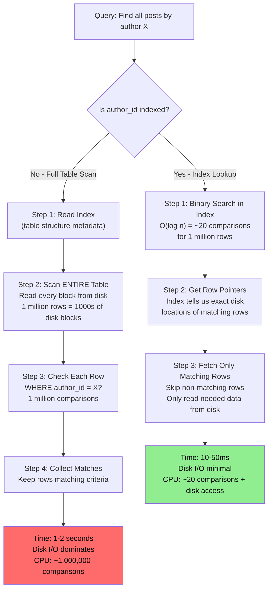

**The difference:**
- Full scan: **Read 1000s of disk blocks** even though you only need 10
- Index lookup: **Read only 10 disk blocks** by using the index as a map

---

### When to Create Indexes

**Strong candidates for indexing:**

```
1. PRIMARY KEY & FOREIGN KEYS
   ├─ Always indexed automatically
   └─ Critical for JOINs

2. WHERE Clause Columns
   ├─ WHERE email = 'user@example.com'  → Index email
   ├─ WHERE status = 'active'            → Index status
   └─ Most common reason to index

3. JOIN Conditions
   ├─ JOIN users ON posts.user_id = users.id
   ├─ Index posts.user_id
   └─ Index users.id (usually primary key)

4. ORDER BY Columns
   ├─ ORDER BY created_at DESC
   ├─ ORDER BY price, category
   └─ Index allows sorted retrieval without sorting

5. GROUP BY Columns
   ├─ GROUP BY user_id
   └─ Can optimize aggregation queries

6. Columns in Predicates
   ├─ WHERE quantity > 100 AND price < 50
   └─ Composite index can help
```

**Poor candidates for indexing:**

```
1. Low Cardinality Columns
   ├─ Column has few unique values (e.g., gender, status)
   ├─ Example: 1 million users, only 2 values (M/F)
   └─ Index not helpful, full scan might be faster

2. Frequently Updated Columns
   ├─ Index must be updated every time data changes
   ├─ Example: view_count, last_login
   └─ Update overhead > lookup benefit

3. Rarely Queried Columns
   ├─ Maintenance cost exceeds benefit
   └─ Keep only if absolutely necessary

4. Very Large Columns
   ├─ Text, JSON, BLOB fields
   ├─ Index storage cost high
   └─ Use full-text index instead for text

5. Columns in Complex Functions
   ├─ WHERE LOWER(email) = 'test@example.com'
   └─ Index on email won't help (function applied to data)
```

---

### Query Planning: How Database Chooses Indexes

**The Query Optimizer Decision:**

```
Query: SELECT * FROM posts WHERE author_id = 5 AND status = 'published'

Option 1: Full Table Scan
├─ Cost: Read 10,000 disk blocks, ~2 seconds
└─ Worst case: all rows match

Option 2: Use author_id Index
├─ Cost: Read index (fast), then fetch 100 matching rows
└─ Estimate: 50 disk blocks, ~100ms

Option 3: Use status Index
├─ Cost: Read index (fast), then fetch 5,000 matching rows
└─ Estimate: 5,000 disk blocks, ~1 second

Database chooses: Option 2 (fastest estimated)
```

**1. What is a Disk Block?**
A database doesn't read a single row at a time directly from your hard drive.  Storage drives are optimized to read and write data in fixed-size chunks called **blocks** or **pages** (usually 4KB or 8KB in size). 

One disk block contains multiple rows of data. Even if the database only needs to read *one* specific row, it must load the entire block containing that row from the disk into the computer's memory (RAM).

**2. Why does the cost differ so much between indexes?**
An index acts like a map of pointers to disk locations.  Finding those pointers inside the index is extremely fast. However, the massive difference in cost comes from **what happens after the index gives you the pointers**:

The cost depends on **Selectivity** (how many rows actually match your condition):

*   **`author_id = 5` (High Selectivity):** This condition only matches a small number of rows (e.g., 100). The index quickly finds 100 pointers. The database then has to go to the main table on the disk to fetch the blocks for those 100 rows. Since multiple rows might live on the same block, the database only has to read about **50 disk blocks**. 
*   **`status = 'published'` (Low Selectivity):** In a typical database, almost all posts are published. This condition matches a massive number of rows (e.g., 5,000). The index very quickly finds 5,000 pointers. But now, the database has to make trips to the main disk to fetch the blocks for all 5,000 of those rows, resulting in reading **5,000 disk blocks**. 

**The Book Index Analogy:**
Imagine looking at the index at the back of a large textbook:
*   Looking up a highly specific, rare word (`author_id = 5`) tells you it appears on 3 pages. You physically flip to those 3 pages. *(Low effort/Cost)*
*   Looking up a very common word like "Science" (`status = 'published'`) tells you it appears on 200 pages. Even though the index tells you *exactly* where they are, you still have to physically flip to 200 different pages to read the text. *(High effort/Cost)*

Because the `author_id` index requires fetching far fewer blocks from the actual hard drive, the database's query optimizer accurately estimates it as the fastest route!

**The optimizer considers:**
- Table statistics (how many rows, distribution)
- Index available
- Selectivity (how many rows match condition)
- Disk I/O vs CPU cost

---

### Index Trade-offs

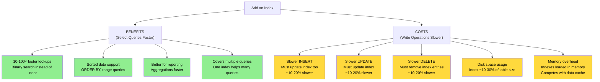

**Real-world example:**

```
Table: 1 million user records
Average row size: 500 bytes
Total table size: ~500 MB

Index on email (150 bytes per entry):
Index size: ~150 MB (30% of table)

Impact:
✓ SELECT by email: 2000ms → 20ms (100× faster)
✗ INSERT new user: 5ms → 6ms (20% slower)
✗ UPDATE email: 10ms → 12ms (20% slower)
✗ Disk: +150 MB
✗ RAM: +150 MB

Worth it? YES - reads happen 100× more often than writes
```

---

### Practical Indexing Strategy

**Step 1: Find Slow Queries**
```
Enable slow query log
Threshold: queries > 100ms
Find the worst offenders
```

**Step 2: Analyze Query Plans**
```
EXPLAIN ANALYZE SELECT * FROM posts WHERE author_id = 5
Output shows:
- Full table scan: 1000ms
- Could use index if exists
```

**Step 3: Create Indexes**
```
CREATE INDEX idx_posts_author_id ON posts(author_id)
```

**Step 4: Verify Improvement**
```
EXPLAIN ANALYZE again
Old: Full table scan 1000ms
New: Index lookup 20ms
Improvement: 50× faster
```

**Step 5: Monitor Over Time**
```
Track index usage
Remove unused indexes (they slow down writes without helping reads)
Add new indexes as query patterns change
```

---

### Index Maintenance

Indexes aren't set-and-forget. They require maintenance:

**Fragmentation:**
- Over time, indexes become fragmented
- Random data updates scatter index entries
- Performance degrades gradually
- Solution: Rebuild/reorganize indexes periodically

**Unused indexes:**
- Some indexes created for specific queries no longer run
- They slow down all write operations for no benefit
- Solution: Monitor index usage, drop unused ones

**Stale statistics:**
- Query optimizer uses table statistics to choose indexes
- Statistics become inaccurate as data changes
- Optimizer makes wrong choices
- Solution: Update statistics regularly

```
PostgreSQL: ANALYZE table_name
MySQL:      ANALYZE TABLE table_name
SQL Server: UPDATE STATISTICS table_name
```

---

### Example: Building Better Indexes

**Scenario: E-commerce product search**

Bad approach:
```sql
CREATE INDEX idx_category ON products(category)
CREATE INDEX idx_price ON products(price)
CREATE INDEX idx_name ON products(name)
-- 3 separate indexes, slow updates
```

Better approach:
```sql
-- Composite index for common search patterns
CREATE INDEX idx_product_search ON products(category, price, name)

-- Covering index - includes all needed columns
CREATE INDEX idx_product_display ON products(id, name, price, image_url)
WHERE active = true
-- Only index active products
```

**Result:**
- Query `WHERE category = 'shoes' AND price < 100` - uses single index
- Query `WHERE name LIKE 'Nike%'` - uses index
- Fewer indexes = faster writes = happy databases

---

### Key Takeaways on Indexes

✓ **Indexes are essential** - Can make queries 100× faster
✓ **B-Trees are efficient** - Provide O(log n) performance
✓ **Index strategically** - Focus on frequently queried, slow columns
✓ **Monitor trade-offs** - Faster reads vs slower writes
✓ **Keep them maintained** - Rebuild, update statistics, remove unused
✓ **Composite indexes help** - Multi-column indexes beat single-column
✓ **Covering indexes are best** - Never need to fetch the actual table


---

## Connection Pooling

### The Connection Overhead Problem

Creating a new database connection is expensive:

```
1. DNS lookup:              0-5ms
2. TCP connection setup:    5-10ms
3. Authentication:          2-5ms
4. Query execution:         5-50ms (actual work)
   ────────────────
   Total per query:         12-70ms

For 1000 queries:
- With pooling: 1000 × 10ms = 10 seconds
- Without pooling: 1000 × 50ms = 50 seconds (5x slower!)
```

### Connection Pooling Solution

Instead of creating a new connection for each request:

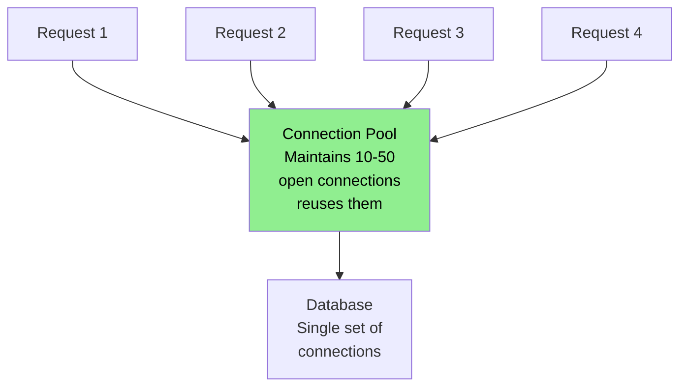

### Types of Pooling

#### Internal Pooling (Application-level)

```
Server 1 → Connection Pool (10 connections) ↘
Server 2 → Connection Pool (10 connections) → Database (capacity: 30 connections)
Server 3 → Connection Pool (10 connections) ↗

Problem: Multiple servers can exceed database capacity
```

#### External Pooling (Dedicated pooler)

```
Server 1 →┐
Server 2 →├→ External Pooler (25 connections) → Database (capacity: 30 connections)
Server 3 →┘

Benefit: Single pool prevents connection exhaustion
```

### When Pooling Becomes Critical

**Scenario: Traffic Spike with Auto-scaling**

```
Normal state:
- 1 server with 10-connection pool
- Database max: 30 connections
- Utilization: 10/30 = 33% ✓

Traffic spike detected:
- Kubernetes adds 2 more servers
- Now 3 servers × 10-connection pool = 30 connections
- Utilization: 30/30 = 100% (at capacity)

Traffic spikes again:
- Each server tries to grab 20 connections (high load)
- Total needed: 3 × 20 = 60 connections
- Database capacity: 30 connections
- Result: Connection pool exhausted! ✗ Database crash
```

**Solution**: Use external pooler (e.g., PgBouncer for PostgreSQL)

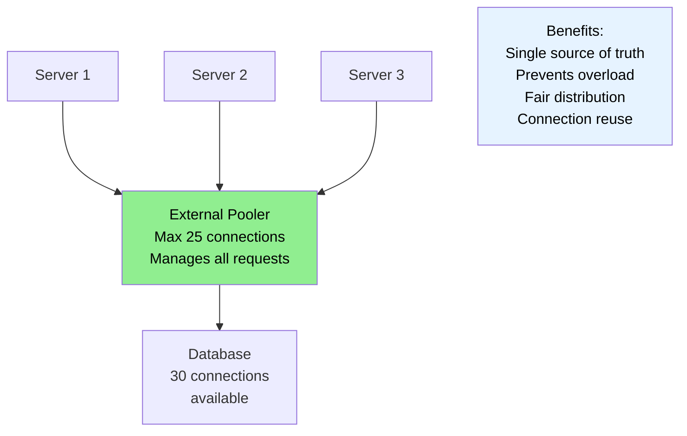

---

## Caching Fundamentals

### The Caching Principle

> Store results of expensive operations, reuse them instead of recomputing.

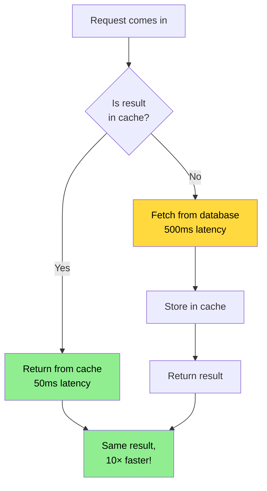

### Caching Impact

```
Without cache:
- All requests query database: 500ms each
- 1000 requests: 500 seconds total

With cache (80% hit rate):
- 800 requests from cache: 50ms each = 40 seconds
- 200 requests from database: 500ms each = 100 seconds
- Total: 140 seconds (71% faster!)
```

### Cache Invalidation

**The Hard Problem**: Keeping cache consistent with database.

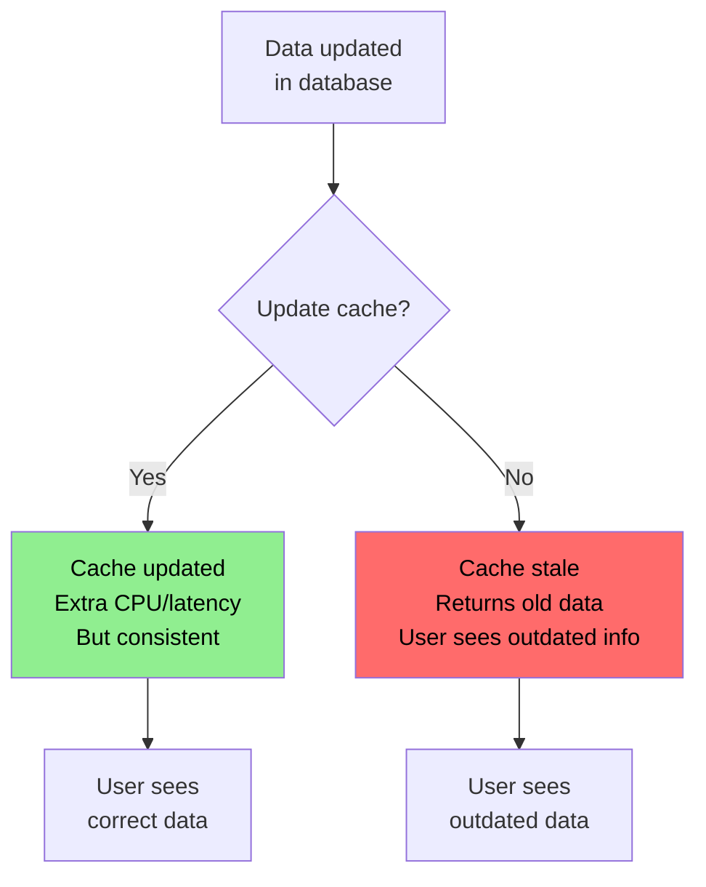

### Cache Invalidation Strategies

```
1. Time-based (TTL):
   Cache expires after 5 minutes
   Example: cache.set(key, value, ttl=300)
   ✓ Simple
   ✗ Data might be stale

2. Event-based:
   Update cache when data changes
   Example: On UPDATE, delete cache entry
   ✓ Consistent
   ✗ Complex to implement

3. Demand-based:
   Application checks and updates
   Example: Check timestamp, refresh if old
   ✓ Flexible
   ✗ Additional complexity

4. Hybrid:
   TTL + event-based + demand checks
   ✓ Most robust
   ✗ Most complex
```

---

## Key Takeaways

### Fundamental Concepts

1. **Performance is Measurable**
   - Latency: time for request to complete
   - Throughput: requests per unit time
   - Utilization: percentage of capacity in use

2. **Utilization Drives Latency Exponentially**
   - Linear from 0-60% utilization
   - Curves upward from 60-80%
   - Exponential from 80-100%
   - Never run at 100% utilization

3. **Bottleneck Mindset**
   - One component usually causes slowness
   - Find it, optimize it, measure improvement
   - Move to next bottleneck

### Database Optimization Priority

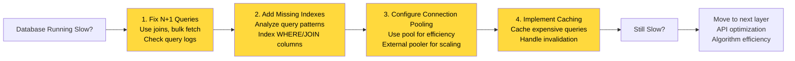

### Action Items

- ✓ **Measure everything** - Collect latency, throughput, utilization metrics
- ✓ **Find the bottleneck** - Use profiling and monitoring tools
- ✓ **Optimize iteratively** - Fix biggest impact first
- ✓ **Verify improvements** - Measure before and after
- ✓ **Monitor production** - Performance changes over time
- ✓ **Set performance budgets** - Define acceptable latency targets

### Remember

- **Performance is a feature**, not an afterthought
- **Premature optimization is bad**, but informed optimization is essential
- **Understand your system** before optimizing
- **Measure everything** - "You can't improve what you don't measure"
- **Keep buffer capacity** - 20-30% reserved for spikes

---

## Next Steps

This Part 1 covered foundational concepts and database optimization. Part 2 typically covers:

- Scaling strategies (vertical vs. horizontal)
- Load balancing
- Caching strategies in depth
- API optimization
- Message queues and async processing
- Infrastructure scaling

The mental models learned here apply to all these topics.
