# Backend Scaling & Performance Engineering — Part 2

> **Prerequisite:** This is a continuation of Part 1. Watch Part 1 first for context on vertical vs. horizontal scaling fundamentals.

---

## Table of Contents

1. [Statelessness — The Key to Horizontal Scaling](#1-statelessness--the-key-to-horizontal-scaling)
2. [Load Balancers](#2-load-balancers)
3. [Database Scaling](#3-database-scaling)
4. [Content Delivery Networks (CDNs)](#4-content-delivery-networks-cdns)
5. [Edge Computing](#5-edge-computing)
6. [Asynchronous Processing & Background Jobs](#6-asynchronous-processing--background-jobs)
7. [Microservices vs. Monoliths](#7-microservices-vs-monoliths)
8. [Serverless Architecture](#8-serverless-architecture)
9. [Practical Principles & Mental Models](#9-practical-principles--mental-models)

---

## 1. Statelessness — The Key to Horizontal Scaling

### What is Statelessness?

Statelessness is the **foundational property** that makes horizontal scaling possible. In a horizontally scaled system, you run multiple identical instances of your backend server. For this to work correctly, **no single instance can hold data that is exclusive to it**.

> **Stateful** = A server remembers information about a client and stores it internally.
> **Stateless** = No server instance holds any exclusive data; every request can be handled by any instance with identical results.

### The Core Principle

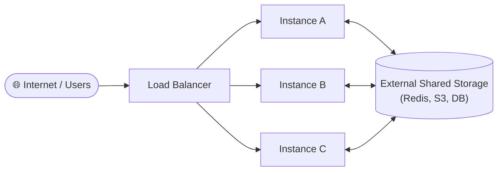

It doesn't matter which server instance handles a given request — the result must always be the same. If Instance B is removed, Instances A and C should behave identically without any data loss.

### What Goes Wrong Without Statelessness

#### Problem: In-Memory Sessions

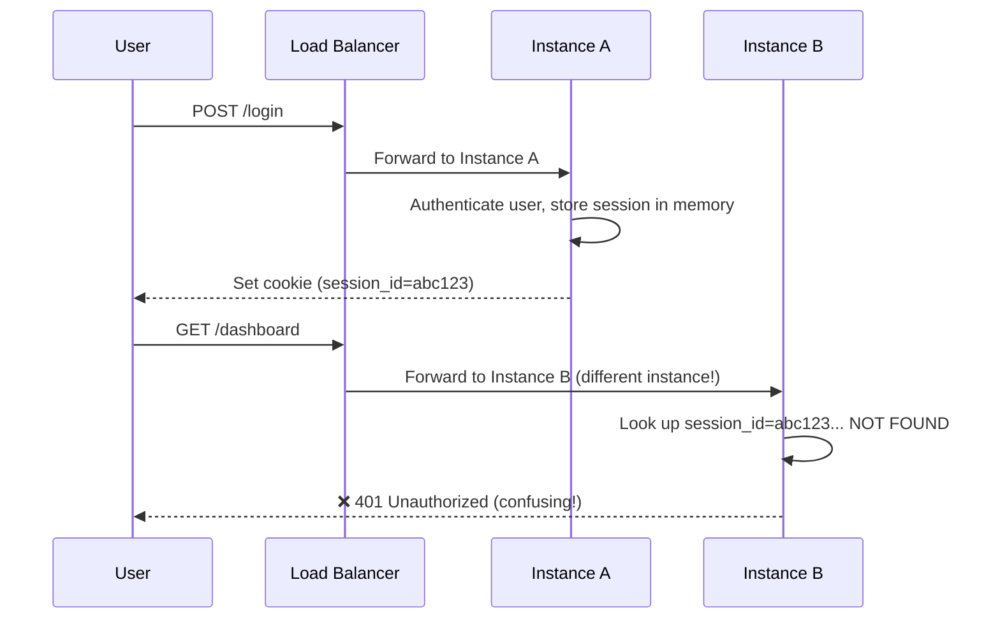

#### Problem: Local File Storage

A user uploads a file → Instance A saves it to its own disk → Next request goes to Instance C → Instance C can't find the file → Error.

### The Solution: Externalize Everything

| Data Type | ❌ Wrong Approach | ✅ Stateless Approach |
|---|---|---|
| **Sessions / Auth** | Store in server memory (array, map) | Store in **Redis** (shared, accessible by all instances) |
| **File Uploads** | Save to server's local disk | Upload to **S3 / Cloudflare R2 / Object Storage** |
| **Database** | SQLite file on the server | Centralized **PostgreSQL / MySQL / RDS** |
| **Caches** | In-process local cache | **Redis** / external cache |

**The thumb rule:** In a horizontally scaled system, if it's data — it must live outside any individual server instance.

---

## 2. Load Balancers

### Why Load Balancers Are Mandatory

With multiple server instances running, something must decide **which instance** receives each incoming request. This is the load balancer.

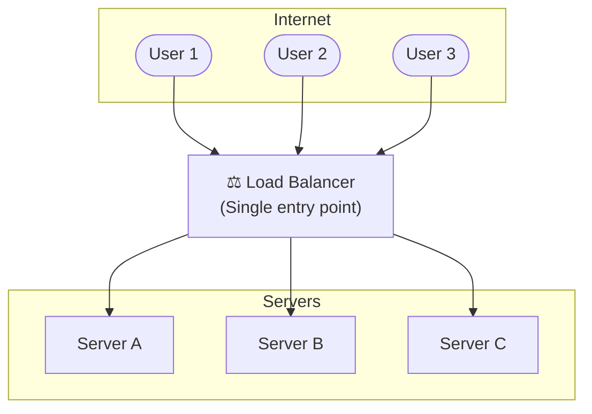

The load balancer is the **single entry point** for all traffic. It receives requests from the internet and distributes them across server instances. It also receives the responses and returns them to the client.

### Load Balancer Algorithms

The key decision the load balancer makes is: *which server instance should receive this request?* Several algorithms govern this.

#### Round Robin

Requests are distributed in a rotating, sequential order.

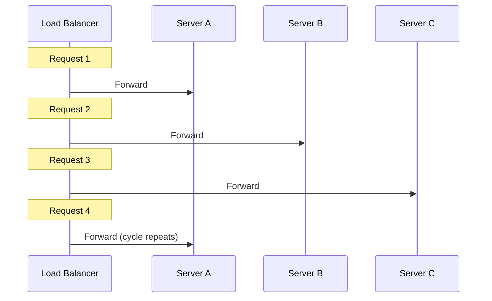

**Best for:** Servers with equal capacity handling similar requests.

#### Least Connections

The request goes to whichever server currently has the fewest active connections.

**Best for:** Workloads where different requests take very different amounts of time (e.g., some requests are fast, others are slow and long-running).

#### IP Hashing (Sticky Sessions)

The client's IP address is hashed to always route that client to the same server instance.

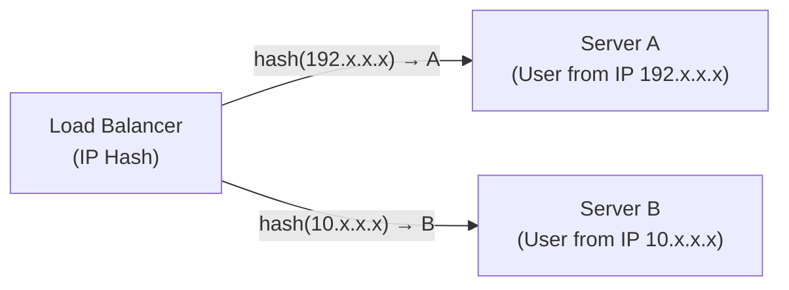

**Best for:** Stateful sessions that haven't been externalized yet. However, this is a **workaround**, not a solution — it breaks down when servers are added or removed and causes uneven load distribution.

### Load Balancer Algorithms Comparison

| Algorithm | How It Works | Best For | Limitation |
|---|---|---|---|
| **Round Robin** | Sequential rotation | Equal capacity, similar request cost | Ignores current server load |
| **Least Connections** | Route to least busy server | Variable request duration | More complex to track state |
| **IP Hashing** | Same client → same server | Stateful legacy apps | Uneven load, breaks on scaling |

### Additional Capabilities of Load Balancers

Beyond routing, load balancers also provide:

- **Health checks** — continuously ping each server instance to detect failures. If a server goes down, the load balancer stops routing traffic to it automatically.
- **SSL termination** — handle the HTTPS encryption/decryption at the load balancer level, reducing the burden on backend servers.
- **Rate limiting** — throttle traffic from specific IPs or clients to prevent abuse.

### Popular Load Balancer Solutions

| Type | Examples |
|---|---|
| **Managed Cloud** | AWS ALB/ELB, GCP Load Balancer, Azure LB |
| **Software** | Nginx, HAProxy, Traefik |
| **API Gateway (includes LB)** | AWS API Gateway, Kong, Cloudflare |

---

## 3. Database Scaling

When your application servers scale horizontally, the database becomes the next bottleneck. Unlike stateless application servers, databases are **stateful** — their data must remain consistent across all instances.

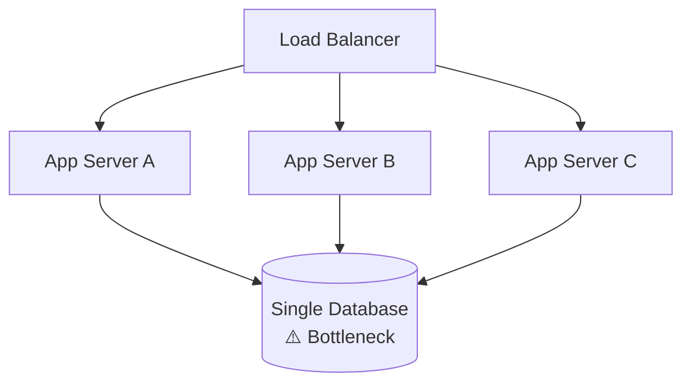

With three app servers all hitting a single database, the database becomes the performance ceiling. Two primary techniques address this.

### 3.1 Read Replicas

The most common first step in database scaling.

**Core idea:** Separate read and write traffic. All write operations go to one **primary** (master) instance. Multiple **replica** (secondary/slave) instances handle read-only queries.

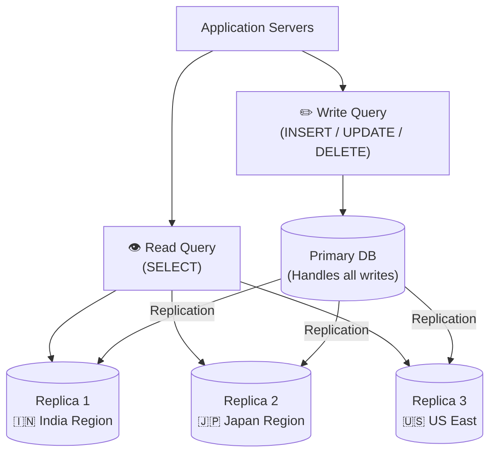

**Benefits:**
- Offloads 70–90% of traffic (most SaaS apps are read-heavy) from the primary instance
- Replicas can be placed geographically close to users, reducing latency
- If the primary is in the US, a replica in India means Indian users get fast reads without crossing the ocean

#### The Consistency Trade-off: Replication Lag

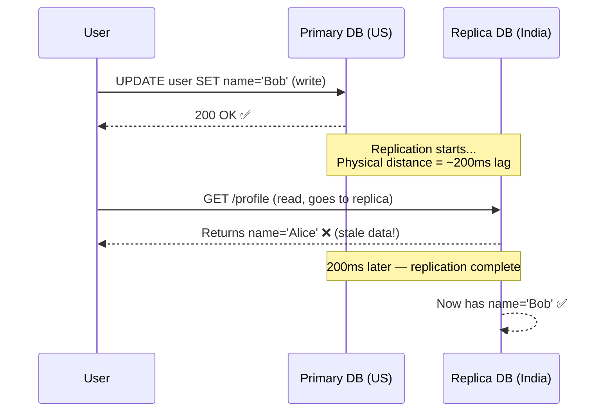

**The replication lag** is the time it takes for data written to the primary to propagate to all replicas. Due to physics (the speed of light through undersea fiber optic cables), this is unavoidable.

**Solutions for managing replication lag:**
- **Route post-write reads to primary** — after a write operation, redirect subsequent read queries for the same entity to the primary until replication completes
- **Track lag and block reads** — monitor replication lag (~200–250ms) and hold read requests until the replica is fully up to date
- **Frontend-side delay** — architect the frontend to wait ~300ms before issuing the follow-up GET request after a save
- **Optimistic UI updates** — update the UI immediately from local state without a re-fetch, avoiding the stale read entirely

### 3.2 Sharding (Partitioning)

Sharding solves two problems that replicas cannot: **query latency at massive scale** and **write throughput limitations**. It means physically splitting a single large table across multiple database instances.

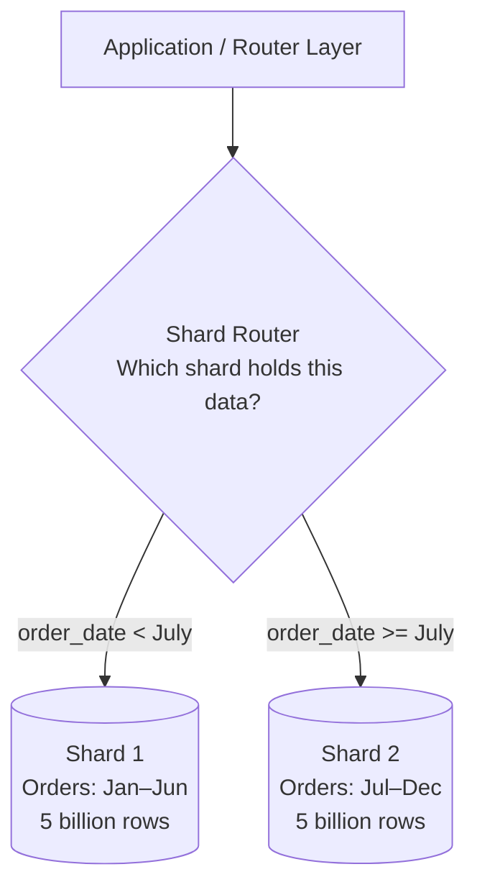

**Example:** An e-commerce `orders` table with 10 billion rows is divided by `order_date`:
- Shard 1 holds January–June orders
- Shard 2 holds July–December orders

**Benefits:**
- Each shard has half the rows → queries are faster
- Two physical instances → double the write throughput

**The Sharding Key challenge:** Choosing which column to shard by is critical. A bad sharding key creates uneven distribution (some shards much larger than others — called a "hot shard"). Common choices: date ranges, user ID ranges, geographic region.

### 3.3 Modern Managed & Distributed Databases

In practice, most backend engineers don't implement replication or sharding manually. Modern managed database providers handle this automatically:

| Provider | Engine | Notable Feature |
|---|---|---|
| **AWS RDS / Aurora** | PostgreSQL, MySQL | Managed replicas, automated backups |
| **PlanetScale** | MySQL (Vitess) | Built-in horizontal sharding |
| **Neon** | PostgreSQL (Rust) | Serverless, scales to zero |
| **CockroachDB** | Distributed SQL | Auto-sharding, geo-distribution |
| **Yugabyte** | PostgreSQL-compatible | Fully distributed, ACID |

You configure replication regions and scaling policies via the dashboard. The actual mechanics are managed for you — but understanding the concepts lets you configure them correctly.

---

## 4. Content Delivery Networks (CDNs)

### The Physics Problem

No matter how optimized your backend is, you cannot beat the speed of light.

- Light travels at ~200,000 km/second through fiber optic cables
- A round trip from **Tokyo → US East (Virginia) → Tokyo** is ~20,000 km
- Minimum theoretical latency: **~100 milliseconds** — just for the network round trip, before any processing

Add database queries (~50–100ms), business logic, and external API calls — and a Tokyo user could easily see **500–800ms** total latency. This is not an optimization problem; it's a geography problem.

**CDNs solve it by bringing the content closer to the user.**

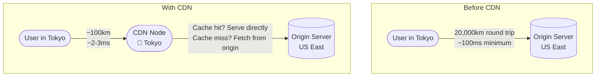

CDN nodes — also called **Points of Presence (PoPs)** or **edge nodes** — are strategically placed globally, often co-located with ISP infrastructure, so they are the first point of contact for user requests.

### Benefits of CDNs

**1. Reduced Latency**
Geographic proximity slashes response times from ~100ms to ~2–3ms for cached content.

**2. Reduced Origin Server Load**
When a CDN node serves cached content, the request never reaches your primary server. Traffic that would have overwhelmed your origin is distributed across hundreds of CDN nodes globally.

**3. DDoS Protection**
A DDoS attack floods your server with traffic from thousands of bots. With a CDN:
- Traffic hits the CDN layer first, not your servers directly
- CDNs (like Cloudflare) have massive distributed infrastructure — terabytes of attack traffic get absorbed across their global network
- Advanced detection triggers CAPTCHAs and blocks suspicious sources automatically

### What to Cache in a CDN

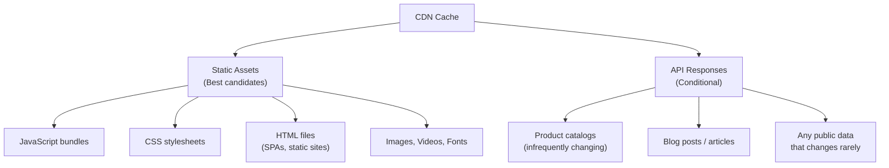

**Cache invalidation (purging):** When data changes (e.g., a user publishes a new blog post), you can programmatically purge specific cached content using tags. Cloudflare, for example, lets you tag cached content by user ID or entity type and purge all related cache entries on update.

---

## 5. Edge Computing

### What Edge Computing Means

Traditional CDNs only served **static content** — files with no processing. Edge computing extends this by running **actual code** at CDN edge nodes, not just serving cached files.

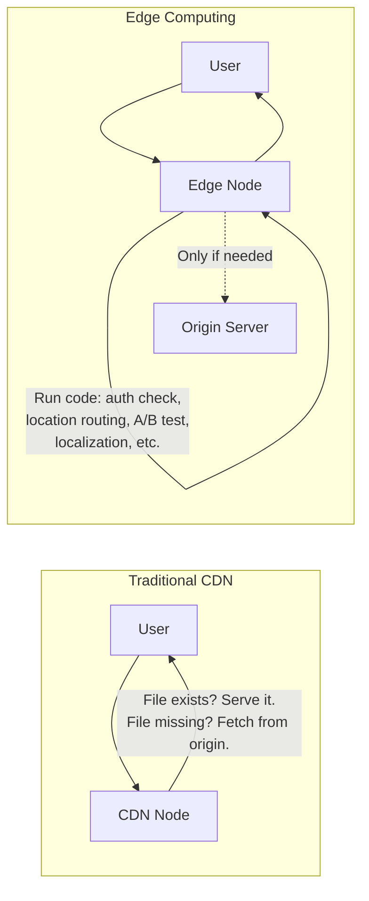

### Use Cases for Edge Computing

#### 1. Authentication at the Edge

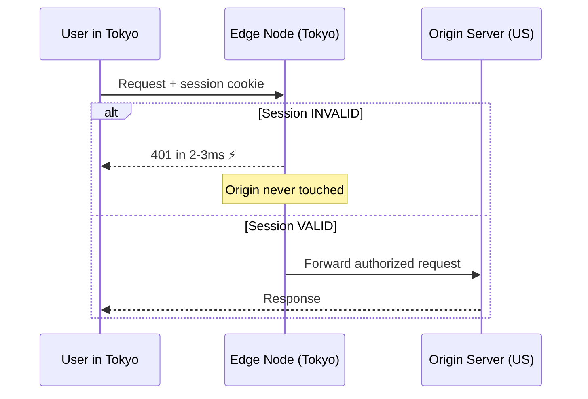

Without edge auth, a rejected 401 response costs ~100ms round trip and wastes origin server resources. With edge auth, it costs 2–3ms and the origin is never touched.

#### 2. Geo-based Localization
The edge node knows the user's region and can immediately serve the Japanese version of your website to a Tokyo user — without hitting the origin.

#### 3. Request Routing
Route traffic to different origin servers based on region, request type, or A/B test cohort — all decided at the edge.

### Constraints of Edge Computing

Edge nodes are not full servers. They run on lightweight ISP infrastructure with meaningful limitations:

| Constraint | Detail |
|---|---|
| **Limited RAM** | Often ~1GB, vs. 8–16GB on a primary server |
| **No file system access** | Cannot read/write local files |
| **No TCP connections** | Cannot open raw TCP sockets |
| **Runtime restrictions** | Cloudflare Workers use V8 isolates (JavaScript/WASM only) |
| **Execution time limits** | Short CPU time budgets per request |

**The conclusion:** Edge computing is a powerful complement to primary servers for lightweight, latency-sensitive operations (auth, routing, localization, validation). It cannot fully replace origin servers for complex business logic, heavy computation, or database operations.

---

## 6. Asynchronous Processing & Background Jobs

### The Problem: Synchronous Latency

In a typical synchronous HTTP flow, the user waits for **every step** to complete before getting a response.

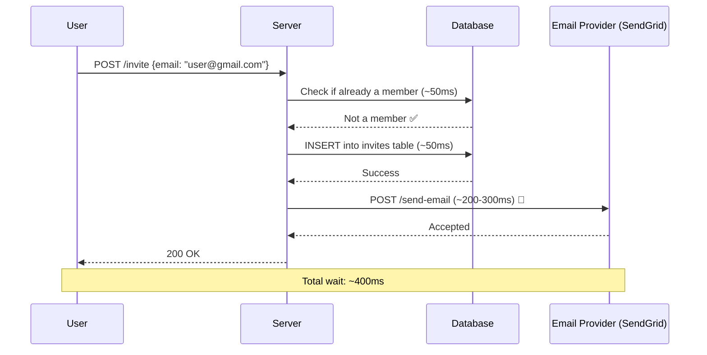

The user had to wait 300ms extra for the email to be sent — which they don't even see happen. The email sending is a separate side-effect that doesn't need to block the response.

### The Solution: Offload to a Queue

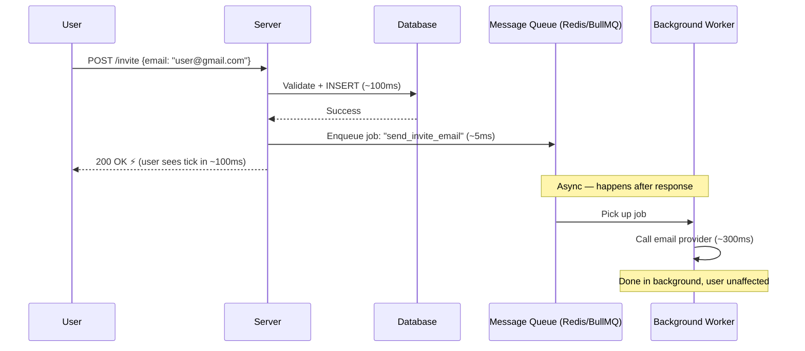

**Result:** User interaction drops from 400ms to ~100ms. The email still gets sent — just not while the user is waiting.

### Tasks Suitable for Async Processing

These are operations where the user **does not need to see the result immediately:**

- Sending emails (invitations, password resets, notifications)
- Sending push notifications
- Processing video or image uploads
- Resizing / transcoding media
- Generating PDF reports
- Deleting user data (GDPR compliance)
- Syncing data with third-party services
- Sending webhooks

### Queue Architecture

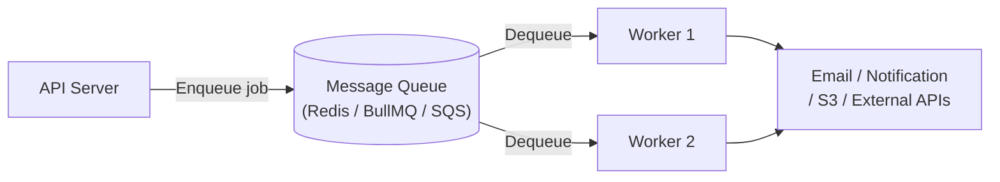

**Popular tools:**
- **Redis + BullMQ** (Node.js) — widely used, handles retries, rate limiting, delayed jobs
- **Celery + Redis** (Python) — standard for Python backends
- **AWS SQS** — fully managed message queue
- **RabbitMQ** — powerful enterprise queue with complex routing

> Async processing is one of the **earliest performance improvements** you should implement — not something saved for when you have 100k users. The benefits are immediate and the complexity is low.

---

## 7. Microservices vs. Monoliths

### What is a Monolith?

A **monolith** is a backend where all functionality (authentication, orders, payments, notifications, etc.) lives in a **single deployable unit** — one codebase, one repository, one running process.

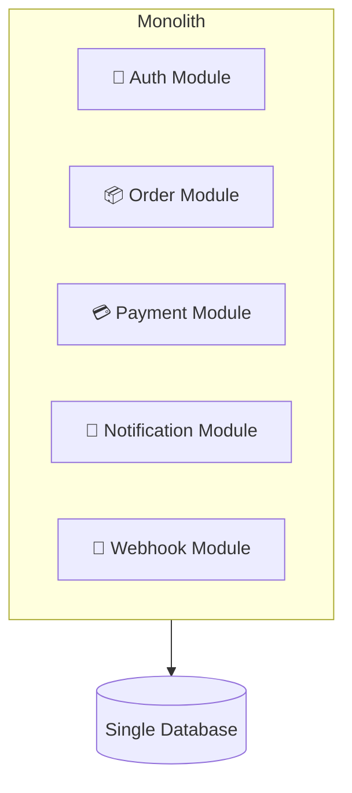

**Monolith advantages:**
- Simple to develop, test, and debug
- One codebase, one git repository
- Straightforward refactoring (cross-module changes in one place)
- Simple deployment pipeline
- Easy to run locally for development

### What are Microservices?

**Microservices** split the same functionality into **independently deployable services**, each running its own process and communicating over a network.

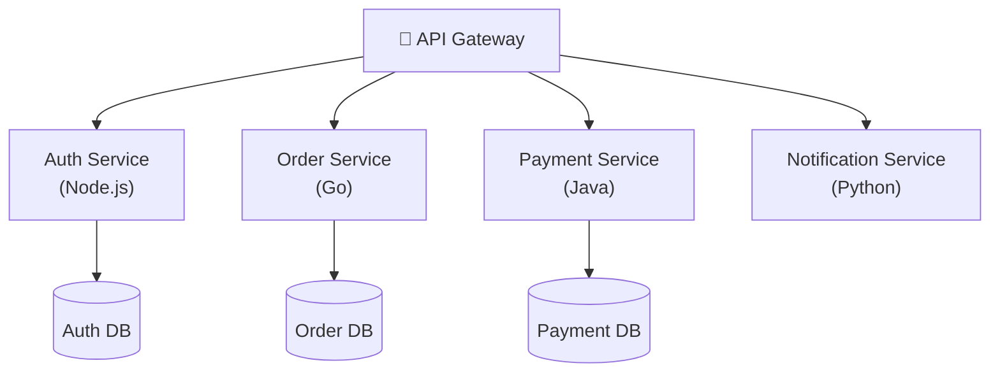

### Why Microservices Exist — Problems They Solve

Microservices are primarily about **scaling your team**, not your machines.

#### 1. Deployment Independence
In a 500-developer monolith, teams block each other. Team A's payment feature is ready to ship, but Team B's half-finished notification changes are on the main branch. The entire release is held up.

With microservices, the Payment Service deploys independently on its own schedule.

#### 2. Independent Scaling
In a monolith, if only the payment processing module needs more resources, you must scale the entire application — including the lightweight notification module that doesn't need it.

With microservices, scale only the services that need it.

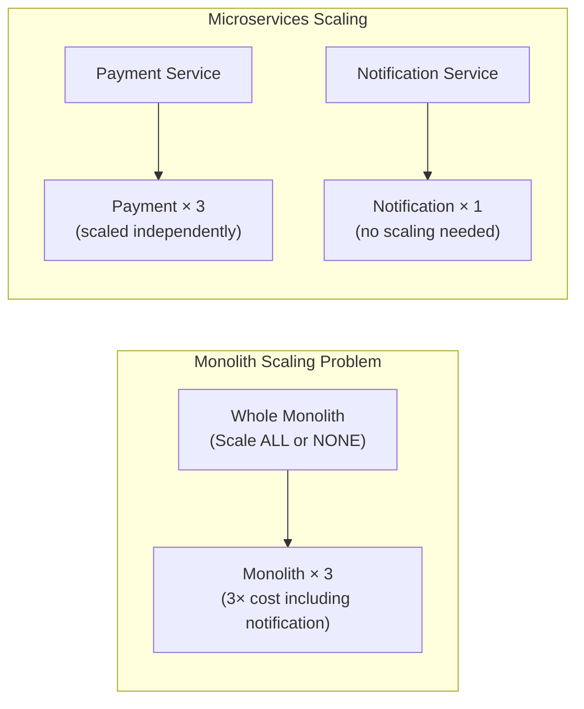

#### 3. Technology Freedom
Different services can use different programming languages and frameworks — chosen for what's best suited to that service's workload.

**Example:** A markdown parsing service benefits from npm's rich library ecosystem (Node.js), while an image resizing service benefits from Go or Rust's raw CPU performance. In a monolith, you're locked to one language.

### Microservices Trade-offs

| Advantage | Trade-off |
|---|---|
| Independent deployments | Network calls replace function calls → latency + failure risk |
| Independent scaling | Distributed debugging across multiple service logs |
| Technology freedom | Data consistency across multiple databases is complex |
| Clear team boundaries | Operational overhead: monitoring N services instead of 1 |

#### The Network Complexity Problem

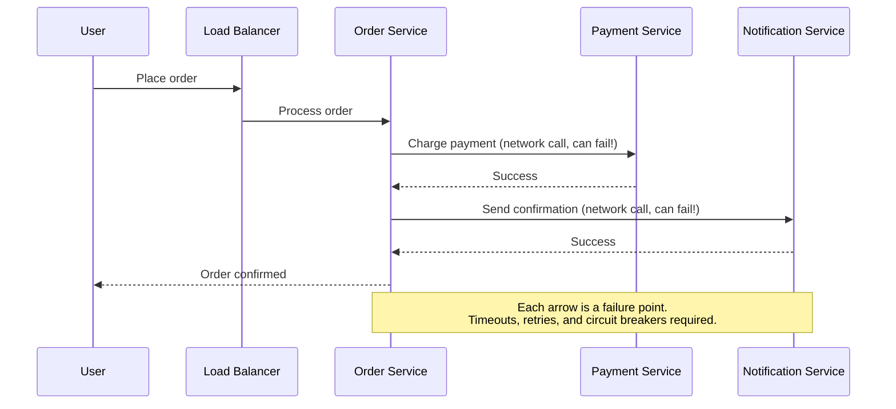

Debugging a single user request now requires correlating logs across four services simultaneously. This is why microservices require distributed tracing tools.

### When Should You Use Microservices?

Only seriously consider microservices when you have clear answers to these:

| Criteria | Threshold |
|---|---|
| **Team size** | 100+ developers on the same codebase |
| **Independent scaling needs** | Clearly different resource profiles per module |
| **Technology requirements** | Specific modules genuinely need different languages |
| **Deployment velocity** | Teams are blocking each other on releases |

> **Default to a monolith.** A well-structured monolith can scale to millions of users with horizontal scaling. Netflix, Amazon, and Uber all started as monoliths. Microservices are a solution to organizational and operational scale — not a default architecture.

---

## 8. Serverless Architecture

### Before Serverless: The Traditional VM Model

Traditionally, you provision a VM (e.g., an AWS EC2 instance), install an OS, configure your application, and manage that server indefinitely:

```mermaid
flowchart LR
    subgraph Traditional Server Model
        direction TB
        VM["VM / EC2 Instance\n(Always running, always paying)"]
        OS["Ubuntu / Linux OS"]
        App["Your Application\n(Node.js, Go, etc.)"]
        Config["Nginx, Docker, etc."]
        VM --> OS --> Config --> App
    end

    Note["You manage:\n• OS updates\n• Security patches\n• Scaling config\n• DNS, SSL certs\n• Always paying (even idle)"]
```

You pay for the VM 24/7, even when it handles zero requests.

### What Serverless Is

In serverless, **you don't manage servers at all.** You provide your code (a function), and the cloud provider handles everything else: provisioning, scaling, OS, networking.

```mermaid
sequenceDiagram
    participant User
    participant Provider as Cloud Provider (Vercel / AWS Lambda)
    participant Fn as Your Function

    User->>Provider: HTTP Request arrives
    Provider->>Provider: Spin up a container/isolate
    Provider->>Fn: Execute your function code
    Fn-->>Provider: Return response
    Provider-->>User: HTTP Response
    Provider->>Provider: Container destroyed (or kept warm briefly)

    Note over Provider: No requests → No running cost
```

**Key properties:**
- **Pay per execution** — you pay only when your function runs, not for idle time
- **Auto-scaling** — the provider spins up as many instances as needed automatically
- **Stateless by design** — each function invocation is independent; no persistent state between calls
- **Cold starts** — the first request after a period of inactivity has additional latency (~100–500ms) while the container initializes

### The Cold Start Problem

```mermaid
flowchart LR
    A["First Request\n(after idle)"] -->|"Cold start:\nContainer initializes\n+100-500ms latency"| F["Function Runs"]
    B["Subsequent Requests\n(within warm window)"] -->|"Warm start:\nNo extra latency"| F
    C["After idle period"] -->|"Cold start again"| F
```

Cold starts make serverless unsuitable for latency-sensitive applications. Payment transactions or real-time banking where every millisecond counts should not be serverless.

### Serverless: When to Use vs. Avoid

| ✅ Good Fit | ❌ Poor Fit |
|---|---|
| Infrequent, event-triggered workloads | Latency-sensitive user-facing APIs (banking, payments) |
| Video / image processing pipelines | Long-running processes (WebSocket connections, streaming) |
| Scheduled batch jobs | Applications requiring many persistent DB connections |
| Queue-driven background workers | TCP-heavy protocols |
| API endpoints with unpredictable traffic spikes | Applications with high cold-start sensitivity |
| Webhook receivers | Stateful workflows |

### Popular Serverless Platforms

| Platform | Language Support | Notes |
|---|---|---|
| **AWS Lambda** | Most languages | The original, most mature |
| **Vercel Functions** | Node.js, Edge | Default for frontend frameworks (Next.js) |
| **Cloudflare Workers** | JavaScript/WASM | V8 isolates, ultra-low latency edge |
| **Netlify Functions** | Node.js | Simple deployment alongside frontend |

> **The industry is somewhat overhyped on serverless.** It is a powerful tool for specific use cases — particularly event-driven and infrequent workloads — but it is not a universal replacement for traditional servers. Understanding where it fits and where it doesn't is the key skill.

### Serverless Enforces Statelessness

Serverless architectures make statelessness mandatory, not optional:
- Containers are created and destroyed with every request
- No persistent local state is possible
- TCP connections (like traditional DB connections) don't persist between invocations
- File system is unavailable or ephemeral

This requires rethinking how WebSocket connections, database connections, and session data work. Serverless-native databases (like Neon, PlanetScale) are designed for this connection model.

---

## 9. Practical Principles & Mental Models

After covering all these techniques — load balancers, CDNs, database scaling, async processing, microservices, serverless — here are the decision-making principles that tie it all together.

### Principle 1: Always Start with the Problem, Not the Solution

The biggest mistake in performance engineering is implementing solutions for problems you haven't measured.

```mermaid
flowchart TD
    Start["System feels slow?"]
    Measure["📊 Measure Everything\n(logs, metrics, traces)"]
    Identify["🔍 Identify the Bottleneck\nWhich component? Which query?"]
    Solution["🔧 Apply Targeted Solution\n(indexing, caching, scaling, etc.)"]
    Validate["✅ Validate Improvement\nDid the metric improve?"]

    Start --> Measure --> Identify --> Solution --> Validate --> Measure
```

**Premature optimization** — adding Redis caching, microservices, or sharding before you understand where the actual bottleneck is — is the root cause of most over-engineered systems. You might fix the wrong thing and never see improvement.

**Tools for measuring:**
- **Prometheus + Grafana** — open-source metrics and dashboards
- **New Relic / Datadog** — managed observability platforms
- **Distributed tracing** — tools like Jaeger, Zipkin, or built-in cloud tools

### Principle 2: Always Prefer Simple Solutions

Complexity has costs. Every component you add is another component that can fail, that you must monitor, understand, and operate.

| Simpler Option | Complex Alternative | When to use the complex one |
|---|---|---|
| Vertical scaling (larger server) | Horizontal scaling + load balancer | When vertical limits are hit |
| Database indexes | Redis cache in front of all queries | When indexes are genuinely insufficient |
| Monolith + horizontal scaling | Microservices | 100+ engineers blocking each other |
| PostgreSQL + RDS | Self-managed sharded cluster | When managed DB limits are hit |

> "Only accept complexity when simplicity is genuinely insufficient."

### Principle 3: Scale for the Problems You Have

You do not need to build for a million users on day one. Most platforms never reach a million users. Build for your current scale with reasonable headroom, and evolve as you grow.

Generic advice from Netflix engineering blogs may not apply to your application. Netflix's bottleneck is video streaming at planetary scale. Your bottleneck is probably a missing database index.

**Your observability (logs, metrics, traces) will tell you where your specific bottleneck is** — trust your data, not general internet advice.

### Principle 4: Instrument from Day One

This is the exception to "prefer simple solutions." Observability is not optional and should not be deferred.

```mermaid
graph LR
    O["Observability\nfrom Day 1"]
    O --> L["📝 Logs\n(structured, searchable)"]
    O --> M["📈 Metrics\n(latency, error rate, throughput)"]
    O --> T["🔍 Traces\n(per-request lifecycle)"]

    L & M & T --> V["Visibility\ninto your system"]
    V --> A["Proactive alerting\nbefore users notice"]
    V --> B["Fast diagnosis\nwhen issues occur"]
    V --> C["Data-driven scaling\ndecisions"]
```

Without observability, you're guessing. With it, you know:
- Your average request latency
- Your error rate
- Which endpoints are slow
- Where in a request's lifecycle time is spent
- When resource utilization is approaching its limit (so you can scale proactively, not reactively)

### Principle 5: Performance Optimization is a Mindset

No single tutorial can teach you everything. Performance engineering is a skill built through experience:

- You build systems
- You watch them struggle under real load
- You measure, identify, and optimize
- You learn what works and what doesn't for your specific application

Your job as a backend engineer is not to predict every possible failure in advance. It's to **build systems that degrade gracefully** when problems occur, and to develop the skills to **measure, diagnose, and resolve** issues quickly when they do.

---

## Quick Reference: Scaling Decision Tree

```mermaid
flowchart TD
    Start["System needs more capacity?"]

    Start --> Measure{"Have you measured\nand identified\nthe bottleneck?"}
    Measure -- No --> Observe["Implement observability\n(logs, metrics, traces) first"]
    Measure -- Yes --> BN{"What is the\nbottleneck?"}

    BN -->|"Single server\nrunning out of resources"| VS["Try vertical scaling first\n(cheaper, simpler)"]
    VS -->|"Max vertical limit reached"| HS["Horizontal scaling\n+ Load Balancer\n(ensure statelessness first)"]

    BN -->|"Database too slow\n(read-heavy)"| RR["Add Read Replicas"]
    BN -->|"Database too slow\n(massive data volume)"| SH["Consider Sharding"]
    BN -->|"Database too slow\n(index problem)"| IDX["Add proper indexes first\n(simplest fix)"]

    BN -->|"High perceived latency\n(non-critical operations)"| AQ["Async Queue\n(emails, notifications, etc.)"]

    BN -->|"Global users\nstatic content slow"| CDN["Add CDN Layer"]

    BN -->|"Team of 100+\nblocking each other"| MS["Consider Microservices\n(carefully)"]

    BN -->|"Infrequent heavy tasks\n(video processing, etc.)"| SLS["Consider Serverless\nfor those tasks"]
```

---

*End of Lecture — Part 2*

> **See also:** Part 1 covers the fundamentals of latency, throughput, vertical scaling, and database query optimization (caching, indexing).
