# Task Queues & Background Jobs

## Table of Contents

- [Introduction](#introduction)
- [Why Background Jobs Matter](#why-background-jobs-matter)
- [Architecture Overview](#architecture-overview)
- [How Task Queues Work](#how-task-queues-work)
- [Types of Background Tasks](#types-of-background-tasks)
- [Task Queue Technologies](#task-queue-technologies)
- [Design Considerations](#design-considerations)
- [Best Practices](#best-practices)
- [Real-World Examples](#real-world-examples)

---

## Introduction

### What is a Background Job?

A **background job** (or background task) is any piece of code that runs **outside the request-response lifecycle**.

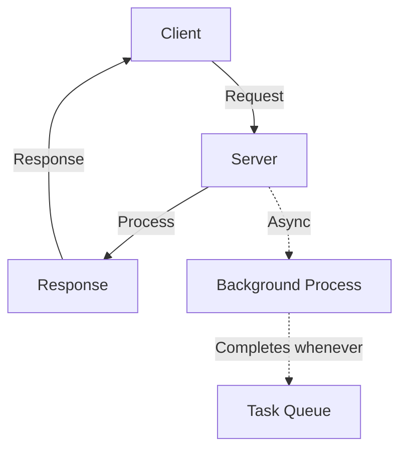

**Key Characteristics:**

- Runs outside request-response cycle
- Not synchronous (doesn't need immediate response)
- Can be retried if it fails
- Offloaded to separate process
- Non-blocking to API calls

---

## Why Background Jobs Matter

### The Problem: Synchronous Email Sending

**Scenario: User Signup**

User signs up → Backend validates → **Sends verification email** → Returns response

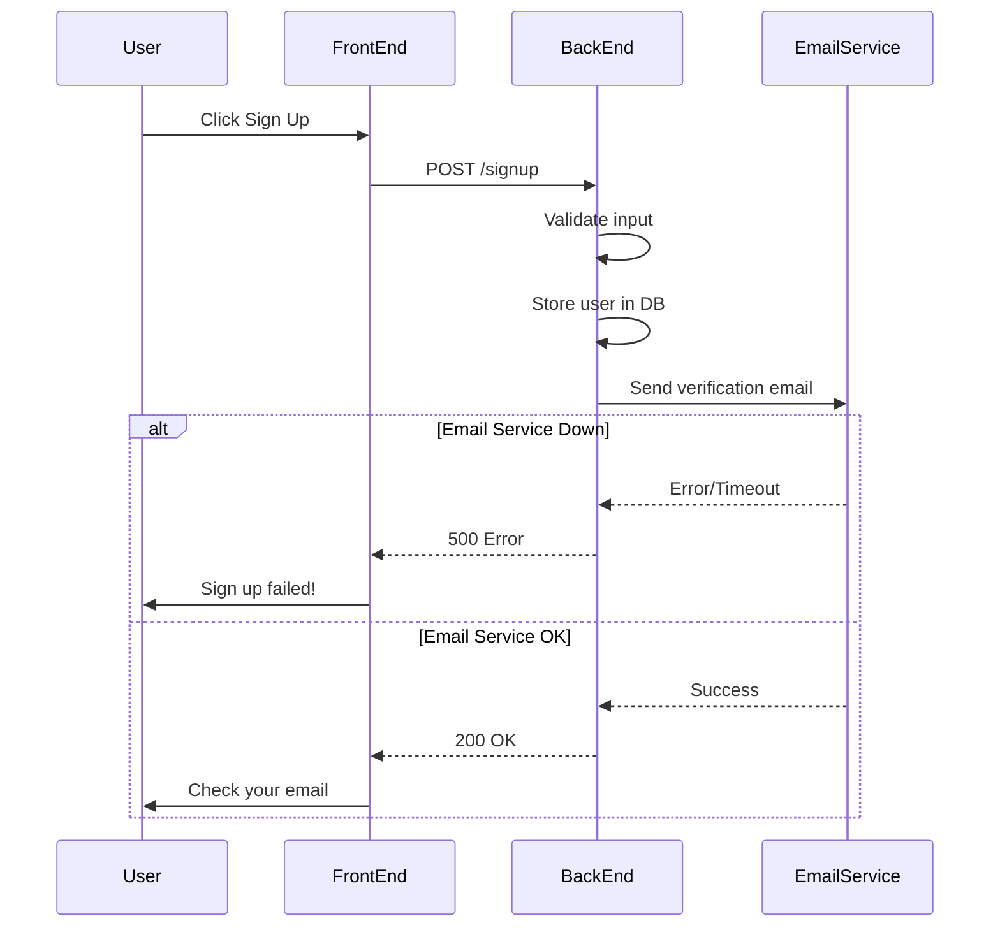

**Problems:**

1. **Blocking**: User waits for email service response (could be 5-10 seconds)
2. **Coupling**: If email service is down, signup API fails
3. **Bad UX**: User sees failure even though account was created
4. **Timeouts**: Email service might be slow

### The Solution: Async with Background Jobs

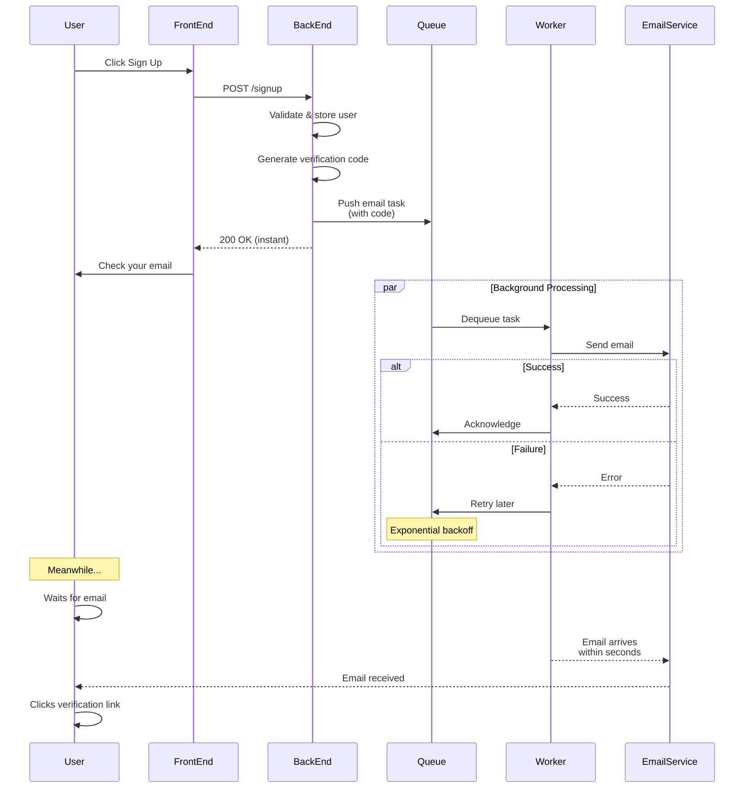

**How Email Verification Actually Works (The Key!):**

```
T=0ms:   User submits signup form
         └─ Email not sent yet ❌

T=5ms:   Backend processes:
         ├─ Stores user in database ✓
         ├─ Generates unique verification code (e.g., "ABC123XYZ") ✓
         ├─ Creates verification link: https://myapp.com/verify?code=ABC123XYZ ✓
         │  (This link is made RIGHT NOW, doesn't need email service)
         └─ Creates email task with code READY TO SEND ✓

T=10ms:  Backend returns 200 OK to user
         User sees: "Check your email for verification link"
         ✓ Response is instant even though email not sent yet

T=20ms:  Background worker picks up email task

T=100ms: Worker sends email to email service
         Email service sends actual email

T=2000ms: User receives email in inbox
          Email contains the verification link
          ✓ Link works because code was created at T=5ms

User clicks link:
├─ Browser sends: GET /verify?code=ABC123XYZ
├─ Backend checks if code exists and not expired
├─ Backend marks user as verified ✓
└─ User can now log in
```

**The KEY Insight:**

The verification code is NOT dependent on the email service responding. It's generated immediately in the database at T=5ms. The email service only needs to **deliver the email** later—the verification link is already valid.

Think of it like mailing a physical letter with a coupon code:

```
❌ OLD WAY (blocking):
  1. Write letter with code
  2. Wait for mailman to arrive
  3. Wait for mailman to deliver
  4. Return to user
  (User waits 1 hour!)

✓ NEW WAY (async):
  1. Write letter with code IMMEDIATELY
  2. Drop in mailbox queue
  3. Return to user IMMEDIATELY
  4. Mailman picks up later and delivers
  (User waits 10ms, email arrives in 2 seconds!)
```

**Benefits:**

1. **Fast Response**: User sees success immediately (10ms)
2. **Decoupled**: Email service down doesn't affect signup (code still valid)
3. **Better UX**: User can sign up regardless of email service
4. **Retry Logic**: If email fails, worker retries without affecting user
5. **Verification still works**: Code is valid whether email takes 1 second or 10 seconds to arrive

---

## Architecture Overview

### Component Diagram

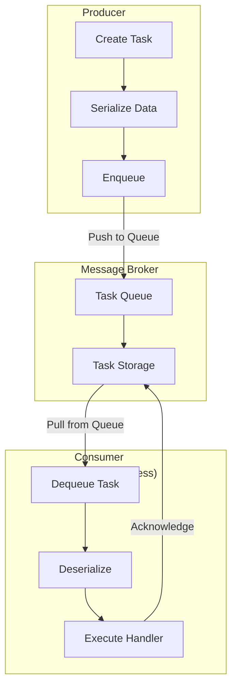

### Data Flow

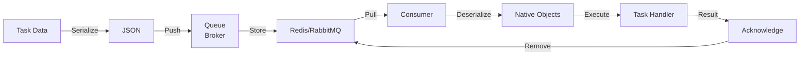

---

## How Task Queues Work

### Step-by-Step Workflow

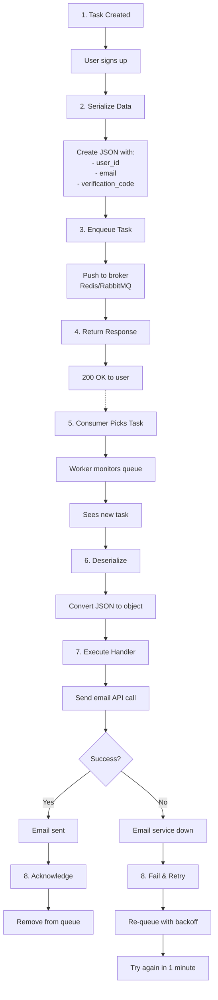

### Enqueue vs Dequeue

**Enqueue (Producer):**

```javascript
// Create and push task
const task = {
  type: "send_email",
  user_id: 123,
  email: "user@example.com",
  template: "verification",
};

queue.enqueue(task); // Push to queue
```

**Dequeue (Consumer):**

```javascript
// Pull and execute task
while (true) {
  const task = queue.dequeue(); // Wait for task
  if (task) {
    sendEmail(task);
    queue.acknowledge(task); // Mark as done
  }
}
```

---

## Types of Background Tasks

### 1. One-Off Tasks

**Definition:** Single task triggered by specific event

**Examples:**

- Send verification email after signup
- Send welcome email after account creation
- Send password reset email
- Send notification when message received
- Send order confirmation email

**Characteristics:**

- Triggered immediately
- Depend on user action
- Most common type
- Usually fast (under 5 seconds)

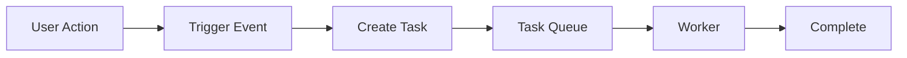

---

### 2. Recurring Tasks

**Definition:** Tasks that execute periodically at intervals

**Examples:**

- Send daily reports
- Send monthly invoices
- Send annual statements
- Cleanup sessions/orphaned records
- Database maintenance
- Cache refresh

**Characteristics:**

- Scheduled at fixed intervals
- Run independently of user action
- Can be resource intensive

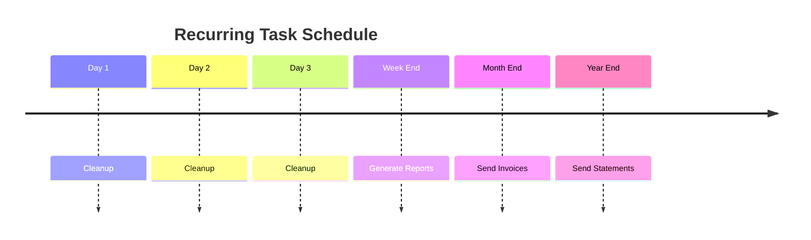

**Implementation:**

```javascript
// Cleanup task every 2 months
scheduler.scheduleRecurring("cleanup_sessions", "0 0 1 */2 *", () => {
  deleteOrphanedSessions();
});

// Daily report at 9 AM
scheduler.scheduleRecurring("daily_report", "0 9 * * *", () => {
  generateAndSendReport();
});
```

---

### 3. Chain Tasks (Dependent Tasks)

**Definition:** Tasks with parent-child relationships

**Example: (LMS) Video Upload**

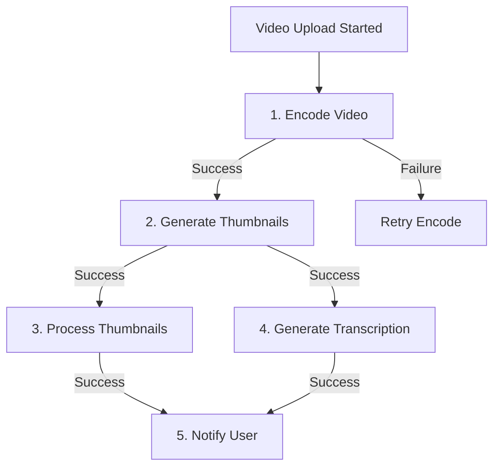

**Why This Matters:**

- Thumbnail generation depends on encoded video
- Transcription can run parallel to thumbnail processing
- If encoding fails, downstream tasks don't run
- Better scaling and failure handling

**Real-World Scenario:**

```
1. User uploads video
2. Task 1: Encode video to multiple formats (5 minutes)
   ├─ Task 2a: Generate thumbnail (parallel, 30 seconds)
   ├─ Task 2b: Generate transcription (parallel, 1 minute)
3. Task 3: Process thumbnails for different resolutions
4. Notify user when complete
```

---

### 4. Batch Tasks

**Definition:** Multiple tasks triggered together or single task processing bulk data

**Examples:**

**A. Delete Account (Bulk Deletion)**

```
User clicks "Delete Account"
↓
Immediately return 200 OK
↓
Background: Delete all user resources
  - Delete projects where user is owner
  - Delete user posts/comments
  - Delete user files/assets
  - Delete user profile
  - Send deletion confirmation email
```

**B. Send Reports to All Users**

```
Scheduled: Daily at midnight
↓
Create 1 million send_report tasks simultaneously
↓
Workers process in parallel
  - Each task sends personalized report to 1 user
  - Distributed across many workers
```

**Characteristics:**

- Multiple independent tasks
- Can run in parallel
- Often triggered by scheduler
- Large volume of work

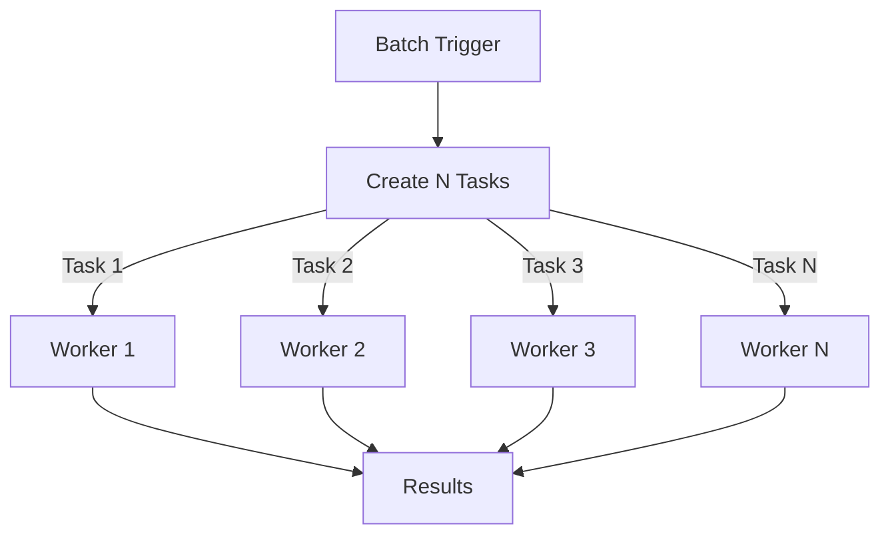

---

## Task Queue Technologies

### Popular Task Queue Technologies

| Technology       | Language | Use Case         | Pros                  | Cons                 |
| ---------------- | -------- | ---------------- | --------------------- | -------------------- |
| **Celery**       | Python   | General purpose  | Mature, feature-rich  | Complex config       |
| **Bullmq**       | Node.js  | General purpose  | Modern, Redis-based   | Redis required       |
| **AsyncQ**       | Go       | High performance | Fast, scalable        | Smaller community    |
| **RabbitMQ**     | Any      | Message queuing  | Reliable, widely used | Operational overhead |
| **Redis PubSub** | Any      | Simple pub/sub   | Easy setup            | Limited features     |
| **AWS SQS**      | Any      | Managed service  | Scalable, serverless  | Cost, vendor lock-in |

### Redis as a Broker

**Why Redis for Task Queues?**

- In-memory storage (fast)
- Native list support (queue operations)
- Atomic operations
- Built-in expiration (TTL)
- Simple key-value API

**Implementation:**

```javascript
// Using Redis as broker
const redis = require("redis");
const client = redis.createClient();

// Enqueue task
async function enqueueTask(taskName, data) {
  const task = JSON.stringify({ name: taskName, data });
  await client.rpush("task_queue", task); // Right push (enqueue)
}

// Dequeue task
async function dequeueTask() {
  const task = await client.blpop("task_queue", 0); // Block left pop
  return JSON.parse(task);
}

// Set task retry
async function queueForRetry(task, delaySeconds) {
  await client.zadd(
    "retry_queue",
    Date.now() + delaySeconds * 1000,
    JSON.stringify(task),
  );
}
```

---

## Core Concepts

### Visibility Timeout

**Definition:** Period when a task is considered "in progress"

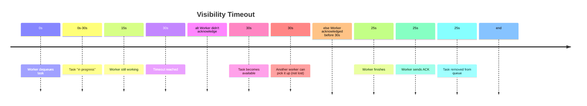

**Why It Matters:**

- Prevents task loss if worker crashes
- Makes queue reliable
- If worker doesn't acknowledge within timeout, task is requeued
- Other workers can retry the task

### Acknowledgements

**Task Flow:**

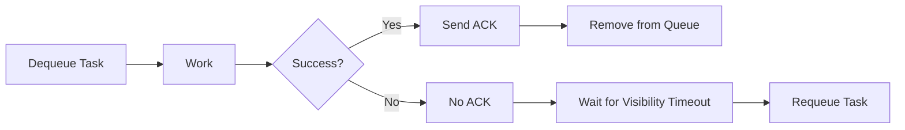

---

## Design Considerations

### 1. Idempotency

**Definition:** Task can be safely executed multiple times without side effects

**Bad Example (Non-Idempotent):**

```javascript
// If this fails halfway and retries, money is charged twice!
async function processPayment(orderId, amount) {
  database.updateOrder(orderId, "processing");
  chargeCard(amount); // FAILS HERE - retry called
  database.updateOrder(orderId, "completed");
}

// Retry → charges AGAIN
```

**Good Example (Idempotent):**

```javascript
async function processPayment(orderId, amount) {
  const order = database.getOrder(orderId);

  // Check if already processed
  if (order.status === "completed") {
    return; // Already done, skip
  }

  // Atomic transaction
  database.transaction(() => {
    database.updateOrder(orderId, "processing");
    chargeCard(amount);
    database.updateOrder(orderId, "completed");
  });

  // If fails, next retry starts fresh
}
```

### 2. Error Handling

**Must-Have Components:**

- Try-catch blocks
- Detailed error logging
- Distinguishing recoverable vs non-recoverable errors
- Retry mechanisms

```javascript
async function processTask(task) {
  try {
    await executeTask(task);
  } catch (error) {
    // Recoverable: network timeout, service temporarily down
    if (isRecoverable(error)) {
      logger.warn("Recoverable error:", error);
      throw error; // Queue will retry
    }

    // Non-recoverable: invalid data, auth failed
    if (isNonRecoverable(error)) {
      logger.error("Non-recoverable error:", error);
      database.markTaskFailed(task.id, error);
      return; // Don't retry
    }

    // Unknown
    logger.error("Unknown error:", error);
    throw error; // Retry to be safe
  }
}
```

### 3. Monitoring & Alerting

**Key Metrics to Track:**

```javascript
// Queue health metrics
- Queue length (growing? stuck?)
- Task success rate
- Task failure rate
- Average processing time
- P95/P99 processing time
- Worker utilization

// Example monitoring
metrics.gauge('queue_length', queueLength);
metrics.counter('tasks_completed', 1);
metrics.counter('tasks_failed', 1);
metrics.histogram('task_duration_ms', duration);
```

**Alerts:**

- Queue length exceeds threshold (tasks backing up)
- Failure rate exceeds threshold
- Worker down/not responding
- Processing time degradation

### 4. Scalability

**Horizontal Scaling:**

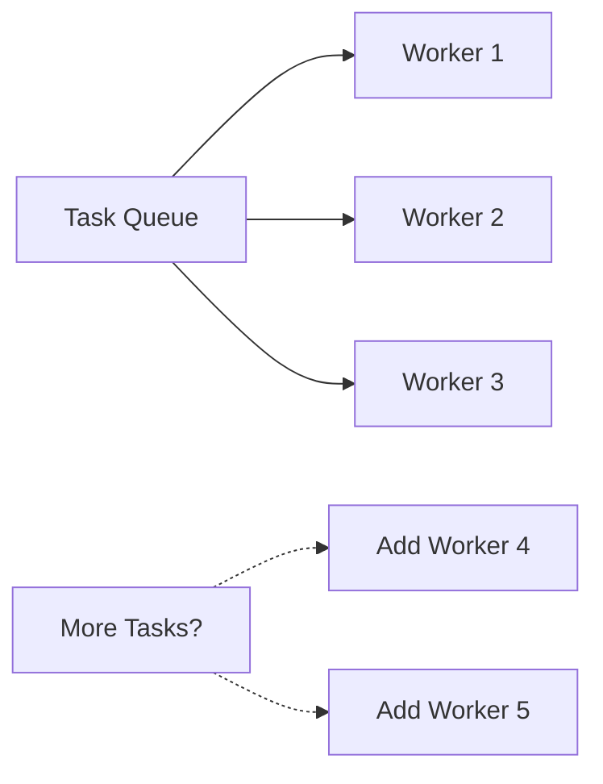

**Key Considerations:**

- Add more workers/consumers as needed
- Each worker independently pulls from queue
- Queue acts as load balancer
- No single point of failure

**Vertical Scaling:**

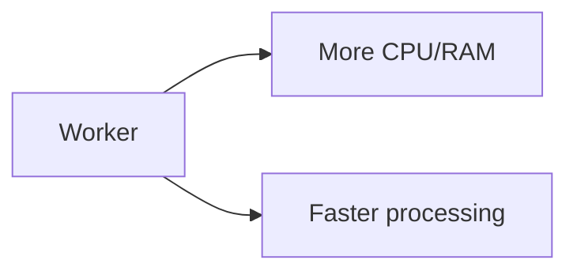
**Key Considerations:**
- Upgrade worker machines for better performance
- Faster processing reduces queue backlog


### 5. Ordering

**When You Need Ordering:**

- Delete user: must delete posts before deleting user
- Financial transactions: debit before credit
- Workflow steps: must happen in sequence

**Implementation:**

- Use partitioned queues (one per user/entity)
- Or use priority queues

### 6. Rate Limiting

**Why?**

- External services have rate limits
- Don't want to overwhelm 3rd party APIs
- Cost control

```javascript
// Rate limit example: Send emails
// Max 100 emails per minute
const emailsPerMinute = 100;
const delayBetweenEmails = (60 * 1000) / emailsPerMinute; // 600ms

async function sendEmailWorker() {
  while (true) {
    const task = queue.dequeue();
    await sendEmail(task);
    await delay(delayBetweenEmails); // Space out requests
  }
}
```

---

## Best Practices

### 1. Keep Tasks Small and Focused

**Bad:**

```javascript
// Too much in one task - if any part fails, retry everything
async function processOrder(orderId) {
  const order = fetchOrder(orderId);
  validateOrder(order); // Fails here
  chargeCard(order);
  updateInventory(order);
  sendConfirmationEmail(order);
  updateAnalytics(order);
}
```

**Good:**

```javascript
// Separate concerns
async function processOrderPayment(orderId) {
  chargeCard(orderId);
}

async function updateInventoryTask(orderId) {
  updateInventory(orderId);
}

async function sendConfirmationTask(orderId) {
  sendConfirmationEmail(orderId);
}

// Or chain them if dependent
```

**Benefits:**

- Easier to scale specific step
- Failures contained
- Retries faster
- Monitoring easier

### 2. Avoid Long-Running Tasks

**Problem:**

```javascript
// Takes 1 hour - ties up a worker
async function generateAnnualReport() {
  // Processing thousands of records
}
```

**Solution:**

```javascript
// Break into chunks
async function generateReportChunk(startDate, endDate) {
  // Process smaller date range
}

// Create many small tasks instead of one large one
for (let i = 0; i < 12; i++) {
  const start = getMonthStart(i);
  const end = getMonthEnd(i);
  queue.enqueue("generate_report_chunk", { start, end });
}
```

### 3. Comprehensive Error Handling & Logging

```javascript
async function executeTask(task) {
  const taskId = task.id;
  const startTime = Date.now();

  try {
    logger.info(`Starting task ${taskId}`);

    const result = await performWork(task);

    const duration = Date.now() - startTime;
    logger.info(`Task ${taskId} succeeded in ${duration}ms`, { result });
  } catch (error) {
    const duration = Date.now() - startTime;
    logger.error(`Task ${taskId} failed after ${duration}ms`, {
      error: error.message,
      stack: error.stack,
      taskData: task,
    });

    throw error; // Let queue handle retry
  }
}
```

### 4. Monitor Queue Length & Worker Health
That mean setting up alerts if the queue is backing up (indicating tasks aren't being processed fast enough) or if workers are down (indicating no one is processing tasks).

```javascript
// Alert if queue is backing up
setInterval(async () => {
  const length = await queue.length();
  if (length > 10000) {
    alerts.critical("Queue backed up: " + length);
  }
}, 5000);

// Alert if workers are down
setInterval(async () => {
  const workers = await getWorkerHealth();
  workers.forEach((worker) => {
    if (!worker.responsive) {
      alerts.critical(`Worker ${worker.id} is down`);
    }
  });
}, 10000);
```

### 5. Implement Exponential Backoff for Retries
That mean if a task fails, instead of retrying immediately, you wait for an increasing amount of time before each retry attempt. This helps prevent overwhelming a service that may be temporarily down or experiencing issues.

```javascript
function getRetryDelay(attemptNumber) {
  // Exponential backoff: 1s, 2s, 4s, 8s, 16s...
  return Math.pow(2, attemptNumber - 1) * 1000;
}

// Example:
// Attempt 1: Fails immediately
// Attempt 2: Retry after 1 second
// Attempt 3: Retry after 2 seconds
// Attempt 4: Retry after 4 seconds
// ... up to max retries

// This prevents overwhelming temporarily-down services
```

---

## Real-World Examples

### Example 1: Email Verification on Signup

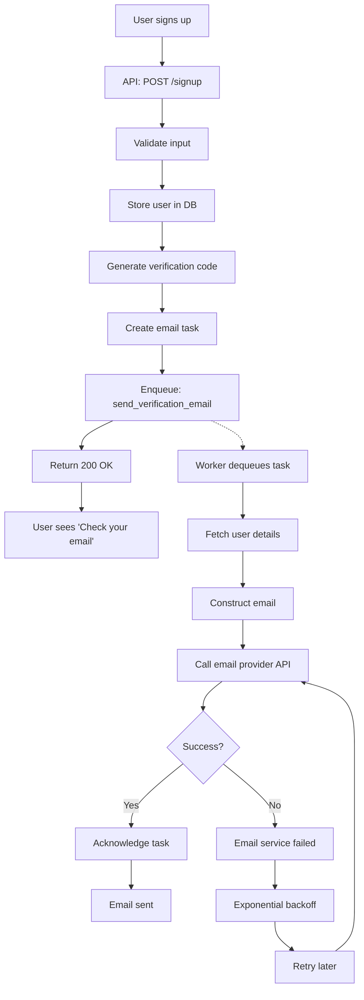

### Example 2: Image Processing

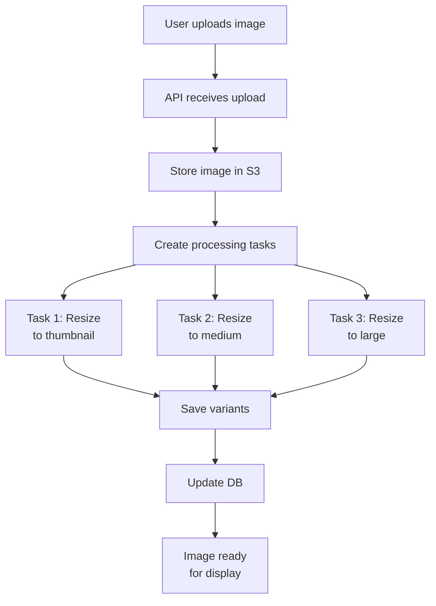

### Example 3: Delete Account

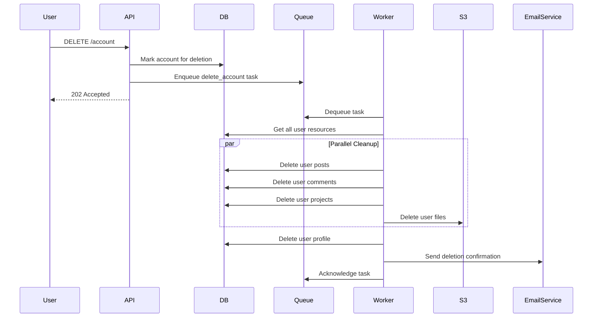

---

## Implementation Checklist

```
Core Setup:
✓ Choose task queue technology (Celery, Bullmq, etc.)
✓ Configure broker (Redis, RabbitMQ, etc.)
✓ Set up workers/consumers
✓ Create task handlers

Error Handling:
✓ Implement try-catch in all handlers
✓ Log errors with context
✓ Configure retry logic
✓ Set max retry attempts
✓ Implement exponential backoff

Monitoring:
✓ Track queue length
✓ Track task success/failure rates
✓ Monitor worker health
✓ Set up alerts for problems
✓ Dashboard for visibility

Reliability:
✓ Ensure idempotent tasks
✓ Implement acknowledgements
✓ Handle visibility timeout
✓ Test failure scenarios
✓ Plan disaster recovery

Scalability:
✓ Design for horizontal scaling
✓ Support adding workers easily
✓ Monitor performance
✓ Plan for growth
```

---

## Summary: Key Takeaways

1. **Background jobs decouple operations** - Improve responsiveness by offloading non-critical work

2. **Reduce latency** - Don't block API responses on slow operations like sending emails

3. **Improve reliability** - Automatic retries handle temporary service outages

4. **Better user experience** - APIs respond instantly, work completes asynchronously

5. **Enable scaling** - Process multiple tasks in parallel across workers

6. **Task types matter**:
   - One-off: Single event-triggered task
   - Recurring: Scheduled periodic tasks
   - Chain: Dependent tasks in sequence
   - Batch: Multiple tasks in parallel

7. **Design for idempotency** - Tasks must be safe to execute multiple times

8. **Monitor everything** - Track queue health, worker status, success rates

9. **Keep tasks focused** - Small, single-responsibility tasks are better

10. **Use exponential backoff** - Retry intelligently without overwhelming services

---

## Common Task Queue Patterns

| Pattern           | Example        | Characteristics                    |
| ----------------- | -------------- | ---------------------------------- |
| **Fire & Forget** | Send email     | Create task, don't wait for result |
| **Fire & Track**  | Video upload   | Create task, track progress        |
| **Chain**         | Workflow steps | Tasks dependent on each other      |
| **Fan-Out**       | Batch reports  | One trigger creates many tasks     |
| **Fan-In**        | Aggregation    | Many tasks produce one result      |

---

## Next Steps

1. **Evaluate your needs** - What operations are blocking your APIs?
2. **Choose technology** - Pick task queue based on your stack
3. **Start simple** - Implement with one-off tasks first
4. **Monitor & iterate** - Add monitoring, optimize based on metrics
5. **Scale gradually** - Add complexity only when needed
