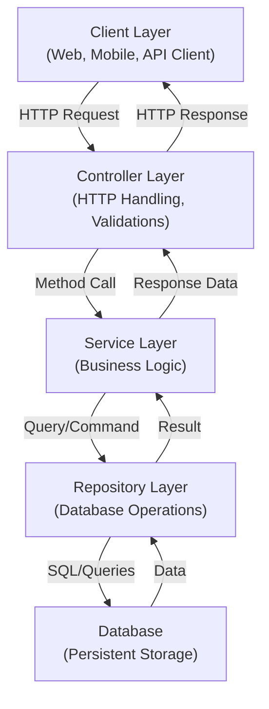
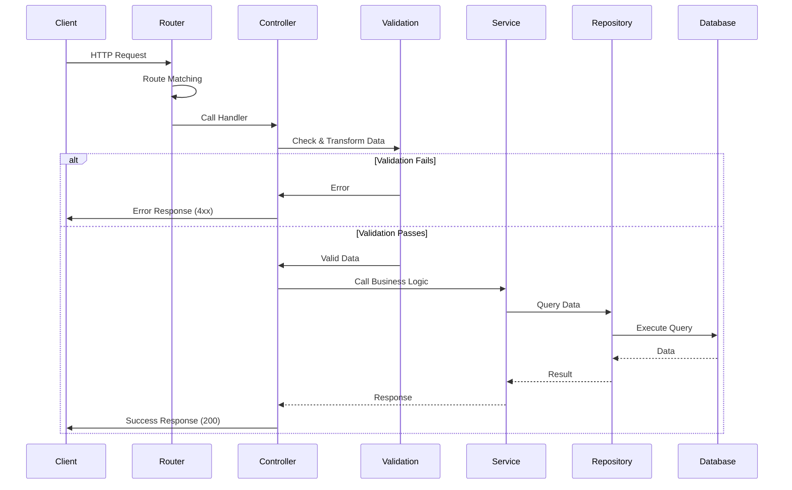
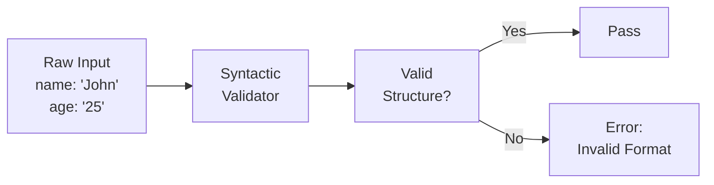
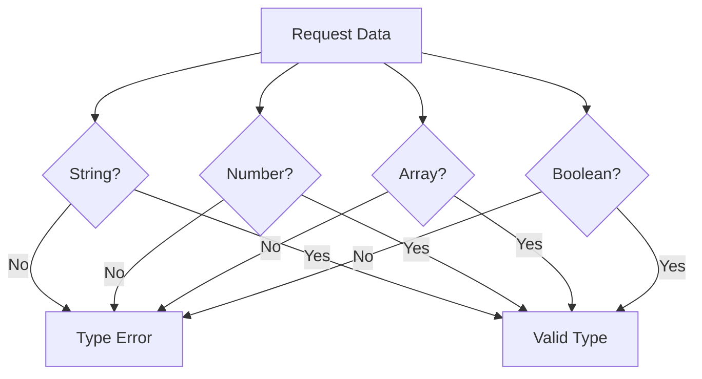
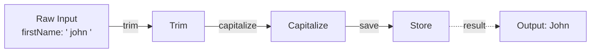
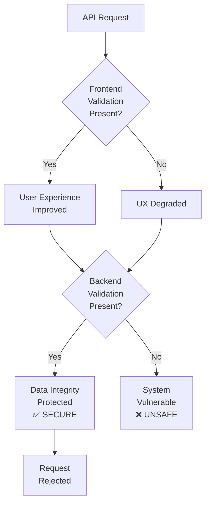
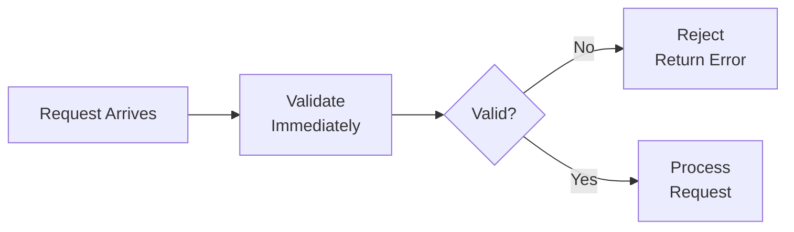

# Validations and Transformations for Backend Engineers

## Table of Contents
1. [Introduction](#introduction)
2. [Backend Architecture Overview](#backend-architecture-overview)
3. [Where Validations and Transformations Occur](#where-validations-and-transformations-occur)
4. [Purpose and Benefits](#purpose-and-benefits)
5. [Types of Validations](#types-of-validations)
6. [Transformation Examples](#transformation-examples)
7. [Frontend vs Backend Validation](#frontend-vs-backend-validation)
8. [Best Practices](#best-practices)

---

## Introduction

Validations and transformations are fundamental concepts in API design that focus on **data integrity** and **security**. These mechanisms ensure that all data entering your system conforms to expected formats and constraints before being processed by your business logic.

### Key Takeaway
Validations and transformations are sets of rules and guidelines to follow when designing APIs to ensure data quality and system security.

---

## Backend Architecture Overview

A typical backend architecture consists of multiple layers, each with specific responsibilities:



### Layer Responsibilities

#### **Repository Layer**
- Handles database connections and operations
- Manages CRUD (Create, Read, Update, Delete) operations
- Works with relational databases, NoSQL, Redis, or other persistent storage
- Provides data access abstraction

#### **Service Layer**
- Implements business logic
- Orchestrates repository method calls
- Handles notifications (email, push notifications)
- Manages webhook calls
- Defines all functionality expected from an API call

#### **Controller Layer**
- Acts as the entry point for HTTP requests
- Handles HTTP-specific concerns (status codes, response formats)
- Performs input validation and transformation
- Routes requests to appropriate service methods
- Formats and returns responses to clients

---

## Where Validations and Transformations Occur

### Request Flow with Validation



### Critical Entry Point

Validations and transformations occur **immediately after route matching** and **before controller logic execution**. This strategic placement:

- ✅ Prevents invalid data from reaching the service layer
- ✅ Reduces unnecessary database queries
- ✅ Ensures data consistency throughout the application
- ✅ Provides early error feedback to clients

---

## Purpose and Benefits

### What Are Validations?

Validations ensure that incoming data matches the expected **format, type, and constraints**.

#### Example Requirement
```
- Field: "name"
- Type: String
- Length: Between 5 and 100 characters
```

When a client sends data to this API, the validation layer:

1. **Checks for presence**: Is the "name" field provided?
2. **Validates type**: Is it a string (not array, number, object)?
3. **Validates constraints**: Is the length between 5-100 characters?
4. **Returns feedback**: If invalid, sends error immediately

### What Are Transformations?

Transformations modify incoming data into a format suitable for the service layer or database.

#### Transformation Examples
| Input | Transformation | Output |
|-------|---|--------|
| `"  John  "` | Trim whitespace | `"John"` |
| `"JOHN@EXAMPLE.COM"` | Convert to lowercase | `"john@example.com"` |
| `"+1234567890"` | Format phone | `"+1-234-567-890"` |
| `"2024-04-30"` | Parse date | `Date(2024, 3, 30)` |

---

## Types of Validations

### 1. **Syntactic Validation**

Validates the structure and format of data.



**Examples:**
- Email format: `user@domain.com`
- Phone format: `+1-234-567-8900`
- Date format: `YYYY-MM-DD`
- JSON structure: Valid JSON object

### 2. **Semantic Validation**

Validates the meaning and logical correctness of data.

**Examples:**
- Email exists in the system
- Username is not already taken
- Start date is before end date
- Age is within acceptable range
- User has permission to perform action

### 3. **Type Validation**

Ensures data types match requirements.



**Example Error:**
```
Error: For field "age", expected number but received string "twenty-five"
```

### 4. **Constraint Validation**

Validates field-level constraints and rules.

**Examples:**
- **Min length**: Username must be at least 3 characters
- **Max length**: Bio cannot exceed 500 characters
- **Range**: Age must be between 18 and 120
- **Pattern**: Username must match `[a-zA-Z0-9_]`
- **Enum**: Status must be one of: `active`, `inactive`, `pending`

---

## Transformation Examples

### Email Field Transformation

**Input:**
```json
{
  "email": "  JOHN.DOE@EXAMPLE.COM  "
}
```

**Transformations Applied:**
1. Trim whitespace: `"JOHN.DOE@EXAMPLE.COM"`
2. Convert to lowercase: `"john.doe@example.com"`

**Output:**
```json
{
  "email": "john.doe@example.com"
}
```

### Phone Field Transformation

**Input:**
```json
{
  "phone": "1234567890"
}
```

**Transformations Applied:**
1. Format phone number: Add `+` prefix and formatting

**Output:**
```json
{
  "phone": "+1-234-567-890"
}
```

### Complex Transformation Pipeline



---

## Frontend vs Backend Validation

### The Critical Distinction

One of the **most important concepts** in API design is understanding the difference between frontend and backend validation. This is a common source of security vulnerabilities.

### Frontend Validation

**Purpose:** User Experience (UX)
- Provides immediate feedback to users
- Prevents unnecessary API calls
- Improves user experience

**Characteristics:**
- Optional (can be bypassed)
- Not trusted for security
- Only validates what the UI allows

**Example:**
```javascript
// Frontend validation - UX improvement only
if (email.includes('@')) {
  submitForm();
} else {
  showError('Invalid email');
}
```

### Backend Validation

**Purpose:** Security & Data Integrity
- Enforces data requirements
- Protects against malicious input
- Ensures database consistency
- Independent of client implementation

**Characteristics:**
- Mandatory
- Trusted and authoritative
- Applies to all clients

**Example:**
```javascript
// Backend validation - security enforcement
if (!isValidEmail(email)) {
  return error('Invalid email', 400);
}
```

### Why Both Are Necessary



### Real-World Scenario

```
Scenario: User bypasses frontend validation using API client (Postman, Insomnia)
```

**With Backend Validation (Correct):**
```
1. Frontend validation skipped
2. User sends invalid data via Postman
3. Backend validation catches the error
4. Request rejected with clear error message
5. System remains secure ✅
```

**Without Backend Validation (Dangerous):**
```
1. Frontend validation skipped
2. User sends invalid/malicious data via Postman
3. No validation in backend
4. Invalid data reaches database
5. Data corruption, security breach ❌
```

### Client Variations

A typical API server may receive requests from:

- **Web Browser**: React, Vue, Angular app with validation
- **Mobile App**: iOS, Android with built-in validation
- **API Client**: Postman, Insomnia (NO frontend validation)
- **Direct HTTP**: `curl`, direct socket connections (NO frontend validation)
- **Third-party Integration**: External services (unknown validation)

**Conclusion:** Never rely on frontend validation for security or data integrity.

---

## Validation in Action: Code Example

### API Definition

```
POST /api/users
Required Fields:
  - stringField (String)
  - numberField (Number)
  - arrayField (Array of Strings)
  - booleanField (Boolean)
```

### Scenario 1: Missing Required Fields

**Request:**
```json
{
  "stringField": "example"
}
```

**Response (400 Bad Request):**
```json
{
  "error": "numberField is required",
  "error": "arrayField is required",
  "error": "booleanField is required"
}
```

### Scenario 2: Wrong Data Types

**Request:**
```json
{
  "stringField": "example",
  "numberField": "not-a-number",
  "arrayField": "not-an-array",
  "booleanField": "not-a-boolean"
}
```

**Response (400 Bad Request):**
```json
{
  "errors": [
    "numberField: expected number, received string",
    "arrayField: expected array, received string",
    "booleanField: expected boolean, received string"
  ]
}
```

### Scenario 3: Incorrect Array Element Types

**Request:**
```json
{
  "stringField": "example",
  "numberField": 10,
  "arrayField": [1, 2, 3],
  "booleanField": true
}
```

**Response (400 Bad Request):**
```json
{
  "error": "arrayField[0]: expected string, received number"
}
```

### Scenario 4: All Valid Data

**Request:**
```json
{
  "stringField": "example",
  "numberField": 10,
  "arrayField": ["item1", "item2"],
  "booleanField": true
}
```

**Response (200 OK):**
```json
{
  "success": true,
  "data": {
    "stringField": "example",
    "numberField": 10,
    "arrayField": ["item1", "item2"],
    "booleanField": true
  }
}
```

---

## Best Practices

### 1. **Validate Early, Fail Fast**


- Validate at the controller layer entry point
- Reject invalid requests before they reach service or repository layers
- Provide immediate error feedback

### 2. **Be Specific in Constraints**
```
❌ Bad:  "email must be valid"
✅ Good: "email must be a valid RFC 5322 formatted address"

❌ Bad:  "password must be strong"
✅ Good: "password must be 12+ characters with uppercase, lowercase, numbers, and symbols"
```

### 3. **Use Validation Libraries**
- Leverage existing validation frameworks (Zod, Joi, Yup, class-validator)
- Define reusable validation schemas
- Reduce code duplication

### 4. **Separate Frontend and Backend Logic**
```
Frontend Validation          Backend Validation
├─ UX improvements          ├─ Security enforcement
├─ Instant feedback          ├─ Data integrity
├─ Can be bypassed           └─ Cannot be bypassed
└─ Not trusted
```

### 5. **Provide Clear Error Messages**
```
❌ Bad:  "Validation failed"
✅ Good: "Field 'email' must be a valid email address. Received: 'invalid.email'"
```

### 6. **Never Trust Client-Side Validation**
```
// Always validate on the backend
// Never write:
if (frontendSaysValid) {
  processRequest(); // ❌ WRONG
}

// Always validate:
if (backendValidates(data)) {
  processRequest(); // ✅ CORRECT
}
```

### 7. **Validate All Input Sources**
Validate data from:
- JSON request body
- Query parameters
- Path parameters
- Headers
- Cookies
- File uploads

### 8. **Use Transformations for Normalization**
```javascript
// Normalize data for consistency
{
  email: toLowercase(trim(input.email)),
  phone: formatPhoneNumber(input.phone),
  date: parseISO8601(input.date),
  name: capitalizeWords(trim(input.name))
}
```

### 9. **Document Validation Rules**
```
POST /api/users
Parameters:
  - email (string, required): Valid email address following RFC 5322
  - password (string, required): 12+ chars with uppercase, lowercase, number, symbol
  - age (number, optional): Integer between 0 and 150
  - interests (array, optional): Array of strings, max 10 items
```

### 10. **Test Validation Comprehensively**
Test cases should include:
- ✅ Valid data (happy path)
- ❌ Missing required fields
- ❌ Wrong data types
- ❌ Out-of-range values
- ❌ Invalid formats
- ❌ Boundary cases
- ❌ Malicious input

---

## Summary

| Concept | Purpose | Trust Level | Responsibility |
|---------|---------|-------------|-----------------|
| **Frontend Validation** | User Experience | ⚠️ Not Trusted | Client |
| **Backend Validation** | Security & Integrity | ✅ Trusted | Server |
| **Transformation** | Data Normalization | ✅ Server Control | Server |

### Key Takeaways

1. **Validations ensure data integrity and security**
2. **Transformations normalize data for consistency**
3. **Validations occur at the controller layer entry point**
4. **Backend validation is mandatory, never optional**
5. **Frontend validation is for UX only, not security**
6. **Always validate ALL input sources**
7. **Provide clear, specific error messages**
8. **Use validation libraries to reduce complexity**
9. **Test validation logic thoroughly**
10. **Design APIs with security-first mindset**

---

## Conclusion

Validations and transformations are not complex concepts—they are **essential guidelines** for secure API design. By implementing proper validation and transformation logic at the right architectural layer, you ensure that your system maintains data integrity, prevents security vulnerabilities, and provides a robust foundation for your backend services.

Remember: **Your backend must be secure regardless of what the client does.**
