# Concurrency & Parallelism: IO Bound vs CPU Bound

## Table of Contents
1. [Why Concurrency Matters](#why-concurrency-matters)
2. [The Problem: IO Waiting](#the-problem-io-waiting)
3. [Concurrency vs Parallelism](#concurrency-vs-parallelism)
4. [IO-Bound vs CPU-Bound Workloads](#io-bound-vs-cpu-bound-workloads)
5. [Concurrency Models](#concurrency-models)
   - [Threading Model](#1-threading-model)
   - [Event Loop Model](#2-event-loop-model)
   - [Virtual Threads (Go Routines)](#3-virtual-threads-go-routines)
6. [How Async/Await Works](#how-asyncawait-works)
7. [Race Conditions & Shared State](#race-conditions--shared-state)
8. [Summary](#summary)

---

## Why Concurrency Matters

Every backend system must handle multiple things at once. A web server that can only process **one request at a time** is impractical for production where thousands of users may be sending requests simultaneously.

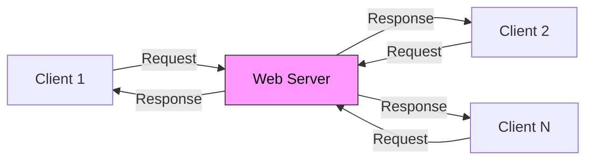
```mermaid
flowchart LR
    A[Client 1] -->|Request| S[Web Server]:::blackText
    B[Client 2] -->|Request| S
    C[Client N] -->|Request| S
    S -->|Response| A
    S -->|Response| B
    S -->|Response| C
    
    classDef blackText color:#000
    style S fill:#f9f,stroke:#333
```

**Key Insight:** Understanding how servers process requests concurrently helps you:
- Debug performance issues
- Structure applications better
- Make informed architectural decisions

---

## The Problem: IO Waiting

### The Scenario
A typical API call involves:
1. Receiving a request
2. Making database queries (IO)
3. Calling external services (IO)
4. Returning a response

### The Waste of Synchronous Processing


```mermaid
gantt
    title Synchronous Processing (Single Request)
    dateFormat X
    axisFormat %L ms
    
    section Request A
    CPU Work (parse, validate) :a1, 0, 10
    Waiting for DB (IO) :a2, 10, 110
    CPU Work (process result) :a3, 110, 120
```

**The Numbers:**
- Modern CPU: ~3 billion instructions/second = 3 million instructions/millisecond
- Waiting 100ms for DB = 300 million wasted instructions
- Typical API: 3-5 DB queries + external calls
- Total IO wait: ~250ms vs CPU work: ~10ms
- **CPU is idle 95% of the time!**

### Typical Backend Request Lifecycle

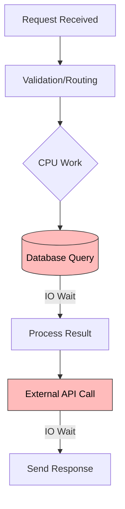
```mermaid
flowchart TD
    R[Request Received] --> V[Validation/Routing]
    V --> C{CPU Work}
    C --> DB[(Database Query)]:::blackText
    DB -->|IO Wait| P[Process Result]
    P --> E[External API Call]:::blackText
    E -->|IO Wait| S[Send Response]
    
    classDef blackText color:#000;
    style DB fill:#fbb,stroke:#333
    style E fill:#fbb,stroke:#333
```

---

## Concurrency vs Parallelism

### Definitions

| Concept | Definition | Hardware Required |
|---------|------------|------------------|
| **Concurrency** | Dealing with multiple things at once | Can work on single core |
| **Parallelism** | Doing multiple things at the same time | Requires multiple cores |

### Visual Comparison

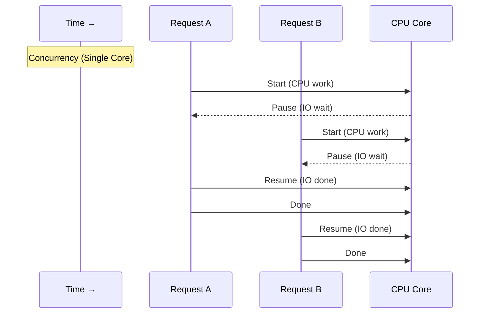
```mermaid
sequenceDiagram
    participant Time as Time →
    participant A as Request A
    participant B as Request B
    participant CPU as CPU Core
    
    Note over Time: Concurrency (Single Core)
    A->>CPU: Start (CPU work)
    CPU-->>A: Pause (IO wait)
    B->>CPU: Start (CPU work)
    CPU-->>B: Pause (IO wait)
    A->>CPU: Resume (IO done)
    A->>CPU: Done
    B->>CPU: Resume (IO done)
    B->>CPU: Done
```

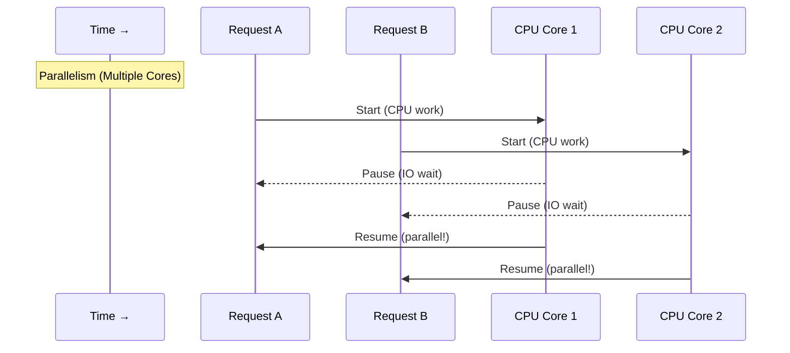
```mermaid
sequenceDiagram
    participant Time as Time →
    participant A as Request A
    participant B as Request B
    participant CPU1 as CPU Core 1
    participant CPU2 as CPU Core 2
    
    Note over Time: Parallelism (Multiple Cores)
    A->>CPU1: Start (CPU work)
    B->>CPU2: Start (CPU work)
    CPU1-->>A: Pause (IO wait)
    CPU2-->>B: Pause (IO wait)
    CPU1->>A: Resume (parallel!)
    CPU2->>B: Resume (parallel!)
```

**Key Difference:**
- **Concurrency** = Structure of the program (start, pause, resume)
- **Parallelism** = Hardware execution (simultaneous execution)

---

## IO-Bound vs CPU-Bound Workloads

### IO-Bound Operations
Operations where CPU cannot do anything and must wait:

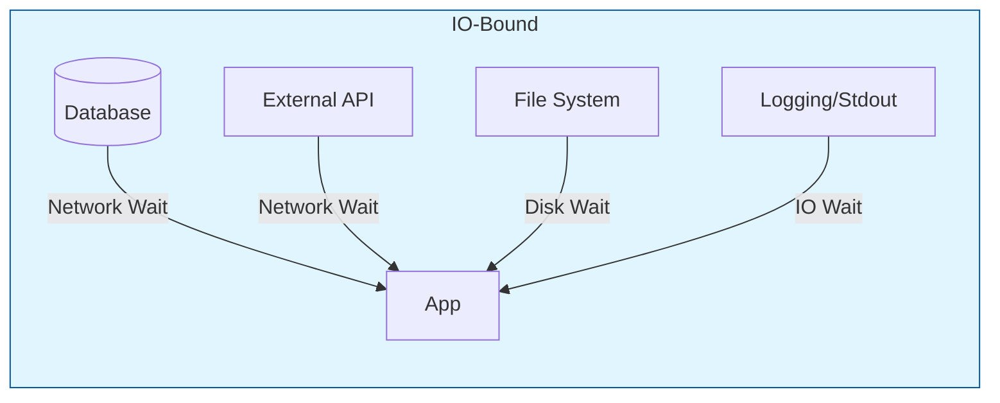
```mermaid
graph LR
    subgraph IO-Bound
        DB[(Database)] -->|Network Wait| A[App]
        API[External API] -->|Network Wait| A
        FS[File System] -->|Disk Wait| A
        LOG[Logging/Stdout] -->|IO Wait| A
    end
    
    style IO-Bound fill:#e1f5fe,stroke:#01579b
```

**Examples:**
- Database queries
- API calls to external services
- File system operations
- Network communication
- Standard input/output

> **Important:** Most backend applications are **70%+ IO-bound**. The bottleneck is almost always IO, not CPU.

### CPU-Bound Operations
Operations that require actual computation:

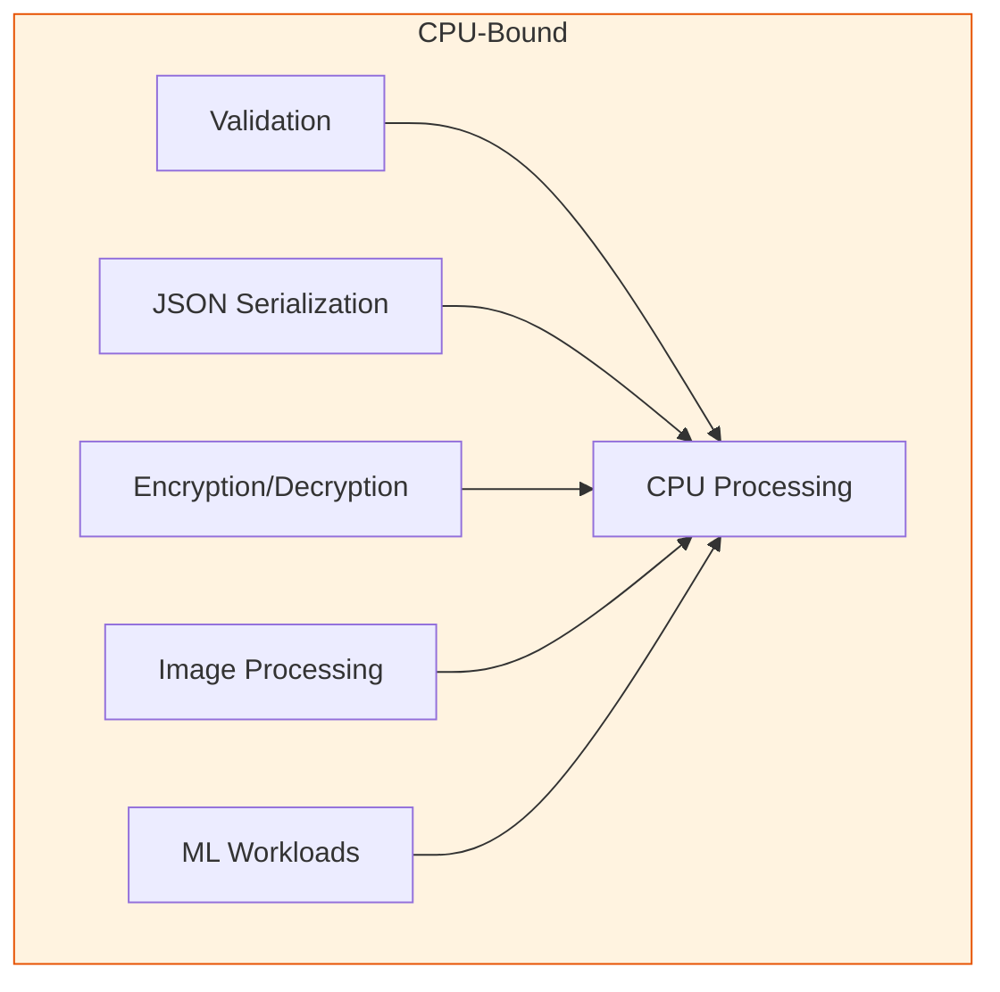
```mermaid
graph TD
    subgraph CPU-Bound
        V[Validation] --> CPU[CPU Processing]
        J[JSON Serialization] --> CPU
        E[Encryption/Decryption] --> CPU
        IP[Image Processing] --> CPU
        ML[ML Workloads] --> CPU
    end
    
    style CPU-Bound fill:#fff3e0,stroke:#e65100
```

**Examples:**
- Data validation
- JSON serialization/deserialization
- Encryption (JWT verification)
- Image/video processing
- Matrix operations
- Machine learning workloads

### Concurrency Needs by Workload Type

| Workload Type | Primary Need | Best Approach |
|--------------|-------------|---------------|
| **IO-Bound** | Concurrency | Event loop, Virtual threads |
| **CPU-Bound** | Parallelism | Multiple threads, Multi-core |
| **Mixed** | Both | Combination of both |

---

## Concurrency Models

### 1. Threading Model

#### What is a Thread?
A thread is an independent piece of execution managed by the operating system.

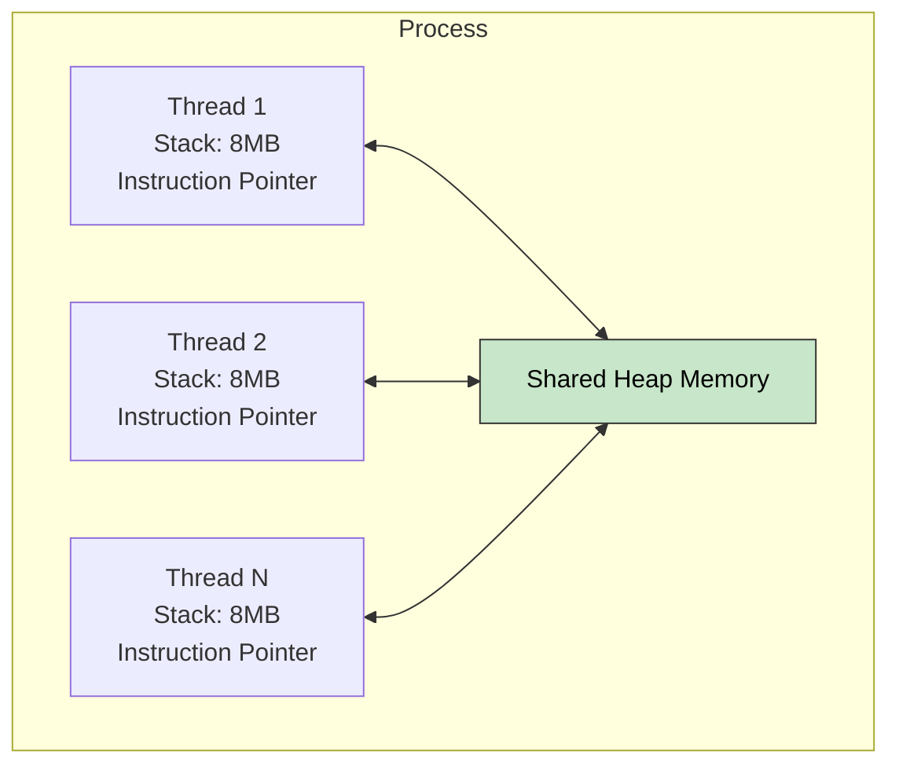
```mermaid
graph TD
    subgraph Process
        T1[Thread 1\nStack: 8MB\nInstruction Pointer]
        T2[Thread 2\nStack: 8MB\nInstruction Pointer]
        T3[Thread N\nStack: 8MB\nInstruction Pointer]
        Heap[Shared Heap Memory]:::balckText
    end
    
    classDef balckText color:#000
    T1 <--> Heap
    T2 <--> Heap
    T3 <--> Heap
    
    style Heap fill:#c8e6c9,stroke:#333
```

#### Thread Lifecycle

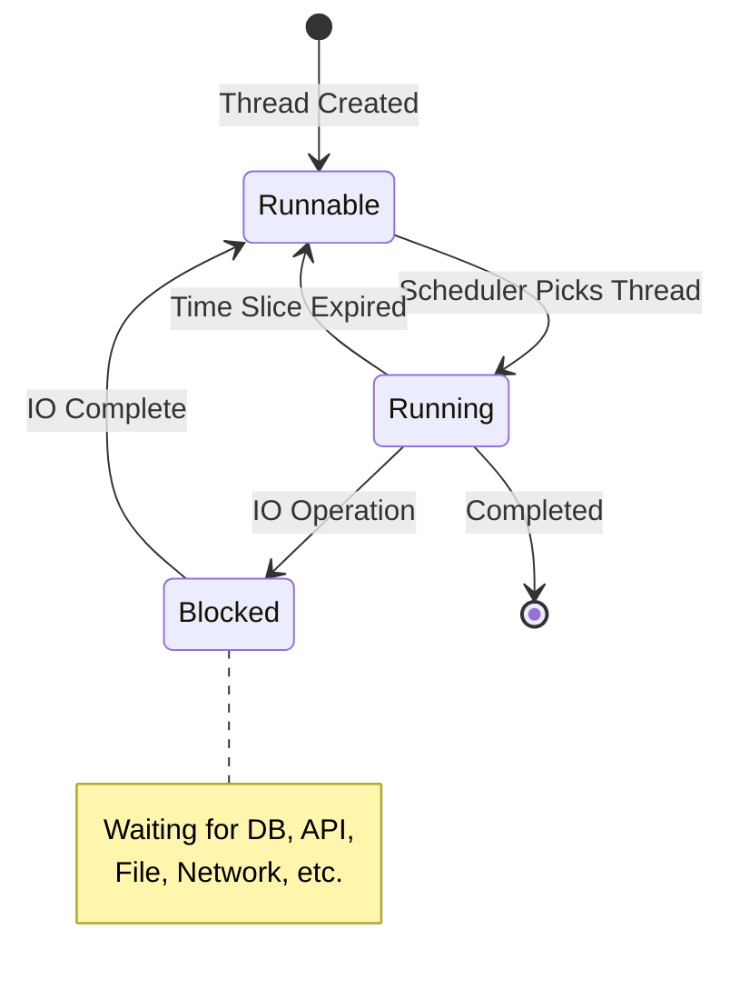
```mermaid
stateDiagram-v2
    [*] --> Runnable: Thread Created
    Runnable --> Running: Scheduler Picks Thread
    Running --> Blocked: IO Operation
    Blocked --> Runnable: IO Complete
    Running --> Runnable: Time Slice Expired
    Running --> [*]: Completed
    
    note right of Blocked
        Waiting for DB, API,
        File, Network, etc.
    end note
```

#### OS Scheduler (Preemptive Scheduling)

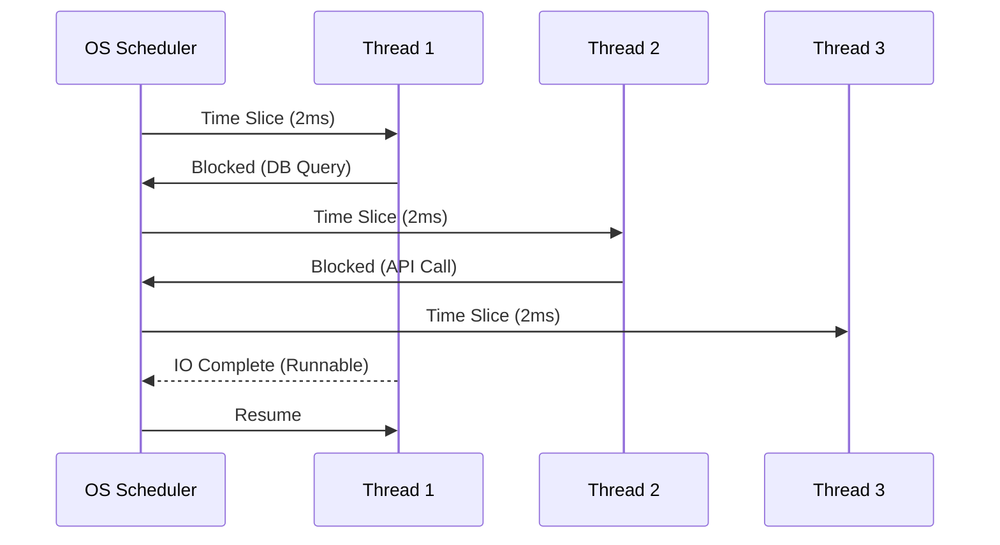
```mermaid
sequenceDiagram
    participant S as OS Scheduler
    participant T1 as Thread 1
    participant T2 as Thread 2
    participant T3 as Thread 3
    
    S->>T1: Time Slice (2ms)
    T1->>S: Blocked (DB Query)
    S->>T2: Time Slice (2ms)
    T2->>S: Blocked (API Call)
    S->>T3: Time Slice (2ms)
    T1-->>S: IO Complete (Runnable)
    S->>T1: Resume
```

#### Thread Overhead

| Type | Cost |
|------|------|
| **Memory** | ~8MB stack per thread (even if mostly virtual) |
| **Creation** | System call to kernel, microseconds to milliseconds |
| **Context Switch** | 1-10 microseconds per switch |

**The Math:**
- 10,000 threads × 1MB = ~10GB memory just for thread stacks!
- Thousands of threads = massive context switching overhead

---

### 2. Event Loop Model

#### Architecture

```mermaid
flowchart TD
    EL[Event Loop\nSingle Thread]
    Q1[Callback Queue]
    Q2[IO Polling\n(epoll/kqueue)]
    
    EL -->|Checks IO| Q2
    Q2 -->|IO Ready| Q1
    Q1 -->|Execute| EL
    
    subgraph IO Operations
        DB[(DB Query)]
        API[API Call]
        FS[File Read]
    end
    
    IO Operations -.->|Async| Q2
    
    style EL fill:#fce4ec,stroke:#333
    style Q1 fill:#e8eaf6,stroke:#333
    style Q2 fill:#e0f2f1,stroke:#333
```

#### How It Works

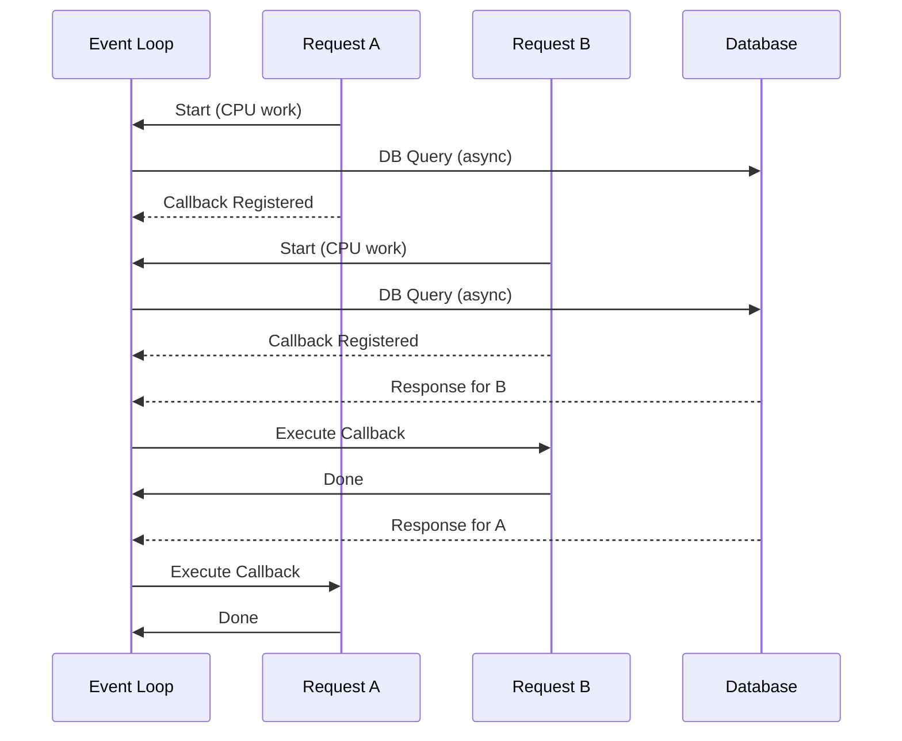
```mermaid
sequenceDiagram
    participant EL as Event Loop
    participant A as Request A
    participant B as Request B
    participant DB as Database
    
    A->>EL: Start (CPU work)
    EL->>DB: DB Query (async)
    A-->>EL: Callback Registered
    B->>EL: Start (CPU work)
    EL->>DB: DB Query (async)
    B-->>EL: Callback Registered
    DB-->>EL: Response for B
    EL->>B: Execute Callback
    B->>EL: Done
    DB-->>EL: Response for A
    EL->>A: Execute Callback
    A->>EL: Done
```

#### Event Loop Code Evolution

**Callback Style (Old):**
```javascript
db.query("SELECT * FROM users WHERE id = ?", [userId], function(err, result) {
    if (err) return handleError(err);
    // Process result
    sendResponse(result);
});
```

**Async/Await Style (Modern):**
```javascript
async function handleRequest(userId) {
    const user = await db.query("SELECT * FROM users WHERE id = ?", [userId]);
    return user;
}
```

> **Note:** `async/await` is syntactic sugar over callbacks. The state machine underneath is the same.

#### Event Loop Advantages & Trade-offs

| Advantages | Trade-offs |
|-----------|------------|
| No context switching | Must never block the loop |
| Minimal memory usage | Single CPU core utilization |
| Efficient for IO-bound | CPU-bound tasks hurt performance |
| No thread overhead | |

---

### 3. Virtual Threads (Go Routines)

#### The Go Scheduler (M:N Model)

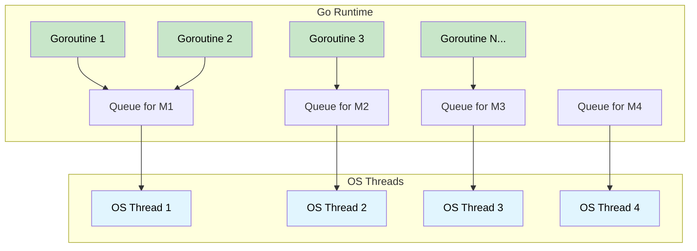
```mermaid
graph TD
    subgraph Go Runtime
        G1[Goroutine 1]:::blackText
        G2[Goroutine 2]:::blackText
        G3[Goroutine 3]:::blackText
        G4[Goroutine N...]:::blackText
        
        Q1[Queue for M1]
        Q2[Queue for M2]
        Q3[Queue for M3]
        Q4[Queue for M4]
    end
    
    subgraph OS Threads
        M1[OS Thread 1]
        M2[OS Thread 2]
        M3[OS Thread 3]
        M4[OS Thread 4]
    end
    
    G1 --> Q1
    G2 --> Q1
    G3 --> Q2
    G4 --> Q3
    
    Q1 --> M1
    Q2 --> M2
    Q3 --> M3
    Q4 --> M4
    
    classDef line_1 color:#000,fill:#c8e6c9;
    classDef line_2 color:#000,fill:#e1f5fe;
    class G1,G2,G3,G4 line_1
    class M1,M2,M3,M4 line_2
```

**Key Insight:** Many goroutines map to few OS threads (M:N scheduling)

#### How Go Handles Requests

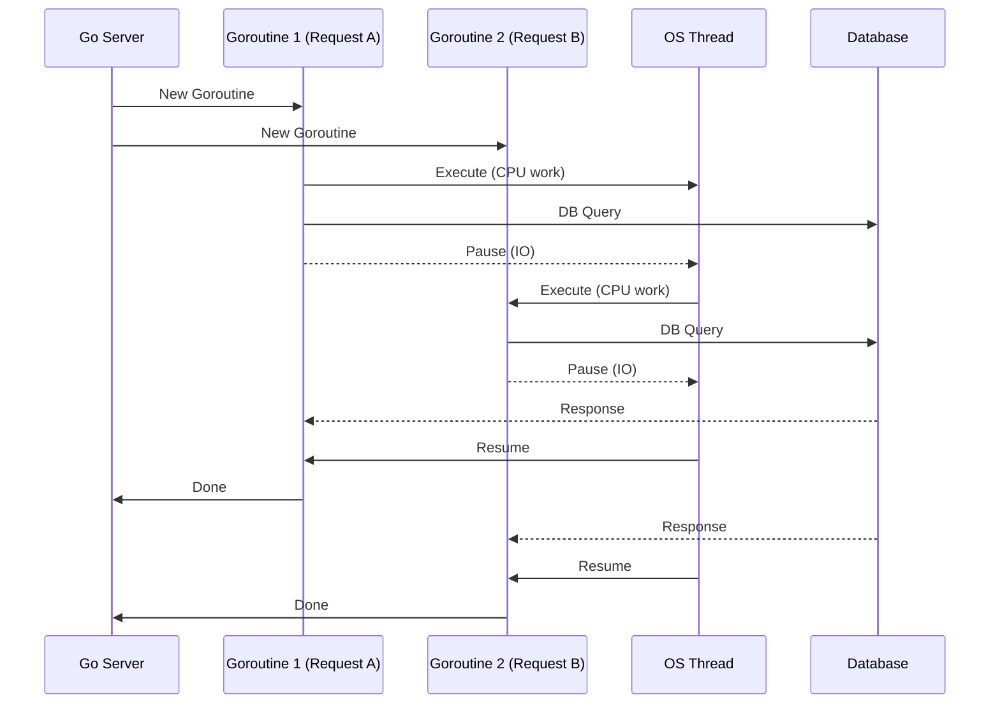
```mermaid
sequenceDiagram
    participant S as Go Server
    participant G1 as Goroutine 1 (Request A)
    participant G2 as Goroutine 2 (Request B)
    participant M as OS Thread
    participant DB as Database
    
    S->>G1: New Goroutine
    S->>G2: New Goroutine
    G1->>M: Execute (CPU work)
    G1->>DB: DB Query
    G1-->>M: Pause (IO)
    M->>G2: Execute (CPU work)
    G2->>DB: DB Query
    G2-->>M: Pause (IO)
    DB-->>G1: Response
    M->>G1: Resume
    G1->>S: Done
    DB-->>G2: Response
    M->>G2: Resume
    G2->>S: Done
```

#### Go Code Example

```go
func handleRequest(w http.ResponseWriter, r *http.Request) {
    // This runs as a goroutine automatically
    user, err := db.Query("SELECT * FROM users WHERE id = ?", userId)
    if err != nil {
        http.Error(w, err.Error(), 500)
        return
    }
    json.NewEncoder(w).Encode(user)
}
```

#### Comparison: Threads vs Goroutines

| Aspect | OS Threads | Goroutines |
|--------|------------|------------|
| Memory | ~8MB stack | ~2KB initially |
| Creation | Kernel syscall | Go runtime (cheap) |
| Switching | OS context switch | Pointer switch (lightweight) |
| Scheduling | OS scheduler | Go runtime scheduler |
| Max count | Thousands | Millions |

---

## How Async/Await Works

### The State Machine Behind Async/Await

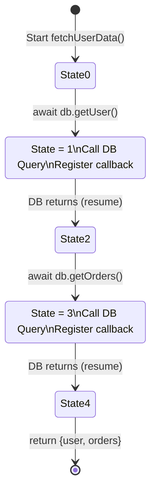
```mermaid
stateDiagram-v2
    [*] --> State0: Start fetchUserData()
    State0 --> State1: await db.getUser()
    State1: State = 1\nCall DB Query\nRegister callback
    State1 --> State2: DB returns (resume)
    State2 --> State3: await db.getOrders()
    State3: State = 3\nCall DB Query\nRegister callback
    State3 --> State4: DB returns (resume)
    State4 --> [*]: return {user, orders}
```

### Code Transformation: Async/Await → State Machine

**Original async/await code:**
```javascript
async function fetchUserData(userId) {
    const user = await db.getUser(userId);     // State 0 → 1
    const orders = await db.getOrders(userId);  // State 2 → 3
    return { user, orders };                     // State 4
}
```

**Conceptual state machine transformation:**
```javascript
function fetchUserData(userId) {
    let state = 0;
    let user, orders;
    
    function step() {
        switch(state) {
            case 0:
                state = 1;
                db.getUser(userId).then(result => {
                    user = result;
                    step(); // Transition to next state
                });
                break;
            case 1:
                state = 2;
                db.getOrders(userId).then(result => {
                    orders = result;
                    step();
                });
                break;
            case 2:
                return { user, orders };
        }
    }
    return step();
}
```

> **Why `await` only works inside `async` functions:** The `async` keyword transforms the function into a state machine.

---

## Race Conditions & Shared State

### The Problem: Shared Memory

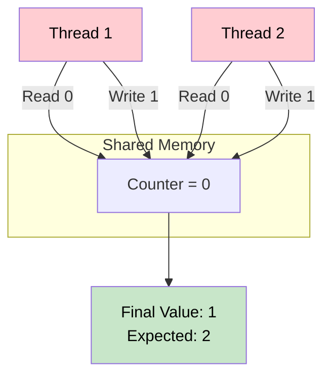
```mermaid
graph TD
    subgraph Shared Memory
        V[Counter = 0]
    end
    
    T1[Thread 1] -->|Read 0| V
    T2[Thread 2] -->|Read 0| V
    T1 -->|Write 1| V
    T2 -->|Write 1| V
    
    Result[Final Value: 1\nExpected: 2]
    
    V --> Result
    
    classDef line_1 color:#000,fill:#ffcdd2;
    classDef line_3 color:#000,fill:#c8e6c9;
    class T1,T2 line_1
    class Result line_3

```

### Lost Update Example

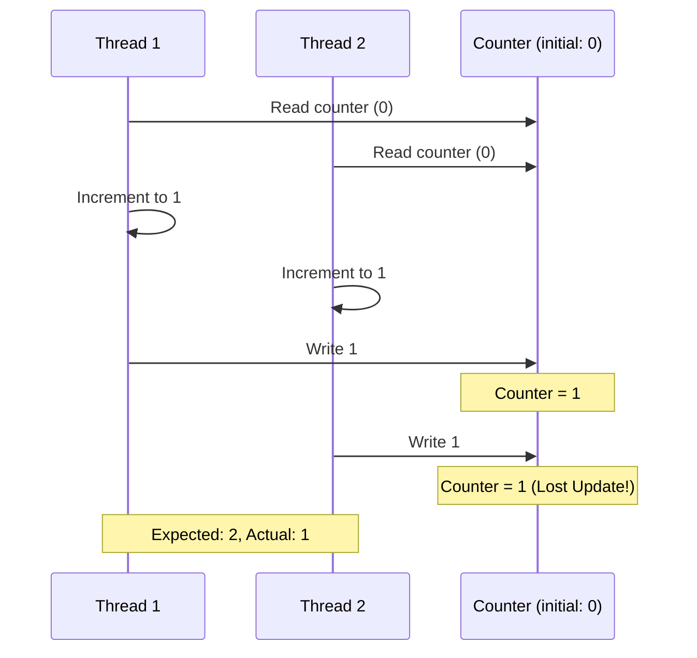
```mermaid
sequenceDiagram
    participant T1 as Thread 1
    participant T2 as Thread 2
    participant C as Counter (initial: 0)
    
    T1->>C: Read counter (0)
    T2->>C: Read counter (0)
    T1->>T1: Increment to 1
    T2->>T2: Increment to 1
    T1->>C: Write 1
    Note over C: Counter = 1
    T2->>C: Write 1
    Note over C: Counter = 1 (Lost Update!)
    Note over T1,T2: Expected: 2, Actual: 1
```

### Race Condition in Async/Await (Single Thread!)

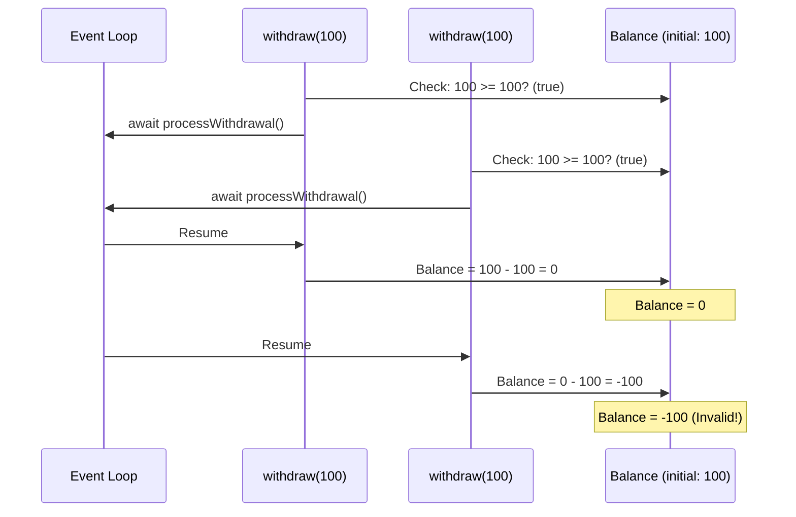
```mermaid
sequenceDiagram
    participant E as Event Loop
    participant W1 as withdraw(100)
    participant W2 as withdraw(100)
    participant B as Balance (initial: 100)
    
    W1->>B: Check: 100 >= 100? (true)
    W1->>E: await processWithdrawal()
    W2->>B: Check: 100 >= 100? (true)
    W2->>E: await processWithdrawal()
    E->>W1: Resume
    W1->>B: Balance = 100 - 100 = 0
    Note over B: Balance = 0
    E->>W2: Resume
    W2->>B: Balance = 0 - 100 = -100
    Note over B: Balance = -100 (Invalid!)
    
```

### Solutions to Race Conditions

#### 1. Locks/Mutexes

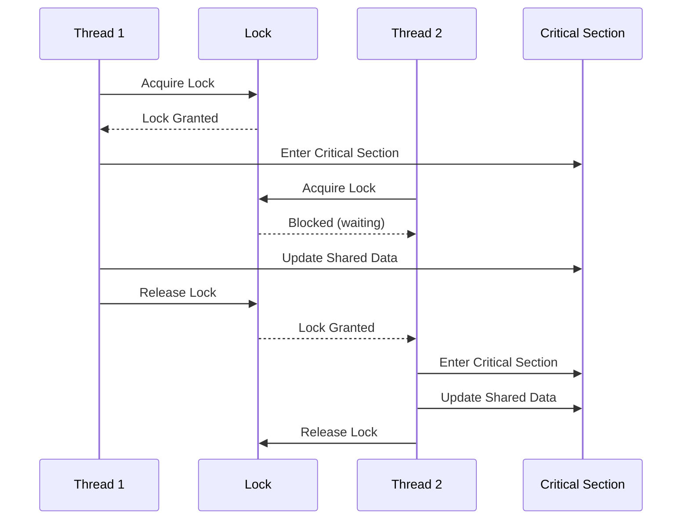
```mermaid
sequenceDiagram
    participant T1 as Thread 1
    participant L as Lock
    participant T2 as Thread 2
    participant C as Critical Section
    
    T1->>L: Acquire Lock
    L-->>T1: Lock Granted
    T1->>C: Enter Critical Section
    T2->>L: Acquire Lock
    L-->>T2: Blocked (waiting)
    T1->>C: Update Shared Data
    T1->>L: Release Lock
    L-->>T2: Lock Granted
    T2->>C: Enter Critical Section
    T2->>C: Update Shared Data
    T2->>L: Release Lock
```

**Python Example:**
```python
import threading

lock = threading.Lock()
counter = 0

def increment():
    global counter
    with lock:  # Critical section protected
        counter += 1
```

#### 2. Channels (Go-style Message Passing)

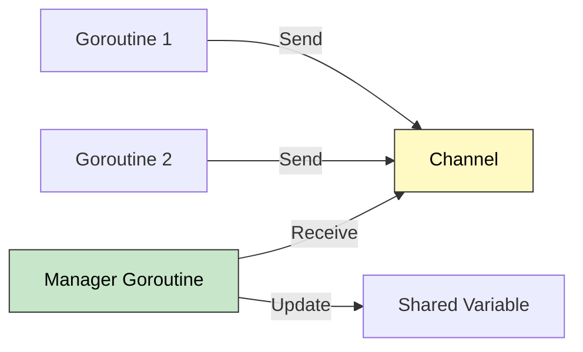
```mermaid
graph LR
    G1[Goroutine 1] -->|Send| CH[Channel]
    G2[Goroutine 2] -->|Send| CH
    GM[Manager Goroutine] -->|Receive| CH
    GM -->|Update| V[Shared Variable]
    
    style CH fill:#fff9c4,stroke:#333,color:#000
    style GM fill:#c8e6c9,stroke:#333,color:#000
```

> **Key Principle:** "Don't communicate by sharing memory; share memory by communicating." (Go philosophy)

---

## Summary

### Key Takeaways

```mermaid
mindmap
  root((Concurrency & Parallelism))
    Concurrency
      Dealing with multiple things
      Single core capable
      Event Loop
      Virtual Threads
      Prevents CPU waste during IO
    Parallelism
      Doing multiple things simultaneously
      Multiple cores required
      True simultaneous execution
      Best for CPU-bound
    IO-Bound
      70%+ of backend work
      Database calls
      API calls
      File operations
      Needs concurrency
    CPU-Bound
      Image processing
      Encryption
      Data transformation
      Needs parallelism
```

### When to Use What

| Scenario | Recommended Approach |
|----------|----------------------|
| High-concurrency web server | Event loop (Node.js) or Virtual threads (Go) |
| CPU-intensive processing | Multiple threads with parallelism |
| Mixed workload | Combination (Go routines handle both well) |
| Simple CRUD API | Any concurrency model works |

### Final Thoughts

> **The most important concept:** Understand the difference between **IO-bound** and **CPU-bound** workloads. Most backend applications are IO-bound, making concurrency (not parallelism) the primary concern.

- **Concurrency** = Structure your program to handle multiple things (event loops, virtual threads)
- **Parallelism** = Use multiple CPU cores for true simultaneous execution
- **IO-bound** = Waiting for external resources (use concurrency)
- **CPU-bound** = Crunching numbers (use parallelism)

---
*Based on "Backend from First Principles" lecture series*
