# Concurrency & Parallelism: IO Bound vs CPU Bound

## Table of Contents

1. [Why Concurrency Matters](#why-concurrency-matters)
2. [The Problem: IO Waiting](#the-problem-io-waiting)
3. [Concurrency vs Parallelism](#concurrency-vs-parallelism)
4. [IO-Bound vs CPU-Bound Workloads](#io-bound-vs-cpu-bound-workloads)
5. [Concurrency Models](#concurrency-models)
   - [Threading Model](#1-threading-model)
   - [Event Loop Model](#2-event-loop-model)
   - [Virtual Threads (Go Routines)](#3-virtual-threads-go-routines)
6. [How Async/Await Works](#how-asyncawait-works)
7. [Race Conditions & Shared State](#race-conditions--shared-state)
8. [Summary](#summary)

---

## Why Concurrency Matters

Every backend system must handle multiple things at once. A web server that can only process **one request at a time** is impractical for production where thousands of users may be sending requests simultaneously.

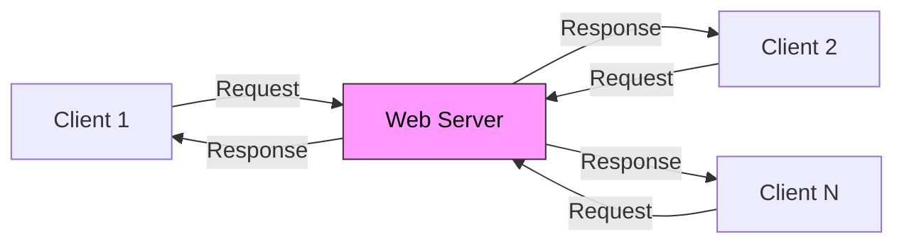

**Key Insight:** Understanding how servers process requests concurrently helps you:

- Debug performance issues
- Structure applications better
- Make informed architectural decisions

---

## The Problem: IO Waiting

### The Scenario

A typical API call involves:

1. Receiving a request
2. Making database queries (IO)
3. Calling external services (IO)
4. Returning a response

### The Waste of Synchronous Processing

```mermaid
gantt
    title Synchronous Processing (Single Request)
    dateFormat X
    axisFormat %L ms

    section Request A
    CPU Work (parse, validate) :a1, 0, 10
    Waiting for DB (IO) :a2, 10, 110
    CPU Work (process result) :a3, 110, 120
```

**The Numbers:**

- Modern CPU: ~3 billion instructions/second = 3 million instructions/millisecond
- Waiting 100ms for DB = 300 million wasted instructions
- Typical API: 3-5 DB queries + external calls
- Total IO wait: ~250ms vs CPU work: ~10ms
- **CPU is idle 95% of the time!**

### Typical Backend Request Lifecycle

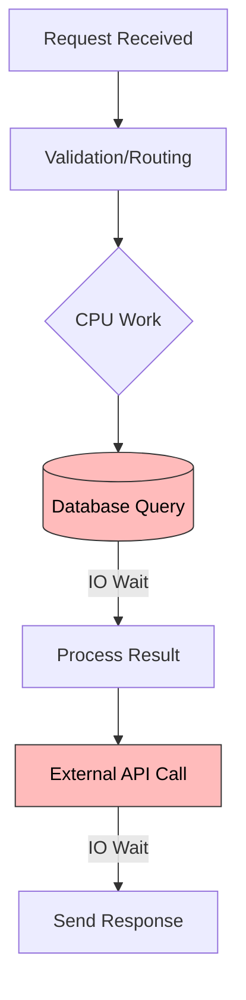

---

## Concurrency vs Parallelism

### Definitions

| Concept         | Definition                             | Hardware Required       |
| --------------- | -------------------------------------- | ----------------------- |
| **Concurrency** | Dealing with multiple things at once   | Can work on single core |
| **Parallelism** | Doing multiple things at the same time | Requires multiple cores |

### Visual Comparison

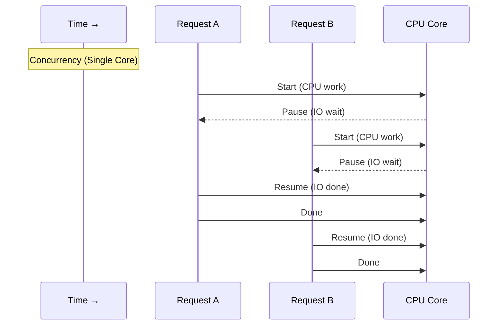

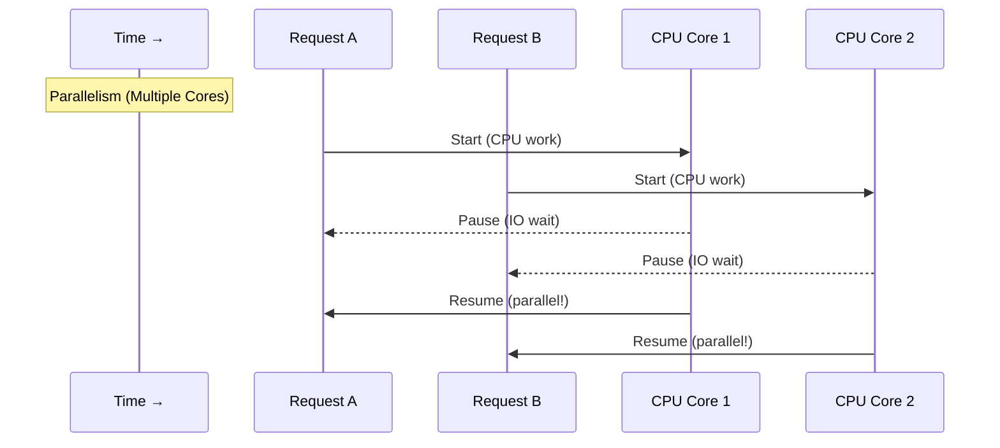

**Key Difference:**

- **Concurrency** = Structure of the program (start, pause, resume)
- **Parallelism** = Hardware execution (simultaneous execution)

---

## IO-Bound vs CPU-Bound Workloads

### IO-Bound Operations

Operations where CPU cannot do anything and must wait:

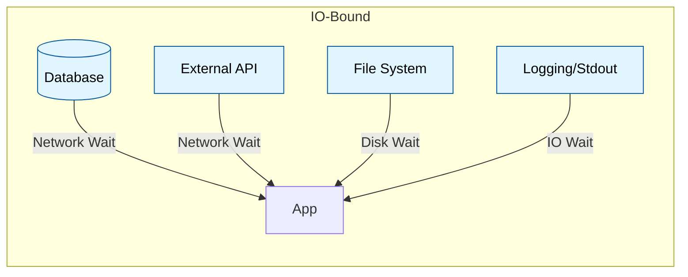

**Examples:**

- Database queries
- API calls to external services
- File system operations
- Network communication
- Standard input/output

> **Important:** Most backend applications are **70%+ IO-bound**. The bottleneck is almost always IO, not CPU.

### CPU-Bound Operations

Operations that require actual computation:

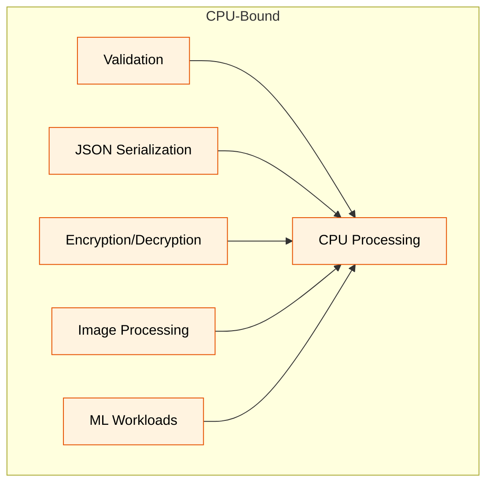

**Examples:**

- Data validation
- JSON serialization/deserialization
- Encryption (JWT verification)
- Image/video processing
- Matrix operations
- Machine learning workloads

### Concurrency Needs by Workload Type

| Workload Type | Primary Need | Best Approach                |
| ------------- | ------------ | ---------------------------- |
| **IO-Bound**  | Concurrency  | Event loop, Virtual threads  |
| **CPU-Bound** | Parallelism  | Multiple threads, Multi-core |
| **Mixed**     | Both         | Combination of both          |

---

## Concurrency Models

### 1. Threading Model

#### What is a Thread?

A thread is an independent piece of execution managed by the operating system.

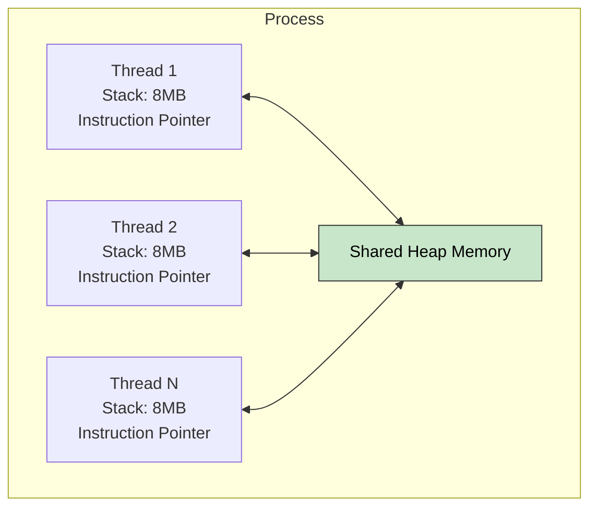

#### Thread Lifecycle

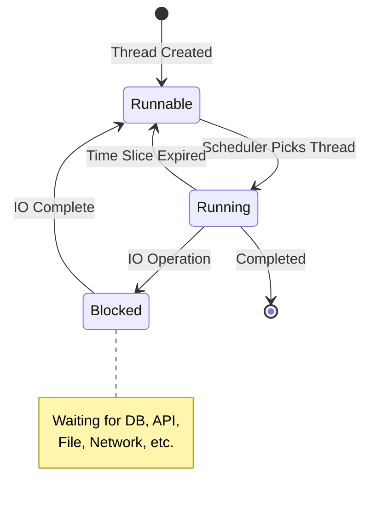

#### OS Scheduler (Preemptive Scheduling)

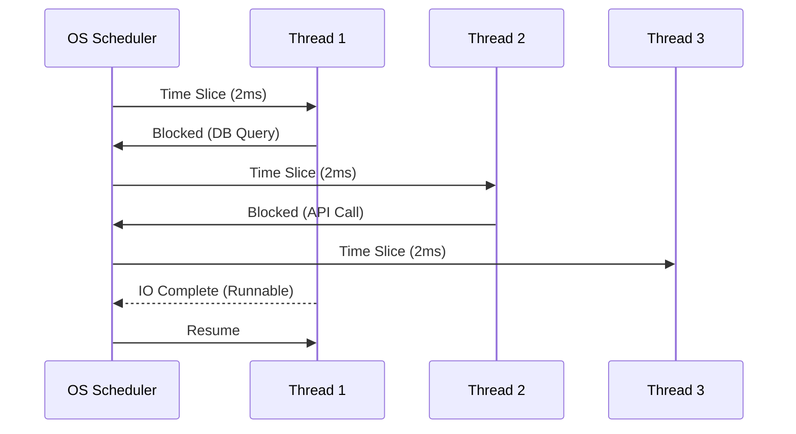

#### Thread Overhead

| Type               | Cost                                                |
| ------------------ | --------------------------------------------------- |
| **Memory**         | ~8MB stack per thread (even if mostly virtual)      |
| **Creation**       | System call to kernel, microseconds to milliseconds |
| **Context Switch** | 1-10 microseconds per switch                        |

**The Math:**

- 10,000 threads × 1MB = ~10GB memory just for thread stacks!
- Thousands of threads = massive context switching overhead

---

### 2. Event Loop Model

#### Architecture

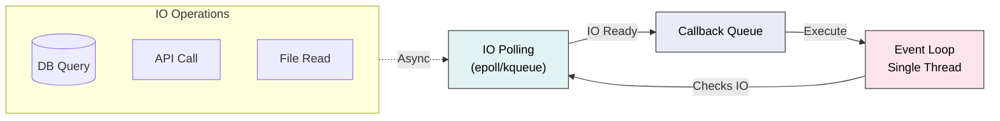

#### How It Works

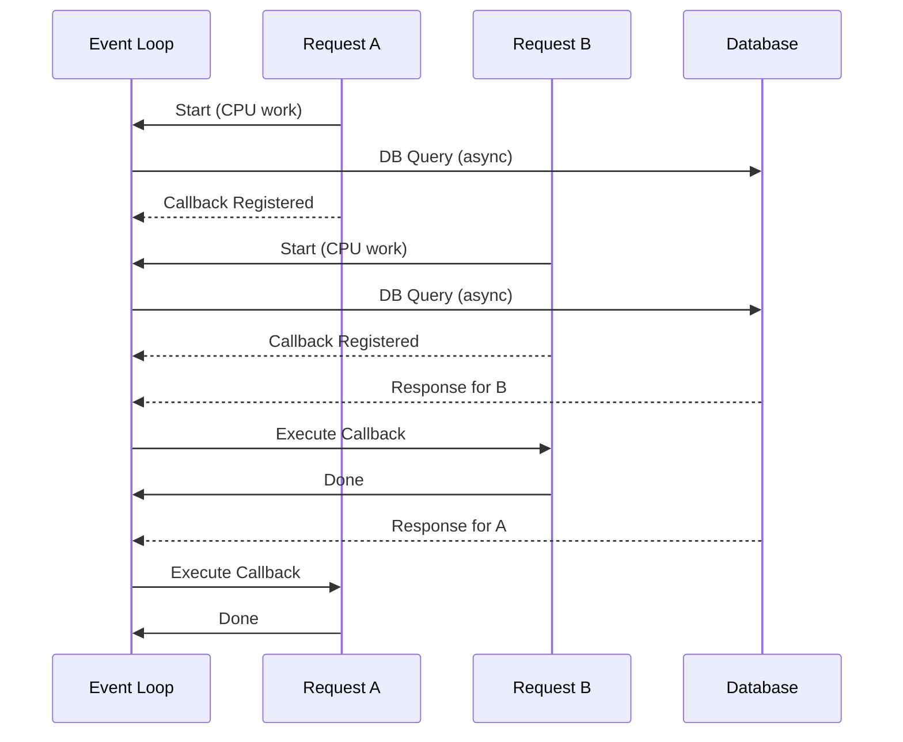

#### Event Loop Code Evolution

**Callback Style (Old):**

```javascript
db.query("SELECT * FROM users WHERE id = ?", [userId], function (err, result) {
  if (err) return handleError(err);
  // Process result
  sendResponse(result);
});
```

**Async/Await Style (Modern):**

```javascript
async function handleRequest(userId) {
  const user = await db.query("SELECT * FROM users WHERE id = ?", [userId]);
  return user;
}
```

> **Note:** `async/await` is syntactic sugar over callbacks. The state machine underneath is the same.

#### Event Loop Advantages & Trade-offs

| Advantages             | Trade-offs                       |
| ---------------------- | -------------------------------- |
| No context switching   | Must never block the loop        |
| Minimal memory usage   | Single CPU core utilization      |
| Efficient for IO-bound | CPU-bound tasks hurt performance |
| No thread overhead     |                                  |

---

### 3. Virtual Threads (Go Routines)

#### The Go Scheduler (M:N Model)

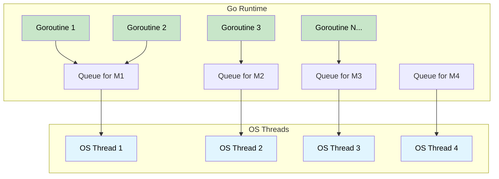

**Key Insight:** Many goroutines map to few OS threads (M:N scheduling)

#### How Go Handles Requests

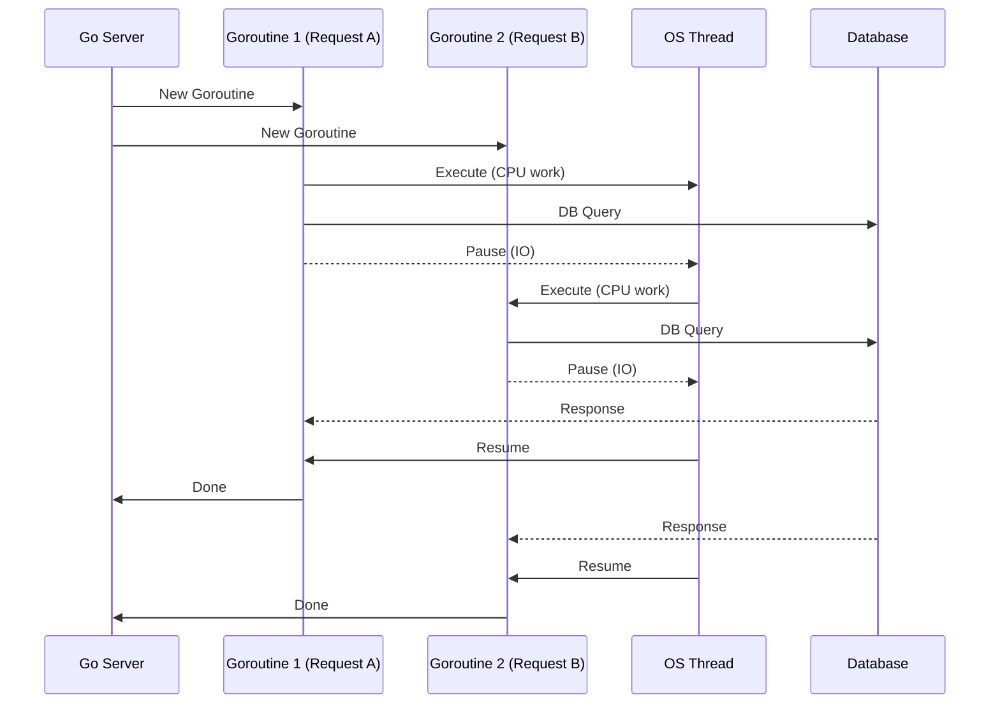

#### Go Code Example

```go
func handleRequest(w http.ResponseWriter, r *http.Request) {
    // This runs as a goroutine automatically
    user, err := db.Query("SELECT * FROM users WHERE id = ?", userId)
    if err != nil {
        http.Error(w, err.Error(), 500)
        return
    }
    json.NewEncoder(w).Encode(user)
}
```

#### Comparison: Threads vs Goroutines

| Aspect     | OS Threads        | Goroutines                   |
| ---------- | ----------------- | ---------------------------- |
| Memory     | ~8MB stack        | ~2KB initially               |
| Creation   | Kernel syscall    | Go runtime (cheap)           |
| Switching  | OS context switch | Pointer switch (lightweight) |
| Scheduling | OS scheduler      | Go runtime scheduler         |
| Max count  | Thousands         | Millions                     |

---

## How Async/Await Works

### Understanding State Machines

Before diving into async/await, you need to understand **state machines** — a fundamental concept in computer science.

**What is a State Machine?**
A state machine is a system that can be in one of several **states** at any given time. It transitions from one state to another based on specific events or conditions. Each state represents a distinct mode of operation with its own behavior.

**Real-World Example:**
Think of a traffic light:

- **States:** Red, Yellow, Green
- **Transitions:** Red → Green → Yellow → Red
- **Events:** Timer expires

In async/await, the state machine tracks:

- **Current state:** Which line of code are we on?
- **Paused state:** What data do we need to remember?
- **Next state:** What happens when the async operation completes?

### Why Async/Await Needs State Machines

Here's the core problem: **JavaScript (and most single-threaded languages) can only execute one thing at a time.** When you call an async function that awaits a result (like a database query), the function cannot actually "wait" — that would block the entire thread and freeze the application.

Instead, the `async` keyword tells the JavaScript compiler: **"Transform this function into a state machine that can pause and resume."**

**The Challenge:**
Consider this simple async function:

```javascript
async function fetchUserData(userId) {
  const user = await db.getUser(userId); // Line A: Make DB call
  const orders = await db.getOrders(userId); // Line B: Make another DB call
  return { user, orders }; // Line C: Return result
}
```

The function needs to:

1. Execute up to Line A
2. **Pause** and hand control back to the event loop (so other code can run)
3. Register a callback for when the DB response arrives
4. **Resume** at Line B when the callback fires
5. **Pause** again for the second DB call
6. **Resume** at Line C when done

**Without state machines, this is impossible.** The JavaScript engine uses a state machine internally to make this work.

### The State Machine Behind Async/Await

Here's how the compiler visualizes your function:

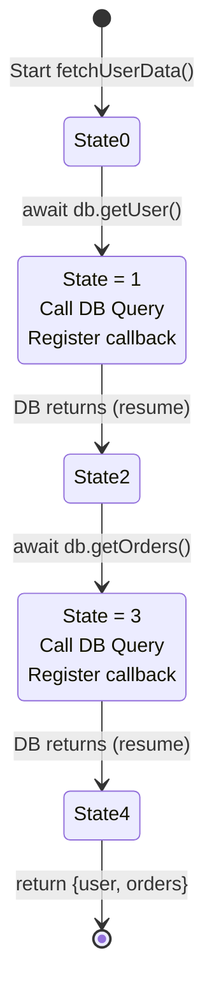

**What Each State Represents:**

- **State 0:** Initial state, start execution
- **State 1:** Paused, waiting for first DB response
- **State 2:** Resumed from state 1, now at line B
- **State 3:** Paused, waiting for second DB response
- **State 4:** Resumed from state 3, ready to return

### Code Transformation: Async/Await → State Machine

When you write async/await code, the compiler transforms it into a state machine under the hood. Let's see how:

**Original async/await code:**

```javascript
async function fetchUserData(userId) {
  const user = await db.getUser(userId); // State 0 → 1
  const orders = await db.getOrders(userId); // State 2 → 3
  return { user, orders }; // State 4
}
```

**What the compiler generates (conceptually):**

```javascript
function fetchUserData(userId) {
  let state = 0;
  let user, orders;

  function step() {
    switch (state) {
      case 0:
        // Execute the first part of the function
        state = 1; // Move to state 1
        // Call the async function and register callback
        db.getUser(userId).then((result) => {
          user = result; // Save the result
          step(); // Call step() to continue execution
        });
        break;

      case 1:
        // Resume after first await
        // Now execute the code between first and second await
        state = 2;
        // Call the second async function
        db.getOrders(userId).then((result) => {
          orders = result; // Save the result
          step(); // Call step() to continue
        });
        break;

      case 2:
        // Resume after second await
        // Execute the final part
        return { user, orders };
    }
  }

  return step(); // Start the state machine
}
```

**How Execution Flows:**

1. `fetchUserData(userId)` is called
2. The state machine starts at `state = 0`
3. It calls `db.getUser()` and registers a `.then()` callback
4. **Returns immediately** — other code can now run
5. When the DB responds, the callback fires and calls `step()` again
6. Now `state = 1`, so execution jumps to case 1
7. It calls `db.getOrders()` and registers another callback
8. **Returns immediately again**
9. When the second DB responds, the callback fires again
10. Now `state = 2`, so it executes the return statement

**Key Insight:** The state machine uses **callbacks internally**. `async/await` is just syntactic sugar that makes it look like you're writing synchronous code, but underneath it's using the callback-based event loop.

### Why `await` Only Works Inside `async` Functions

The `async` keyword enables the compiler to perform this state machine transformation. If you tried to use `await` in a regular function, the compiler wouldn't know how to transform it, so it's a syntax error.

```javascript
// ❌ ERROR: await outside async function
function fetchUser() {
  const user = await db.getUser(1);  // SyntaxError!
}

// ✓ CORRECT: await inside async function
async function fetchUser() {
  const user = await db.getUser(1);  // Works!
}
```

The `async` keyword tells the compiler: **"Transform this function into a state machine that can pause/resume at await points."**

### The Event Loop Integration

The state machine doesn't exist in isolation. It integrates with the event loop:

1. **Event Loop executes** your code until it hits an `await`
2. **Async operation** (DB call, API request, etc.) is initiated
3. **State is saved** (variables, current state number)
4. **Control returns** to the event loop
5. **Event loop runs other code** (other requests, timers, etc.)
6. **Async operation completes**, callback is added to callback queue
7. **Event loop picks up** the callback from the queue
8. **State machine resumes** at the next state, restoring all variables
9. **Execution continues** until the next await

---

### The State Machine Behind Async/Await


### Code Transformation: Async/Await → State Machine

**Original async/await code:**

```javascript
async function fetchUserData(userId) {
  const user = await db.getUser(userId); // State 0 → 1
  const orders = await db.getOrders(userId); // State 2 → 3
  return { user, orders }; // State 4
}
```

**Conceptual state machine transformation:**

```javascript
function fetchUserData(userId) {
  let state = 0;
  let user, orders;

  function step() {
    switch (state) {
      case 0:
        state = 1;
        db.getUser(userId).then((result) => {
          user = result;
          step(); // Transition to next state
        });
        break;
      case 1:
        state = 2;
        db.getOrders(userId).then((result) => {
          orders = result;
          step();
        });
        break;
      case 2:
        return { user, orders };
    }
  }
  return step();
}
```

> **Why `await` only works inside `async` functions:** The `async` keyword transforms the function into a state machine.

---

## Race Conditions & Shared State

### The Problem: Shared Memory

When multiple threads or async operations access and modify the same piece of memory without synchronization, **race conditions** occur. A race condition is a situation where the final result depends on the **timing and order** of thread execution, which is unpredictable and can vary from run to run.

**The Core Issue:**

1. Thread A reads a value from memory
2. Thread B reads the **same old value** (before Thread A writes back)
3. Both threads compute independently
4. Both write back their results
5. One write **overwrites** the other — data is lost

This is called a **lost update** or **write-write conflict**.

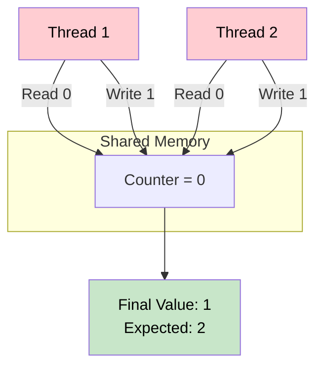

**Why This Happens:**
The operation `counter += 1` is **NOT atomic** (not a single indivisible unit). It consists of three steps:

1. **Read** the current value of `counter`
2. **Increment** the value in the CPU register
3. **Write** the new value back to memory

Between any of these steps, another thread can interrupt and access the same variable.

### Lost Update Example

This is the most common race condition. Let's trace through exactly what happens when two threads try to increment a counter simultaneously:

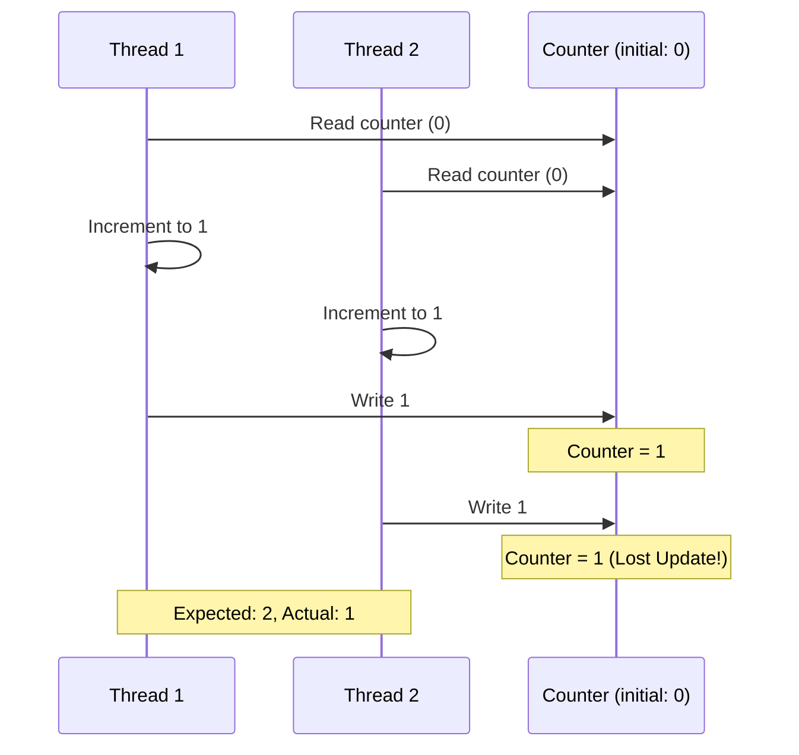

**What Went Wrong:**

- Thread 1 read the old value (0) and computed 1
- Thread 2 also read the old value (0) and computed 1
- Both threads wrote back 1
- Thread 1's work is completely lost because Thread 2's write overwrote it

**Why Expected 2?**
If the operations were truly sequential (one after another), we'd see:

1. T1 increments: 0 → 1
2. T2 increments: 1 → 2
3. Final result: 2 ✓

But because both read before either wrote, both saw 0, and we got 1.

**The Unpredictability:**
Sometimes the code works correctly by accident (if the timing happens to be sequential). Other times it fails. This makes race conditions especially dangerous because:

- They're hard to detect (tests may pass, production fails)
- They're non-deterministic (different every run)
- They cause data corruption, not immediate crashes

### Race Condition in Async/Await (Single Thread!)

**Important Realization:** Race conditions are NOT limited to multithreaded code! They occur whenever you have **concurrency** — even in single-threaded, event-loop-based systems like Node.js.

The problem occurs at **await** boundaries. When a function awaits an async operation, it yields control back to the event loop. Other code can run and potentially modify shared state before the awaited operation completes.

Consider a bank withdrawal system:

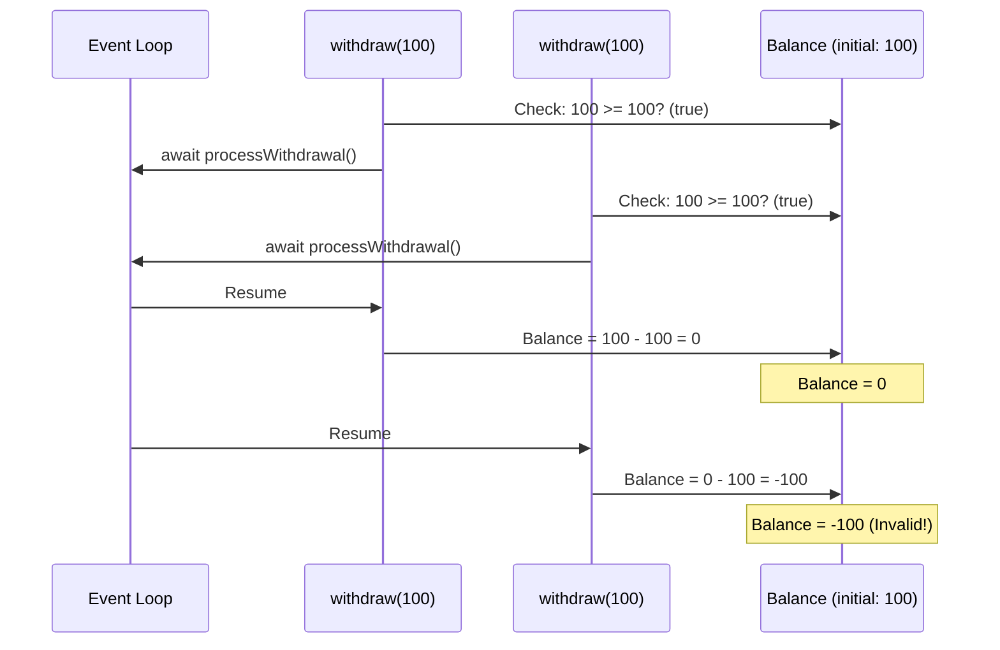

**The Sequence of Events:**

1. `withdraw(100)` checks the balance: 100 >= 100? ✓ Yes, proceed
2. Control yields to the event loop for processing
3. Another `withdraw(100)` request comes in and **also** checks: 100 >= 100? ✓ Yes
4. It also yields to the event loop
5. First withdrawal completes: balance becomes 0
6. Second withdrawal completes: balance becomes -100 (overdraft!)

**Why This Is Dangerous:**

- The check and the action are **not atomic**
- Between checking the balance and updating it, another operation can interfere
- This causes **insufficient funds** errors, **data corruption**, and **financial losses**

**The Key Lesson:** The problem isn't about threading. It's about **check-then-act** operations in concurrent systems. Anytime you have:

```
1. Read state
2. Make decision based on state
3. Yield/await (concurrency point)
4. Modify state based on decision from step 2
```

You have a potential race condition, regardless of threading model.

### Solutions to Race Conditions

#### 1. Locks/Mutexes

A **lock** (or **mutex**, short for "mutual exclusion") is a synchronization primitive that ensures only one thread can access a **critical section** of code at a time.

**How It Works:**

- Before entering a critical section, a thread must **acquire** the lock
- If the lock is already held by another thread, the thread **blocks** (waits)
- Once the critical section is complete, the thread **releases** the lock
- The next waiting thread can then acquire the lock

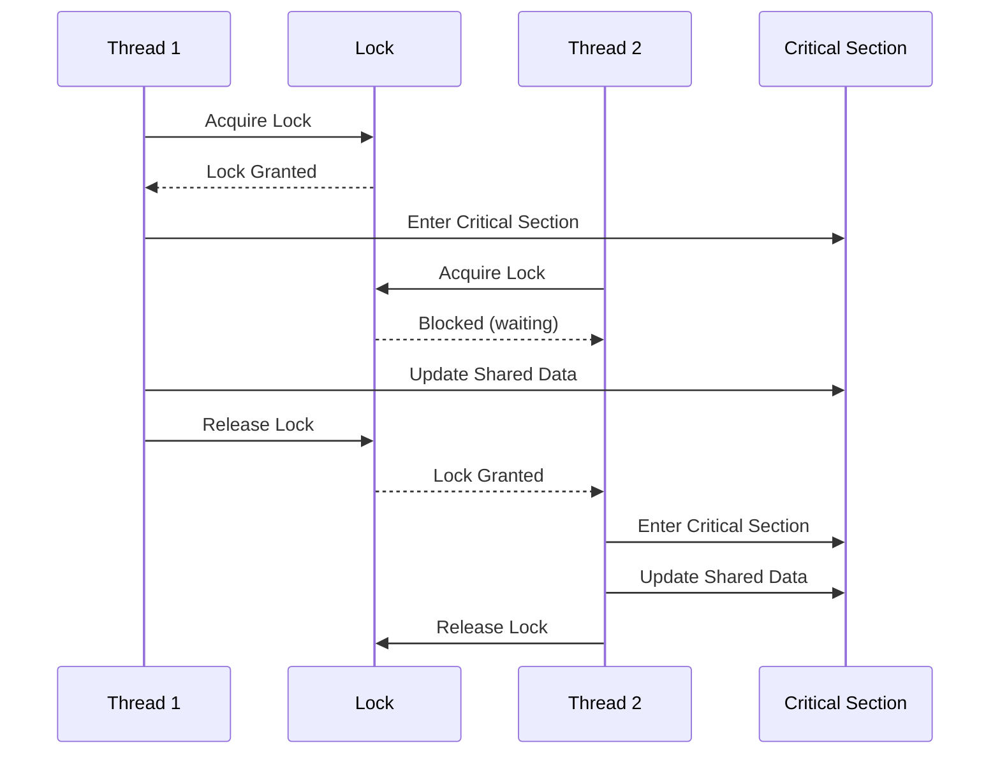

**Python Example:**

```python
import threading

lock = threading.Lock()
counter = 0

def increment():
    global counter
    with lock:  # Acquire lock, execute block, then release
        temp = counter      # Read
        temp += 1           # Increment
        counter = temp      # Write
    # Lock automatically released here

# Now both threads will increment properly
t1 = threading.Thread(target=increment)
t2 = threading.Thread(target=increment)
t1.start()
t2.start()
t1.join()
t2.join()
print(counter)  # Output: 2 (guaranteed!)
```

**Why This Works:**
The `with lock:` statement ensures that only one thread can execute the critical section at a time. The sequence becomes:

1. Thread 1 acquires lock, reads counter (0), increments to 1, writes back → counter = 1
2. Thread 1 releases lock
3. Thread 2 acquires lock, reads counter (1), increments to 2, writes back → counter = 2
4. Thread 2 releases lock

**Trade-offs:**

- ✓ Guarantees correctness and data consistency
- ✗ **Performance cost**: Threads must wait (blocking), causing slowdowns
- ✗ **Deadlock risk**: If not used carefully, threads can wait forever (e.g., A waiting for B's lock while B waits for A's)
- ✗ **Not suitable for high concurrency**: Many threads competing for one lock creates contention

#### 2. Channels (Go-style Message Passing)

Instead of sharing memory and protecting it with locks, **channels** take a different approach: **Pass data by sending messages between goroutines**. A channel is a queue that one goroutine can send to and another can receive from.

**The Philosophy:**

> "Don't communicate by sharing memory; share memory by communicating." — Go Proverb

This inverts the problem: rather than multiple goroutines accessing the same variable, one goroutine **owns** the variable and others send it messages requesting changes.

```mermaid
graph LR
    G1[Goroutine 1] -->|Send: increment| CH[Channel]
    G2[Goroutine 2] -->|Send: increment| CH
    GM[Manager Goroutine] -->|Receive| CH
    GM -->|Update| V[Shared Variable]

    style CH fill:#fff9c4,stroke:#333,color:#000
    style GM fill:#c8e6c9,stroke:#333,color:#000
```

**Go Example:**

```go
package main

import "fmt"

func main() {
    counter := 0
    commands := make(chan string)  // Channel for messages

    // Manager goroutine - owns the counter
    go func() {
        for cmd := range commands {
            if cmd == "increment" {
                counter++
            }
        }
    }()

    // Multiple goroutines send commands
    go func() { commands <- "increment" }()
    go func() { commands <- "increment" }()

    // Wait and print
    time.Sleep(10 * time.Millisecond)
    fmt.Println(counter)  // Output: 2 (guaranteed!)
    close(commands)
}
```

**Why This Works:**

- Only the manager goroutine directly accesses `counter`
- Other goroutines never touch it directly
- The channel acts as a synchronized queue of operations
- Operations are processed sequentially by the manager

**Advantages:**

- ✓ **No explicit locks** — cleaner, less error-prone code
- ✓ **Deadlock-resistant** — channels have clear send/receive semantics
- ✓ **Composable** — easy to build complex concurrent systems
- ✓ **Better for high concurrency** — lightweight and efficient

**When to Use:**

- Go routines (Go language) — channels are built-in and idiomatic
- When you have a clear producer-consumer pattern
- When operations must be ordered or synchronized

**Limitations:**

- Not available in all languages (Python, Java, JavaScript don't have native channels)
- Requires careful design of the message protocol
- Overkill for simple, low-concurrency scenarios

#### 3. Atomic Operations

**Atomic operations** are operations that execute completely without interruption. They're indivisible at the hardware level, so no partial state can be observed.

**Examples:**

- Incrementing a counter with `atomic.AddInt64()` in Go
- Compare-and-swap (CAS) operations
- Java's `AtomicInteger` class

These are useful for simple operations on single variables but don't scale to complex multi-step operations.

---

### Comparison: Solving Race Conditions

| Solution         | Best For                   | Pros                                             | Cons                                               |
| ---------------- | -------------------------- | ------------------------------------------------ | -------------------------------------------------- |
| **Locks**        | Complex critical sections  | Simple to understand, widely available           | Lock contention, deadlock risk, low performance    |
| **Channels**     | Producer-consumer patterns | Deadlock-resistant, composable, high concurrency | Language-specific, requires careful design         |
| **Atomic Ops**   | Single variable updates    | Lock-free, high performance                      | Limited to simple operations, hard to reason about |
| **Immutability** | Functional programming     | No mutation = no race                            | May require more memory, complex in OOP            |

### Practical Rules to Avoid Race Conditions

1. **Minimize Shared State**
   - Avoid shared mutable state whenever possible
   - Pass data through channels rather than sharing

2. **Protect All Access**
   - If state must be shared, **every** read and write must be protected
   - A single unprotected access can corrupt data

3. **Keep Critical Sections Small**
   - Don't hold locks longer than necessary
   - Reduces contention and deadlock risk

4. **Never Nest Locks** (without careful ordering)
   - Can lead to deadlocks if threads acquire them in different orders
   - Use a lock hierarchy if necessary

5. **Test with Concurrency**
   - Race conditions don't always show up in sequential tests
   - Use tools like Go's `-race` flag, ThreadSanitizer, or stress tests

6. **Prefer Async/Await Patterns**
   - In high-concurrency systems, async patterns are often safer than manual threading
   - Event loops naturally serialize access to callback queue

---

## Summary

### Key Takeaways

```mermaid
mindmap
  root((Concurrency & Parallelism))
    Concurrency
      Dealing with multiple things
      Single core capable
      Event Loop
      Virtual Threads
      Prevents CPU waste during IO
    Parallelism
      Doing multiple things simultaneously
      Multiple cores required
      True simultaneous execution
      Best for CPU-bound
    IO-Bound
      70%+ of backend work
      Database calls
      API calls
      File operations
      Needs concurrency
    CPU-Bound
      Image processing
      Encryption
      Data transformation
      Needs parallelism
```

### When to Use What

| Scenario                    | Recommended Approach                         |
| --------------------------- | -------------------------------------------- |
| High-concurrency web server | Event loop (Node.js) or Virtual threads (Go) |
| CPU-intensive processing    | Multiple threads with parallelism            |
| Mixed workload              | Combination (Go routines handle both well)   |
| Simple CRUD API             | Any concurrency model works                  |

### Final Thoughts

> **The most important concept:** Understand the difference between **IO-bound** and **CPU-bound** workloads. Most backend applications are IO-bound, making concurrency (not parallelism) the primary concern.

- **Concurrency** = Structure your program to handle multiple things (event loops, virtual threads)
- **Parallelism** = Use multiple CPU cores for true simultaneous execution
- **IO-bound** = Waiting for external resources (use concurrency)
- **CPU-bound** = Crunching numbers (use parallelism)

---

_Based on "Backend from First Principles" lecture series_
