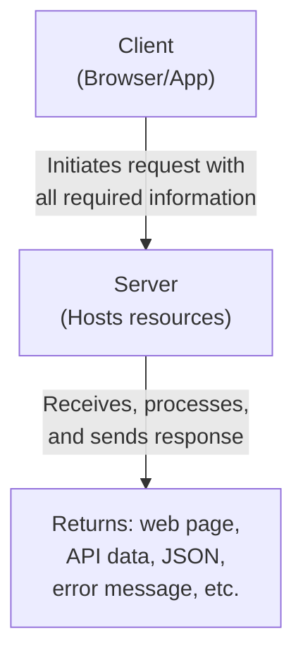
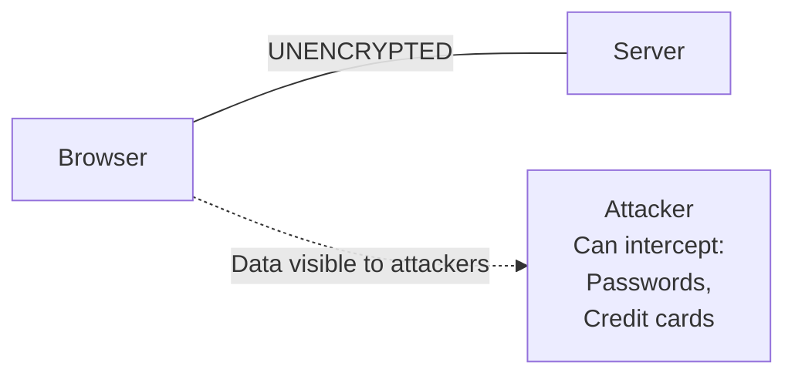
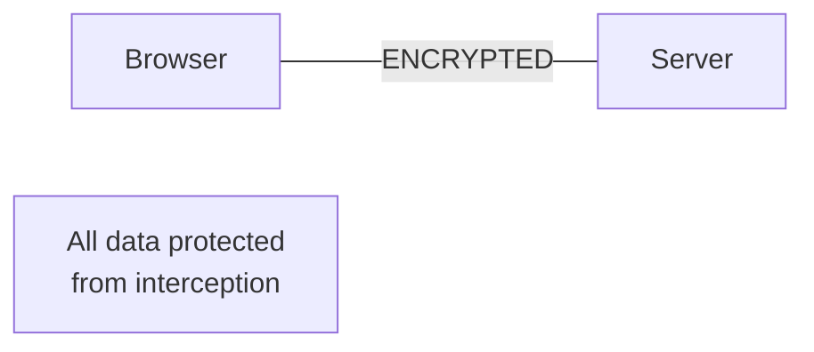

# HTTP Protocol: A Deep Dive into Backend Communication

## Table of Contents

1. [Introduction](#introduction)
2. [Core HTTP Concepts](#core-http-concepts)
3. [HTTP Messages](#http-messages)
4. [HTTP Headers](#http-headers)
5. [HTTP Methods](#http-methods)
6. [CORS (Cross-Origin Resource Sharing)](#cors)
7. [HTTP Status Codes](#http-status-codes)
8. [HTTP Caching](#http-caching)
9. [Content Negotiation](#content-negotiation)
10. [HTTP Compression](#http-compression)
11. [Persistent Connections](#persistent-connections)
12. [Large Requests and Responses](#large-requests-and-responses)
13. [HTTPS and TLS](#https-and-tls)

---

## Introduction

Backend is vast, and discussing every single component would take years. Therefore, we focus on topics used in **90% of codebases**. The **HTTP protocol** is the medium through which browsers communicate with servers—either sending or receiving data.

### Why HTTP?

While other protocols exist (WebSocket, gRPC), HTTP is one of the most widely used because it's:

- Simple and standardized
- Reliable for client-server communication
- Stateless and scalable

---

## Core HTTP Concepts

### 1. Statelessness

**Definition**: HTTP has no memory of past interactions.

**Key Points:**

- Each HTTP request carries all necessary information for the server to process it (headers, URLs, methods, etc.)
- After the server responds, it forgets about the request
- If a client makes another request, the server treats it as a new, unrelated event
- Each request must be **self-contained** with all necessary data (authentication tokens, session info, etc.)

**Example:**
When accessing a user profile, the client must provide credentials (cookies or tokens) on **every request** for the server to know which user is requesting the data.

#### Benefits of Statelessness

| Benefit             | Description                                                                     |
| ------------------- | ------------------------------------------------------------------------------- |
| **Simplicity**      | Server doesn't need to store session information, reducing complexity           |
| **Scalability**     | Easy to distribute requests across multiple servers; no session tracking needed |
| **Fault Tolerance** | If a server crashes, it doesn't affect client state                             |

#### State Management Workarounds

Developers often implement state management techniques to maintain continuity:

- **Cookies**: Store session data on client-side
- **Sessions**: Server-side session storage
- **Tokens**: JWT tokens for authentication

### 2. Client-Server Model

**Flow:**



**Important Rule:** Communication is **always initiated by the client** to get a response from the server.

---

## HTTP Messages

### Request Message Structure

```
GET /api/users HTTP/1.1
Host: api.example.com
User-Agent: Mozilla/5.0
Accept: application/json
Authorization: Bearer token123

{"data": "request body"}
```

### Response Message Structure

```
HTTP/1.1 200 OK
Content-Type: application/json
Content-Length: 256
Cache-Control: max-age=3600

[{"id": 1, "name": "John"}]
```

### Components Breakdown

| Component                 | Description                     | Example                         |
| ------------------------- | ------------------------------- | ------------------------------- |
| **Request Method**        | Action to perform               | GET, POST, PUT, DELETE          |
| **Resource URL**          | What is being requested         | `/api/users`                    |
| **HTTP Version**          | Protocol version                | HTTP/1.1                        |
| **Host**                  | Domain name                     | `api.example.com`               |
| **Headers**               | Metadata about request/response | `Authorization`, `Content-Type` |
| **Request/Response Body** | Data being sent/received        | JSON, HTML, binary data         |
| **Status Code**           | Result of request               | 200, 404, 500                   |

---

## HTTP Headers

### What Are Headers?

Headers are **key-value pairs** of metadata sent in requests or received in responses. They provide essential information about the request/response without altering the protocol.

### Real-World Analogy: Mailing a Parcel

When sending a parcel:

- **Inside parcel**: Actual content (like request body)
- **On parcel label**: Address, recipient, sender info (like headers)

The delivery person needs the label information to route the parcel efficiently. Similarly, headers provide routing and processing information without cluttering the message body.

### Types of Headers

#### 1. Request Headers

Sent by the client to provide information about the request:

| Header            | Purpose                | Example                              |
| ----------------- | ---------------------- | ------------------------------------ |
| `User-Agent`      | Identifies the client  | `Mozilla/5.0`, `Postman`, mobile app |
| `Authorization`   | Provides credentials   | `Bearer token123`                    |
| `Accept`          | Expected content type  | `application/json`, `text/html`      |
| `Accept-Language` | Preferred language     | `en-US`, `es-ES`                     |
| `Accept-Encoding` | Supported compressions | `gzip`, `deflate`                    |

#### 2. General Headers

Used in both requests and responses; contain metadata about the message:

| Header          | Purpose               | Example                         |
| --------------- | --------------------- | ------------------------------- |
| `Date`          | Message timestamp     | `Wed, 21 Oct 2025 07:28:00 GMT` |
| `Cache-Control` | Caching directives    | `max-age=3600`, `no-cache`      |
| `Connection`    | Connection management | `keep-alive`, `close`           |

#### 3. Representation Headers

Deal with the representation of the resource being transmitted:

| Header             | Purpose                       | Example                         |
| ------------------ | ----------------------------- | ------------------------------- |
| `Content-Type`     | Media type of body            | `application/json`, `text/html` |
| `Content-Length`   | Size of body in bytes         | `1024`                          |
| `Content-Encoding` | Applied encoding              | `gzip`, `deflate`               |
| `ETag`             | Unique identifier for caching | `"abc123"`                      |
| `Last-Modified`    | Last modification time        | `Wed, 21 Oct 2025 07:28:00 GMT` |

#### 4. Security Headers

Enhance request/response security:

| Header                                | Purpose                    | Impact                                 |
| ------------------------------------- | -------------------------- | -------------------------------------- |
| `Strict-Transport-Security (HSTS)`    | Force HTTPS only           | Prevents protocol downgrade attacks    |
| `Content-Security-Policy (CSP)`       | Restrict content sources   | Prevents XSS attacks                   |
| `X-Frame-Options`                     | Prevent iframe embedding   | Mitigates clickjacking                 |
| `X-Content-Type-Options`              | Prevent MIME type sniffing | Protects against MIME sniffing attacks |
| `Set-Cookie` with `HttpOnly`/`Secure` | Secure cookies             | Prevents cookie theft                  |

### Two Key Ideas About Headers

#### Idea 1: Extensibility

HTTP is highly extensible. Headers can be:

- Easily added or customized without altering the underlying protocol
- Defined for various purposes
- Adapted to new technologies and use cases

**Examples:**

- Security enhancements: `Strict-Transport-Security`, `Content-Security-Policy`
- Custom headers: `X-Custom-Header` for application-specific needs
- Content negotiation: `Accept`, `Accept-Language`, `Accept-Encoding`

#### Idea 2: Remote Control

HTTP headers act like a **remote control for the server**. They allow clients to:

- Send instructions or preferences
- Influence how the server responds
- Control request processing

**Examples:**

- **Content Negotiation**: Client requests HTML format → Server sends HTML
- **Caching Control**: `Cache-Control: max-age=3600` → Server specifies cache duration
- **Authentication**: `Authorization: Bearer token` → Server validates access

---

## HTTP Methods

### Purpose

HTTP methods define the **intent** of the interaction, providing semantic meaning to each action:

| Method      | Purpose              | Has Body | Idempotent | Use Case                       |
| ----------- | -------------------- | -------- | ---------- | ------------------------------ |
| **GET**     | Fetch data           | No       | Yes        | Retrieve resources             |
| **POST**    | Create data          | Yes      | No         | Submit forms, create resources |
| **PATCH**   | Partial update       | Yes      | No         | Update specific fields         |
| **PUT**     | Complete replacement | Yes      | Yes        | Replace entire resource        |
| **DELETE**  | Remove data          | No       | Yes        | Delete resources               |
| **OPTIONS** | Query capabilities   | No       | Yes        | CORS preflight requests        |

### Detailed Method Descriptions

#### GET

- Retrieves data from the server
- Should NOT modify anything on the server
- No request body
- **Idempotent**: Calling multiple times returns the same result

#### POST

- Creates new data on the server
- Includes a request body with data
- **Non-idempotent**: Each call may produce different results

**Example:** User creates a note → Each POST creates a new note

#### PATCH

- Updates specific fields of a resource
- **Selective replacement**: Only specified fields are updated
- Includes request body

**Example:** User updates only their name, leaving other fields unchanged

#### PUT

- Replaces entire resource with provided data
- **Complete replacement**: Overwrites all fields
- Includes request body
- **Idempotent**: Multiple calls produce same result

**Example:** Replace entire user profile with new data

**Rule of Thumb:** Always use PATCH unless you have a specific use case for PUT.

#### DELETE

- Removes a resource from the server
- **Idempotent**: Resource can only be deleted once; subsequent calls have same effect

#### OPTIONS

- Queries server capabilities for cross-origin requests
- Used in **CORS preflight requests** (browser-initiated, not manually called)
- No request body

### Idempotency Concept

**Idempotent Methods:** Can be called multiple times with the same result

- **GET**: Fetching returns same data
- **PUT**: Replacing with same data produces same result
- **DELETE**: Resource deleted once; repeated calls have no new effect

**Non-Idempotent Methods:** Different results on repeated calls

- **POST**: Each call creates new resource

---

## CORS

### What is CORS?

**Cross-Origin Resource Sharing (CORS)** is a browser security mechanism that controls how web applications interact with resources on different domains.

### Why CORS?

**Same-Origin Policy:**

- By default, browsers restrict web pages from making requests to different origins
- Origin = scheme + domain + port
- Security measure to prevent unauthorized data access

**CORS enables:**

- Controlled cross-origin requests
- Server-specified access policies
- Secure resource sharing between domains

### Same-Origin Policy Example

```
Frontend: http://example.com:5173
Backend:  http://api.example.com:3000

These are DIFFERENT origins because:
- Different domains (example.com vs api.example.com)
- Different ports (5173 vs 3000)

Browser blocks requests between them without CORS headers
```

### CORS Flow Types

#### Type 1: Simple Request

**What Makes a Request "Simple"?**

Simple requests are requests that pose minimal security risk. The browser allows these without preflight checks because:

- They only read data (GET) or basic form submissions (POST, HEAD)
- They use standard content types that browsers naturally use for forms
- They cannot carry sensitive authentication headers in dangerous ways

**Conditions for Simple Request:**

1. **Method**: GET, POST, or HEAD (basic, non-destructive operations)
2. **Headers**: Only simple headers—NO Authorization, NO custom headers
   - Simple headers: Accept, Accept-Language, Content-Language, etc.
   - Forbidden headers: Authorization, X-Custom-Header, etc.
3. **Content-Type**: Only form-based types that browsers use naturally
   - ✓ application/x-www-form-urlencoded (traditional form)
   - ✓ multipart/form-data (file uploads)
   - ✓ text/plain (plain text)
   - ✗ application/json (NOT simple, triggers preflight)

**Why These Restrictions?**

The browser allows simple requests without preflight because:

- GET requests don't modify anything (read-only, safe)
- POST with form data is how traditional HTML forms work (backward compatible)
- Without security headers, the request is less likely to bypass server protections

**Flow:**

```
1. Browser detects: "This is a simple request"
2. Browser adds Origin header automatically
   Origin: http://example.com:5173

3. Request sent directly to server (NO preflight)

4. Server receives and responds

5. Browser examines response headers:
   - If Access-Control-Allow-Origin is present and matches origin → Allow access
   - If header is missing or doesn't match → Block access (CORS error)
```

**Example: Allowed Simple Request**

```
Frontend Code:
fetch('http://api.example.com/api/data')  // GET with no special headers

Request Sent:
GET /api/data HTTP/1.1
Origin: http://example.com:5173
Accept: application/json

Response from Server:
HTTP/1.1 200 OK
Access-Control-Allow-Origin: http://example.com:5173
Content-Type: application/json

{"data": "some data"}

Result: ✓ Browser allows access, JavaScript can use response
```

**Example: Blocked Simple Request**

```
Frontend Code:
fetch('http://api.example.com/api/data')  // Same GET request

Request Sent:
GET /api/data HTTP/1.1
Origin: http://example.com:5173

Response from Server:
HTTP/1.1 200 OK
Content-Type: application/json

{"data": "some data"}

Result: ✗ Server didn't include CORS header
        ✗ Browser blocks response
        ✗ JavaScript error: "CORS error"
        ✗ Response data completely inaccessible
```

**Key Insight for Simple Requests:**

- Request is sent immediately (fast)
- Browser can only check CORS after seeing response (reactive, not preventative)
- Server cannot protect itself; response is already sent and might be processed by browser

#### Type 2: Preflight Request

**What Triggers Preflight?**

Preflight requests occur when a request is considered "complex" or potentially risky:

- The method is destructive (PUT, DELETE, PATCH) → could modify server data
- Special headers are included (Authorization, X-Custom) → carries sensitive info
- Content includes complex data (JSON) → structured data, not basic form

**Conditions Triggering Preflight:**

1. **Method is NOT GET, POST, or HEAD**
   - PUT (complete replacement) → dangerous, needs permission check
   - PATCH (partial update) → dangerous, needs permission check
   - DELETE (removal) → dangerous, needs permission check

2. **OR request includes non-simple headers**
   - Authorization headers (tokens, credentials) → sensitive
   - Custom headers (X-API-Key, X-Custom-Header) → application-specific
   - Others: Authorization, X-\*, etc.

3. **OR Content-Type is application/json**
   - JSON is structured, complex data format
   - Not a native browser form format
   - Requires explicit permission

**Why Preflight?**

Browser sends preflight to:

- Ask the server: "Before I send the real request, are you okay with it?"
- Check what methods and headers the server allows
- Prevent potentially dangerous cross-origin requests from reaching server
- Give server a chance to reject before the action occurs

**Flow (Detailed):**

```
Step 1: Browser detects complex request
        Frontend code tries: fetch(url, {method: 'PUT', headers: {Authorization: 'token'}})
        Browser thinking: "This is PUT + authorization header = complex/risky"

Step 2: Browser sends OPTIONS preflight first (automatic, you don't write this)
        OPTIONS /api/users/1 HTTP/1.1
        Origin: http://example.com:5173
        Access-Control-Request-Method: PUT     ← "I want to send PUT"
        Access-Control-Request-Headers: authorization  ← "I want to send this header"

Step 3: Server receives OPTIONS and decides
        Option A: "Yes, I allow PUT and authorization header"
        Option B: "No, I don't allow that"
        Server responds with headers describing what's allowed

Step 4: Browser checks server's response
        If server allowed PUT + authorization → proceed to actual request
        If server denied → stop, don't send actual request, throw CORS error

Step 5: Browser sends actual PUT request (if approved)
        PUT /api/users/1 HTTP/1.1
        Authorization: bearer-token
        Content-Type: application/json

        {"name": "Updated Name"}

Step 6: Server processes PUT and responds

Step 7: Browser checks response headers and allows access to JavaScript
```

**Preflight Request Example:**

```
Preflight (Browser asks permission):
OPTIONS /api/users/1 HTTP/1.1
Origin: http://example.com:5173
Access-Control-Request-Method: PUT
Access-Control-Request-Headers: authorization

Preflight Response (Server grants permission):
HTTP/1.1 204 No Content
Access-Control-Allow-Origin: http://example.com:5173
Access-Control-Allow-Methods: GET, POST, PUT, DELETE
Access-Control-Allow-Headers: authorization, content-type
Access-Control-Max-Age: 86400

Actual Request (Browser sends real request):
PUT /api/users/1 HTTP/1.1
Origin: http://example.com:5173
Authorization: bearer-token
Content-Type: application/json

{"name": "Updated Name"}

Actual Response:
HTTP/1.1 200 OK
Access-Control-Allow-Origin: http://example.com:5173
Content-Type: application/json

{"id": 1, "name": "Updated Name"}
```

**Key Response Headers Explained:**

| Header                         | Purpose                            | What It Means                    | Example                          |
| ------------------------------ | ---------------------------------- | -------------------------------- | -------------------------------- |
| `Access-Control-Allow-Origin`  | Which origins allowed to access    | The frontend domain allowed      | `http://example.com:5173` or `*` |
| `Access-Control-Allow-Methods` | Which HTTP methods allowed         | Methods the server supports      | `GET, POST, PUT, DELETE`         |
| `Access-Control-Allow-Headers` | Which headers allowed in requests  | Custom headers server accepts    | `authorization, content-type`    |
| `Access-Control-Max-Age`       | How long to cache preflight result | Avoid sending OPTIONS repeatedly | `86400` (24 hours)               |

**Understanding Access-Control-Max-Age:**

```
First PUT request at t=0:
  → Browser sends OPTIONS preflight
  → Server responds with Max-Age: 86400
  → Browser caches: "PUT allowed for 86400 seconds"

Second PUT request at t=30 minutes:
  → Browser checks cache: "Still fresh!"
  → Browser skips OPTIONS preflight (faster!)
  → Sends PUT request directly

Third PUT request at t=25 hours:
  → Browser checks cache: "Expired"
  → Browser sends OPTIONS preflight again
  → Repeats preflight process
```

**When Preflight Fails:**

```
Frontend tries: fetch(url, {method: 'DELETE'})

Browser sends: OPTIONS /api/users/1

Server responds WITHOUT proper CORS headers:
HTTP/1.1 200 OK
[No CORS headers]

Browser sees: "Server didn't allow this"
Browser action: Stops and throws CORS error
Actual DELETE: NEVER SENT (prevented by browser)
JavaScript error: "CORS error"
```

**Key Insight for Preflight:**

- Browser sends OPTIONS first (preventative, not reactive)
- Dangerous requests checked BEFORE being sent to server
- Server can reject risky requests before they execute
- Safer than simple requests because server gets to approve first

### Real-World Demo: Putting It All Together

**Scenario Setup:**

- Frontend app: http://localhost:5173 (React app on port 5173)
- Backend API: http://localhost:3000 (Node/Express server on port 3000)
- These are different origins (different ports)

**Example 1: Simple Request (No Preflight)**

```
STEP 1: Frontend sends GET request
Code: fetch('http://localhost:3000/api/users')

STEP 2: Browser intercepts, adds Origin
GET /api/users HTTP/1.1
Host: localhost:3000
Origin: http://localhost:5173
Accept: application/json

STEP 3: Backend receives and responds
HTTP/1.1 200 OK
Access-Control-Allow-Origin: http://localhost:5173
Content-Type: application/json

[{"id": 1, "name": "John"}]

STEP 4: Browser checks response
✓ Origin matches Access-Control-Allow-Origin
✓ Simple GET request
✓ Browser permits JavaScript access

STEP 5: JavaScript receives data
const data = await fetch(...).then(r => r.json())
// data = [{"id": 1, "name": "John"}]
```

**Example 2: Preflight Request (DELETE with custom header)**

```
STEP 1: Frontend sends DELETE request with authorization
Code: fetch('http://localhost:3000/api/users/1', {
  method: 'DELETE',
  headers: {Authorization: 'Bearer token123'}
})

STEP 2: Browser detects: DELETE method + Authorization header
Browser thinking: "This is complex! Need preflight first"

STEP 3: Browser sends OPTIONS preflight automatically
OPTIONS /api/users/1 HTTP/1.1
Host: localhost:3000
Origin: http://localhost:5173
Access-Control-Request-Method: DELETE
Access-Control-Request-Headers: authorization

STEP 4: Backend receives OPTIONS and responds
HTTP/1.1 204 No Content
Access-Control-Allow-Origin: http://localhost:5173
Access-Control-Allow-Methods: GET, POST, PUT, DELETE
Access-Control-Allow-Headers: authorization, content-type
Access-Control-Max-Age: 86400

STEP 5: Browser checks preflight response
✓ DELETE is in Access-Control-Allow-Methods
✓ authorization is in Access-Control-Allow-Headers
✓ Preflight passed! Proceed to actual request

STEP 6: Browser sends actual DELETE request
DELETE /api/users/1 HTTP/1.1
Host: localhost:3000
Origin: http://localhost:5173
Authorization: Bearer token123

STEP 7: Backend receives DELETE and processes
HTTP/1.1 204 No Content
Access-Control-Allow-Origin: http://localhost:5173

STEP 8: Browser permits JavaScript to know request succeeded
// Request completes without CORS error
```

**Example 3: Preflight FAILS (Server rejects)**

```
STEP 1: Frontend sends PUT with custom header
Code: fetch('http://localhost:3000/api/data', {
  method: 'PUT',
  headers: {'X-API-Key': 'my-secret-key'}
})

STEP 2: Browser detects: PUT + custom header → need preflight

STEP 3: Browser sends OPTIONS
OPTIONS /api/data HTTP/1.1
Origin: http://localhost:5173
Access-Control-Request-Method: PUT
Access-Control-Request-Headers: x-api-key

STEP 4: Backend is not configured for CORS
Backend responds WITHOUT CORS headers:
HTTP/1.1 200 OK
Content-Type: text/plain

OK

STEP 5: Browser checks preflight response
✗ No Access-Control-Allow-Origin header
✗ No Access-Control-Allow-Methods header
✗ Preflight FAILED!

STEP 6: Browser STOPS everything
✗ Does NOT send actual PUT request
✗ Throws CORS error to JavaScript
✗ No network request to server

Browser console error:
"Access to XMLHttpRequest at 'http://localhost:3000/api/data'
from origin 'http://localhost:5173' has been blocked by CORS policy"

JavaScript receives error, not successful response
```

**Key Differences Highlighted:**

| Aspect                        | Simple Request                              | Preflight Request                        |
| ----------------------------- | ------------------------------------------- | ---------------------------------------- |
| **When Used**                 | GET, POST, HEAD with basic headers          | PUT, DELETE, PATCH or with Authorization |
| **Preflight Sent?**           | NO                                          | YES (OPTIONS first)                      |
| **Request Immediately Sent?** | YES                                         | NO (only if preflight passes)            |
| **CORS Check Timing**         | After request sent (reactive)               | Before request sent (preventative)       |
| **If CORS Headers Missing**   | Response received but JS blocked            | Request never sent                       |
| **Speed**                     | Faster (1 request)                          | Slower (2 requests minimum)              |
| **Safety**                    | Lower (dangerous requests can reach server) | Higher (server can reject first)         |

**Common CORS Error Messages & What They Mean:**

```
Error: "CORS error: The value of the 'Access-Control-Allow-Origin' header
is 'http://example.com' which does not match the supplied origin"
→ Server only allows example.com, but you're from different domain

Error: "CORS error: Response to preflight request doesn't pass access
control check: The value of the 'Access-Control-Allow-Methods' header
is 'GET, POST' which does not include the requested method 'DELETE'"
→ Server didn't allow DELETE method in preflight response

Error: "CORS error: Response to preflight request doesn't pass access
control check: The value of the 'Access-Control-Allow-Headers' header
is 'content-type' which does not include the requested header 'authorization'"
→ Server didn't allow Authorization header in preflight response
```

---

## HTTP Status Codes

### Purpose

HTTP status codes communicate the result of a request in a standardized way:

- Quickly inform whether request succeeded, failed, or needs action
- Help clients handle errors with specific codes
- Enable consistency across all web services regardless of language/platform

### Status Code Categories

| Code Range | Category      | Meaning                   |
| ---------- | ------------- | ------------------------- |
| **1xx**    | Informational | Request received, proceed |
| **2xx**    | Success       | Request successful        |
| **3xx**    | Redirection   | Further action needed     |
| **4xx**    | Client Error  | Client-side issue         |
| **5xx**    | Server Error  | Server-side issue         |

### 1xx - Informational Responses

| Code    | Name                | Use Case                                              |
| ------- | ------------------- | ----------------------------------------------------- |
| **100** | Continue            | Large uploads; client can send body after getting 100 |
| **101** | Switching Protocols | Protocol upgrade (e.g., HTTP → WebSocket)             |

### 2xx - Success Responses

| Code    | Name       | Meaning                | Use Case                             |
| ------- | ---------- | ---------------------- | ------------------------------------ |
| **200** | OK         | Request successful     | GET requests, successful operations  |
| **201** | Created    | Resource created       | POST requests, new form submissions  |
| **204** | No Content | Success but no content | DELETE requests, preflight responses |

**Examples:**

- **200 OK**: GET user returns user data
- **201 Created**: POST creates new resource
- **204 No Content**: DELETE removes resource; no data returned

### 3xx - Redirection Responses

| Code    | Name               | Meaning                               | Use Case                                                      |
| ------- | ------------------ | ------------------------------------- | ------------------------------------------------------------- |
| **301** | Moved Permanently  | Resource permanently moved            | Old URL `/user` → new URL `/person`; redirect future requests |
| **302** | Temporary Redirect | Resource temporarily at different URL | Campaign redirect; revert changes later                       |
| **304** | Not Modified       | Resource unchanged since last request | Caching; client uses cached version                           |

**Examples:**

- **301 Moved Permanently**: Backward compatibility when renaming routes
- **302 Temporary Redirect**: Time-limited redirects for campaigns
- **304 Not Modified**: Efficient caching using ETag headers

### 4xx - Client Errors

| Code    | Name               | Meaning                         | When to Use                                           |
| ------- | ------------------ | ------------------------------- | ----------------------------------------------------- |
| **400** | Bad Request        | Invalid request data            | Client sends wrong data type, missing required fields |
| **401** | Unauthorized       | Authentication failed           | Invalid/expired JWT token, missing credentials        |
| **403** | Forbidden          | Authenticated but no permission | User A trying to delete User B's resource             |
| **404** | Not Found          | Resource doesn't exist          | Wrong URL or deleted resource                         |
| **405** | Method Not Allowed | Invalid HTTP method             | PUT to endpoint that only accepts GET                 |
| **409** | Conflict           | Request conflicts with state    | Creating folder with duplicate name                   |
| **429** | Too Many Requests  | Rate limit exceeded             | Exceeding request limit (60 requests/second)          |

**Examples:**

- **400 Bad Request**: Expected number, got string
- **401 Unauthorized**: JWT token expired
- **403 Forbidden**: User lacks permission to delete resource
- **404 Not Found**: Requesting `/api/users/9999` that doesn't exist
- **429 Too Many Requests**: Client exceeds rate limit

### 5xx - Server Errors

| Code    | Name                  | Meaning                                      | Cause                                      |
| ------- | --------------------- | -------------------------------------------- | ------------------------------------------ |
| **500** | Internal Server Error | Unexpected server error                      | Unhandled exception, crashed process       |
| **501** | Not Implemented       | Feature not yet supported                    | Functionality planned but not available    |
| **502** | Bad Gateway           | Upstream server returned invalid response    | Reverse proxy/load balancer issue          |
| **503** | Service Unavailable   | Server temporarily unable to handle requests | Maintenance, high traffic, server down     |
| **504** | Gateway Timeout       | Upstream server didn't respond in time       | Reverse proxy waiting too long for backend |

**Examples:**

- **500 Internal Server Error**: Database connection fails, unhandled exception
- **502 Bad Gateway**: Nginx can't reach backend server
- **503 Service Unavailable**: Server maintenance or under heavy load

---

## HTTP Caching

### Purpose

HTTP caching stores copies of responses for reuse, reducing:

- Repeated requests to server
- Bandwidth usage
- Server load
- Page load times

### Caching Headers

| Header          | Purpose                                | Example                         |
| --------------- | -------------------------------------- | ------------------------------- |
| `Cache-Control` | Specifies cache duration               | `max-age=3600` (1 hour)         |
| `ETag`          | Unique identifier for resource version | `"abc123"`                      |
| `Last-Modified` | Last modification time                 | `Wed, 21 Oct 2025 07:28:00 GMT` |

### Deep Dive: Understanding ETag

**What is an ETag?**

ETag stands for **Entity Tag**—it's a unique identifier that represents a specific version of a resource. Think of it like a fingerprint:

- If resource content changes, the fingerprint changes
- If resource content stays the same, the fingerprint stays the same
- The fingerprint allows comparison without downloading the entire file

**How ETag Works:**

The server generates an ETag by:

1. Taking the resource content (e.g., entire JSON response)
2. Creating a hash or version string from it
3. Sending it in the `ETag` header

**Examples of ETag Generation:**

```
Content: {"id": 1, "name": "John", "age": 30}
Hash Algorithm: SHA-256 or similar
ETag: "33a64df551425fcc55e4d42a148795d9f25f89d4"

OR

Content: Same JSON
Version Numbering: v1, v2, etc.
ETag: "v1"

OR

Content: Same JSON
Timestamp Based: Generated from last modification
ETag: "1234567890"
```

**Real-World ETag Example:**

```
FIRST REQUEST (t=0):
Browser: GET /api/user HTTP/1.1

Server Response:
HTTP/1.1 200 OK
ETag: "abc123"
Cache-Control: max-age=3600
Content-Type: application/json

{"id": 1, "name": "John", "age": 30}

Browser Action:
✓ Stores response in cache
✓ Stores ETag: "abc123"
```

```
SECOND REQUEST (t=10 minutes, still within cache window):
Browser checking: "Is cached version still fresh?"
Cache-Control says: max-age=3600 (1 hour)
Cache is still valid!
→ Browser uses cached version immediately (NO network request)
```

```
THIRD REQUEST (t=1.5 hours, cache expired):
Browser thinking: "Cache expired, need fresh data"
Browser decision: "Let me check if content actually changed"
Browser sends:
GET /api/user HTTP/1.1
If-None-Match: "abc123"

Server receives request and ETag:
Server checks: "Does resource match ETag abc123?"
Check logic:
  - Calculate current ETag: "abc123" (no changes made)
  - Compare: "abc123" == "abc123" ✓ MATCH!
  - Conclusion: Content hasn't changed

Server Response (Efficient!):
HTTP/1.1 304 Not Modified
ETag: "abc123"

Browser action:
✓ Sees 304 (Not Modified)
✓ Uses cached version (still valid)
✓ No data transfer needed (only headers)
```

```
FOURTH REQUEST (t=2 hours, after content changed):
Browser sends:
GET /api/user HTTP/1.1
If-None-Match: "abc123"

Server receives request and checks ETag:
Server calculates current ETag: "xyz789" (content changed!)
Compare: "abc123" != "xyz789" ✗ MISMATCH!
Conclusion: Content has changed

Server Response (Sends new content):
HTTP/1.1 200 OK
ETag: "xyz789"
Content-Type: application/json

{"id": 1, "name": "John", "age": 31}  ← Age updated!

Browser action:
✓ Sees 200 (OK) with new data
✓ Updates cache with new content
✓ Updates stored ETag: "xyz789"
```

**Key Benefits of ETag:**

| Benefit                | Explanation                                               |
| ---------------------- | --------------------------------------------------------- |
| **Bandwidth Saving**   | If content unchanged, only headers sent (no body)         |
| **Smart Revalidation** | Checks if content REALLY changed before downloading       |
| **Accuracy**           | Works even if file modification time is identical         |
| **Perfect for APIs**   | Detects data changes at content level, not just timestamp |
| **Atomic Updates**     | Can prevent race conditions (exactly what changed)        |

**ETag vs Last-Modified: Key Difference**

```
Last-Modified (Time-Based):
- Compares: Is resource newer than cache?
- Problem: File might be touched/saved without content changing
- Problem: Server clock sync issues
- Drawback: Always sends full response if timestamp differs

ETag (Content-Based):
- Compares: Did content actually change?
- Advantage: Timestamp irrelevant
- Advantage: Only matters if bytes changed
- Advantage: Can send 304 even if time is newer
```

**Real Example - Why ETag Matters:**

```
Scenario: Database backed API

Request 1 at t=0:
GET /api/user/1
Response: 200 OK, ETag: "abc123", Last-Modified: 2024-01-01

Browser Cache: Stores ETag "abc123" and 2024-01-01 timestamp

Request 2 at t=1 hour (cache expired):
Browser sends: If-None-Match: "abc123", If-Modified-Since: 2024-01-01

WITHOUT ETag (using only Last-Modified):
Server checks: "Is file newer than 2024-01-01?"
Server result: No file touch/write since then
Response: 304 Not Modified ✓ (Correct!)

Request 3 at t=2 hours (different scenario):
Database record updated: name changed from "John" to "Johnny"
API re-serializes JSON (same schema, different data)
File's Last-Modified: 2024-01-01 (same, no file write)

Browser sends: If-Modified-Since: 2024-01-01

WITHOUT ETag:
Server checks: "Is file newer than 2024-01-01?"
Server result: File not touched, same timestamp
Response: 304 Not Modified ✗ (WRONG! Data changed but API cached old version!)

WITH ETag:
Server calculates new ETag: "xyz789" (different data = different hash)
Browser sends: If-None-Match: "abc123"
Server compares: "abc123" != "xyz789"
Response: 200 OK with new data ✓ (CORRECT!)
```

**Common ETag Strategies:**

```
Strategy 1: Hash-based (Most Common)
ETag = hash(response_body)
Pros: Detects any content change
Cons: Requires computing hash

Strategy 2: Version numbering
ETag = "v1", "v2", "v3"
Pros: Simple, fast
Cons: Manual version management

Strategy 3: Timestamp-based
ETag = last_modified_time
Pros: Simple
Cons: Doesn't detect content changes without file writes

Strategy 4: Content hash + version
ETag = "v1-abc123" (version + hash)
Pros: Best of both worlds
Cons: More complex
```

### Caching Flow

#### Initial Request (No Cache)

```
1. Client requests resource
   GET /api/data HTTP/1.1

2. Server responds with cache headers
   HTTP/1.1 200 OK
   Cache-Control: max-age=10
   ETag: "abc123"
   Last-Modified: Wed, 21 Oct 2025 07:28:00 GMT

   [Response body]

3. Browser stores response locally
```

#### Subsequent Request (Within Cache Window)

```
1. Browser checks: Is cached version fresh?
2. If yes: Use cached version (no network request)
3. If no: Send conditional GET request
```

#### Conditional GET Request (Cache Expired)

```
1. Client sends stored ETag and Last-Modified
   GET /api/data HTTP/1.1
   If-None-Match: "abc123"
   If-Modified-Since: Wed, 21 Oct 2025 07:28:00 GMT

2. Server checks: Has resource changed?

3a. If unchanged:
    HTTP/1.1 304 Not Modified
    [No response body]
    Browser: Use cached version

3b. If changed:
    HTTP/1.1 200 OK
    ETag: "xyz789"
    [New response body]
    Browser: Update cache with new data
```

### Caching Example Sequence

```
Request 1 (t=0s): Get data
Response: 200 OK, Cache-Control: max-age=10, ETag: "abc123"
Cache stores data until t=10s

Request 2 (t=5s): Get data again
Cache valid, use cached version (no network request)

Request 3 (t=15s): Get data again
Cache expired, send conditional request
If-None-Match: "abc123"

Response: 304 Not Modified
(Resource hasn't changed, use cache)

Update resource...

Request 4 (t=20s): Get data
Cache expired, send conditional request
If-None-Match: "abc123"

Response: 200 OK, ETag: "xyz789"
(Resource changed, update cache)
```

### Modern Caching Solutions

Traditional HTTP caching can be complex to implement. Modern alternatives:

- **React Query**: Client-side caching library
- **SWR**: Stale-while-revalidate strategy
- **Apollo Client**: GraphQL caching

These provide more control over when to cache and refetch data.

---

## Content Negotiation

### What is Content Negotiation?

A mechanism for clients and servers to agree on the best format to exchange data:

- Client indicates preferred format, language, encoding
- Server responds with compatible format or fallback
- Ensures both parties understand the data structure

### Types of Content Negotiation

#### 1. Media Type Negotiation

Client specifies desired format via `Accept` header:

```
Accept: application/json          # I want JSON
Accept: text/html                # I want HTML
Accept: application/xml          # I want XML
```

Server responds with matching `Content-Type`:

```
Content-Type: application/json
Content-Type: text/html
```

#### 2. Language Negotiation

Client specifies language via `Accept-Language` header:

```
Accept-Language: en-US          # English
Accept-Language: es-ES          # Spanish
Accept-Language: fr-FR          # French
```

Server responds in requested language:

```
Response: {"message": "Hello"}
Response: {"message": "Hola"}
```

#### 3. Encoding Negotiation

Client specifies supported compression via `Accept-Encoding` header:

```
Accept-Encoding: gzip           # Accept gzip compression
Accept-Encoding: deflate        # Accept deflate compression
Accept-Encoding: br             # Accept brotli compression
```

Server responds with applied encoding:

```
Content-Encoding: gzip
```

### Real-World Example

```
Request:
GET /api/data HTTP/1.1
Accept: application/json
Accept-Language: es-ES
Accept-Encoding: gzip

Response:
HTTP/1.1 200 OK
Content-Type: application/json
Content-Language: es-ES
Content-Encoding: gzip

[Gzip-compressed Spanish JSON data]
```

---

## HTTP Compression

### Purpose

Compression reduces response size, significantly improving:

- Transfer speed
- Bandwidth usage
- Load times

### Compression Example

**Without Compression:**

- File: 11,000 JSON entries
- Size: 26 MB
- Time: Slow download

**With Gzip Compression:**

- File: Same 11,000 JSON entries
- Size: 3.8 MB
- Reduction: ~85%
- Time: Significantly faster

### How It Works

```
1. Client specifies supported encodings
   Accept-Encoding: gzip, deflate

2. Server checks support
   If gzip supported:
     - Compresses response with gzip
     - Sends Content-Encoding: gzip header

3. Browser:
   - Receives compressed data
   - Automatically decompresses
   - User sees uncompressed content
```

### Common Compression Algorithms

| Algorithm       | Compression | Speed  | Browser Support        |
| --------------- | ----------- | ------ | ---------------------- |
| **gzip**        | Good        | Fast   | Excellent              |
| **deflate**     | Good        | Fast   | Good                   |
| **brotli (br)** | Better      | Slower | Good (modern browsers) |

---

## Persistent Connections

### HTTP 1.0: One Connection per Request

**Problem:**

- Each request opens a new TCP connection
- Each response closes the connection
- Establishing/closing connections is resource-intensive
- Slow performance

### HTTP 1.1: Persistent Connections (Keep-Alive)

**Solution:**

- Single TCP connection serves multiple requests/responses
- Connection stays open unless explicitly closed
- Significantly improves performance

#### Keep-Alive Headers

```
Connection: keep-alive               # Keep connection open
Connection: close                    # Close connection after response

Connection: keep-alive, timeout=5, max=100
# Timeout: close after 5 seconds of inactivity
# Max: allow 100 requests before closing
```

#### Benefits

- Reduces latency
- Saves resources (fewer connection setups)
- Improves throughput
- Better performance for multiple requests

#### Default Behavior

- **HTTP 1.1**: Persistent by default
- **HTTP 1.0**: Non-persistent by default
- Can be explicitly controlled with `Connection` header

---

## Large Requests and Responses

### Handling Large Requests (Client → Server)

#### Multipart Form Data

Used for uploading files or large binary data:

```
POST /upload HTTP/1.1
Content-Type: multipart/form-data; boundary=----WebKitFormBoundary7MA4YWxkTrZu0gW

------WebKitFormBoundary7MA4YWxkTrZu0gW
Content-Disposition: form-data; name="file"; filename="image.jpg"
Content-Type: image/jpeg

[Binary image data...]
------WebKitFormBoundary7MA4YWxkTrZu0gW--
```

**Key Components:**

- `boundary`: Delimiter separating parts
- Binary data transferred in **chunks**
- Each chunk separated by boundary marker

**Use Cases:**

- File uploads (images, videos, documents)
- Form submissions with files
- Large binary payloads

### Handling Large Responses (Server → Client)

#### Chunked Transfer Encoding

Server streams data to client in chunks:

```
Response Headers:
Content-Type: text/event-stream
Connection: keep-alive

Response Body:
[Chunk 1 data]
[Chunk 2 data]
[Chunk 3 data]
... (continues)
```

**Key Components:**

- `Connection: keep-alive`: Keep connection open
- `Content-Type: text/event-stream`: Indicates streaming
- Data sent continuously in chunks
- Client appends all chunks

**Use Cases:**

- Large file downloads
- Streaming video/audio
- Real-time data feeds
- Server-Sent Events (SSE)

**Size Comparison:**

- Regular response: 26 MB (entire file at once)
- Chunked response: Streamed in manageable pieces
- Benefits: Reduced memory usage, faster initial response

---

## HTTPS and TLS

### SSL/TLS History

#### SSL (Secure Sockets Layer) - Outdated

- Original encryption protocol for client-server communication
- Encrypts data in transit
- **Deprecated**: Replaced due to security vulnerabilities

#### TLS (Transport Layer Security) - Modern

- Modern replacement for SSL
- More secure with updated algorithms
- Continuously updated (TLS 1.2, TLS 1.3)
- Currently recommended: **TLS 1.3**

### How HTTPS Works

```
1. Client connects to server
2. TLS handshake establishes encrypted connection
3. Server provides certificate (authenticates identity)
4. Client verifies certificate
5. Symmetric encryption established
6. Data transmitted encrypted
```

### Benefits of HTTPS/TLS

| Benefit            | Description                                 |
| ------------------ | ------------------------------------------- |
| **Encryption**     | Data encrypted so attackers can't intercept |
| **Authentication** | Certificate verifies server identity        |
| **Integrity**      | Data can't be tampered with in transit      |
| **Protection**     | Prevents man-in-the-middle attacks          |

### Data Protection

**Without HTTPS:**



**With HTTPS:**



---

## Summary

### Key Takeaways

HTTP is built on fundamental principles:

1. **Statelessness**: Each request is independent and self-contained
2. **Client-Server Model**: Client initiates, server responds
3. **Request/Response Format**: Headers provide metadata, body contains data
4. **Methods**: Define intent (GET, POST, PUT, DELETE, etc.)
5. **Status Codes**: Standardized response outcomes
6. **Headers**: Extensible metadata for control and negotiation
7. **Caching**: Optimize performance by reusing responses
8. **Security**: CORS, HTTPS/TLS, security headers
9. **Compression**: Reduce payload size for faster transfer
10. **Streaming**: Handle large files efficiently

### For Backend Engineers

Understanding these concepts enables you to:

- Design robust APIs
- Handle errors gracefully
- Optimize performance
- Implement security measures
- Debug networking issues
- Make informed architectural decisions

---

## HTTP Versions Overview

| Version      | Key Features                                                        | Limitations                           |
| ------------ | ------------------------------------------------------------------- | ------------------------------------- |
| **HTTP 1.0** | One connection per request                                          | Inefficient, slow                     |
| **HTTP 1.1** | Persistent connections, chunked encoding                            | Head-of-line blocking in multiplexing |
| **HTTP 2.0** | Multiplexing, binary framing, header compression                    | Still has head-of-line blocking       |
| **HTTP 3.0** | Built on QUIC (UDP), faster connection, better packet loss handling | Newer, less universal support         |

---

## Conclusion

HTTP is the foundation of web communication. Mastering these concepts allows you to:

- Build efficient and secure web services
- Understand and debug network issues
- Implement best practices
- Make informed decisions about caching, compression, and security

Whether you're developing in Python, Go, Rust, JavaScript, or Ruby, these principles remain constant across all platforms and frameworks.
