# Routing in Backend APIs: A Complete Guide

## Table of Contents
1. [Introduction to Routing](#introduction-to-routing)
2. [Core Concepts](#core-concepts)
3. [Route Structure](#route-structure)
4. [Static Routes](#static-routes)
5. [Dynamic Routes](#dynamic-routes)
6. [Path Parameters](#path-parameters)
7. [Query Parameters](#query-parameters)
8. [Nested Routes](#nested-routes)
9. [Route Versioning and Deprecation](#route-versioning-and-deprecation)
10. [Catch-All Routes](#catch-all-routes)
11. [Best Practices](#best-practices)

---

## Introduction to Routing

### The Two Dimensions of HTTP Requests

In HTTP, every request has two critical dimensions:

| Dimension | Defines | Example |
|-----------|---------|---------|
| **Method (HTTP Verb)** | **WHAT** - The intent/action | GET, POST, PUT, DELETE |
| **Route (URL Path)** | **WHERE** - The destination/resource | `/api/users`, `/api/books` |

### What is Routing?

**Definition:** Routing is the process of mapping URL paths and HTTP methods to server-side logic (handlers).

**Purpose:** When a request arrives, the server:
1. Extracts the HTTP method and URL path
2. Matches them against defined routes
3. Finds the appropriate handler
4. Executes the business logic
5. Returns a response

### Real-World Example

```
GET /api/users → Get all users
POST /api/users → Create a new user
GET /api/users/123 → Get user with ID 123
DELETE /api/users/123 → Delete user with ID 123
```

---

## Core Concepts

### Method + Route = Unique Route Handler

The combination of HTTP method and route path creates a unique identifier:

```
GET + /api/books        → Handler A (Fetch all books)
POST + /api/books       → Handler B (Create new book)
GET + /api/users/123    → Handler C (Fetch user 123)
PUT + /api/users/123    → Handler D (Update user 123)
DELETE + /api/users/123 → Handler E (Delete user 123)
```

**Key Point:** Two requests with the same route but different methods map to **different handlers**.

### Route Matching Process

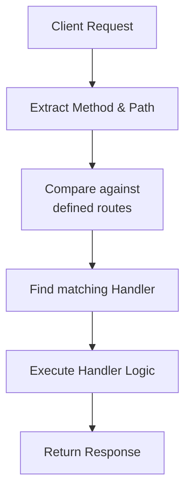

---

## Route Structure

### Anatomy of a Request

```
GET /api/search?query=some+value HTTP/1.1

↑    ↑   ↑      ↑     ↑
|    |   |      |     └─ Query Parameters
|    |   |      └─ Resource
|    |   └─ API namespace
|    └─ Base path
└─ HTTP Method
```

For better visualization:
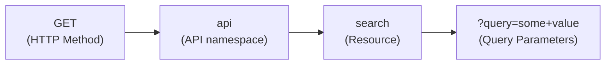

### Route Matching in Code

Most frameworks use similar routing conventions:

```javascript
// Pseudocode - applies to Express, Flask, Django, etc.

router.get('/api/users/:id', (request) => {
  // Handle GET /api/users/:id
});

router.post('/api/users', (request) => {
  // Handle POST /api/users
});

// The :id is a dynamic parameter placeholder
```

**Key Pattern:** The colon (`:`) prefix indicates a dynamic parameter across most frameworks:
- Java, Python, Node.js, Go, Rust
- All follow similar conventions

---

## Static Routes

### Definition

Static routes have no variable parameters in the path. The URL remains **constant** for each request.

### Characteristics

| Aspect | Details |
|--------|---------|
| **Format** | Fixed, unchanging string |
| **Example** | `/api/books`, `/api/users` |
| **Use Case** | Fetching or creating collections |
| **Response** | Same type of data for each request |

### Examples

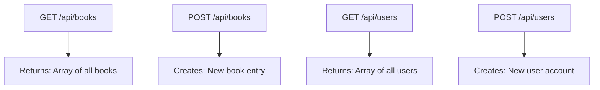

### Real-World Behavior

```
Request 1: GET /api/books
Response: [Book1, Book2, Book3, ...]

Request 2: GET /api/books
Response: [Book1, Book2, Book3, ...]

Request 3: POST /api/books (with new book data)
Response: [Book1, Book2, Book3, Book4, ...]
```

---

## Dynamic Routes

### Definition

Dynamic routes contain **variable parameters** that change with each request.

### When to Use

- Accessing specific resources by ID
- Operating on individual items
- Filtering by identifiers

### Example Pattern

```
GET /api/users/:id
└─ Get a specific user by ID

GET /api/users/123    → Get user with ID 123
GET /api/users/456    → Get user with ID 456
GET /api/users/789    → Get user with ID 789
```

### How It Works

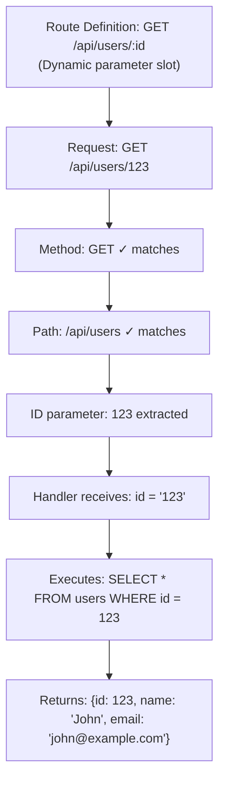

### Multiple Dynamic Parameters

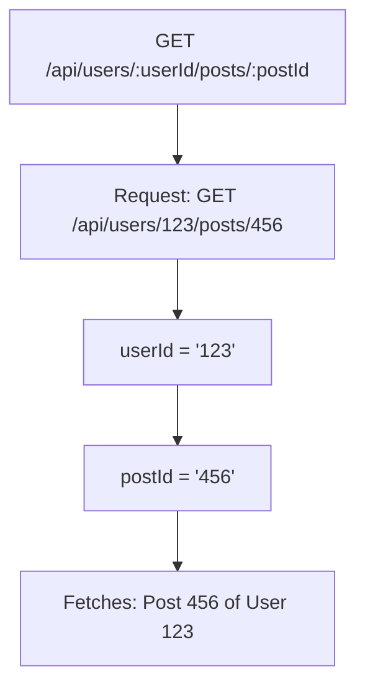

---

## Path Parameters

### Definition

Path parameters are variables embedded directly in the URL path, delimited by forward slashes.

### Syntax Convention

```
/api/users/:id
            ↑
        Path parameter (dynamic)

/api/users/:userId/posts/:postId
           ↑              ↑
       Path parameter  Path parameter
```

This is consistent across Node.js, Python, Go, Rust, Java, and most frameworks.

### Characteristics

| Aspect | Details |
|--------|---------|
| **Placement** | Between forward slashes in URL |
| **Format** | `:parameterName` |
| **Data Type** | String (everything is converted to string) |
| **Purpose** | Identify specific resources |
| **Semantic Meaning** | Clear, RESTful resource identification |

### Semantic Expression

Path parameters provide **human-readable meaning**:

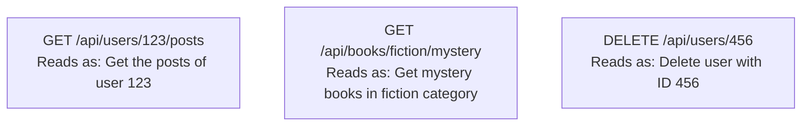

This is a core principle of **REST APIs** - self-documenting endpoints.

### Common Patterns

| Route Pattern | Meaning |
|---------------|---------|
| `/users/:id` | Get/Update/Delete specific user |
| `/posts/:id/comments/:commentId` | Get comment from specific post |
| `/categories/:category/items/:itemId` | Get item from specific category |
| `/organizations/:orgId/teams/:teamId/members/:memberId` | Deep nesting example |

---

## Query Parameters

### Definition

Query parameters are key-value pairs appended to the URL after a question mark (`?`). They provide additional filtering, pagination, or configuration options.

### Syntax

```
/api/search?query=value&filter=active&page=2
            ↑      ↑      ↑      ↑   ↑  ↑
            |      |      |      |   |  └─ Parameter value
            |      |      |      |   └─ Parameter name
            |      |      |      └─ Separator (&)
            |      |      └─ Parameter value
            |      └─ Parameter name
            └─ Query string indicator (?)
```

For a structured view:
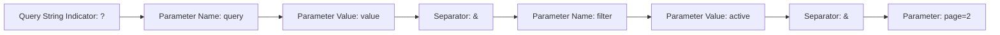

### Key Differences from Path Parameters

| Aspect | Path Parameters | Query Parameters |
|--------|-----------------|------------------|
| **Purpose** | Identify resource | Filter/configure response |
| **Location** | In URL path | After `?` |
| **Presence** | Required | Optional |
| **Example** | `/users/:id` | `?limit=10&page=2` |
| **Use Case** | Resource ID | Pagination, filtering, sorting |
| **HTTP Method** | All methods | Primarily GET |

### Why Query Parameters?

GET requests don't have a request body, so we need another way to pass filtering/configuration data:

```
❌ Bad approach (defeats semantic meaning):
GET /api/search/mystery/fiction/page/2

✅ Good approach (clear and semantic):
GET /api/search?query=mystery&category=fiction&page=2
```

### Common Use Cases

#### 1. Pagination

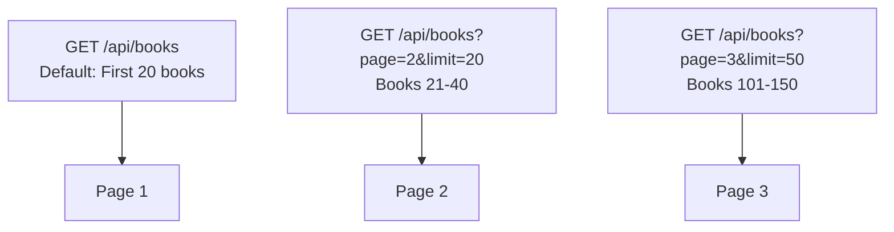

**Server Response:**
```json
{
  "data": [
    {id: 1, title: "Book 1"},
    {id: 2, title: "Book 2"},
    // ... 18 more books
  ],
  "metadata": {
    "currentPage": 2,
    "totalItems": 100,
    "totalPages": 5,
    "itemsPerPage": 20
  }
}
```

#### 2. Filtering

```
GET /api/products?category=electronics&inStock=true&minPrice=100&maxPrice=500
└─ Returns: Electronics in stock between $100-500
```

#### 3. Sorting

```
GET /api/books?sortBy=title&order=ascending
GET /api/books?sortBy=publishDate&order=descending
```

#### 4. Searching

```
GET /api/users?search=john&role=admin
└─ Search for users named "john" with admin role
```

#### 5. Field Selection

```
GET /api/users/123?fields=id,name,email
└─ Return only id, name, and email fields
```

### Multiple Query Parameters

```
GET /api/books?page=2&limit=20&sortBy=title&order=asc&genre=fiction

Query Parameters extracted:
├─ page: "2"
├─ limit: "20"
├─ sortBy: "title"
├─ order: "asc"
└─ genre: "fiction"
```

### Implementation Pattern

```
Route: GET /api/search
Query parameters: ?query=value

Server handling:
1. Extract query params from URL
2. Extract 'query' value
3. Perform search operation
4. Return filtered results
```

---

## Nested Routes

### Definition

Nested routes express hierarchical relationships between resources by nesting multiple path parameters and resource names.

### Purpose

Nested routes provide:
- **Semantic clarity**: Express parent-child relationships
- **Logical organization**: Mirror data structure
- **RESTful design**: Clear resource hierarchy

### Structure

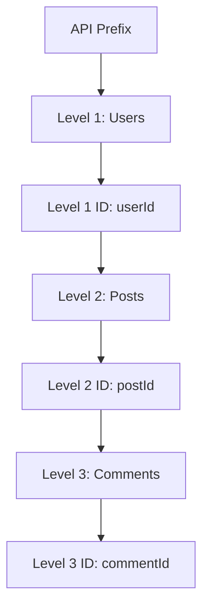

Path: `/api/users/:userId/posts/:postId/comments/:commentId`

### Hierarchy Levels

#### Level 1: Collection
```
GET /api/users
└─ Returns: All users

Response:
[
  {id: 1, name: "User 1"},
  {id: 2, name: "User 2"},
  ...
]
```

#### Level 2: Specific Resource
```
GET /api/users/123
└─ Returns: User with ID 123

Response:
{id: 123, name: "John Doe", email: "john@example.com"}
```

#### Level 3: Related Collection
```
GET /api/users/123/posts
└─ Returns: All posts by user 123

Response:
[
  {id: 1, title: "Post 1", userId: 123},
  {id: 2, title: "Post 2", userId: 123},
  ...
]
```

#### Level 4: Specific Related Resource
```
GET /api/users/123/posts/456
└─ Returns: Post 456 by user 123

Response:
{id: 456, title: "My Post", userId: 123, content: "..."}
```

### Deeper Nesting
```
GET /api/users/123/posts/456/comments/789
└─ Returns: Comment 789 on post 456 by user 123

Response:
{id: 789, text: "Great post!", postId: 456, userId: 123}
```

### Complete Example: Blog API

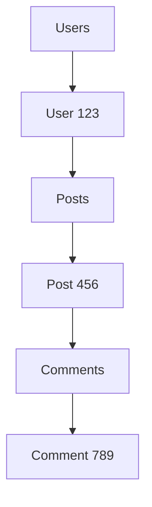

API Routes:
- GET /api/users → All users
- GET /api/users/123 → User 123
- GET /api/users/123/posts → Posts by user 123
- GET /api/users/123/posts/456 → Post 456 by user 123
- GET /api/users/123/posts/456/comments → Comments on post 456
- GET /api/users/123/posts/456/comments/789 → Comment 789

### Method Support at Each Level

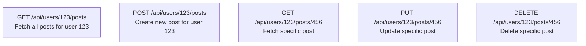

### When to Use Nesting

✅ **Good Use Cases:**
- Hierarchical resource relationships
- Parent-child resource dependencies
- 1-2 levels deep for clarity

⚠️ **Avoid Over-Nesting:**
- More than 3-4 levels becomes hard to read
- Consider alternative approaches for deep hierarchies

### Alternative for Deep Relationships

Instead of:
```
❌ GET /api/users/123/posts/456/comments/789/replies/1011/votes/2013
```

Use query parameters or separate endpoints:
```
✅ GET /api/comments/789/replies/1011?includeVotes=true
✅ GET /api/votes?replyId=1011
```

---

## Route Versioning and Deprecation

### Purpose

API versioning allows you to:
- Support multiple API versions simultaneously
- Introduce breaking changes gracefully
- Give clients time to migrate
- Maintain backward compatibility

### Why Versioning?

As APIs evolve, requirements change:

**Original API (V1):**
```json
{
  "id": 1,
  "name": "Product Name",
  "price": 29.99
}
```

**New Requirements (V2):**
```json
{
  "id": 1,
  "title": "Product Title",  // Changed from "name"
  "price": 29.99,
  "category": "Electronics"   // New field
}
```

### Versioning Strategies

#### 1. URL Path Versioning (Most Common)

```
GET /api/v1/products
GET /api/v2/products
GET /api/v3/products
```

**Advantages:**
- Clear and explicit
- Easy to understand
- Works with all HTTP methods
- Browser-friendly

**Disadvantages:**
- URL duplication
- More routes to maintain

#### 2. Header Versioning

```
GET /api/products
├─ Header: API-Version: 1

GET /api/products
├─ Header: API-Version: 2
```

#### 3. Query Parameter Versioning

```
GET /api/products?version=1
GET /api/products?version=2
```

### Implementation Example

```
// Framework pseudocode

// Version 1 Handler
router.get('/api/v1/products', (request) => {
  return {
    data: [
      {id: 1, name: "Product", price: 29.99},
      {id: 2, name: "Another", price: 49.99}
    ]
  };
});

// Version 2 Handler (updated)
router.get('/api/v2/products', (request) => {
  return {
    data: [
      {id: 1, title: "Product", price: 29.99, category: "Electronics"},
      {id: 2, title: "Another", price: 49.99, category: "Accessories"}
    ]
  };
});
```

### Deprecation Workflow

#### Phase 1: Release V2
```
GET /api/v1/products  → Works (supported)
GET /api/v2/products  → Works (new version)
```

#### Phase 2: Mark V1 as Deprecated
```
Response Headers:
Deprecation: true
Sunset: Sun, 31 Dec 2025 23:59:59 GMT
Link: </api/v2/products>; rel="successor-version"

Message: "V1 is deprecated. Please migrate to V2 by Dec 31, 2025"
```

#### Phase 3: Migration Window
Clients have time to update their code:
- 3-6 months typically
- Announced in advance
- Clear migration guide provided

#### Phase 4: Sunset V1
```
GET /api/v1/products  → 410 Gone (removed)
GET /api/v2/products  → Works
```

#### Phase 5: Promote V2 to V1 (Optional)
```
GET /api/v1/products  → Routes to V2 logic
GET /api/v2/products  → Still works
```

### Benefits

| Benefit | Description |
|---------|-------------|
| **Backward Compatibility** | Old clients continue working |
| **Clear Intent** | Version clearly indicates API iteration |
| **Controlled Migration** | Gradual transition path for clients |
| **Stability** | Breaking changes don't break existing apps |
| **Transparency** | Deprecation timeline is clear |

---

## Catch-All Routes

### Definition

Catch-all routes handle requests that don't match any defined routes. They typically return a "Not Found" error with a helpful message.

### Implementation

Most frameworks support wildcard routes:

```javascript
// Pseudocode

// Specific routes (defined first)
router.get('/api/users', ...);
router.get('/api/books', ...);
router.post('/api/users', ...);
// ... more specific routes

// Catch-all (defined last)
router.get('*', (request) => {
  return {
    status: 404,
    message: `Route ${request.path} not found`,
    availableRoutes: ['/api/users', '/api/books', ...]
  };
});
```

### Route Matching Order

Routes are matched **in order of specificity**:

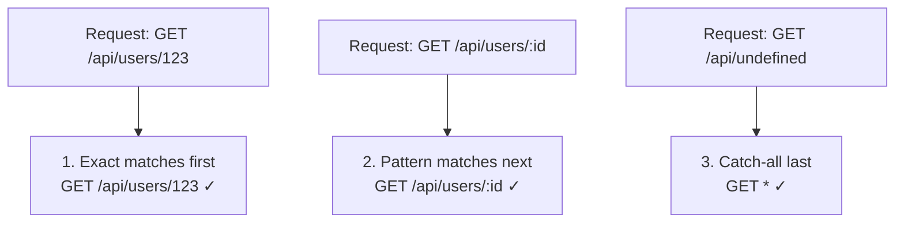

### Example Flow

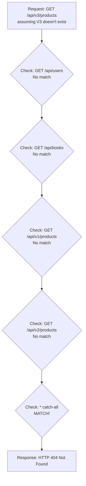

### Best Practices

**Helpful Error Response:**
```json
{
  "status": 404,
  "error": "Not Found",
  "message": "The route '/api/v3/products' does not exist",
  "suggestion": "Did you mean '/api/v2/products'?",
  "availableEndpoints": [
    "/api/v1/products",
    "/api/v2/products"
  ],
  "documentationUrl": "https://api.example.com/docs"
}
```

**What NOT to Do:**
```
❌ Empty response
❌ Null value
❌ Generic 500 error
❌ No helpful message
```

---

## Best Practices

### 1. Route Naming

✅ **Do:**
```
GET /api/users           → Clear, resource-oriented
POST /api/users
GET /api/users/:id
DELETE /api/users/:id
```

❌ **Don't:**
```
GET /api/getUsers        → Verb in URL (HTTP method already defines action)
POST /api/createUser
GET /api/getUser/:id
DELETE /api/removeUser/:id
```

### 2. Resource Hierarchy

✅ **Do:**
```
GET /api/users/:userId/posts/:postId
└─ Clear parent-child relationship
```

❌ **Don't:**
```
GET /api/posts/:postId
└─ Doesn't indicate which user's post
```

### 3. Consistency

✅ **Do:**
```
/api/users          (plural, collection)
/api/posts          (plural, collection)
/api/comments       (plural, collection)
```

❌ **Don't:**
```
/api/user           (singular)
/api/posts          (plural)
/api/comment        (singular)
```

### 4. Version in Path

✅ **Do:**
```
/api/v1/users
/api/v2/users
```

❌ **Avoid for versioning:**
```
/api/users/v1        (confusing - looks like a user ID)
```

### 5. Query Parameters for Filtering

✅ **Do:**
```
GET /api/books?genre=fiction&year=2023&limit=20
└─ Query params for filtering
```

❌ **Don't:**
```
GET /api/books/fiction/2023/limit/20
└─ Path params for filtering (defeats semantic meaning)
```

### 6. Pagination

✅ **Do:**
```
GET /api/users?page=2&limit=50
├─ Metadata response
├─ Includes: total, currentPage, totalPages
└─ Client can navigate pages
```

❌ **Don't:**
```
GET /api/users?skip=50&take=50
└─ Offset-based (less intuitive)
```

### 7. Sorting

✅ **Do:**
```
GET /api/books?sortBy=title&order=asc
GET /api/books?sortBy=publishDate&order=desc
```

### 8. Optional Parameters

✅ **Do - Make parameters optional with defaults:**
```
GET /api/books
├─ Default: page=1, limit=20, sortBy=id

GET /api/books?page=3&limit=50
├─ Override defaults
```

### 9. Nested Routes Depth

✅ **Do:**
```
/api/users/:id/posts          (2 levels - good)
/api/users/:id/posts/:postId  (3 levels - acceptable)
```

❌ **Don't:**
```
/api/users/:id/posts/:postId/comments/:commentId/replies/:replyId/votes/:voteId
(7 levels - too deep, use query params or separate endpoints)
```

### 10. Error Handling

✅ **Do - Return helpful error messages:**
```json
{
  "error": "Not Found",
  "message": "User with ID 999 does not exist",
  "statusCode": 404
}
```

❌ **Don't:**
```
null
{}
"Error"
```

---

## Summary: Routing Cheat Sheet

| Concept | Example | Purpose |
|---------|---------|---------|
| **Static Route** | `GET /api/books` | Fetch all resources |
| **Dynamic Route** | `GET /api/books/:id` | Fetch specific resource |
| **Path Parameter** | `/users/:userId` | Identify specific resource |
| **Query Parameter** | `?page=2&limit=20` | Filter, paginate, sort |
| **Nested Route** | `/users/:id/posts/:postId` | Express hierarchy |
| **Versioning** | `/api/v1/...`, `/api/v2/...` | Manage API changes |
| **HTTP Method** | GET, POST, PUT, DELETE | Define action |
| **Catch-All** | `*` | Handle unknown routes |

---

## Routing in Practice

### Complete API Example

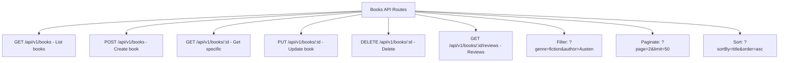

---

## Conclusion

Routing is fundamental to backend API design:

1. **Methods + Paths = Handlers**: Every combination is unique
2. **Semantic Clarity**: Routes should be self-documenting
3. **Resource-Oriented**: Use nouns, not verbs, for resources
4. **Consistency**: Follow conventions for maintainability
5. **Flexibility**: Use path params for identity, query params for filtering
6. **Evolution**: Use versioning for graceful API changes
7. **Error Handling**: Provide helpful messages for invalid routes

Master these routing concepts, and you'll be equipped to design and navigate any REST API backend codebase!

