# Serialization and Deserialization: Data Transmission Between Client and Server

## Table of Contents
1. [Introduction](#introduction)
2. [The Problem](#the-problem)
3. [The Solution: Serialization Standards](#the-solution-serialization-standards)
4. [Network Layers Overview](#network-layers-overview)
5. [Common Serialization Formats](#common-serialization-formats)
6. [JSON Format Deep Dive](#json-format-deep-dive)
7. [JSON Structure and Rules](#json-structure-and-rules)
8. [Real-World Data Flow](#real-world-data-flow)
9. [Backend Engineer Perspective](#backend-engineer-perspective)
10. [Summary](#summary)

---

## Introduction

### The Communication Challenge

In modern web applications, clients and servers constantly exchange data across networks. However, they face a fundamental problem:

**Different environments use different data types and languages.**

```
Client: JavaScript/React/Vue
        ↓
        [Communication]
        ↓
Server: Rust/Go/Python/Java
```

How do these incompatible systems understand each other?

### The Answer: Standardization

The solution is **serialization and deserialization** — converting data to a common, language-agnostic format that both parties can understand.

---

## The Problem

### Different Languages, Different Data Types

```javascript
// JavaScript Object
const user = {
  name: "John",
  age: 30,
  isActive: true,
  emails: ["john@example.com"]
};
```

```rust
// Rust Struct
struct User {
  name: String,
  age: i32,
  is_active: bool,
  emails: Vec<String>,
}
```

### The Core Challenge

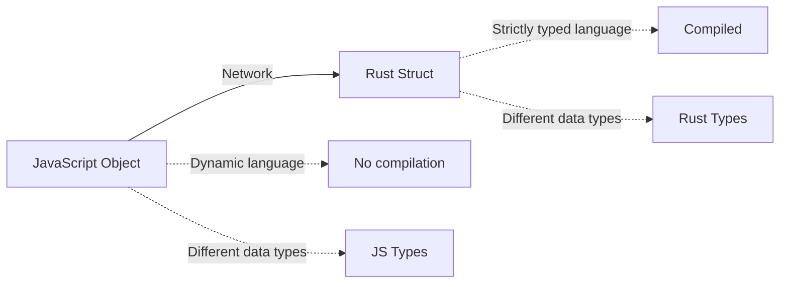

**How can a JavaScript object, sent from a browser, be understood by a Rust server?**

### Before Standardization

Without standards, each system would need:
- Custom translators for every language pair
- Complex encoding/decoding logic
- No guarantee of consistency
- Maintenance nightmare

---

## The Solution: Serialization Standards

### What is a Serialization Standard?

A **serialization standard** is an agreed-upon format that both client and server understand for exchanging data.

### How It Works

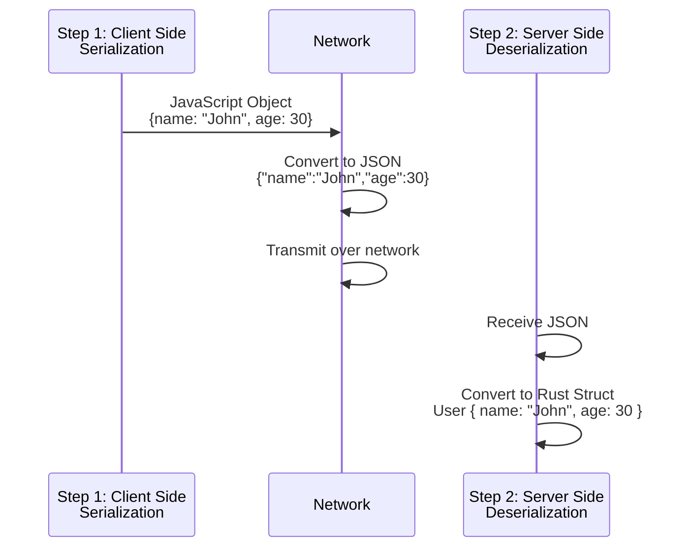

**Detailed Process:**

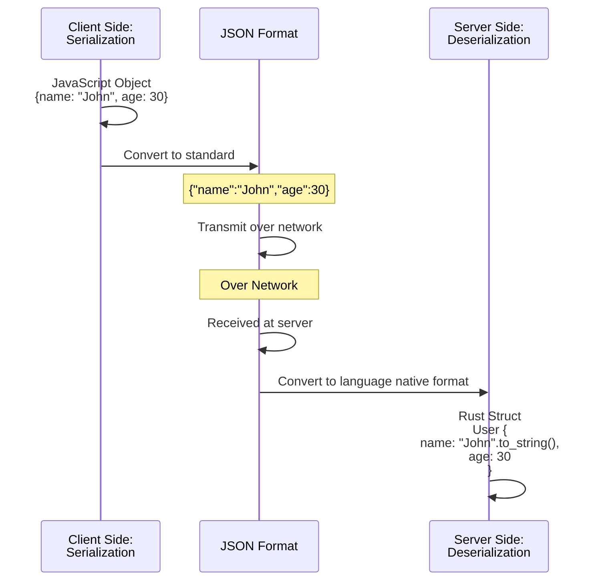

### The Flow

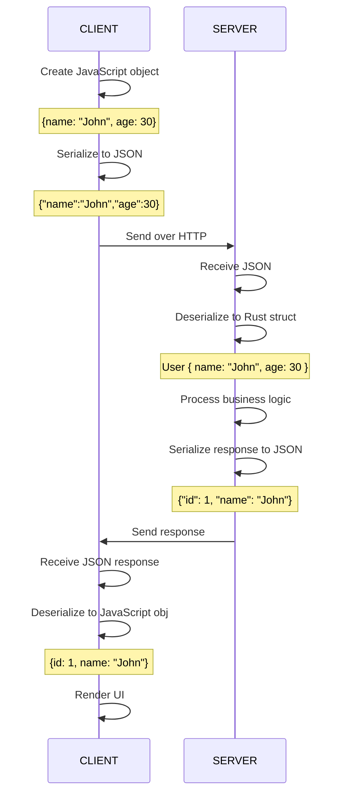

### Key Principle

**Serialization and Deserialization** = Converting data to/from a common format that is:
- Language-agnostic
- Platform-independent
- Human-readable (for text-based formats)
- Standardized and widely supported

---

## Network Layers Overview

### OSI Model Context

For deep understanding, the **OSI (Open Systems Interconnection) model** defines how data is transmitted:

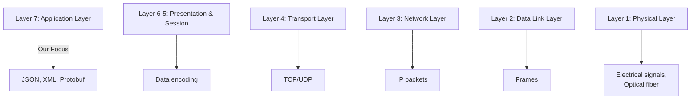

### Backend Engineer Perspective

**Key Insight:** As a backend engineer, you primarily work at the **Application Layer (Layer 7)**.

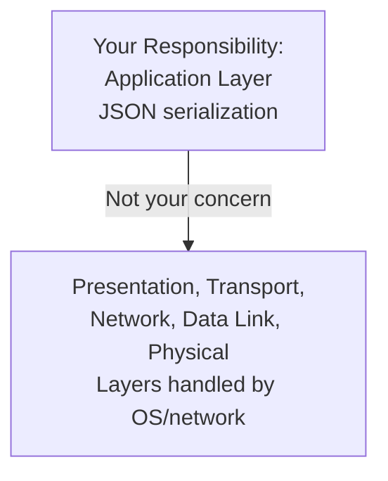

### Mental Model

Think of serialization like this:

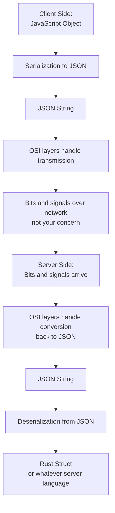

**Bottom Line:** You only need to understand JSON serialization at the application layer. The network transmission details are handled by the OS and network infrastructure.

---

## Common Serialization Formats

### Overview of Standards

The industry uses various serialization standards:

| Format | Type | Use Case | Popularity |
|--------|------|----------|-----------|
| **JSON** | Text-based | REST APIs, HTTP | ~80% (Most common) |
| **XML** | Text-based | Legacy systems, SOAP | ~10% |
| **YAML** | Text-based | Configuration, logging | ~5% |
| **Protobuf** | Binary | gRPC, performance-critical | ~3% |
| **MessagePack** | Binary | High-performance APIs | ~2% |

### Focus: JSON

For this series, we focus on **JSON** because:
- Most widely used (80% of REST APIs)
- Simple and human-readable
- Language-agnostic
- Native support in most languages
- Industry standard for HTTP communication

### Text-Based vs Binary Formats

#### Text-Based Formats

**Advantages:**
- Human-readable
- Easy to debug
- Easy to edit manually
- Can be read in text editors
- Larger file size

**Examples:** JSON, XML, YAML

#### Binary Formats

**Advantages:**
- Compact size
- Faster to parse
- Better performance
- Secure (not human-readable)

**Disadvantages:**
- Not human-readable
- Harder to debug

**Examples:** Protobuf, MessagePack, BSON

---

## JSON Format Deep Dive

### What is JSON?

**JSON** stands for **JavaScript Object Notation**.

Despite its name, JSON is **not limited to JavaScript**:
- Used across all programming languages
- Configuration files
- HTTP REST API communication
- Logging and data storage
- Database storage

### Why JSON?

```json
{
  "user": {
    "id": 1,
    "name": "John Doe",
    "email": "john@example.com",
    "age": 30,
    "active": true
  }
}
```

**Reasons for popularity:**

| Reason | Details |
|--------|---------|
| **Human-Readable** | Easy to understand structure |
| **Simple Structure** | Built from key-value pairs and arrays |
| **Language Support** | Supported natively in all major languages |
| **Compact** | Smaller than XML |
| **Fast Parsing** | Quick to serialize/deserialize |

### JSON Similarities to JavaScript

JSON syntax resembles JavaScript objects:

```javascript
// JavaScript Object
const user = {
  name: "John",
  age: 30
};

// JSON (as string)
'{"name":"John","age":30}'
```

The resemblance is intentional but JSON is **not JavaScript**:
- JSON is a **text format**
- JavaScript objects are **in-memory data structures**
- JSON can be used in any language

---

## JSON Structure and Rules

### Basic Structure

All JSON starts and ends with curly braces:

```json
{
  // content here
}
```

### Rule 1: Keys Must Be Strings in Double Quotes

```json
// ✅ Correct
{
  "name": "John",
  "age": 30
}

// ❌ Incorrect (keys without quotes)
{
  name: "John",
  age: 30
}

// ❌ Incorrect (single quotes)
{
  'name': "John",
  'age': 30
}
```

### Rule 2: Allowed Data Types for Values

JSON supports these value types:

| Type | Example | Notes |
|------|---------|-------|
| **String** | `"hello"` | Must use double quotes |
| **Number** | `42`, `3.14`, `-5` | Integer or float |
| **Boolean** | `true`, `false` | Lowercase only |
| **Null** | `null` | Represents absence of value |
| **Array** | `[1, 2, 3]` | Ordered collection |
| **Object** | `{"key": "value"}` | Nested objects allowed |

### Complete JSON Example

```json
{
  "id": 1,
  "name": "John Doe",
  "email": "john@example.com",
  "age": 30,
  "active": true,
  "balance": 1500.50,
  "tags": null,
  "address": {
    "street": "123 Main St",
    "city": "Springfield",
    "country": "USA",
    "zipCode": 12345
  },
  "hobbies": ["reading", "gaming", "sports"],
  "accounts": [
    {
      "type": "checking",
      "number": "1234567890",
      "balance": 1500.50
    },
    {
      "type": "savings",
      "number": "0987654321",
      "balance": 5000.00
    }
  ]
}
```

### JSON Data Type Breakdown

```json
{
  // String value (text)
  "name": "John",
  
  // Number value (integer)
  "age": 30,
  
  // Number value (decimal)
  "height": 5.9,
  
  // Boolean value
  "isActive": true,
  
  // Null value
  "middleName": null,
  
  // Array (list of values)
  "tags": ["developer", "designer"],
  
  // Nested object
  "address": {
    "street": "123 Main St",
    "city": "Springfield"
  },
  
  // Array of objects
  "projects": [
    {"name": "Project A", "status": "active"},
    {"name": "Project B", "status": "completed"}
  ]
}
```

### JSON Validation Rules

✅ **Valid JSON:**
```json
{
  "name": "John",
  "age": 30,
  "active": true,
  "tags": ["a", "b"],
  "nested": {
    "key": "value"
  }
}
```

❌ **Invalid JSON:**
```json
{
  name: "John",          // ❌ Key not in quotes
  "age": 30,
  'city': "NYC",         // ❌ Single quotes instead of double
  "tags": [1, 2, 3],
  "trailing": "comma",   // ❌ Trailing comma
}
```

---

## Real-World Data Flow

### Complete Example: Creating a Book

#### Request from Client to Server

**Client Code (JavaScript):**
```javascript
// Create a JavaScript object
const newBook = {
  title: "The Great Gatsby",
  author: "F. Scott Fitzgerald",
  year: 1925,
  pages: 180
};

// Serialize to JSON and send
fetch('/api/books', {
  method: 'POST',
  headers: { 'Content-Type': 'application/json' },
  body: JSON.stringify(newBook)  // Serialize to JSON
});
```

**Request JSON (serialized):**
```json
{
  "title": "The Great Gatsby",
  "author": "F. Scott Fitzgerald",
  "year": 1925,
  "pages": 180
}
```

**HTTP Request:**
```
POST /api/books HTTP/1.1
Content-Type: application/json

{"title":"The Great Gatsby","author":"F. Scott Fitzgerald","year":1925,"pages":180}
```

#### Server Processing

**Server Code (Node.js example):**
```javascript
app.post('/api/books', (request) => {
  // Deserialize JSON to JavaScript object
  const book = request.body;  // Now it's a JS object
  
  // Access properties
  console.log(book.title);     // "The Great Gatsby"
  console.log(book.author);    // "F. Scott Fitzgerald"
  
  // Process business logic
  // Save to database, etc.
  
  // Prepare response
  const response = {
    id: 1,
    title: book.title,
    author: book.author,
    created: "2024-01-15"
  };
  
  // Send JSON response (serialize)
  response.send(response);
});
```

#### Response from Server to Client

**Response JSON (serialized):**
```json
{
  "id": 1,
  "title": "The Great Gatsby",
  "author": "F. Scott Fitzgerald",
  "created": "2024-01-15",
  "message": "Book created successfully"
}
```

**HTTP Response:**
```
HTTP/1.1 201 Created
Content-Type: application/json

{"id":1,"title":"The Great Gatsby","author":"F. Scott Fitzgerald","created":"2024-01-15","message":"Book created successfully"}
```

#### Client Receives Response

**Client Code:**
```javascript
fetch('/api/books', {
  method: 'POST',
  body: JSON.stringify(newBook)
})
.then(response => response.json())  // Deserialize JSON
.then(data => {
  // Now data is a JavaScript object
  console.log(data.id);              // 1
  console.log(data.message);         // "Book created successfully"
  
  // Use data to update UI
  displayBook(data);
});
```

### The Complete Flow Visualization

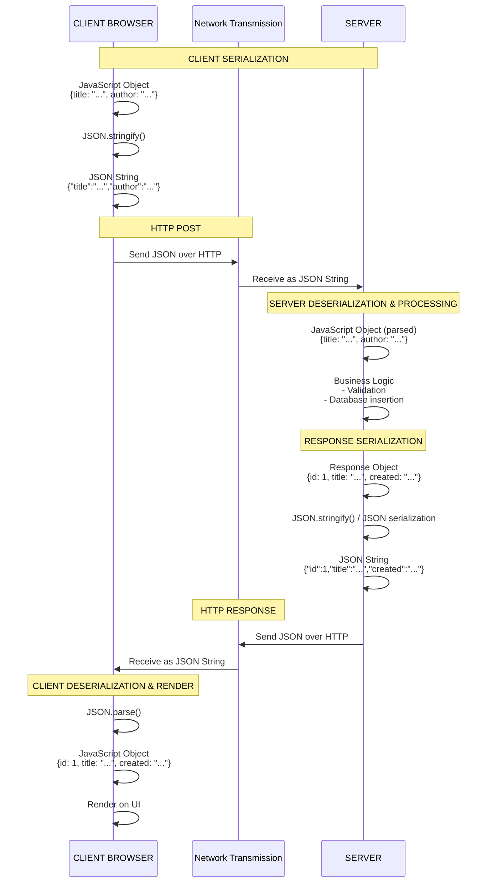

---

## Backend Engineer Perspective

### What You Need to Know

As a backend engineer, focus on these key points:

#### 1. Application Layer is Your Domain

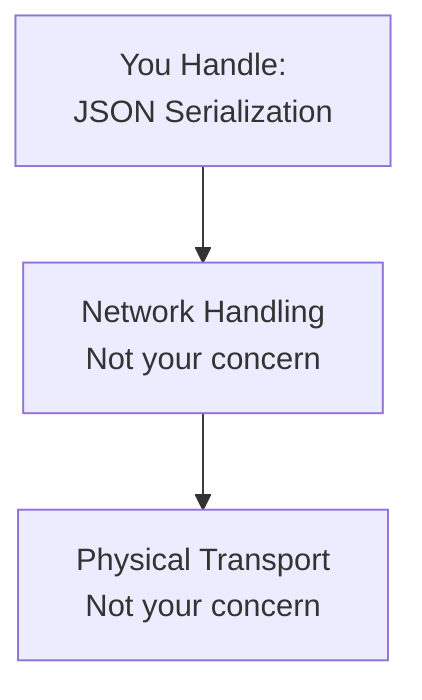

#### 2. Data Conversion at Boundaries

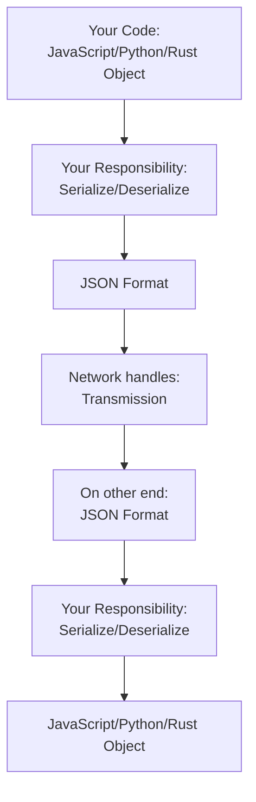

#### 3. Standard Responsibility

Your job:
- Ensure data is properly serialized to JSON
- Ensure JSON received is properly deserialized
- Validate data format and structure
- Handle serialization errors

NOT your job:
- How JSON is transmitted over network
- TCP/IP details
- Physical layer transmission
- Network routing

#### 4. Language Agnostic

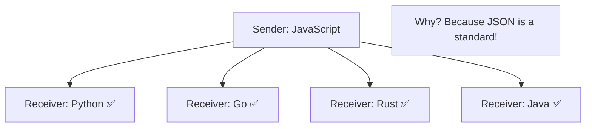

---

## Summary

### Key Definitions

**Serialization:**
- Converting a native language object → JSON format
- Making data ready for transmission or storage

**Deserialization:**
- Converting JSON format → native language object
- Parsing received data into usable format

### Why Serialization/Deserialization Matter

| Aspect | Benefit |
|--------|---------|
| **Communication** | Enables client-server communication across languages |
| **Standardization** | Ensures consistency across systems |
| **Interoperability** | Different systems can work together |
| **Flexibility** | Supports any programming language |
| **Simplicity** | Standard format is easy to understand |

### The Core Concept

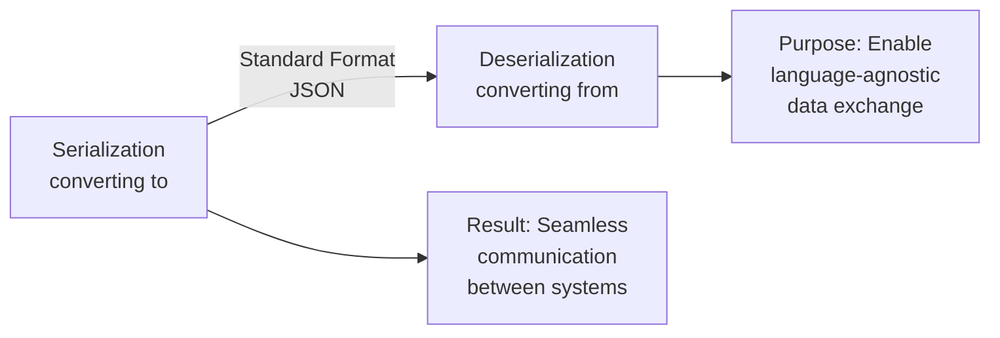

### What You Need to Remember

1. **JSON is a Standard:** Both client and server must follow JSON rules
2. **Keys Are Always Strings:** Enclosed in double quotes
3. **Values Can Be Typed:** Strings, numbers, booleans, null, arrays, objects
4. **It's Text-Based:** Human-readable format transmitted over network
5. **Nested Structures:** JSON supports nesting of objects and arrays
6. **Language Independent:** Works with all programming languages

### Workflow Summary

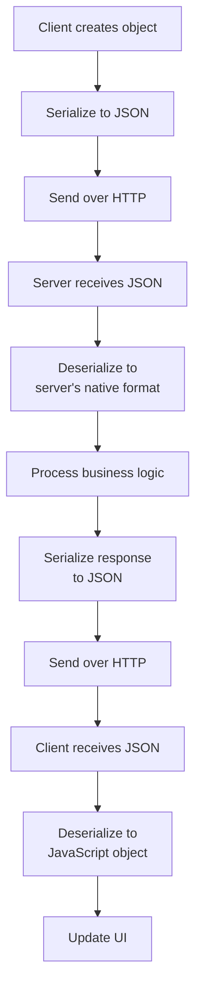

This entire process is **serialization and deserialization**, and JSON is the industry-standard format for this exchange.

---

## Quick Reference: JSON Syntax

```json
{
  "string": "text value",
  "number": 42,
  "decimal": 3.14,
  "negative": -10,
  "boolean_true": true,
  "boolean_false": false,
  "null_value": null,
  "array": [1, 2, 3, "four"],
  "nested_object": {
    "key": "value",
    "nested_array": ["a", "b", "c"]
  }
}
```

---

## Conclusion

Serialization and Deserialization are fundamental concepts in backend development. They solve the problem of communicating between different systems written in different languages by providing a **common, standardized format** — JSON.

Understand this, and you understand one of the most critical mechanisms in modern web application architecture!

