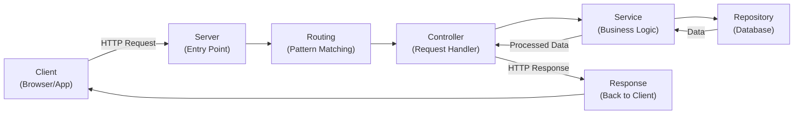
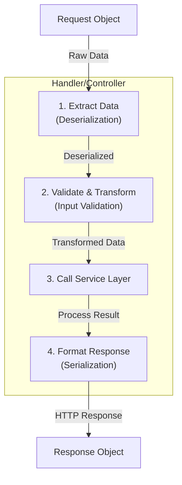
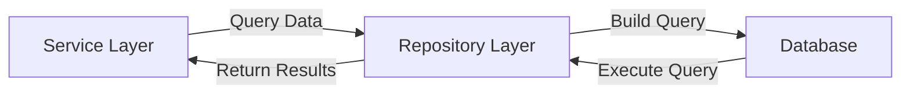
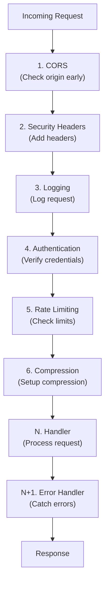
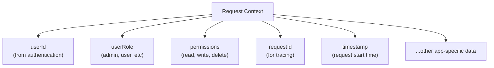
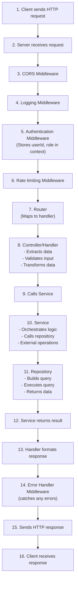
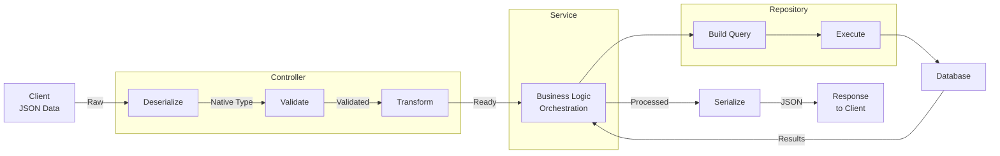

# Controllers, Services, Repositories, Middlewares, and Request Context

## Table of Contents

1. [Introduction](#introduction)
2. [Request Lifecycle Overview](#request-lifecycle-overview)
3. [Controllers/Handlers](#controllershandlers)
4. [Services](#services)
5. [Repositories](#repositories)
6. [Middlewares](#middlewares)
7. [Request Context](#request-context)
8. [Putting It All Together](#putting-it-all-together)

---

## Introduction

This lecture covers the fundamental architectural patterns of backend systems:

- **Controllers/Handlers**: Entry point for HTTP requests
- **Services**: Business logic orchestration
- **Repositories**: Database operations
- **Middlewares**: Cross-cutting concerns and request processing
- **Request Context**: Shared state across the request lifecycle

These components work together to create a scalable, maintainable backend architecture. While not strictly required, following these patterns is considered best practice for production systems.

---

## Request Lifecycle Overview

### Basic Flow

When a client sends an HTTP request to your server, the following sequence occurs:



### Key Stages

1. **Entry Point**: Request reaches the server on a specific port
2. **Routing**: Maps the request URL to a specific handler/controller
3. **Handler/Controller**: Extracts and validates request data
4. **Service Layer**: Contains business logic and orchestrates operations
5. **Repository Layer**: Handles database interactions
6. **Response**: Formatted response sent back to client

---

## Controllers/Handlers

### Purpose

Controllers act as the **orchestration layer** between HTTP and your application logic. They handle:

- Receiving and parsing HTTP requests
- Validating and transforming input data
- Calling appropriate services
- Formatting and sending responses

### Request and Response Objects

Every handler receives (by default from the runtime):

- **Request Object**: Contains HTTP request data (headers, body, query params, path params)
- **Response Object**: Used to send HTTP responses back to the client



### Handler Responsibilities

#### 1. **Deserialization**

Convert incoming JSON/serialized data into native data structures:

```
Client sends: { "title": "Book Title", "author": "Author Name" }
Handler converts to: JavaScript Object / Python Dict / Go Struct
```

**Note**: In languages like JavaScript/Node.js, middleware often handles this automatically.

#### 2. **Validation & Transformation**

**Validation**: Ensure data meets requirements

- Check mandatory fields are present
- Verify data types are correct
- Detect malicious intent

**Transformation**: Prepare data for downstream use

- Set default values for optional fields
- Normalize data formats
- Apply business rules

Example: If a `sort` query parameter is optional and not provided, set a default value like `sort: "date"`

#### 3. **Service Invocation**

Call the appropriate service with validated and transformed data:

```javascript
controller.getBooks(req, res) {
    const sortBy = req.query.sort || 'date';  // Transform
    const service = new BookService();
    const books = service.getBooks(sortBy);   // Call service
    res.json(books);                          // Send response
}
```

#### 4. **Response Formatting**

- Serialize response data to JSON/appropriate format
- Set appropriate HTTP status codes (200, 201, 204, 400, 401, 500, etc.)
- Include error messages if applicable

### HTTP Status Codes

| Code | Scenario         | Example                             |
| ---- | ---------------- | ----------------------------------- |
| 200  | Success          | GET request returns data            |
| 201  | Resource Created | POST request creates new resource   |
| 204  | No Content       | DELETE successful, no response body |
| 400  | Bad Request      | Invalid input data                  |
| 401  | Unauthorized     | Failed authentication               |
| 403  | Forbidden        | Insufficient permissions            |
| 404  | Not Found        | Resource doesn't exist              |
| 500  | Server Error     | Internal server error               |

---

## Services

### Purpose

Services contain the **core business logic** of your application. They:

- Orchestrate complex operations
- Coordinate between repositories
- Handle external API calls
- Send emails/notifications
- Apply business rules

### Key Principle: Independence

Services should be **HTTP-agnostic**. If you look at a service method, you shouldn't be able to tell it's part of an API:

```javascript
// ✅ GOOD - No HTTP awareness
class BookService {
  getBooks(sortBy) {
    return this.bookRepository.fetchAll(sortBy);
  }
}

// ❌ BAD - Tightly coupled to HTTP
class BookService {
  getBooks(req, res) {
    const books = this.bookRepository.fetchAll(req.query.sort);
    res.status(200).json(books); // HTTP awareness!
  }
}
```

### Service Characteristics

- **No HTTP knowledge**: Doesn't know about request/response objects
- **Reusable**: Can be called from HTTP handlers, CLI commands, scheduled jobs, etc.
- **Orchestration**: Can call multiple repositories and external services
- **Error handling**: Throws business exceptions (not HTTP responses)

### Types of Services

#### Database-Dependent Service

```javascript
async createBook(bookData, userId) {
    // Call repository
    const book = await this.bookRepository.create(bookData);

    // Could also call other services
    await this.analyticsService.trackBookCreation(book.id, userId);

    return book;
}
```

#### External Operation Service

```javascript
async sendWelcomeEmail(userEmail, userName) {
    // Only external logic, no database
    await this.emailService.send({
        to: userEmail,
        template: 'welcome',
        variables: { userName }
    });

    return { success: true };
}
```

#### Multiple Repository Orchestration

```javascript
async getBookWithAuthorDetails(bookId) {
    // Call multiple repositories
    const book = await this.bookRepository.findById(bookId);
    const author = await this.authorRepository.findById(book.authorId);

    // Merge and return combined data
    return { ...book, author };
}
```

---

## Repositories

### Purpose

Repositories handle **all database operations**. They:

- Abstract database implementation details
- Provide a clean interface for data persistence
- Execute queries and return results
- Handle database transactions

### Key Principle: Single Responsibility

Each repository method should do **one thing only** and return **one type of data**:

```javascript
// ✅ GOOD - Single responsibility
class BookRepository {
  async getAllBooks(sortBy) {
    // Return all books
    return await db.query("SELECT * FROM books ORDER BY " + sortBy);
  }

  async getBookById(bookId) {
    // Return single book
    return await db.query("SELECT * FROM books WHERE id = ?", [bookId]);
  }
}

// ❌ BAD - Multiple responsibilities
class BookRepository {
  async getBooks(bookId = null, sortBy = "date") {
    if (bookId) {
      // Return single book
    } else {
      // Return all books sorted
    }
  }
}
```

### Repository Responsibilities



### CRUD Operations

| Operation  | Purpose                | Example                                |
| ---------- | ---------------------- | -------------------------------------- |
| **Create** | Insert new record      | `createUser(userData)`                 |
| **Read**   | Fetch records          | `getBooks(filters)`, `getBookById(id)` |
| **Update** | Modify existing record | `updateBook(id, newData)`              |
| **Delete** | Remove record          | `deleteBook(id)`                       |

### Filtering and Sorting

Pass all necessary filtering/sorting parameters:

```javascript
// Parameters passed from service
async getBooks(filter) {
    // filter = { sortBy: 'date', authorId: 5 }
    let query = 'SELECT * FROM books';

    if (filter.authorId) {
        query += ' WHERE authorId = ' + filter.authorId;
    }

    query += ' ORDER BY ' + (filter.sortBy || 'date');

    return await db.query(query);
}
```

---

## Middlewares

### Purpose

Middlewares are functions executed at **specific points in the request lifecycle** to handle cross-cutting concerns:

- Authentication and authorization
- CORS handling
- Request logging
- Error handling
- Rate limiting
- Request compression
- Data parsing

### Why Middlewares?

**Problem**: Many operations need to happen for every request

- Without middlewares: duplicate code in every handler
- Solution: Extract to middlewares

### Middleware Signature

Middlewares receive three objects:

```javascript
function middleware(request, response, next) {
  // Can read from request
  // Can modify request or response
  // Can read/write response headers
  // Execute custom logic

  // Pass control to next middleware/handler
  next();

  // OR terminate early
  response.status(401).json({ error: "Unauthorized" });
}
```

### Key Concepts

#### The `next` Function

- Passes execution to the next middleware in the chain
- If not called, the request lifecycle stops
- Allows middleware chaining

#### Middleware Chain


### Common Middlewares

#### 1. **CORS (Cross-Origin Resource Sharing)**

Enables or restricts cross-origin requests from browsers.

```javascript
function corsMiddleware(request, response, next) {
  const origin = request.headers.origin;
  const allowedOrigins = ["https://frontend.com", "https://app.example.com"];

  if (allowedOrigins.includes(origin)) {
    response.headers["Access-Control-Allow-Origin"] = origin;
    response.headers["Access-Control-Allow-Methods"] = "GET, POST, PUT, DELETE";
  }

  next();
}
```

**Why middleware?**: Applies to every request, needs to modify response headers.

#### 2. **Security Headers**

Add security-related HTTP headers to responses.

```javascript
function securityHeadersMiddleware(request, response, next) {
  response.headers["X-Content-Type-Options"] = "nosniff";
  response.headers["X-Frame-Options"] = "DENY";
  response.headers["Content-Security-Policy"] = "default-src 'self'";

  next();
}
```

#### 3. **Authentication**

Verifies user credentials and extracts user information.

```javascript
function authMiddleware(request, response, next) {
  const token = request.headers.authorization;

  try {
    const decoded = verifyToken(token);

    // Store in request context
    request.context.userId = decoded.userId;
    request.context.userRole = decoded.role;

    next();
  } catch (error) {
    // Terminate request early
    response.status(401).json({ error: "Unauthorized" });
  }
}
```

**When to terminate**: Invalid credentials → send 401 and stop

#### 4. **Rate Limiting**

Prevents abuse by limiting requests per time period.

```javascript
const requestCounts = {};

function rateLimitMiddleware(request, response, next) {
  const ip = request.ip;
  const now = Date.now();
  const windowStart = now - 60000; // Last 60 seconds

  if (!requestCounts[ip]) {
    requestCounts[ip] = [];
  }

  // Remove old requests
  requestCounts[ip] = requestCounts[ip].filter((time) => time > windowStart);

  if (requestCounts[ip].length >= 100) {
    // Too many requests
    response.status(429).json({ error: "Too Many Requests" });
    return;
  }

  requestCounts[ip].push(now);
  next();
}
```

| Status Code | Meaning           |
| ----------- | ----------------- |
| **429**     | Too Many Requests |

#### 5. **Logging & Monitoring**

Logs request details for debugging and auditing.

```javascript
function loggingMiddleware(request, response, next) {
  const timestamp = new Date().toISOString();
  const method = request.method;
  const path = request.path;
  const query = request.query;

  console.log(`[${timestamp}] ${method} ${path}`, query);

  next();
}
```

#### 6. **Global Error Handling**

Catches errors from any layer and sends formatted responses.

```javascript
function errorHandlingMiddleware(error, request, response, next) {
  console.error("Error:", error);

  // Determine error type
  if (error.isClientError) {
    response.status(400).json({
      error: error.message,
      code: error.code,
    });
  } else {
    response.status(500).json({
      error: "Internal Server Error",
      code: "INTERNAL_ERROR",
    });
  }
}
```

**Placement**: Usually last middleware to catch errors from all layers.

#### 7. **Compression**

Compresses response data for faster transmission.

```javascript
function compressionMiddleware(request, response, next) {
  const acceptEncoding = request.headers["accept-encoding"];

  if (acceptEncoding && acceptEncoding.includes("gzip")) {
    response.headers["Content-Encoding"] = "gzip";
    // Compress response body
  }

  next();
}
```

### Middleware Ordering

**Order matters significantly!** Middlewares execute sequentially:



**Recommended Order**:

1. CORS (fail fast if cross-origin not allowed)
2. Security Headers
3. Logging
4. Authentication
5. Rate Limiting
6. Compression
7. ...Handler
8. Error Handling (last, catches errors from all layers)

---

## Request Context

### Purpose

Request Context is a **per-request storage** that allows sharing data across all middlewares and handlers without tight coupling.

### Why Request Context?

**Problem**: How do you share data between middlewares and handlers?

```javascript
// Without context (tightly coupled)
authMiddleware.userId = user.id; // Global variable (bad!)

// With context (clean separation)
request.context.userId = user.id; // Scoped to this request only
```

### Characteristics

- **Request-scoped**: Each request has its own isolated context
- **Accessible everywhere**: Available in all middlewares and handlers for that request
- **Key-value storage**: Stores metadata as key-value pairs
- **Isolated**: One request's context doesn't affect another

### Common Context Values



### Usage Example

#### Step 1: Generate Request ID

```javascript
function requestIdMiddleware(request, response, next) {
  const requestId = generateUUID();
  request.context.requestId = requestId;
  console.log(`[${requestId}] New request`);
  next();
}
```

#### Step 2: Authentication

```javascript
function authMiddleware(request, response, next) {
  const token = request.headers.authorization;
  const decoded = verifyToken(token);

  // Store authentication data in context
  request.context.userId = decoded.userId;
  request.context.userRole = decoded.role;
  request.context.permissions = decoded.permissions;

  next();
}
```

#### Step 3: Use in Handler

```javascript
function createBookHandler(request, response) {
  const { title, author } = request.body;
  const userId = request.context.userId; // From context
  const requestId = request.context.requestId; // From context

  // Don't trust client - use authenticated userId
  const bookData = {
    title,
    author,
    userId, // Use from context, not from request body
    requestId,
  };

  const book = bookService.createBook(bookData);
  response.json(book);
}
```

### Why Not Pass Values Directly?

**Problem**: Tight coupling between functions

```javascript
// ❌ Tightly coupled
function handler(request, response) {
  authMiddleware.getUserId(); // Direct dependency
}
```

**Solution**: Use context for decoupling

```javascript
// ✅ Loose coupling
function handler(request, response) {
  const userId = request.context.userId; // Context access
}
```

### Security Considerations

**Critical**: Never trust client-provided IDs when context is available

```javascript
// ❌ INSECURE - Uses client-provided data
async function updateUserProfile(request, response) {
  const userId = request.body.userId; // From client!
  await userService.update(userId, request.body);
}

// ✅ SECURE - Uses authenticated context
async function updateUserProfile(request, response) {
  const userId = request.context.userId; // From authentication
  await userService.update(userId, request.body);
}
```

### Distributed Tracing with Request ID

In microservices architectures, pass request ID to other services:

```javascript
function makeExternalAPICall(request, response) {
    const requestId = request.context.requestId;

    // Pass request ID to external service
    const result = await fetch('https://other-service.com/api', {
        headers: {
            'X-Request-ID': requestId
        }
    });

    return result;
}
```

This helps trace a request's journey across multiple services in logs.

---

## Putting It All Together

### Complete Request Flow Diagram



### Data Flow Through Layers



### Responsibility Matrix

| Layer          | Responsibility                       | HTTP Aware? |
| -------------- | ------------------------------------ | ----------- |
| **Controller** | Parse input, validate, format output | ✅ Yes      |
| **Service**    | Business logic, orchestration        | ❌ No       |
| **Repository** | Database queries                     | ❌ No       |
| **Middleware** | Cross-cutting concerns               | ✅ Yes      |
| **Context**    | Store request metadata               | ✅ Yes      |

### Code Example: POST /books

```javascript
// Middleware: Authentication
function authMiddleware(req, res, next) {
  const token = req.headers.authorization;
  req.context.userId = verifyToken(token).userId;
  next();
}

// Middleware: Request ID
function requestIdMiddleware(req, res, next) {
  req.context.requestId = generateUUID();
  next();
}

// Handler: Create Book
async function createBookHandler(req, res) {
  // Deserialize
  const { title, author } = req.body;

  // Validate
  if (!title || !author) {
    return res.status(400).json({ error: "Missing required fields" });
  }

  // Transform
  const userId = req.context.userId; // From context

  // Call service
  const book = await bookService.createBook({
    title,
    author,
    userId,
  });

  // Send response
  res.status(201).json(book);
}

// Service: Create Book
class BookService {
  async createBook(data) {
    // Validate business rules
    if (data.title.length > 255) {
      throw new Error("Title too long");
    }

    // Store in database
    const book = await bookRepository.create(data);

    // Could send notification
    await notificationService.send(data.userId, `Book "${data.title}" created`);

    return book;
  }
}

// Repository: Create Book
class BookRepository {
  async create(bookData) {
    const query = `
            INSERT INTO books (title, author, userId)
            VALUES (?, ?, ?)
        `;
    const result = await database.run(query, [
      bookData.title,
      bookData.author,
      bookData.userId,
    ]);

    return { id: result.lastId, ...bookData };
  }
}
```

---

## Summary

| Component      | When            | What                                         |
| -------------- | --------------- | -------------------------------------------- |
| **Middleware** | Before routing  | Cross-cutting concerns (auth, logging, CORS) |
| **Controller** | Route matched   | Parse input, call service, format output     |
| **Service**    | From controller | Business logic, orchestration                |
| **Repository** | From service    | Database operations                          |
| **Context**    | Throughout      | Store request-specific metadata              |

### Key Principles

1. **Separation of Concerns**: Each layer has a specific responsibility
2. **Single Responsibility**: Functions do one thing well
3. **No HTTP in Services**: Services are framework-agnostic
4. **Fail Fast**: Validate early (in controller/middleware)
5. **Context over Coupling**: Use context for sharing data
6. **Middleware Order Matters**: Execute in logical sequence
7. **Trust Context, Question Client**: Use authenticated data from context, not client input

---

## Further Reading

- API Design principles and REST conventions
- Authentication and Authorization mechanisms
- Error handling strategies
- Microservices and distributed tracing
- Testing strategies for each layer
