# Complete REST API Design

## Table of Contents

1. [Introduction](#introduction)
2. [Historical Context](#historical-context)
3. [REST Architecture](#rest-architecture)
4. [Fundamental Concepts](#fundamental-concepts)
5. [HTTP Methods & Idempotency](#http-methods--idempotency)
6. [URL Design](#url-design)
7. [Resource Design](#resource-design)
8. [API Response Design](#api-response-design)
9. [Error Handling](#error-handling)
10. [Practical API Design Example](#practical-api-design-example)
11. [Best Practices](#best-practices)

---

## Introduction

API design is **one of the most critical skills** for backend engineers. It's where you spend significant time thinking about how users will interact with your system.

### Why Standardize API Design?

**Problem**: Without standards, common questions cause confusion:

- Should resource URIs be plural or singular?
- When updating, should I use PATCH or PUT?
- What HTTP status code for this scenario?
- How to structure error responses?

**Solution**: Following REST standards eliminates confusion and provides:

- ✅ Consistent developer experience
- ✅ Reduced integration time
- ✅ Fewer bugs and assumptions
- ✅ Better documentation
- ✅ Shared understanding between API creator and consumer

---

## Historical Context

### The Birth of the Web (1990s)

Tim Berners-Lee initiated the World Wide Web project to **facilitate global knowledge sharing**. Within a year, he invented:

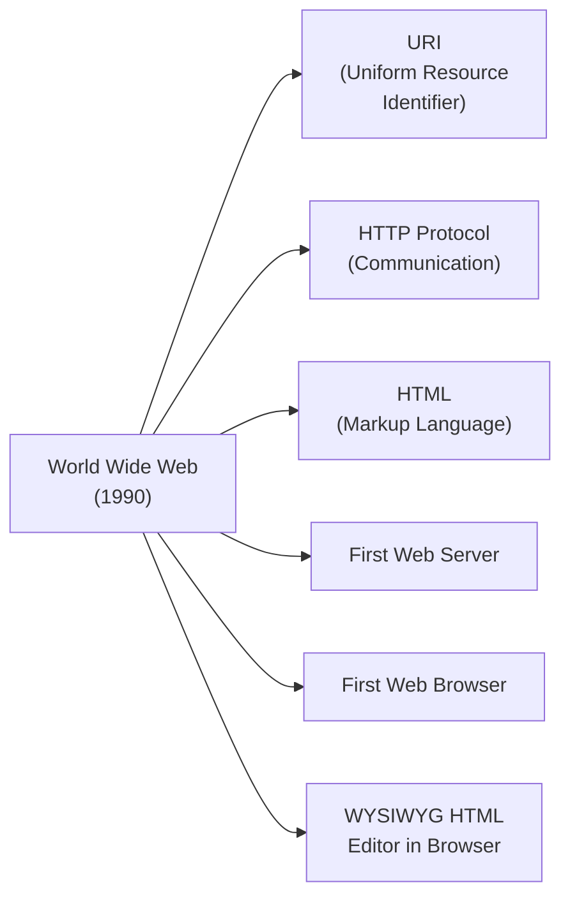

### The Scalability Crisis (1991-1993)

The web grew **exponentially**, but infrastructure couldn't scale. The original design assumed far fewer users.

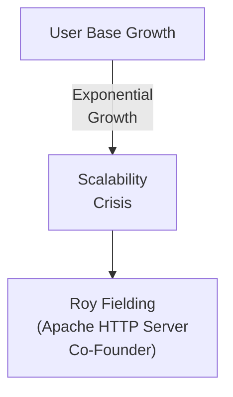

### Roy Fielding's Solution (1993-2000)

Roy Fielding proposed architectural **constraints** to solve scalability. He later:

- Collaborated with Tim Berners-Lee
- Contributed to HTTP 1.1 specification
- Formalized REST architecture in his 2000 PhD dissertation

---

## REST Architecture

### What Does REST Stand For?

**REST = Representational State Transfer**

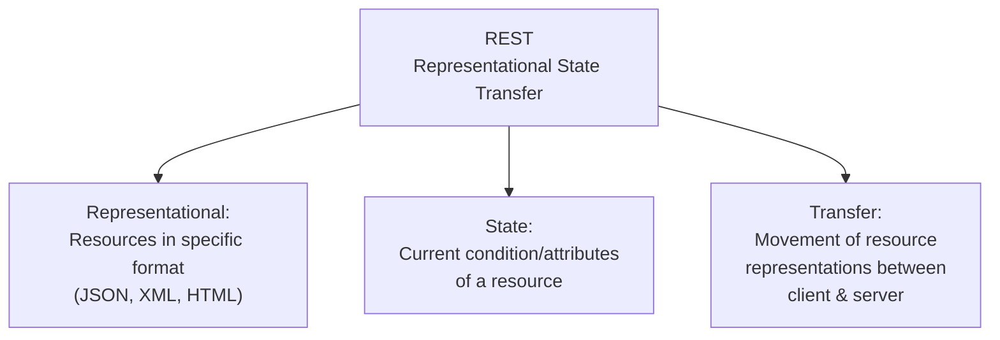

### Example: REST in Practice

```
Shopping Cart State:
- Items: [Book1, Book2, Book3]
- Total Price: $75.50
- Quantities: [1, 2, 1]

This STATE is TRANSFERRED between client and server
with each API call using different REPRESENTATIONS (JSON, etc.)
```

### Roy Fielding's 6 Architectural Constraints

| #   | Constraint            | Purpose                                   | Benefit                                                                  |
| --- | --------------------- | ----------------------------------------- | ------------------------------------------------------------------------ |
| 1   | **Client-Server**     | Separation of concerns                    | Independent evolution of frontend & backend                              |
| 2   | **Uniform Interface** | Standardized communication                | Simplified system architecture                                           |
| 3   | **Layered System**    | Hierarchical layers                       | Scalability, security, intermediate components (load balancers, proxies) |
| 4   | **Cacheability**      | Responses labeled cacheable/non-cacheable | Reduced server load, faster responses                                    |
| 5   | **Statelessness**     | Each request contains all necessary info  | Reliability, scalability, any server can handle any request              |
| 6   | **Code on Demand**    | Server sends executable code (JavaScript) | _Optional_ - adds flexibility                                            |

### Why These Constraints Scale the Web

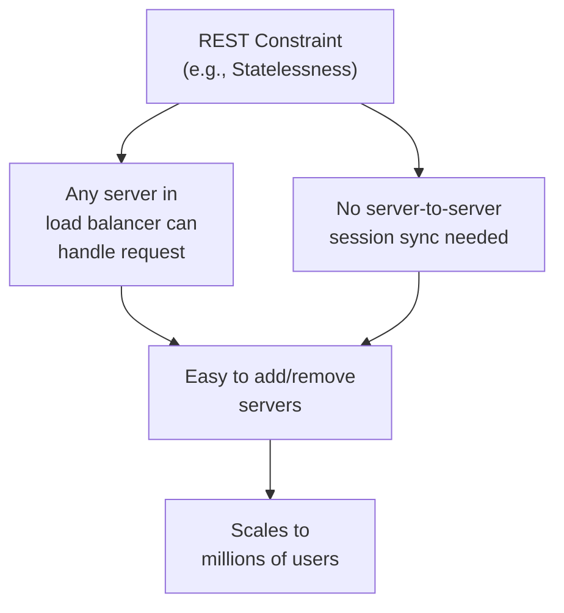

---

## Fundamental Concepts

### 1. Resources

**Definition**: Nouns representing entities in your system

**How to Identify**:

1. Review UI wireframes and designs
2. Talk to product/client stakeholders
3. Extract all nouns from requirements

**Example: Project Management Platform**

- Organizations
- Projects
- Tasks
- Tags
- Users

### 2. CRUD Operations

Basic operations on resources:

| Operation  | Purpose           | Example                       |
| ---------- | ----------------- | ----------------------------- |
| **Create** | Add new resource  | POST /organizations           |
| **Read**   | Fetch resource(s) | GET /organizations            |
| **Update** | Modify resource   | PATCH/PUT /organizations/{id} |
| **Delete** | Remove resource   | DELETE /organizations/{id}    |

### 3. Resource Lifecycle

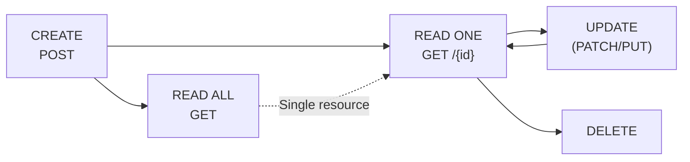

---

## HTTP Methods & Idempotency

### Concept: Idempotency

**Definition**: An operation where performing it multiple times has the **same effect as performing it once**

**In REST Context**: The side effects in the server remain the same regardless of how many times the request is made

### Understanding Through Examples

#### GET - Idempotent ✅

```
Request 1: GET /books → Returns [Book A, Book B, Book C]
Request 2: GET /books → Returns [Book A, Book B, Book C]
Request 1000: GET /books → Returns same list

Side effect: NONE (just fetches data)
Result: SAME (idempotent)
```

#### PATCH/PUT - Idempotent ✅

```
Initial State: User name = "John"

Request 1: PATCH /users/1 { name: "Jane" }
Result: name = "Jane" (changed)

Request 2: PATCH /users/1 { name: "Jane" }
Result: name = "Jane" (no change - already Jane)

Request 1000: PATCH /users/1 { name: "Jane" }
Result: name = "Jane" (still Jane)

Side effect after first request: NONE (already in desired state)
Result: SAME (idempotent)
```

#### DELETE - Idempotent ✅

```
Initial State: User with ID 1 exists

Request 1: DELETE /users/1
Result: User deleted (status: 200 OK or 204 No Content)

Request 2: DELETE /users/1
Result: User not found (status: 404 Not Found)

Request 1000: DELETE /users/1
Result: Still not found (status: 404 Not Found)

Side effect after first request: NONE
Result: Same outcome (idempotent)
```

#### POST - NOT Idempotent ❌

```
Initial State: 0 books in database

Request 1: POST /books { title: "Harry Potter", author: "JK Rowling" }
Result: Book ID 1 created

Request 2: POST /books { title: "Harry Potter", author: "JK Rowling" }
Result: Book ID 2 created (NEW book - duplicate)

Request 1000: POST /books { title: "Harry Potter", author: "JK Rowling" }
Result: Book ID 1000 created

Each request creates a NEW resource
Side effects: DIFFERENT
Result: NOT idempotent ❌
```

### HTTP Methods Reference

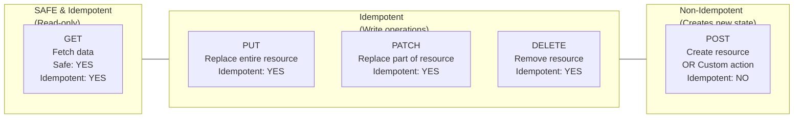

### PATCH vs PUT

**PATCH**: Update specific fields

```json
// Initial state
{
  "id": 1,
  "name": "John",
  "email": "john@example.com",
  "age": 30
}

// PATCH /users/1
{ "name": "Jane" }

// Result: Only name changed
{
  "id": 1,
  "name": "Jane",           // ← Changed
  "email": "john@example.com",  // ← Unchanged
  "age": 30                 // ← Unchanged
}
```

**PUT**: Replace entire resource

```json
// Initial state
{
  "id": 1,
  "name": "John",
  "email": "john@example.com",
  "age": 30
}

// PUT /users/1
{ "name": "Jane", "email": "jane@example.com", "age": 30 }

// Result: Entire resource replaced
{
  "id": 1,
  "name": "Jane",
  "email": "jane@example.com",
  "age": 30
}
```

### Custom Actions with POST

When an operation doesn't fit CRUD:

```
POST /users/1/send-welcome-email
  ↑ Not directly updating the user
  → Requires: email service, template rendering, sending logic
  
POST /tasks/1/mark-complete
  ↑ Not just a simple PATCH
  → Might require: status change + notification + logging + workflow trigger
  
POST /organizations/1/invite-members
  ↑ Not creating a member directly
  → Requires: validation + email sending + access granting
```

These are **non-CRUD actions** → Use POST

---

## URL Design

### URL Structure

```
https://api.example.com/v1/organizations/123/projects
└──┬──┘└─┬─┘└─────┬───┘└─┬─┘└────┬──────┘└─┬─┘└───┬──┘
Scheme Subdomain domain Version Resource  ID   Path
```

### URL Components

| Component            | Example                   | Purpose                                       |
| -------------------- | ------------------------- | --------------------------------------------- |
| **Scheme**           | `https`                   | HTTP or HTTPS (always HTTPS in production)    |
| **Subdomain**        | `api`                     | Indicates API endpoint                        |
| **Domain**           | `example.com`             | Company domain                                |
| **Version**          | `/v1`                     | API version (optional but recommended)        |
| **Path**             | `/organizations/projects` | Resource hierarchy                            |
| **Query Parameters** | `?page=1&limit=10`        | Filters, pagination, sorting                  |
| **Fragment**         | `#section`                | Client-side navigation (rarely used for APIs) |

### URL Best Practices

#### 1. Always Use Plural Resource Names

```
✅ CORRECT:
GET /books
GET /books/1
POST /books

❌ WRONG:
GET /book
GET /book/1
POST /book
```

**Why**: Consistent representation of collections

#### 2. Use Hyphens for Multi-word Resources

```
✅ CORRECT:
GET /book-reviews
GET /author-profiles
POST /shopping-carts

❌ WRONG:
GET /bookReviews        (camelCase)
GET /book_reviews       (snake_case)
GET /Authorprofiles     (mixed case)
```

**Why**: URLs are case-sensitive and cross-platform compatible

#### 3. Use Slugs for Human-Readable IDs

```
Book Title: "Harry Potter and The Philosopher's Stone"

Slug creation:
1. Convert to lowercase: "harry potter and the philosopher's stone"
2. Replace spaces with hyphens: "harry-potter-and-the-philosopher's-stone"
3. Remove special characters: "harry-potter-and-the-philosophers-stone"

Then use in URL:
GET /books/harry-potter-and-the-philosophers-stone
```

#### 4. Hierarchy Shows Relationships

```
GET /organizations/123/projects
            ↓
    This shows that this project (resource)
    belongs to organization 123 (parent resource)

GET /organizations/123/projects/456/tasks
            ↓                       ↓
    This task belongs to Project 456,
    which belongs to Organization 123
```

#### 5. Query Parameters for Filtering

```
GET /books?page=1&limit=10
GET /books?sort=title&order=asc
GET /books?author=JK+Rowling
GET /books?page=2&limit=20&sort=published_date&order=desc
```

---

## Resource Design

### Step-by-Step Resource Design

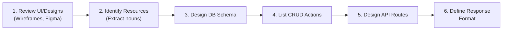

### Example: Project Management Platform

#### Resources Identified

1. **Organizations** - The company/team
2. **Projects** - Initiatives within organizations
3. **Tasks** - Work items within projects
4. **Users** - People using the platform
5. **Tags** - Labels for tasks

#### Database Schema (Simplified)

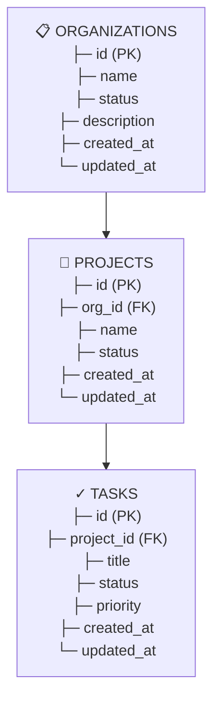

#### API Routes

| Method     | Route                                   | Action                  |
| ---------- | --------------------------------------- | ----------------------- |
| **GET**    | `/organizations`                        | List all organizations  |
| **GET**    | `/organizations/{id}`                   | Get single organization |
| **POST**   | `/organizations`                        | Create organization     |
| **PATCH**  | `/organizations/{id}`                   | Update organization     |
| **DELETE** | `/organizations/{id}`                   | Delete organization     |
|            |                                         |                         |
| **GET**    | `/organizations/{org_id}/projects`      | List projects in org    |
| **GET**    | `/organizations/{org_id}/projects/{id}` | Get single project      |
| **POST**   | `/organizations/{org_id}/projects`      | Create project          |
| **PATCH**  | `/projects/{id}`                        | Update project          |
| **DELETE** | `/projects/{id}`                        | Delete project          |
|            |                                         |                         |
| **GET**    | `/projects/{project_id}/tasks`          | List tasks in project   |
| **POST**   | `/projects/{project_id}/tasks`          | Create task             |
| **PATCH**  | `/tasks/{id}`                           | Update task             |
| **DELETE** | `/tasks/{id}`                           | Delete task             |

---

## API Response Design

### 1. Success Response Structure

#### For Single Resource (200 OK)

```json
{
  "status": "success",
  "code": 200,
  "data": {
    "id": 1,
    "name": "Acme Corp",
    "status": "active",
    "description": "Digital company",
    "created_at": "2024-01-15T10:30:00Z",
    "updated_at": "2024-01-20T14:22:00Z"
  }
}
```

#### For Created Resource (201 Created)

```json
{
  "status": "success",
  "code": 201,
  "message": "Organization created successfully",
  "data": {
    "id": 2,
    "name": "TechStart Inc",
    "status": "active",
    "description": "New startup",
    "created_at": "2024-02-01T09:15:00Z",
    "updated_at": "2024-02-01T09:15:00Z"
  }
}
```

#### For No Content (204 No Content)

```
Status: 204 No Content
Body: (empty)
```

### 2. Pagination Response Structure

```json
{
  "status": "success",
  "code": 200,
  "data": [
    {
      "id": 1,
      "name": "Organization A",
      "status": "active"
    },
    {
      "id": 2,
      "name": "Organization B",
      "status": "active"
    }
  ],
  "pagination": {
    "page": 1,
    "limit": 10,
    "total": 47,
    "total_pages": 5,
    "has_more": true
  }
}
```

### 3. Why Pagination?

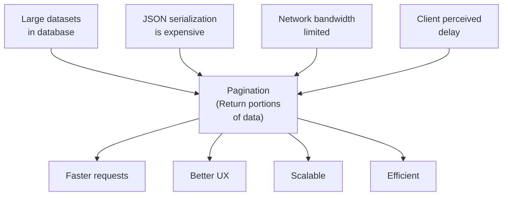

### Pagination Fields Explained

| Field           | Purpose                  | Example |
| --------------- | ------------------------ | ------- |
| **page**        | Current page number      | `1`     |
| **limit**       | Items per page           | `10`    |
| **total**       | Total count of all items | `47`    |
| **total_pages** | Total number of pages    | `5`     |
| **has_more**    | More pages available?    | `true`  |

### Pagination Query Parameters

```
GET /organizations?page=1&limit=10
GET /books?page=3&limit=20
GET /tasks?page=2&limit=15&sort=created_at&order=desc
```

---

## Error Handling

### HTTP Status Codes for Errors

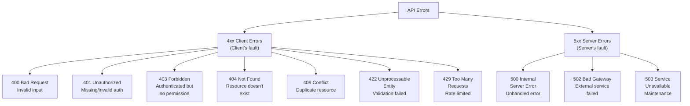

### Error Response Structure

#### Validation Error (400 Bad Request)

```json
{
  "status": "error",
  "code": 400,
  "message": "Validation failed",
  "type": "VALIDATION_ERROR",
  "errors": [
    {
      "field": "email",
      "message": "Invalid email format"
    },
    {
      "field": "age",
      "message": "Must be at least 18"
    }
  ]
}
```

#### Not Found Error (404)

```json
{
  "status": "error",
  "code": 404,
  "message": "Organization not found",
  "type": "NOT_FOUND",
  "id": 999
}
```

#### Authentication Error (401)

```json
{
  "status": "error",
  "code": 401,
  "message": "Unauthorized: Invalid or missing authentication token",
  "type": "AUTHENTICATION_ERROR"
}
```

#### Permission Error (403)

```json
{
  "status": "error",
  "code": 403,
  "message": "Forbidden: You don't have permission to access this resource",
  "type": "AUTHORIZATION_ERROR"
}
```

#### Rate Limit Error (429)

```json
{
  "status": "error",
  "code": 429,
  "message": "Too many requests",
  "type": "RATE_LIMIT_EXCEEDED",
  "retry_after": 60
}
```

#### Server Error (500)

```json
{
  "status": "error",
  "code": 500,
  "message": "Internal server error",
  "type": "INTERNAL_ERROR",
  "request_id": "550e8400-e29b-41d4-a716-446655440000"
}
```

---

## Practical API Design Example

### Scenario: Project Management Platform

#### 1. Get All Organizations

```
GET /organizations?page=1&limit=10

Response (200 OK):
{
  "status": "success",
  "code": 200,
  "data": [
    {
      "id": 1,
      "name": "Acme Corp",
      "status": "active",
      "description": "Digital services company"
    }
  ],
  "pagination": {
    "page": 1,
    "limit": 10,
    "total": 1,
    "total_pages": 1,
    "has_more": false
  }
}
```

#### 2. Create Organization

```
POST /organizations
Content-Type: application/json

Request Body:
{
  "name": "TechStart Inc",
  "status": "active",
  "description": "Innovation startup"
}

Response (201 Created):
{
  "status": "success",
  "code": 201,
  "message": "Organization created successfully",
  "data": {
    "id": 2,
    "name": "TechStart Inc",
    "status": "active",
    "description": "Innovation startup",
    "created_at": "2024-02-01T10:30:00Z",
    "updated_at": "2024-02-01T10:30:00Z"
  }
}
```

#### 3. Get Single Organization

```
GET /organizations/1

Response (200 OK):
{
  "status": "success",
  "code": 200,
  "data": {
    "id": 1,
    "name": "Acme Corp",
    "status": "active",
    "description": "Digital services company",
    "created_at": "2024-01-15T08:00:00Z",
    "updated_at": "2024-01-20T14:22:00Z"
  }
}
```

#### 4. Update Organization

```
PATCH /organizations/1
Content-Type: application/json

Request Body:
{
  "status": "inactive"
}

Response (200 OK):
{
  "status": "success",
  "code": 200,
  "message": "Organization updated successfully",
  "data": {
    "id": 1,
    "name": "Acme Corp",
    "status": "inactive",                    // ← Updated
    "description": "Digital services company",
    "created_at": "2024-01-15T08:00:00Z",
    "updated_at": "2024-02-01T11:45:00Z"    // ← Updated timestamp
  }
}
```

#### 5. Delete Organization

```
DELETE /organizations/1

Response (204 No Content):
(No response body)
```

#### 6. Get Projects in Organization

```
GET /organizations/1/projects?page=1&limit=10

Response (200 OK):
{
  "status": "success",
  "code": 200,
  "data": [
    {
      "id": 101,
      "org_id": 1,
      "name": "Website Redesign",
      "status": "in_progress",
      "created_at": "2024-01-20T09:00:00Z",
      "updated_at": "2024-01-25T14:30:00Z"
    },
    {
      "id": 102,
      "org_id": 1,
      "name": "Mobile App Development",
      "status": "planning",
      "created_at": "2024-01-22T10:15:00Z",
      "updated_at": "2024-01-22T10:15:00Z"
    }
  ],
  "pagination": {
    "page": 1,
    "limit": 10,
    "total": 2,
    "total_pages": 1,
    "has_more": false
  }
}
```

#### 7. Create Task in Project

```
POST /projects/101/tasks
Content-Type: application/json

Request Body:
{
  "title": "Create wireframes",
  "status": "todo",
  "priority": "high"
}

Response (201 Created):
{
  "status": "success",
  "code": 201,
  "message": "Task created successfully",
  "data": {
    "id": 501,
    "project_id": 101,
    "title": "Create wireframes",
    "status": "todo",
    "priority": "high",
    "created_at": "2024-02-01T12:00:00Z",
    "updated_at": "2024-02-01T12:00:00Z"
  }
}
```

---

## Best Practices

### 1. **Start with UI/Design**

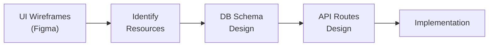

**Why**: UI shows how users interact with data, which translates to API requirements.

### 2. **Make Query Parameters Optional**

```
❌ WRONG:
GET /books?sort=date  (required)

✅ CORRECT:
GET /books            (all books, default sort)
GET /books?sort=date  (custom sort)
```

**Why**: Better developer experience, fewer required parameters.

### 3. **Use Consistent Response Formats**

Always return:

- `status`: "success" or "error"
- `code`: HTTP status code
- `data`: Actual data or error details
- `message`: Human-readable message (optional)

### 4. **Document Everything**

- Clear endpoint descriptions
- Example request/response bodies
- Error scenarios
- Authentication requirements
- Rate limiting info

### 5. **Version Your APIs**

```
✅ CORRECT:
GET /v1/books
GET /v2/books

❌ WRONG:
GET /books-v1
GET /books_v2
```

**Why**: Clean, standardized approach when breaking changes occur.

### 6. **Use Webhooks for Events**

Instead of polling:

```
❌ Polling (wasteful):
Every 5 seconds: GET /tasks/501/status

✅ Webhooks (efficient):
When task.status changes → POST /webhooks/task-updated
```

### 7. **Implement Rate Limiting**

Prevent abuse:

```
X-RateLimit-Limit: 1000
X-RateLimit-Remaining: 999
X-RateLimit-Reset: 1234567890
```

### 8. **Enable CORS Properly**

```
Access-Control-Allow-Origin: https://frontend.example.com
Access-Control-Allow-Methods: GET, POST, PATCH, DELETE
Access-Control-Allow-Headers: Content-Type, Authorization
```

### 9. **Use Semantic HTTP Methods**

| Operation        | Method |
| ---------------- | ------ |
| Fetch all        | GET    |
| Fetch one        | GET    |
| Create           | POST   |
| Update partially | PATCH  |
| Replace entirely | PUT    |
| Delete           | DELETE |
| Custom action    | POST   |

### 10. **Include Request IDs in Responses**

```json
{
  "status": "error",
  "code": 500,
  "request_id": "550e8400-e29b-41d4-a716-446655440000"
}
```

**Why**: Helps with debugging and tracing across microservices.

---

## API Design Checklist

Before deploying your API, verify:

- [ ] All resources identified from UI/requirements
- [ ] Resource names are plural
- [ ] URLs use hyphens for multi-word resources
- [ ] HTTP methods follow REST semantics (GET, POST, PATCH, DELETE)
- [ ] Success responses include data and appropriate status codes
- [ ] Error responses are consistent and include error types
- [ ] Pagination implemented for list endpoints
- [ ] Query parameters are optional
- [ ] API is versioned
- [ ] Documentation is clear with examples
- [ ] Authentication/authorization is specified
- [ ] Rate limiting is documented
- [ ] CORS is properly configured
- [ ] Response timestamps are in ISO 8601 format
- [ ] Consistent response structure throughout

---

## Summary

### REST API Design Workflow

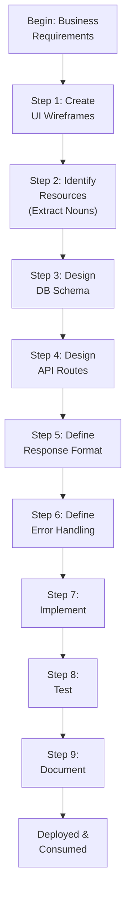

### Key Takeaways

1. **API design comes before implementation** - Start with UI, not code
2. **Follow REST standards** - Eliminates confusion and reduces integration time
3. **Resources are nouns** - Identify from requirements
4. **HTTP methods have semantics** - GET = fetch, POST = create, PATCH = update, DELETE = delete
5. **Idempotency matters** - GET, PATCH, PUT, DELETE are idempotent; POST is not
6. **URLs tell a story** - Hierarchy shows relationships
7. **Pagination is essential** - For scalability and UX
8. **Consistency is key** - Response format, error handling, status codes
9. **Documentation is critical** - Examples, error scenarios, auth requirements
10. **Version your APIs** - For managing breaking changes

---

## References

- **Roy Fielding's REST Dissertation**: Search "Roy Fielding REST" for the original PhD dissertation
- **HTTP Semantics**: Understand idempotency and safe operations
- **REST Best Practices**: Followed by major APIs (GitHub, Stripe, Google, etc.)
- **Next Steps**: Learn database design, authentication/authorization, and monitoring
