# Backend Databases with PostgreSQL

## Table of Contents

1. [Why Databases?](#why-databases)
2. [What is a Database?](#what-is-a-database)
3. [Database Management Systems (DBMS)](#database-management-systems-dbms)
4. [Problem with Simple File Storage](#problem-with-simple-file-storage)
5. [Types of Databases](#types-of-databases)
6. [Why PostgreSQL](#why-postgresql)
7. [PostgreSQL Data Types](#postgresql-data-types)
8. [Database Migrations](#database-migrations)
9. [Schema Design](#schema-design)
10. [SQL Queries for APIs](#sql-queries-for-apis)
11. [Joins](#joins)
12. [Parameterized Queries](#parameterized-queries)
13. [Database Indexes](#database-indexes)
14. [Triggers](#triggers)

---

## Why Databases?

### The Problem: Persistence

Every application needs to **persist information** across different sessions. Persistence means storing data in a way that survives even after the program stops running.

### Real-World Example: To-Do App

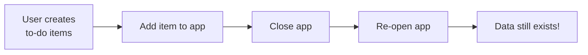

**Without persistence**: Every time you open the app, you lose all your tasks.
**With persistence**: Your tasks remain even after closing and reopening.

---

## What is a Database?

### Broad Definition

A database is **any structured storage** that allows Create-Read-Update-Delete (CRUD) operations.

### Examples of Databases

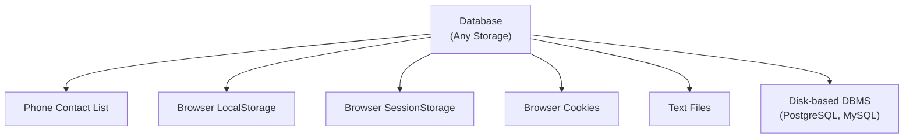

### In Backend Context

When backend engineers say "database," they specifically mean:

**Disk-based relational or non-relational databases** like PostgreSQL, MySQL, MongoDB, etc.

---

## Database Management Systems (DBMS)

### Definition

A DBMS is **software** that efficiently provides structured storage and CRUD operations on large datasets.

### Why Not Just File Storage?

Simply storing data in text files causes major problems:

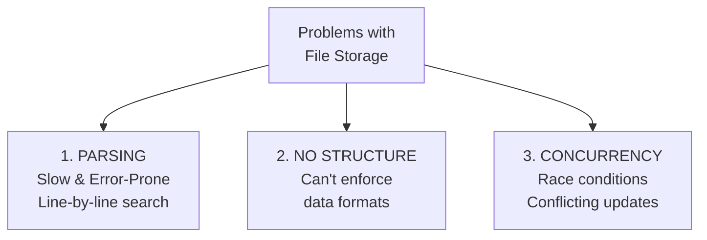

#### Example: Concurrency Problem

```
Initial Amount: 40

User 1 Thread:
  1. Read: 40
  2. Increase by 20: 40 + 20 = 60
  3. Write: 60 ❌

User 2 Thread:
  1. Read: 40
  2. Decrease by 20: 40 - 20 = 20
  3. Write: 20 ❌

Result: INCONSISTENT DATA!
Which value (60 or 20) persists depends on timing.
```

### DBMS Responsibilities

| Responsibility          | Purpose                                      |
| ----------------------- | -------------------------------------------- |
| **Data Organization**   | Efficiently organize data for fast retrieval |
| **Access Methods**      | Provide CRUD operations                      |
| **Integrity**           | Ensure data accuracy and validity            |
| **Security**            | Protect from unauthorized access             |
| **Scalability**         | Handle millions of users                     |
| **Concurrency Control** | Safe multi-user updates                      |

---

## Types of Databases

### Relational Databases

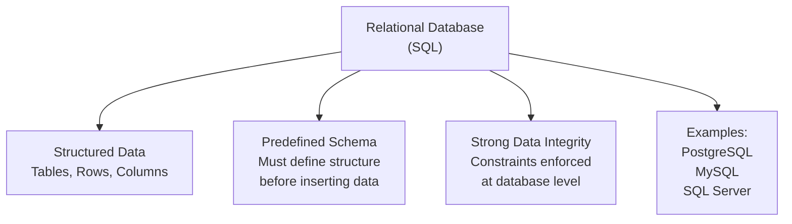

**Characteristics**:

- Strict schema (must define tables, columns, types beforehand)
- Relationships between tables via foreign keys
- ACID properties (guaranteed consistency)
- Uses SQL language

### Non-Relational Databases

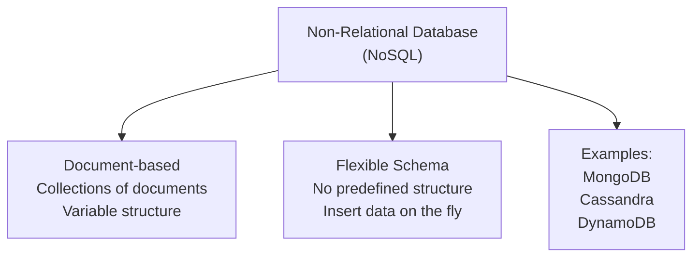

**Characteristics**:

- Flexible/dynamic schema
- No predefined structure
- Easier to scale horizontally
- Less strict relationships

### Use Case Comparison

| Use Case                              | Best Choice              | Reason                                       |
| ------------------------------------- | ------------------------ | -------------------------------------------- |
| **CRM System** (Customer data)        | Relational (PostgreSQL)  | Need strong data integrity, complex queries  |
| **Content Management System** (Blog)  | Non-Relational (MongoDB) | Content structure varies, flexibility needed |
| **E-commerce** (Orders, payments)     | Relational (PostgreSQL)  | Accuracy critical, complex relationships     |
| **User Profiles** (Flexible metadata) | Non-Relational           | Profile fields vary by user                  |

---

## Why PostgreSQL

### 5 Compelling Reasons

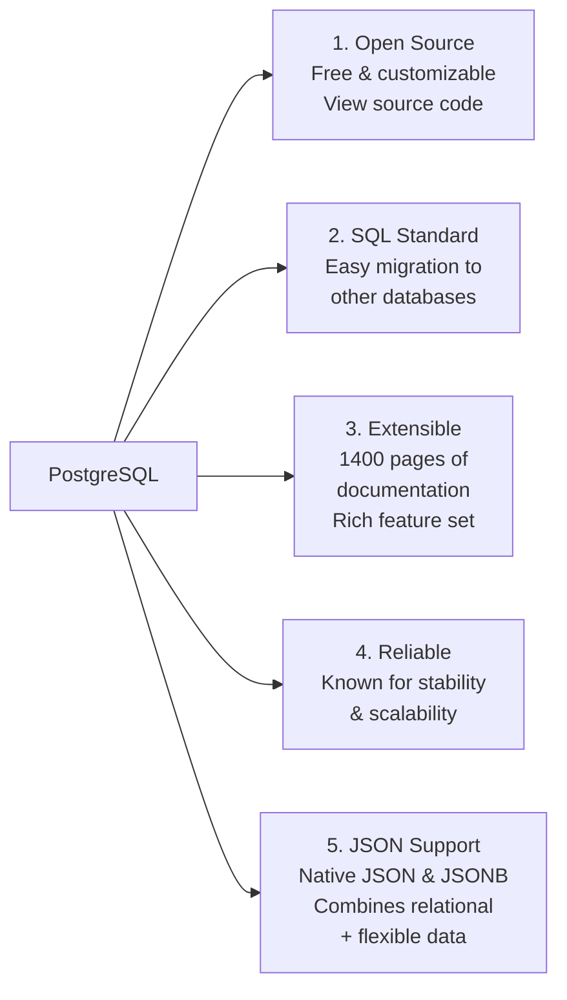

### The JSON Advantage

```
NoSQL advantage: Store any JSON data
PostgreSQL advantage: Store any JSON data + SQL queries + constraints

Best of both worlds! ✅
```

---

## PostgreSQL Data Types

### Numeric Types

| Type               | Purpose                   | Example          |
| ------------------ | ------------------------- | ---------------- |
| **SERIAL**         | Auto-incrementing integer | 1, 2, 3, ...     |
| **BIGSERIAL**      | Auto-incrementing 64-bit  | For production   |
| **INTEGER/BIGINT** | Fixed-size integers       | 42, -1000        |
| **DECIMAL(10,2)**  | Precise decimals          | For money: 99.99 |
| **FLOAT/DOUBLE**   | Approximate decimals      | Science: 3.14159 |

### When to Use DECIMAL vs FLOAT

```
DECIMAL: Money, prices, accounting
  - Exact: 10.50 is always 10.50
  - Safe: No rounding errors
  - Trade-off: Slower

FLOAT: Scientific, measurements
  - Approximate: 10.50 might be 10.5000000001
  - Fast: Optimized operations
  - Trade-off: Possible precision loss
```

### String Types

| Type           | Purpose          | Use Case                   |
| -------------- | ---------------- | -------------------------- |
| **CHAR(n)**    | Fixed-length     | Days (Mo, Tu, We)          |
| **VARCHAR(n)** | Variable-length  | Names, limited size        |
| **TEXT**       | Unlimited length | **RECOMMENDED** - use this |

**Best Practice**: Use TEXT (no length limit needed at DB level, enforce in app)

### Special Types

| Type                         | Purpose                | Example                 |
| ---------------------------- | ---------------------- | ----------------------- |
| **BOOLEAN**                  | True/false             | `true` or `false`       |
| **DATE**                     | Date only              | `2024-02-15`            |
| **TIME**                     | Time only              | `14:30:00`              |
| **TIMESTAMP**                | Date + time            | `2024-02-15 14:30:00`   |
| **TIMESTAMP WITH TIME ZONE** | Date + time + timezone | With UTC offset         |
| **UUID**                     | Unique identifier      | `550e8400-e29b-41d4...` |
| **JSON / JSONB**             | JSON data              | `{"key": "value"}`      |
| **ARRAY**                    | Ordered collection     | `ARRAY[1, 2, 3]`        |

---

## Database Migrations

### What Are Migrations?

Migrations are **version-controlled SQL files** that describe database changes over time.

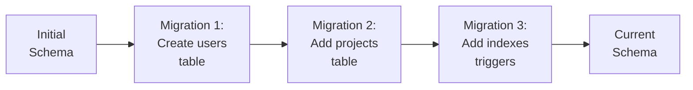

### Typical Migration Structure

```
db/
├── migrations/
│   ├── 001_create_users_table.sql
│   ├── 002_create_projects_table.sql
│   └── 003_add_indexes_and_triggers.sql
└── seeds/
    └── seed_data.sql
```

### Migration File Format

```sql
-- ===== UP MIGRATION =====
-- Changes to apply
CREATE TABLE users (
  id UUID PRIMARY KEY DEFAULT gen_random_uuid(),
  email TEXT NOT NULL UNIQUE,
  ...
);

-- ===== DOWN MIGRATION =====
-- Rollback changes
DROP TABLE users;
```

### Why Migrations Matter

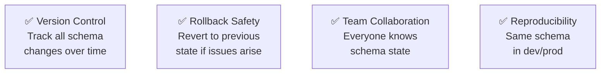

---

## Schema Design

### Example: Project Management Platform

#### Resources Identified

```
- Organizations (company/team)
- Projects (initiatives)
- Tasks (work items)
- Users (people)
- Tags (labels)
```

### Database Relationships

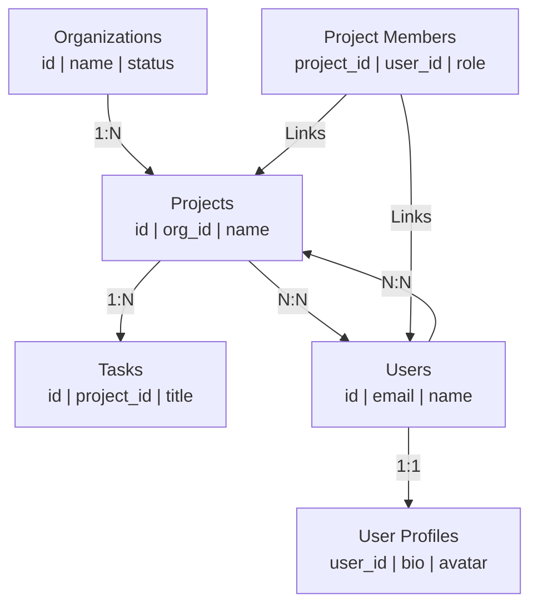

### Relationship Types

#### 1. One-to-One (1:1)

**Definition**: Each row in Table A is linked to exactly one row in Table B, and vice versa.

**Real-World Example**:

```
Users Table ──→ User_Profiles Table
One user has one profile
One profile belongs to one user
```

**When to Use**:

- User accounts with optional detailed profiles
- Organizations with headquarters info
- Employee salary information (sensitive, often in separate table)

**Implementation Methods**:

**Method 1: Foreign Key in Profile Table**

```sql
CREATE TABLE users (
  id UUID PRIMARY KEY,
  email TEXT NOT NULL UNIQUE,
  created_at TIMESTAMP DEFAULT NOW()
);

CREATE TABLE user_profiles (
  id UUID PRIMARY KEY,
  user_id UUID NOT NULL UNIQUE,  -- UNIQUE ensures 1:1
  bio TEXT,
  avatar_url TEXT,
  created_at TIMESTAMP DEFAULT NOW(),
  FOREIGN KEY (user_id) REFERENCES users(id) ON DELETE CASCADE
);
```

**Key Points**:

- `UNIQUE` constraint on `user_id` in profiles ensures one-to-one
- Without `UNIQUE`, it would be one-to-many
- `ON DELETE CASCADE` means if user is deleted, profile is also deleted

**Query Example**:

```sql
-- Get user with profile
SELECT u.*, p.bio, p.avatar_url
FROM users u
LEFT JOIN user_profiles p ON u.id = p.user_id
WHERE u.id = $1;
```

**Method 2: Shared Primary Key**

```sql
CREATE TABLE users (
  id UUID PRIMARY KEY,
  email TEXT NOT NULL UNIQUE
);

CREATE TABLE user_profiles (
  id UUID PRIMARY KEY,  -- Same as user.id
  bio TEXT,
  avatar_url TEXT,
  FOREIGN KEY (id) REFERENCES users(id) ON DELETE CASCADE
);
```

Both methods work; Method 1 is more flexible.

---

#### 2. One-to-Many (1:N)

**Definition**: One row in Table A can be linked to many rows in Table B, but each row in Table B links to only one row in Table A.

**Real-World Example**:

```
Organizations (1) ──→ Projects (Many)
One organization can have many projects
Each project belongs to exactly one organization
```

**When to Use**:

- Organizations to projects
- Projects to tasks
- Authors to books
- Departments to employees

**Implementation**:

```sql
CREATE TABLE organizations (
  id UUID PRIMARY KEY,
  name TEXT NOT NULL
);

CREATE TABLE projects (
  id UUID PRIMARY KEY,
  org_id UUID NOT NULL,  -- Foreign key to organizations
  name TEXT NOT NULL,
  FOREIGN KEY (org_id) REFERENCES organizations(id) ON DELETE CASCADE
);
```

**Key Points**:

- Foreign key goes in the "many" table (projects)
- Multiple projects can have the same `org_id`
- No `UNIQUE` constraint on `org_id`
- `ON DELETE CASCADE` - if org deleted, all projects deleted

**Query Examples**:

```sql
-- Get all projects for organization 1
SELECT * FROM projects WHERE org_id = $1;

-- Get organizations with project count
SELECT o.id, o.name, COUNT(p.id) as project_count
FROM organizations o
LEFT JOIN projects p ON o.id = p.org_id
GROUP BY o.id, o.name;

-- Get top 3 organizations with most projects
SELECT o.id, o.name, COUNT(p.id) as project_count
FROM organizations o
LEFT JOIN projects p ON o.id = p.org_id
GROUP BY o.id, o.name
ORDER BY project_count DESC
LIMIT 3;
```

---

#### 3. Many-to-Many (N:N)

**Definition**: Many rows in Table A can be linked to many rows in Table B. A junction/linking table is required.

**Real-World Example**:

```
Users (Many) <──→ Projects (Many)
Many users can work on many projects
One project can have many users
```

**When to Use**:

- Users to projects/teams
- Products to categories
- Students to courses
- Employees to skills

**Implementation with Junction Table**:

```sql
-- Table 1: Users
CREATE TABLE users (
  id UUID PRIMARY KEY,
  email TEXT NOT NULL UNIQUE,
  name TEXT NOT NULL
);

-- Table 2: Projects
CREATE TABLE projects (
  id UUID PRIMARY KEY,
  name TEXT NOT NULL,
  status VARCHAR(50)
);

-- Junction Table: Links users to projects
CREATE TABLE project_members (
  id UUID PRIMARY KEY,
  project_id UUID NOT NULL,
  user_id UUID NOT NULL,
  role VARCHAR(50),  -- 'admin', 'member', 'viewer'
  joined_at TIMESTAMP DEFAULT NOW(),

  -- Composite primary key: ensure one user per project only once
  UNIQUE(project_id, user_id),

  -- Foreign keys
  FOREIGN KEY (project_id) REFERENCES projects(id) ON DELETE CASCADE,
  FOREIGN KEY (user_id) REFERENCES users(id) ON DELETE CASCADE
);
```

**Why Junction Table?**

Without junction table:

```
❌ Can't store: Which role does user have in project?
❌ Can't store: When did they join?
❌ Violates normalization
```

With junction table:

```
✅ Can store extra relationship data (role, joined_at)
✅ Can link one user to many projects
✅ Can link one project to many users
✅ Follows database normalization
```

**Example Data**:

```
users table:
┌────┬───────┬─────────┐
│ id │ email │  name   │
├────┼───────┼─────────┤
│ 1  │ a@... │  Alice  │
│ 2  │ b@... │  Bob    │
│ 3  │ c@... │ Charlie │
└────┴───────┴─────────┘

projects table:
┌────┬──────────────┐
│ id │    name      │
├────┼──────────────┤
│ P1 │ Website      │
│ P2 │ Mobile App   │
└────┴──────────────┘

project_members table (Junction):
┌────┬────────────┬─────────┬──────────┐
│ id │ project_id │ user_id │   role   │
├────┼────────────┼─────────┼──────────┤
│ 1  │    P1      │    1    │  admin   │
│ 2  │    P1      │    2    │  member  │
│ 3  │    P2      │    2    │  admin   │
│ 4  │    P2      │    3    │  member  │
└────┴────────────┴─────────┴──────────┘

This means:
- Alice (1) works on Website as admin
- Bob (2) works on Website as member AND Mobile App as admin
- Charlie (3) works on Mobile App as member
```

**Query Examples**:

```sql
-- Get all users in project P1
SELECT u.id, u.email, u.name, pm.role
FROM users u
JOIN project_members pm ON u.id = pm.user_id
WHERE pm.project_id = $1;

-- Get all projects for user 2 (Bob)
SELECT p.id, p.name, pm.role
FROM projects p
JOIN project_members pm ON p.id = pm.project_id
WHERE pm.user_id = $1;

-- Add user to project
INSERT INTO project_members (project_id, user_id, role)
VALUES ($1, $2, 'member')
ON CONFLICT (project_id, user_id) DO NOTHING;  -- Prevent duplicates

-- Remove user from project
DELETE FROM project_members
WHERE project_id = $1 AND user_id = $2;

-- Get users count per project
SELECT p.id, p.name, COUNT(pm.user_id) as member_count
FROM projects p
LEFT JOIN project_members pm ON p.id = pm.project_id
GROUP BY p.id, p.name;
```

**Why UNIQUE(project_id, user_id)?**

```
Without UNIQUE constraint:
┌────┬────────────┬─────────┐
│ id │ project_id │ user_id │
├────┼────────────┼─────────┤
│ 1  │    P1      │    1    │
│ 2  │    P1      │    1    │  ← DUPLICATE! Bob added twice
│ 3  │    P1      │    1    │  ← DUPLICATE! Bob added three times
└────┴────────────┴─────────┘

With UNIQUE(project_id, user_id):
Attempt to insert duplicate → Database rejects it ✅
```

### Best Practices

#### 1. Always Include Metadata

```sql
CREATE TABLE users (
  id UUID PRIMARY KEY DEFAULT gen_random_uuid(),
  email TEXT NOT NULL UNIQUE,
  full_name TEXT NOT NULL,
  created_at TIMESTAMP WITH TIME ZONE DEFAULT NOW(),
  updated_at TIMESTAMP WITH TIME ZONE DEFAULT NOW()
);
```

**Why**: Track resource creation and modification

#### 2. Use Snake Case for Names

```sql
-- ✅ GOOD
user_id, full_name, created_at

-- ❌ BAD
userId (camelCase - requires quotes in PostgreSQL)
user_profile (could be confused with column name)
```

#### 3. Define Constraints

```sql
CREATE TABLE users (
  id UUID PRIMARY KEY,
  email TEXT NOT NULL UNIQUE,  -- Can't duplicate, can't be empty
  status VARCHAR(50) NOT NULL DEFAULT 'active'
);
```

#### 4. Use Enums for Fixed Values

```sql
-- Define allowed values
CREATE TYPE project_status AS ENUM ('active', 'completed', 'archived');
CREATE TYPE task_priority AS ENUM ('low', 'medium', 'high', 'urgent');

-- Use in tables
CREATE TABLE projects (
  id UUID PRIMARY KEY,
  status project_status NOT NULL DEFAULT 'active'
);
```

**Why**:

- Database enforces valid values
- Self-documents allowed options
- Prevents typos

#### 5. Use Foreign Keys with Constraints

```sql
CREATE TABLE projects (
  id UUID PRIMARY KEY,
  org_id UUID NOT NULL,
  FOREIGN KEY (org_id) REFERENCES organizations(id)
    ON DELETE RESTRICT  -- Prevent deleting org with projects
);
```

---

## SQL Queries for APIs

### 1. Get All Users with Profiles

```sql
SELECT
  u.*,
  to_jsonb(up.*) as profile
FROM users u
LEFT JOIN user_profiles up ON u.id = up.user_id
ORDER BY u.created_at DESC
LIMIT 10 OFFSET 0;
```

**Purpose**: Fetch users with nested profile data for list API

### 2. Get Single User

```sql
SELECT
  u.*,
  to_jsonb(up.*) as profile
FROM users u
LEFT JOIN user_profiles up ON u.id = up.user_id
WHERE u.id = $1;
```

**Purpose**: Fetch specific user by ID (use parameterized query)

### 3. Create User

```sql
INSERT INTO users (email, full_name, password_hash)
VALUES ($1, $2, $3)
RETURNING *;
```

**Purpose**: Insert new user and return created record

### 4. Update User Profile

```sql
UPDATE user_profiles
SET
  bio = $1,
  phone = $2,
  updated_at = NOW()
WHERE user_id = $3
RETURNING *;
```

**Purpose**: Update specific profile fields

### 5. Get All Tasks with Filters and Pagination

```sql
SELECT
  t.*,
  to_jsonb(u.*) as assigned_to_user
FROM tasks t
LEFT JOIN users u ON t.assigned_to = u.id
WHERE
  t.project_id = $1
  AND t.status = $2  -- Filter by status
  AND t.priority >= $3  -- Filter by priority
ORDER BY t.created_at DESC
LIMIT $4 OFFSET $5;  -- Pagination
```

**Purpose**: Fetch tasks with dynamic filters and pagination

---

## Joins

### Why Joins Matter

In relational databases, data is split across multiple tables. Joins allow us to combine related data from different tables into a single result.

```
Without Joins: Incomplete data
┌─────────────────────────────────────────┐
│ users table (incomplete view)           │
├──────┬─────────────┬─────────────────────┤
│ id   │ email       │ bio (missing)       │
├──────┼─────────────┼─────────────────────┤
│ 1    │ alice@...   │ ??? (in other table)│
│ 2    │ bob@...     │ ??? (in other table)│
└──────┴─────────────┴─────────────────────┘

With Joins: Complete data
Combine users + user_profiles → Full picture ✅
```

### How Joins Work Internally

**Join Mechanism**:

```
1. Left table (FROM users) → Read each row
2. For each row, find matching row in right table
3. Match condition (ON u.id = up.user_id)
4. Combine the rows
5. Return result
```

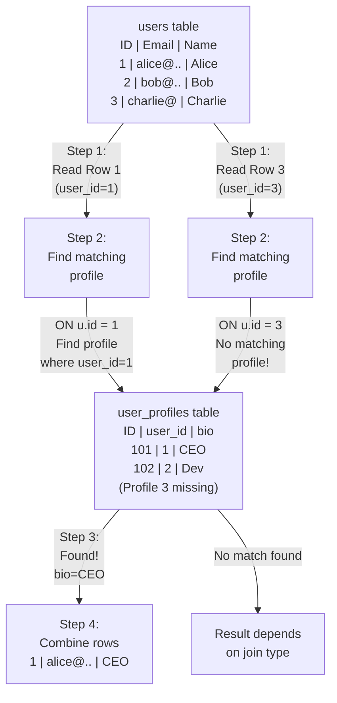

### Types of Joins

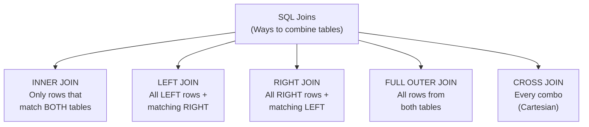

---

### 1. INNER JOIN (Most Restrictive)

**Definition**: Returns only rows that have matches in BOTH tables.

**Visual**:

```
Users Table          Profiles Table
┌────┬──────┐      ┌───┬─────────┐
│id  │name  │      │uid│bio      │
├────┼──────┤      ├───┼─────────┤
│ 1  │Alice │◄────►│ 1 │CEO      │ ✅ Match! Include
│ 2  │Bob   │      │ 2 │Dev      │ ✅ Match! Include
│ 3  │Charlie│      │   │         │ ❌ No profile! Exclude
│ 4  │David │      │   │         │ ❌ No profile! Exclude
└────┴──────┘      └───┴─────────┘
                    │ 5 │Designer │ ❌ Orphan profile! Exclude
```

**Query**:

```sql
SELECT u.id, u.name, p.bio
FROM users u
INNER JOIN user_profiles p ON u.id = p.user_id;
```

**Result**:

```
┌────┬──────┬─────┐
│ id │ name │ bio │
├────┼──────┼─────┤
│ 1  │Alice │CEO  │
│ 2  │Bob   │Dev  │
└────┴──────┴─────┘
```

**When to Use**:

- When you ONLY want related data
- "Get users who have profiles"
- "Get orders with customer info"
- Exclude orphaned/incomplete records

**Example Use Cases**:

```sql
-- Get only members with verified email (both tables must have match)
SELECT u.id, u.email
FROM users u
INNER JOIN email_verifications ev ON u.id = ev.user_id;

-- Get projects with assigned members
SELECT p.name, COUNT(pm.user_id) as members
FROM projects p
INNER JOIN project_members pm ON p.id = pm.project_id
GROUP BY p.id, p.name
HAVING COUNT(pm.user_id) > 0;  -- Only projects with members
```

---

### 2. LEFT JOIN (Most Common)

**Definition**: Returns ALL rows from LEFT table + matching rows from RIGHT table. Non-matching rows in RIGHT table show as NULL.

**Visual**:

```
Users Table          Profiles Table
┌────┬──────┐      ┌───┬─────────┐
│id  │name  │      │uid│bio      │
├────┼──────┤      ├───┼─────────┤
│ 1  │Alice │◄────►│ 1 │CEO      │ ✅ Match! Use profile
│ 2  │Bob   │      │ 2 │Dev      │ ✅ Match! Use profile
│ 3  │Charlie│      │   │         │ ❌ No profile! Use NULL
│ 4  │David │      │   │         │ ❌ No profile! Use NULL
└────┴──────┘      └───┴─────────┘
                    │ 5 │Designer │ ← Ignored (not in left table)
```

**Query**:

```sql
SELECT u.id, u.name, p.bio
FROM users u
LEFT JOIN user_profiles p ON u.id = p.user_id;
```

**Result**:

```
┌────┬──────┬─────────┐
│ id │ name │ bio     │
├────┼──────┼─────────┤
│ 1  │Alice │CEO      │
│ 2  │Bob   │Dev      │
│ 3  │Charlie│ NULL   │ ← No profile, but user still included
│ 4  │David │ NULL    │ ← No profile, but user still included
└────┴──────┴─────────┘
```

**When to Use**:

- When you want ALL records from left table, even if no match
- "Get all users, show profile if exists"
- "Get all organizations, show project count"
- Most common in real-world APIs

**Detecting NULL Values**:

```sql
-- Find users without profiles
SELECT u.id, u.name
FROM users u
LEFT JOIN user_profiles p ON u.id = p.user_id
WHERE p.user_id IS NULL;  -- No matching profile

-- Results:
┌────┬──────┐
│ id │ name │
├────┼──────┤
│ 3  │Charlie│
│ 4  │David │
└────┴──────┘
```

**Example Use Cases**:

```sql
-- Get all organizations with their project count (zero for new orgs)
SELECT o.id, o.name, COUNT(p.id) as project_count
FROM organizations o
LEFT JOIN projects p ON o.id = p.org_id
GROUP BY o.id, o.name;

-- Get all users with optional profile data
SELECT u.id, u.email, COALESCE(p.bio, 'No bio') as bio
FROM users u
LEFT JOIN user_profiles p ON u.id = p.user_id;
```

---

### 3. RIGHT JOIN (Mirror of LEFT JOIN)

**Definition**: Returns ALL rows from RIGHT table + matching rows from LEFT table. Opposite of LEFT JOIN.

**Visual**:

```
Users Table          Profiles Table
┌────┬──────┐      ┌───┬─────────┐
│id  │name  │      │uid│bio      │
├────┼──────┤      ├───┼─────────┤
│ 1  │Alice │◄────►│ 1 │CEO      │ ✅ Match! Include
│ 2  │Bob   │      │ 2 │Dev      │ ✅ Match! Include
│ 3  │Charlie│      │   │         │ ← Ignored (not in right table)
│ 4  │David │      │   │         │ ← Ignored (not in right table)
└────┴──────┘      └───┴─────────┘
                    │ 5 │Designer │ ✅ No user! Include with NULL
```

**Query**:

```sql
SELECT u.id, u.name, p.bio
FROM users u
RIGHT JOIN user_profiles p ON u.id = p.user_id;
```

**Result**:

```
┌──────┬──────┬─────────┐
│ id   │ name │ bio     │
├──────┼──────┼─────────┤
│ 1    │Alice │CEO      │
│ 2    │Bob   │Dev      │
│ NULL │ NULL │Designer │ ← Profile with no user!
└──────┴──────┴─────────┘
```

**When to Use**:

- Less common than LEFT JOIN
- "Get all profiles, show user if exists"
- Find orphaned records in right table
- Usually better to rewrite as LEFT JOIN

**Note**: Most experienced SQL developers prefer LEFT JOIN. RIGHT JOIN is often rewritten:

```sql
-- Instead of:
SELECT * FROM users u RIGHT JOIN profiles p ON u.id = p.user_id;

-- Write:
SELECT * FROM profiles p LEFT JOIN users u ON p.user_id = u.id;
```

---

### 4. FULL OUTER JOIN (Include All)

**Definition**: Returns ALL rows from BOTH tables. Non-matching rows show NULL.

**Visual**:

```
Users Table          Profiles Table
┌────┬──────┐      ┌───┬─────────┐
│id  │name  │      │uid│bio      │
├────┼──────┤      ├───┼─────────┤
│ 1  │Alice │◄────►│ 1 │CEO      │ ✅ Match! Include
│ 2  │Bob   │      │ 2 │Dev      │ ✅ Match! Include
│ 3  │Charlie│      │   │         │ ✅ No profile! Include with NULL
│ 4  │David │      │   │         │ ✅ No profile! Include with NULL
└────┴──────┘      └───┴─────────┘
                    │ 5 │Designer │ ✅ No user! Include with NULL
```

**Query**:

```sql
SELECT u.id, u.name, p.bio
FROM users u
FULL OUTER JOIN user_profiles p ON u.id = p.user_id;
```

**Result**:

```
┌──────┬──────┬─────────┐
│ id   │ name │ bio     │
├──────┼──────┼─────────┤
│ 1    │Alice │CEO      │
│ 2    │Bob   │Dev      │
│ 3    │Charlie│ NULL   │
│ 4    │David │ NULL    │
│ NULL │ NULL │Designer │
└──────┴──────┴─────────┘
```

**When to Use**:

- Find data inconsistencies (users without profiles, orphaned profiles)
- Data auditing and reconciliation
- "Show me everything and let me see what doesn't match"

**Finding Problems**:

```sql
-- Find users without profiles OR profiles without users
SELECT u.id as user_id, p.user_id as profile_user_id
FROM users u
FULL OUTER JOIN user_profiles p ON u.id = p.user_id
WHERE u.id IS NULL OR p.user_id IS NULL;
```

---

### 5. CROSS JOIN (Cartesian Product)

**Definition**: Returns every combination of rows from both tables. Warning: Can create huge result sets!

**Visual**:

```
Users (3 rows)       Colors (2 rows)
┌────┬──────┐       ┌────┬────────┐
│id  │name  │       │id  │color   │
├────┼──────┤       ├────┼────────┤
│ 1  │Alice │       │ 1  │Red     │
│ 2  │Bob   │       │ 2  │Blue    │
│ 3  │Charlie│       └────┴────────┘
└────┴──────┘

CROSS JOIN Result (3 × 2 = 6 combinations):
┌────┬──────┬────────┐
│uid │name  │color   │
├────┼──────┼────────┤
│ 1  │Alice │Red     │
│ 1  │Alice │Blue    │
│ 2  │Bob   │Red     │
│ 2  │Bob   │Blue    │
│ 3  │Charlie│Red    │
│ 3  │Charlie│Blue   │
└────┴──────┴────────┘
```

**Query**:

```sql
SELECT u.name, c.color
FROM users u
CROSS JOIN colors c;
```

**When to Use**:

- Generate all possible combinations (rare)
- Matrix/reporting data
- Testing scenarios

**⚠️ Warning**: With large tables, CROSS JOIN explodes in size:

```
100 rows × 100 rows = 10,000 results
1000 rows × 1000 rows = 1,000,000 results
10000 rows × 10000 rows = 100,000,000 results ❌
```

---

### Multiple Joins

**Real-World Scenario**: Get tasks with project and assigned user

```sql
SELECT
  t.title,
  p.name as project_name,
  u.name as assigned_to
FROM tasks t
LEFT JOIN projects p ON t.project_id = p.id
LEFT JOIN users u ON t.assigned_to = u.id
WHERE t.project_id = $1
ORDER BY t.created_at DESC;
```

**Execution Flow**:

```
1. Start with tasks table
2. Join with projects (left join)
3. Join result with users (left join)
4. Filter where project_id = $1
5. Order by created_at
```

---

### Join Performance Considerations

**Query Optimizer**: Database chooses join order

```sql
-- These produce identical results, but optimizer may execute differently
FROM a JOIN b JOIN c
FROM c JOIN a JOIN b
```

**Optimization Tips**:

1. **Index foreign keys**: `CREATE INDEX idx_tasks_project_id ON tasks(project_id);`
2. **Join in logical order**: Most selective first
3. **Use EXPLAIN ANALYZE**: See actual execution plan

```sql
EXPLAIN ANALYZE
SELECT ...
FROM tasks t
JOIN projects p ON t.project_id = p.id;
```

---

## Parameterized Queries

### Why Parameterized Queries?

**Problem**: SQL Injection vulnerability

```sql
-- ❌ VULNERABLE
query = "SELECT * FROM users WHERE id = '" + user_id + "'";

// If user_id = "'; DROP TABLE users; --"
// Query becomes: SELECT * FROM users WHERE id = ''; DROP TABLE users; --'
// Result: DATABASE DESTROYED! 💀
```

**Solution**: Use parameterized queries

```sql
-- ✅ SAFE
query = "SELECT * FROM users WHERE id = $1";
database.execute(query, [user_id]);
```

The database treats `$1` as **data only**, never as executable code.

### Syntax Examples

```sql
-- Get single user
SELECT * FROM users WHERE id = $1;

-- Filter with multiple parameters
SELECT * FROM tasks
WHERE status = $1 AND priority >= $2;

-- Insert with parameters
INSERT INTO users (email, name, password_hash)
VALUES ($1, $2, $3)
RETURNING *;

-- Update with parameters
UPDATE users
SET full_name = $1, updated_at = NOW()
WHERE id = $2
RETURNING *;
```

---

## Database Indexes

### Index Fundamentals

**Definition**: An index is a data structure that allows the database to find rows faster without scanning every row in a table.

**Analogy**: Like a book's index

```
Book without index:
- Looking for "PostgreSQL" → Search every page
- 500 pages → 500 comparisons worst case ❌

Book with index:
- Look in index → "PostgreSQL, page 234"
- Turn to page 234 → Read in seconds ✅
```

### How Database Indexes Work: B-Tree Structure

PostgreSQL uses **B-Tree** index by default. It's a self-balancing tree structure.

**What is B-Tree?**

Simple list (NO INDEX):

```
[1, 2, 5, 8, 12, 15, 19, 23, 30, 45, 67, 89, 123, 145, 200]

Searching for 123:
Check 1 ❌
Check 2 ❌
Check 5 ❌
... (12 more checks)
Check 123 ✅  → 13 comparisons!
```

B-Tree INDEX structure (organized for fast search):

```
              [50]
           /       \
         [20]      [100]
        /    \     /    \
      [10]  [30] [70]  [150]
      / \   / \  / \   / \
     1-15 20-40 50-80 100-200

Searching for 123:
Compare 123 vs 50 → Go right
Compare 123 vs 100 → Go right
Compare 123 in [100-200] range → Found!

✅ Only 3 comparisons instead of 15!
```

**Why B-Tree?**

- Keeps data sorted
- Self-balancing (doesn't get lopsided)
- Guarantees O(log n) search time
- Space-efficient

### Index Storage: How PostgreSQL Stores It

**Physical Storage**:

```
Table: users (1 million rows)
Raw Data Layout (unordered):
- Row 1: alice@example.com
- Row 3: bob@example.com
- Row 5: charlie@example.com
- Row 2: alice2@example.com
... (990,996 more rows scattered)

When you CREATE INDEX idx_users_email ON users(email):

Index Structure (organized B-Tree):
Root: [M-Z emails]
   ├─ [A-F emails]
   │  ├─ alice@... → storage location #1
   │  ├─ alice2@... → storage location #4
   │  └─ bob@... → storage location #3
   └─ [G-Z emails]
      ├─ charlie@... → storage location #5
      └─ ...
```

**Query Processing Example**:

```
Query: SELECT * FROM users WHERE email = 'bob@example.com'

Without Index (Full Table Scan):
├─ Row 1: alice@example.com ❌ Not match
├─ Row 3: bob@example.com ✅ FOUND!
│  But: Had to check 500,000 rows before finding it!
├─ Row 5: charlie@example.com (scan continues...)
└─ Time: 2-5 seconds for 1M rows

With B-Tree Index:
├─ Check root: Is 'bob' in [A-F]? Yes
├─ Check leaf: Find 'bob@example.com'
├─ Found! → Jump directly to storage location #3
└─ Time: 0.001 seconds (about log₂ 1M ≈ 20 comparisons)

Improvement: 2000-5000× FASTER! 🚀
```

### Types of Indexes

#### 1. B-Tree Index (Default, Most Common)

### Index Trade-offs: Costs vs Benefits

```mermaid
graph TB
    Benefits[\"INDEX BENEFITS\"]
    Costs[\"INDEX COSTS\"]

    Benefits --> B1[\"✅ Faster SELECT queries<br/>300ms → 1ms\"]
    Benefits --> B2[\"✅ Faster JOIN operations<br/>1000ms → 50ms\"]
    Benefits --> B3[\"✅ Faster sorting<br/>ORDER BY\"]

    Costs --> C1[\"❌ Slower INSERT<br/>Must update index<br/>10ms → 15ms\"]
    Costs --> C2[\"❌ Slower UPDATE/DELETE<br/>Must rebuild index<br/>10ms → 18ms\"]
    Costs --> C3[\"❌ Extra storage<br/>Index uses disk space<br/>1GB table → 1.3GB\"]
    Costs --> C4[\"❌ Maintenance overhead<br/>Database keeps index in sync\"]
```

### Index Guidelines: When to Create

```
✅ CREATE INDEX if:
  1. Field is in WHERE clause (filtering)
  2. Field is in JOIN condition
  3. Field is in ORDER BY (sorting)
  4. Field is foreign key
  5. Query runs frequently

❌ DON'T CREATE if:
  1. Column has low selectivity (few unique values)
     Example: gender (only M/F) → Not helpful
  2. Table is small (< 10,000 rows)
  3. Column updated frequently
  4. Index rarely used (measure with EXPLAIN ANALYZE)
```

### Monitoring Indexes

**See which indexes exist**:

```sql
SELECT *
FROM pg_indexes
WHERE tablename = 'users';
```

**Analyze query execution plan**:

```sql
EXPLAIN ANALYZE
SELECT * FROM users WHERE email = 'alice@example.com';

-- Output example:
-- Seq Scan on users (cost=0.00..35.50 rows=1) (actual time=0.123..0.145 rows=1)
--   Filter: (email = 'alice@example.com')

-- If it says \"Seq Scan\", no index is used ❌
-- If it says \"Index Scan\", index is used ✅
```

**Find unused indexes**:

```sql
SELECT indexname
FROM pg_stat_user_indexes
WHERE idx_scan = 0;  -- Never used

-- Safe to DROP if truly unused
-- DROP INDEX index_name;
```

### Common Indexing Mistakes

```sql
-- ❌ MISTAKE 1: Index on every column
CREATE INDEX idx_name ON users(id);
CREATE INDEX idx_name ON users(email);
CREATE INDEX idx_name ON users(status);
-- Result: Slow inserts, large database

-- ✅ CORRECT: Index only necessary columns
CREATE INDEX idx_users_email ON users(email);
CREATE INDEX idx_users_status ON users(status);

---

-- ❌ MISTAKE 2: Index on high-cardinality columns
CREATE INDEX idx_users_created_at ON users(created_at);  -- Too many unique values
-- Might not help

-- ✅ CORRECT: Index on low-cardinality columns
CREATE INDEX idx_users_status ON users(status);  -- Few unique values (todo, done)

---

-- ❌ MISTAKE 3: Wrong index type
CREATE INDEX idx_email USING HASH ON users(email);  -- Can't do range

-- ✅ CORRECT: Use B-Tree for flexibility
CREATE INDEX idx_email ON users(email);  -- B-Tree by default
```

---

## Triggers

### What Are Triggers?

Triggers are **automatic database functions** that execute in response to specific SQL events (INSERT, UPDATE, DELETE) on a particular table.

**Think of it**: Like event listeners in JavaScript, but at the database level.

```javascript
// JavaScript example (for comparison)
element.addEventListener('click', () => {
  console.log('Clicked!');
});

-- SQL equivalent: Trigger on update
CREATE TRIGGER on_user_update
AFTER UPDATE ON users
FOR EACH ROW
EXECUTE FUNCTION log_user_change();
```

### Trigger Anatomy

```sql
CREATE TRIGGER trigger_name
  [BEFORE | AFTER]              -- Timing: before or after the event?
  [INSERT | UPDATE | DELETE]     -- Which event?
  ON table_name                  -- Which table?
  [FOR EACH ROW]                 -- Per row or per statement?
  EXECUTE FUNCTION function_name();  -- What function to run?
```

### BEFORE vs AFTER Triggers

#### BEFORE Trigger: Executes before the change is applied

**Example 1: Validate/Transform data before inserting**

```sql
-- Scenario: Create a function that validates email before insert
CREATE FUNCTION validate_email_before_insert()
RETURNS TRIGGER AS $$
BEGIN
  -- NEW = the row about to be inserted
  IF NEW.email NOT LIKE '%@%.%' THEN
    RAISE EXCEPTION 'Invalid email format: %', NEW.email;
  END IF;

  -- Transform: lowercase email
  NEW.email = LOWER(NEW.email);

  RETURN NEW;  -- Allow the change
END;
$$ LANGUAGE plpgsql;

CREATE TRIGGER trigger_validate_email
BEFORE INSERT ON users
FOR EACH ROW
EXECUTE FUNCTION validate_email_before_insert();


-- Now when you try to insert:
INSERT INTO users (email) VALUES ('ALICE@EXAMPLE.COM');
-- Trigger fires (BEFORE insert):
--   → Validates email ✅
--   → Transforms to lowercase: 'alice@example.com'
--   → THEN the insert happens
-- Result: Email stored as 'alice@example.com'
```

**Example 2: Auto-generate ID or normalize date before insert**

```sql
CREATE FUNCTION set_defaults_before_insert()
RETURNS TRIGGER AS $$
BEGIN
  -- Generate UUID if not provided
  IF NEW.id IS NULL THEN
    NEW.id = gen_random_uuid();
  END IF;

  -- Set timestamps
  NEW.created_at = NOW();
  NEW.updated_at = NOW();

  RETURN NEW;
END;
$$ LANGUAGE plpgsql;

CREATE TRIGGER trigger_set_defaults_insert
BEFORE INSERT ON users
FOR EACH ROW
EXECUTE FUNCTION set_defaults_before_insert();

-- Insert without providing timestamps or id:
INSERT INTO users (email, name) VALUES ('bob@example.com', 'Bob');
-- Trigger automatically sets id, created_at, updated_at ✅
```

#### AFTER Trigger: Executes after the change is applied

**Example 1: Log changes for audit trail**

```sql
CREATE TABLE users_audit_log (
  id UUID PRIMARY KEY,
  user_id UUID,
  action VARCHAR(50),  -- 'INSERT', 'UPDATE', 'DELETE'
  old_email TEXT,
  new_email TEXT,
  changed_at TIMESTAMP DEFAULT NOW()
);

CREATE FUNCTION log_user_changes()
RETURNS TRIGGER AS $$
BEGIN
  IF TG_OP = 'INSERT' THEN
    INSERT INTO users_audit_log (user_id, action, new_email)
    VALUES (NEW.id, 'INSERT', NEW.email);

  ELSIF TG_OP = 'UPDATE' THEN
    INSERT INTO users_audit_log (user_id, action, old_email, new_email)
    VALUES (NEW.id, 'UPDATE', OLD.email, NEW.email);

  ELSIF TG_OP = 'DELETE' THEN
    INSERT INTO users_audit_log (user_id, action, old_email)
    VALUES (OLD.id, 'DELETE', OLD.email);
  END IF;

  RETURN NULL;  -- AFTER triggers usually return NULL
END;
$$ LANGUAGE plpgsql;

CREATE TRIGGER trigger_log_user_changes
AFTER INSERT OR UPDATE OR DELETE ON users
FOR EACH ROW
EXECUTE FUNCTION log_user_changes();

-- Now every change to users table is logged:
UPDATE users SET email = 'alice.new@example.com' WHERE id = 1;
-- Trigger fires AFTER update:
--   → Inserts log entry: user_id=1, action='UPDATE', old_email='alice@...', new_email='alice.new@...'
```

**Example 2: Notify other systems**

```sql
CREATE FUNCTION notify_on_user_change()
RETURNS TRIGGER AS $$
BEGIN
  -- NOTIFY sends a message to listening clients
  PERFORM pg_notify('user_changes', json_build_object(
    'action', TG_OP,
    'user_id', COALESCE(NEW.id, OLD.id),
    'email', COALESCE(NEW.email, OLD.email),
    'timestamp', NOW()
  )::text);

  RETURN NULL;
END;
$$ LANGUAGE plpgsql;

CREATE TRIGGER trigger_notify_changes
AFTER INSERT OR UPDATE OR DELETE ON users
FOR EACH ROW
EXECUTE FUNCTION notify_on_user_change();

-- Application can LISTEN for these events:
-- LISTEN user_changes;
-- When update happens, app gets notified in real-time ✅
```

### Common Use Case: Auto-Update Timestamps

**This is the MOST common trigger**

```sql
-- Create function
CREATE FUNCTION update_updated_at()
RETURNS TRIGGER AS $$
BEGIN
  -- ALWAYS update the updated_at timestamp
  NEW.updated_at = NOW();
  RETURN NEW;  -- Allow the update
END;
$$ LANGUAGE plpgsql;

-- Create trigger
CREATE TRIGGER trigger_users_updated_at
BEFORE UPDATE ON users
FOR EACH ROW
EXECUTE FUNCTION update_updated_at();

-- Now you can do:
UPDATE users SET name = 'New Name' WHERE id = 1;
-- Trigger automatically sets updated_at = NOW()
-- No need to manually include updated_at in UPDATE statement ✅
```

### Trigger Context Variables

Inside trigger functions, you have access to special variables:

```sql
CREATE FUNCTION example_trigger()
RETURNS TRIGGER AS $$
BEGIN
  -- TG_OP: Operation type ('INSERT', 'UPDATE', or 'DELETE')
  IF TG_OP = 'UPDATE' THEN
    -- Update was triggered
    -- OLD = row before change
    -- NEW = row after change
    RAISE NOTICE 'Email changed from % to %', OLD.email, NEW.email;
  END IF;

  -- TG_WHEN: Timing ('BEFORE' or 'AFTER')
  -- TG_TABLE_NAME: Name of the table
  -- TG_NARGS: Number of trigger arguments
  -- TG_ARGV: Array of trigger arguments

  RETURN NEW;
END;
$$ LANGUAGE plpgsql;
```

### DELETE Operation with Triggers

```sql
-- Scenario: Soft delete (mark as deleted, don't actually delete)
-- Instead of: DELETE FROM users WHERE id = 1
-- We mark: UPDATE users SET deleted_at = NOW() WHERE id = 1

-- But we can also use triggers to prevent actual deletion:
CREATE TABLE users (
  id UUID PRIMARY KEY,
  email TEXT,
  deleted_at TIMESTAMP,  -- NULL = active, HAS VALUE = deleted
  created_at TIMESTAMP,
  updated_at TIMESTAMP
);

CREATE FUNCTION prevent_hard_delete()
RETURNS TRIGGER AS $$
BEGIN
  -- Instead of hard delete, soft delete
  UPDATE users
  SET deleted_at = NOW()
  WHERE id = OLD.id;

  -- Return NULL = cancel the delete operation
  RETURN NULL;
END;
$$ LANGUAGE plpgsql;

CREATE TRIGGER trigger_prevent_hard_delete
BEFORE DELETE ON users
FOR EACH ROW
EXECUTE FUNCTION prevent_hard_delete();

-- Now when someone tries:
DELETE FROM users WHERE id = 1;
-- Trigger fires (BEFORE delete):
--   → Soft deletes: SET deleted_at = NOW()
--   → RETURNS NULL (cancels hard delete)
// Result: User is marked deleted but not removed from table ✅
```

### Multiple Triggers on Same Table

```sql
-- You can have multiple triggers on the same table

CREATE TRIGGER trigger_users_updated_at
BEFORE UPDATE ON users
FOR EACH ROW
EXECUTE FUNCTION update_updated_at();

CREATE TRIGGER trigger_validate_email
BEFORE INSERT ON users
FOR EACH ROW
EXECUTE FUNCTION validate_email_before_insert();

CREATE TRIGGER trigger_log_changes
AFTER INSERT OR UPDATE OR DELETE ON users
FOR EACH ROW
EXECUTE FUNCTION log_user_changes();

-- All three fire automatically at their specified times ✅

-- Execution order:
INSERT INTO users (email) VALUES ('bob@example.com');
--   1. BEFORE INSERT trigger (validate_email)
--   2. INSERT happens
--   3. AFTER INSERT trigger (log_changes)
```

### Trigger Pitfalls & Best Practices

#### ❌ DON'T: Complex business logic in triggers

```sql
-- ❌ BAD: Business logic in trigger
CREATE FUNCTION process_payment()
RETURNS TRIGGER AS $$
BEGIN
  -- Complex payment processing
  -- Calling external APIs
  -- Multiple validations
  -- This is HARD to debug!
END;
$$ LANGUAGE plpgsql;
```

#### ✅ DO: Keep triggers simple and focused

```sql
-- ✅ GOOD: Simple, focused triggers

-- Trigger 1: Update timestamp
CREATE FUNCTION update_timestamp() RETURNS TRIGGER AS $$
BEGIN
  NEW.updated_at = NOW();
  RETURN NEW;
END;
$$ LANGUAGE plpgsql;

-- Trigger 2: Validate data
CREATE FUNCTION validate_data() RETURNS TRIGGER AS $$
BEGIN
  IF NEW.email IS NULL THEN
    RAISE EXCEPTION 'Email required';
  END IF;
  RETURN NEW;
END;
$$ LANGUAGE plpgsql;

-- Complex logic stays in application code
```

#### ⚠️ Performance considerations

```sql
-- ⚠️ WARNING: Triggers execute for EVERY row

-- Safe for small updates:
UPDATE users SET name = 'New' WHERE id = 1;  -- 1 trigger execution

-- Dangerous for bulk updates:
UPDATE users SET status = 'active';  -- Trigger fires 1,000,000 times! 🐢
-- Slow! Can take minutes

-- Solution: Use DISABLE TRIGGER for bulk operations
ALTER TABLE users DISABLE TRIGGER trigger_users_updated_at;
UPDATE users SET status = 'active';  -- FAST, no triggers
ALTER TABLE users ENABLE TRIGGER trigger_users_updated_at;
```

### Viewing Existing Triggers

```sql
-- List all triggers on a table
SELECT *
FROM pg_trigger
WHERE tgrelid = 'users'::regclass;

-- View trigger function code
SELECT pg_get_functiondef('function_name'::regprocedure);

-- Drop a trigger if needed
DROP TRIGGER trigger_name ON table_name;
```

---

## API to Database Query Examples

### Example 1: GET /v1/users

```
Frontend Request:
  GET /v1/users?page=1&limit=10&sort=created_at&order=desc

Backend Flow:
  1. Extract query parameters
  2. Parse: page=1, limit=10, sort=created_at, order=desc
  3. Construct database query
  4. Execute query
  5. Return paginated results

SQL Query:
  SELECT * FROM users
  ORDER BY created_at DESC
  LIMIT 10 OFFSET 0;
```

### Example 2: GET /v1/users/:id

```
Frontend Request:
  GET /v1/users/550e8400-e29b-41d4-a716-446655440000

Backend Flow:
  1. Extract user ID from URL parameter
  2. Validate it's a valid UUID
  3. Create parameterized query
  4. Execute query with user ID as parameter
  5. Return user with profile (if exists)

SQL Query:
  SELECT u.*, to_jsonb(up.*) as profile
  FROM users u
  LEFT JOIN user_profiles up ON u.id = up.user_id
  WHERE u.id = $1;
```

### Example 3: PATCH /v1/user-profiles/:userId

```
Frontend Request:
  PATCH /v1/user-profiles/550e8400-e29b-41d4...
  Body: { "bio": "Updated bio", "phone": "+1234567890" }

Backend Flow:
  1. Extract user ID from URL
  2. Validate request body
  3. Build UPDATE query with provided fields
  4. Trigger automatically updates `updated_at`
  5. Return updated profile

SQL Query:
  UPDATE user_profiles
  SET
    bio = $1,
    phone = $2,
    updated_at = NOW()
  WHERE user_id = $3
  RETURNING *;
```

---

## Best Practices Checklist

- [ ] Always use **parameterized queries** (prevent SQL injection)
- [ ] Create **indexes on foreign keys** (optimize joins)
- [ ] Create **indexes on frequently filtered fields** (optimize WHERE clauses)
- [ ] Use **transactions** for related operations (ensure consistency)
- [ ] Add **NOT NULL** constraints where appropriate (maintain integrity)
- [ ] Use **enum types** for fixed values (self-documents options)
- [ ] Create **unique constraints** for unique fields (email, username)
- [ ] Use **triggers** for auto-updating timestamps (reduce application logic)
- [ ] Version control **all migrations** (track schema changes)
- [ ] Seed **test data** for development (easier testing)
- [ ] Monitor **query performance** (identify slow queries)
- [ ] Use **LEFT JOIN** by default (handle missing related records)
- [ ] Paginate **list endpoints** (API performance)
- [ ] Use **JSONB** not JSON (better performance)
- [ ] Document **schema relationships** (team communication)

---

## Key Takeaways

1. **Persistence is Essential** - Databases solve the problem of keeping data alive between sessions

2. **Why PostgreSQL** - Open source, SQL standard, excellent JSON support, highly scalable

3. **Schema Design Matters** - Proper relationships (1:1, 1:N, N:N) prevent data corruption

4. **SQL Basics** - SELECT, INSERT, UPDATE with WHERE clauses handle 80% of backend work

5. **Joins Connect Tables** - LEFT JOIN most common; lets you combine data from related tables

6. **Security First** - Always use parameterized queries to prevent SQL injection

7. **Performance Optimization** - Indexes on foreign keys and filter fields dramatically speed queries

8. **Automation** - Triggers auto-update fields like timestamps (less manual code)

9. **Migrations Track Changes** - Version control your schema like you do your code

10. **Testing with Seeds** - Use seed migrations to populate test data for development

---

## Common Schema Patterns

### Soft Deletes

```sql
ALTER TABLE users ADD COLUMN deleted_at TIMESTAMP;

-- "Delete" = set timestamp
UPDATE users SET deleted_at = NOW() WHERE id = $1;

-- List only active users
SELECT * FROM users WHERE deleted_at IS NULL;
```

### Audit Trail

```sql
CREATE TABLE users_audit (
  id UUID,
  user_id UUID,
  action VARCHAR(50),  -- 'INSERT', 'UPDATE', 'DELETE'
  old_values JSONB,
  new_values JSONB,
  changed_at TIMESTAMP DEFAULT NOW()
);
```

### Status Tracking

```sql
CREATE TYPE project_status AS ENUM (
  'planning',
  'in_progress',
  'on_hold',
  'completed',
  'cancelled'
);

CREATE TABLE projects (
  id UUID PRIMARY KEY,
  status project_status,
  status_changed_at TIMESTAMP
);
```

---

## Next Steps

1. **Learn SQL deeply** - Practice SELECT, JOIN, WHERE, GROUP BY, HAVING
2. **Design schemas** - Normalize data, think about relationships
3. **Write migrations** - Use tools like Flyway, Liquibase, or db-migrate
4. **Optimize queries** - Use EXPLAIN ANALYZE to see query plans
5. **Monitor performance** - Use slow query logs and profiling tools
6. **Study ACID** - Understand transactions and consistency
7. **Learn indexes deeply** - Different types (B-tree, Hash, GIST, GIN)
8. **Master backups** - Automated backups are critical
