# Caching for Backend Engineers

## Table of Contents

- [Introduction](#introduction)
- [Why Caching Matters](#why-caching-matters)
- [Cache Fundamentals](#cache-fundamentals)
- [Caching Strategies](#caching-strategies)
- [Eviction Policies](#eviction-policies)
- [In-Memory Cache Technologies](#in-memory-cache-technologies)
- [Real-World Use Cases](#real-world-use-cases)
- [Implementation Guide](#implementation-guide)

---

## Introduction

### What is Caching?

Caching is a technique to store frequently accessed data in a location that allows for **faster retrieval**.

**Core Concept:**

```
Primary Storage (Database)
        ↓
    Subset of data
        ↓
    Cache Layer
        ↓
    Much faster retrieval
```

**Key Principle:** Cache is a **subset** of primary storage, not all data.

### The Storage Hierarchy

Different storage mechanisms have vastly different access speeds:

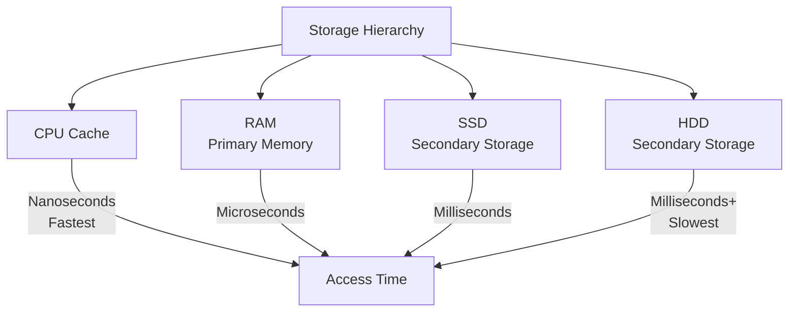

**Real Impact Example:**

```
Scenario: User profile fetched 100 times/day

Option 1: Always query database (50ms per query)
- 100 queries × 50ms = 5,000ms total
- Database load: High
- User experience: Slow

Option 2: Cache in Redis (microseconds per fetch)
- 1 query × 50ms (initial) + 99 × 0.001ms (from cache)
- Database load: Minimal
- User experience: Fast
```

---

## Why Caching Matters

### 1. **Reduced Latency**

| Storage Type      | Latency                |
| ----------------- | ---------------------- |
| Cache (RAM/Redis) | Microseconds (0.001ms) |
| Database Query    | Milliseconds (50ms)    |
| **Difference**    | **50,000x faster**     |

### 2. **Decreased Database Load**

```
Without cache:
1,000 users × 100 requests = 100,000 DB queries/minute

With cache:
1 DB query + 99,999 cache hits = 1 DB query/minute
(99% reduction in database load)
```

### 3. **Improved User Experience**

Faster response times = better satisfaction

### 4. **Cost Savings**

- Fewer database queries = lower infrastructure costs
- Less compute required
- Reduced operational overhead

### 5. **Scalability**

Handle more concurrent users without scaling database immediately.

---

## Cache Fundamentals

### What Gets Cached?

**Good Candidates:**

- Frequently accessed data
- Expensive calculations
- Data that doesn't change often
- Static content

**Bad Candidates:**

- **Credentials & Secrets** - Passwords, API keys, credit card numbers (never cache these)
- **Personally Identifiable Information (PII)** - Social security numbers, passport numbers, medical records
- **Data requiring 100% accuracy** - Stock prices, bank balances, inventory levels (must always be current)
- **Data that changes constantly** - Rapidly updating metrics without acceptable staleness
- **Large objects** - Memory constraints make caching impractical

**Safe to Cache (Surprises Many People!):**

- **Session data** - userId, roles, permissions, login timestamp (these are NOT credentials)
- **User metadata** - Email, name, preferences (usually public anyway)
- **Counters with acceptable lag** - Page views, likes, impressions (small delay is ok)
- **Read-only reference data** - Category lists, lookup tables
- **Eventually-real-time data** - Leaderboard scores, analytics (users accept 1-2 second delay)

**Key Distinction:**

```
❌ Cache:     password, credit_card, api_key, ssn
✓ DO Cache:  { userId: 5, role: "admin", email: "user@example.com" }

Sessions are SAFE because they contain identification (who you are),
not authentication (proof of who you are).
```

### Cache Isolation Layers

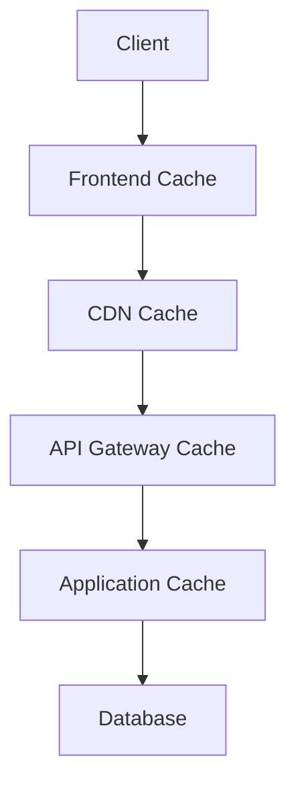

Each layer reduces load on layers below it.

---

## Caching Strategies

How you load data into cache and keep it fresh determines effectiveness.

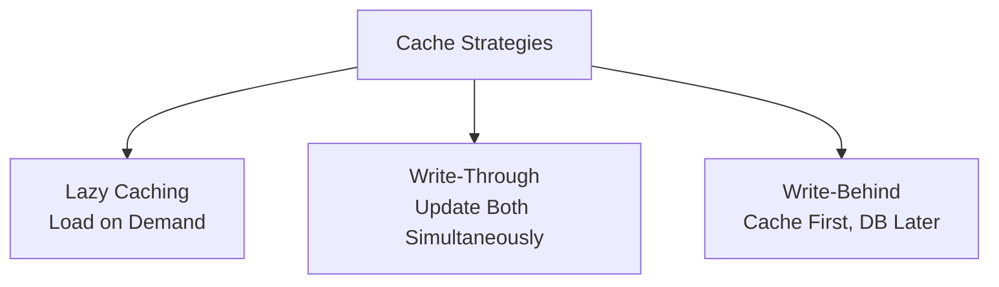

---

### Strategy 1: Lazy Caching (Lazy Loading)

**When to use:** Most common, simple implementation

**How it works:**

```
1. Request comes in
2. Check if data exists in cache
3. If YES → return from cache (fast)
4. If NO → fetch from DB, store in cache, return
```

**Flowchart:**

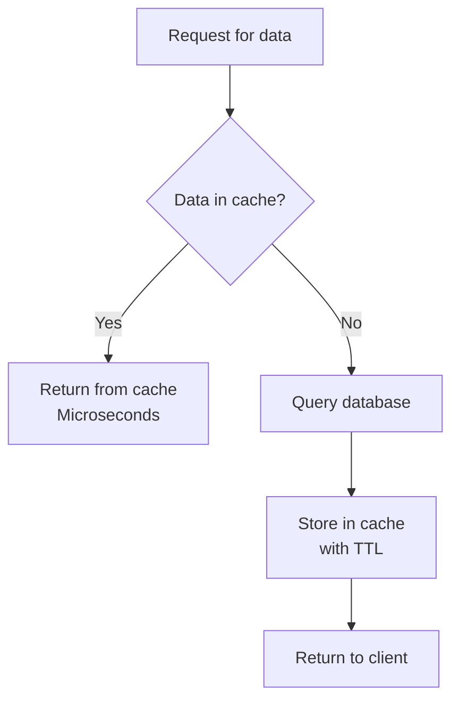

TTL : Time To Live - automatically expire cache entries after a certain time

**Code Example:**

```javascript
async function getUser(userId) {
  // Check cache first
  const cached = await cache.get(`user:${userId}`);
  if (cached) {
    return cached; // Fast!
  }

  // Cache miss - fetch from DB
  const user = await database.getUserById(userId);

  // Store in cache for next time
  await cache.set(`user:${userId}`, user, {
    ttl: 3600, // 1 hour
  });

  return user;
}
```

**Advantages:**

- Simple to implement
- Only cache what's used
- Less overhead on writes
- Natural data expiration

**Disadvantages:**

- First request is slow (cache miss)
- Can serve stale data briefly after updates
- "Thundering herd" problem (many cache misses at once)

**Real-World Example: Patent Information**

```
User 1: Requests patent info
  → Cache miss → Query database → Cache result

User 2: Requests same patent info
  → Cache hit → Instant response

User 3: Requests same patent info
  → Cache hit → Instant response
```

---

### Strategy 2: Write-Through Caching

**When to use:** When consistency is critical

**How it works:**

```
1. Data modified (create/update)
2. Update DATABASE
3. Update CACHE (same transaction)
4. Return success to user
```

**Code Example:**

```javascript
async function updateUser(userId, updates) {
  // Start transaction
  await database.beginTransaction();

  try {
    // Update database
    const updatedUser = await database.updateUser(userId, updates);

    // Update cache immediately
    await cache.set(`user:${userId}`, updatedUser);

    // Commit transaction
    await database.commit();
    return updatedUser;
  } catch (error) {
    await database.rollback();
    throw error;
  }
}
```

**Flowchart:**

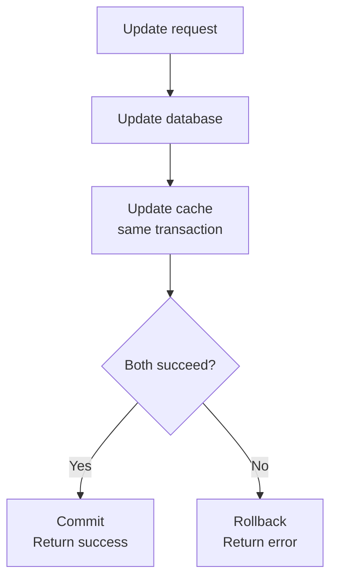

**Advantages:**

- Cache always fresh
- Never serve stale/expired data
- Database and cache always consistent
- Predictable behavior

**Disadvantages:**

- Every write has overhead (update two places)
- Higher latency on write operations
- More complex to implement
- Potential for transaction failures

**Trade-off Visualization:**

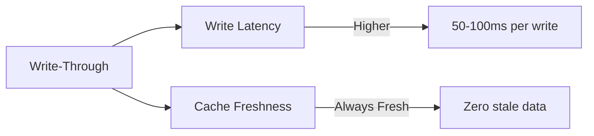

---

### Strategy 3: Write-Behind (Write-Back)

**When to use:** High-volume writes, eventual consistency acceptable

**How it works (with timeline):**

```
Timeline:

User sends update request
    ↓
T=0ms:   Update CACHE immediately ✓
         Return SUCCESS to user immediately ✓
         User thinks it's done!
    ↓
T=5ms:   Queue database update (add to task queue)
    ↓
T=1 second later: Background worker picks up task
                  Updates DATABASE ✓
                  (User already got response!)
```

**Key Difference from Write-Through:**

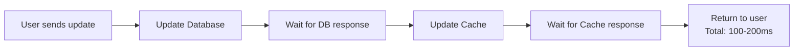

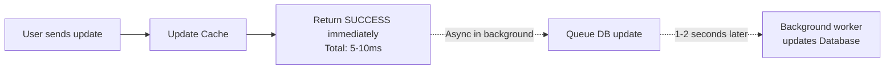

**Real-World Example: Social Media Like Button**

User clicks "Like" on your post:

```
Write-Through (current way):
  Click → Update DB (wait) → Update cache (wait) → Show "Liked" → 200ms wait

Write-Behind (proposed):
  Click → Update cache (instant) → Show "Liked" → Return (10ms)
          Queue DB update ↓
          Background: Update DB after 1 second
```

**Code Example:**

```javascript
// Write-Behind implementation
async function likePost(postId, userId) {
  // STEP 1: Update cache immediately
  await cache.incr(`post:${postId}:likes`);
  await cache.sadd(`post:${postId}:liked_by`, userId);

  // STEP 2: Return response to user IMMEDIATELY
  // User sees "Liked!" right away
  return { success: true, likes: newCount };

  // STEP 3: Queue database update async (fire and forget)
  taskQueue.enqueue("update_post_likes", {
    postId,
    userId,
    action: "like",
  });

  // Background worker picks this up 1-2 seconds later
  // and does: await database.incrementLikes(postId, userId)
}
```

**What Happens DURING the Gap (cache updated, DB not yet updated)?**

```
Timeline of data consistency:

T=0:    Cache updated: likes = 105
        User sees: "✓ Liked (105 likes)"
        Database: likes = 104 (still old!)

T=0.5s: User refreshes page
        Page reads from cache: "105 likes" ✓

T=2s:   Background job updates database: likes = 105
        Now both in sync!
```

**Advantages:**

- ⚡ **Fastest write performance** - User only waits for cache update (5-10ms)
- 🚀 **Handles traffic spikes** - Can queue unlimited updates, process asynchronously
- 📱 **Good for non-critical data** - Social media counters, view counts, ratings
- 💰 **Cheaper compute** - Batch database updates together

**Disadvantages & Risks:**

- ☠️ **Data loss risk** - If cache crashes, queued updates are lost

  ```
  Example: User likes post, cache updated, but before DB update:
  → Cache crashes
  → like_count incremented to 105 in cache
  → But on restart, only 104 likes in DB
  → The like is lost!
  ```

- 🕐 **Eventual consistency** - Data temporarily inconsistent

  ```
  Real scenario:
  T=0: Cache: 105 likes, DB: 104 likes (different!)
  T=1: Page loads from cache: "105 likes" ✓ correct
  T=5: Other user's page loads from cache: "105 likes" ✓ correct
  T=10: Cache expires, falls back to DB: "104 likes" ✗ Different!
  ```

- 🔧 **Complex to implement** - Need reliable task queue, error handling, recovery

**When Write-Behind is SAFE to use:**

✓ **Counters** - Page views, impressions, likes (small loss is acceptable)
✓ **Ratings** - Average ratings (small lag is ok)
✓ **Activity logs** - User activities, analytics (eventual consistency is fine)
✓ **Notifications** - Read/unread status (users tolerate 1-2 sec delay)
✓ **Leaderboards** - Game scores (users accept 1-2 second ranking delay)
✓ **View counts** - Video views, article reads (approximate numbers acceptable)

**Real-time Data Clarification:**

The rule "don't cache real-time data" needs nuance:

```
TRUE Real-Time (Don't Cache):
├─ Stock prices (traders lose money if stale)
├─ Bank balances (legal requirement to be current)
├─ Seat availability (overbooking if stale)
├─ Inventory levels (overselling consequences)
└─ Surgical monitor readings (life or death)

"Eventually Real-Time" (SAFE to Cache):
├─ Leaderboard scores (1-2 sec old is fine)
├─ Like counts (showing 105 vs 107 doesn't matter)
├─ View counts (approximations acceptable)
├─ Comment counts (users don't need exact number)
└─ Social media metrics (eventual consistency expected)

Key Question: "If this shows 2 seconds old data, will user notice or care?"
If NO → Can cache with Write-Behind
If YES → Must use Write-Through or not cache
```

**When NOT to use Write-Behind:**

✗ **Financial transactions** - Must be immediate and guaranteed
✗ **User accounts** - Password changes, email changes (must be instant)
✗ **Inventory** - Stock levels (even small delay causes overselling)
✗ **Critical data** - Anything where data loss is unacceptable

**Comparison: All 3 Strategies**

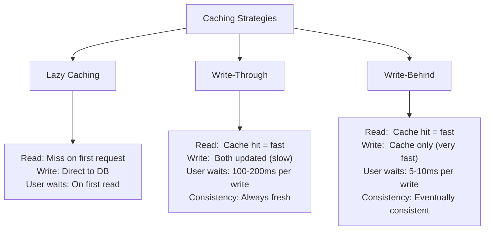

**Data Consistency Timeline Comparison:**

```
Scenario: User updates profile name

Write-Through:
├─ T=0ms: Update DB (John → John Smith)
├─ T=50ms: Update cache
├─ T=100ms: Return to user
├─ Both always in sync ✓

Write-Behind:
├─ T=0ms: Update cache (John → John Smith)
├─ T=10ms: Return to user
├─ T=2000ms: Background job updates DB
├─ Gap: cache has "Smith", DB has "John" ⚠️
├─ After 2s: Both in sync ✓

Lazy Loading:
├─ T=0ms: Return to user (from cache if old)
├─ Later: Update DB asynchronously
├─ Gap: cache has old "John", DB has new "Smith" ⚠️
├─ After cache TTL expires: Eventually syncs ✓
```

---

## Eviction Policies

When cache runs out of memory, you must decide what to remove.

### Why Eviction Policies Matter

In-memory caches use RAM which is limited:

```
Available RAM: 16 GB Cache Size
New data arrives but cache is full
Decision: Which old data do we delete?
```

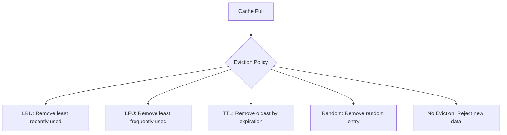

---

### Policy 1: No Eviction

**What happens:**

- When cache is full, return error
- No data is removed

**Use case:** Almost never used in production - not practical

---

### Policy 2: LRU (Least Recently Used)

**Logic:** Remove the key accessed longest ago

**Example:**

```
Cache Keys: [1, 2, 3, 4] (Full)

Access Timeline:
- Key 1: accessed 5 minutes ago
- Key 2: accessed 2 minutes ago
- Key 3: accessed 1 minute ago
- Key 4: accessed 30 seconds ago ← Most Recent

New Key 5 arrives:
→ Remove Key 1 (accessed longest ago)
→ Insert Key 5
```

**Visual:**


**When to use:**

- General-purpose caching
- Most common eviction policy
- Items accessed recently tend to be accessed again

**Implementation in Redis:**

```
REDIS_CONFIG: {
    maxmemory-policy: "allkeys-lru"
}
```

---

### Policy 3: LFU (Least Frequently Used)

**Logic:** Remove the key accessed least often

**Example:**

```
Cache Keys: [1, 2, 3, 4]

Access Frequency:
- Key 1: accessed 5 times (least frequent)
- Key 2: accessed 10 times
- Key 3: accessed 6 times
- Key 4: accessed 23 times (most frequent)

New Key 5 arrives:
→ Remove Key 1 (accessed least frequently)
→ Insert Key 5
```

**Visual:**

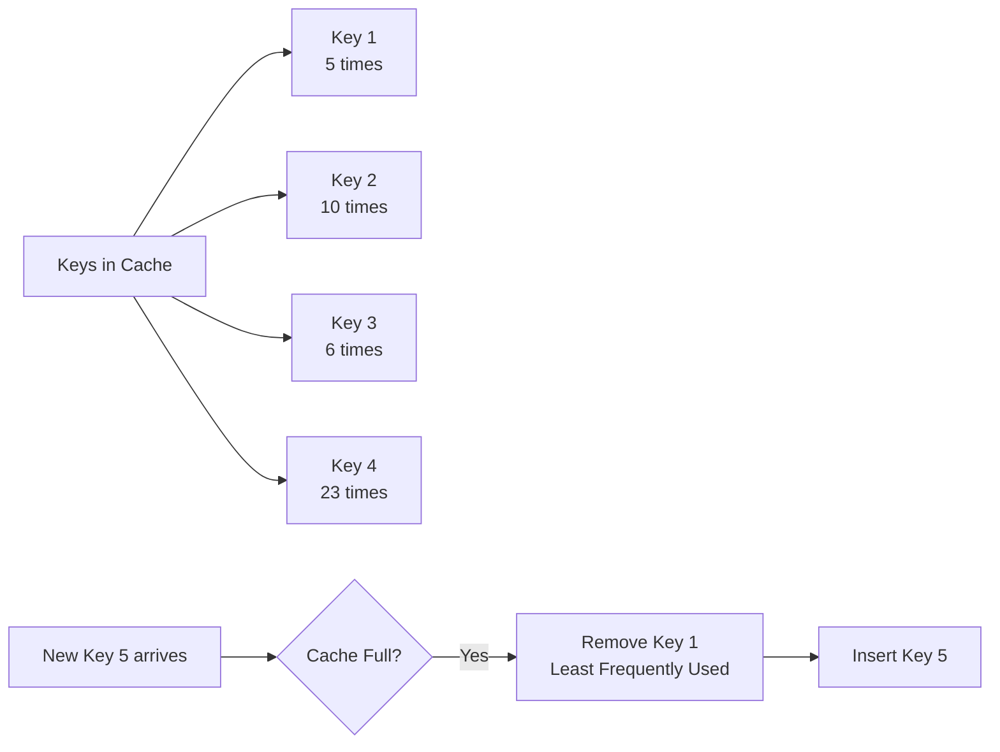

**When to use:**

- When you want to keep frequently accessed items
- Popular items pattern (80/20 rule)
- Better than LRU for variable access patterns

**Implementation in Redis:**

```
REDIS_CONFIG: {
    maxmemory-policy: "allkeys-lfu"
}
```

---

### Policy 4: TTL (Time To Live) Based

**Logic:** Remove items that expire soonest

**Example:**

```
Cache Keys: [1, 2, 3, 4]

TTL Remaining:
- Key 1: 5 minutes (expires soonest)
- Key 2: 30 minutes
- Key 3: 2 hours
- Key 4: 10 hours

New Key 5 arrives:
→ Remove Key 1 (expires soonest anyway)
→ Insert Key 5
```

**Visual:**

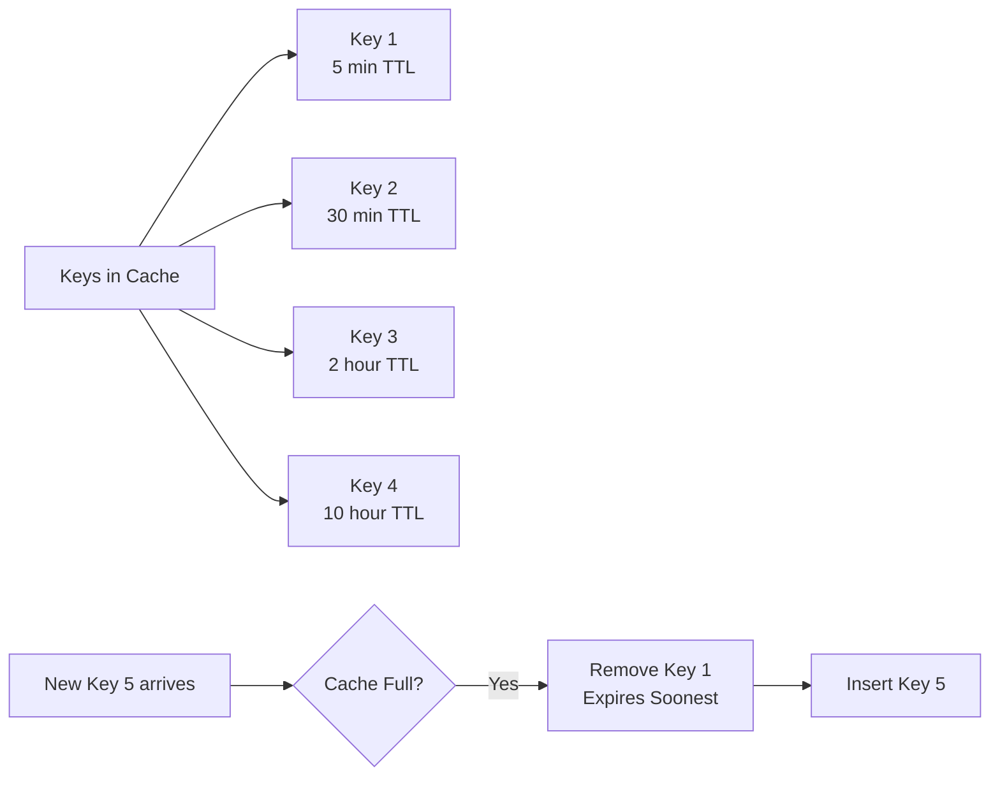

**Additional Benefit:** Keys automatically expire after TTL

```javascript
// Set key with 1 hour TTL
redis.set("user:123", userData, "EX", 3600);

// After 3600 seconds:
// Key automatically deleted
// No need for manual cleanup
```

**When to use:**

- Most common in production
- Data that should be invalidated regularly
- Prevents serving very stale data

**Implementation in Redis:**

```
REDIS_CONFIG: {
    maxmemory-policy: "volatile-ttl"
}
```

---

### Policy 5: Random

**Logic:** Remove random entry

**When to use:** Almost never - no intelligence, last resort

---

### Eviction Policy Comparison

| Policy          | What Gets Removed         | Use Case           | Complexity |
| --------------- | ------------------------- | ------------------ | ---------- |
| **LRU**         | Least recently accessed   | General purpose    | Low        |
| **LFU**         | Least frequently accessed | Popular items      | Medium     |
| **TTL**         | Expires soonest           | Time-based data    | Medium     |
| **Random**      | Random entry              | Emergency fallback | Low        |
| **No Eviction** | Nothing (error)           | Not recommended    | Low        |

---

## In-Memory Cache Technologies

### Redis

**What is Redis?**

- Open-source in-memory key-value store
- Supports complex data structures (strings, lists, sets, hashes, sorted sets)
- Atomicity guarantees
- Expiration support
- Pub/Pub messaging

**Basic Commands:**

```javascript
// String operations
redis.set("user:123", JSON.stringify(userData));
redis.get("user:123");

// Expiration
redis.expire("user:123", 3600); // 1 hour TTL

// List operations
redis.lpush("recent_activities", activity);
redis.lrange("recent_activities", 0, -1);

// Increment counter (atomic)
redis.incr("page_views:123");

// Hash operations
redis.hset("user:123", "name", "John");
redis.hget("user:123", "name");
```

### Memcached

**What is Memcached?**

- Lightweight key-value cache
- Simpler than Redis
- Good for simple caching patterns
- Lower memory overhead

### Comparison

| Feature             | Redis                               | Memcached      |
| ------------------- | ----------------------------------- | -------------- |
| **Data Structures** | Rich (strings, lists, sets, hashes) | Strings only   |
| **Persistence**     | Optional                            | No             |
| **Complexity**      | Higher                              | Lower          |
| **Use Case**        | General purpose                     | Simple caching |

---

## Real-World Use Cases

### Use Case 1: Database Query Caching

**Problem:**

```
User lands on homepage
50 products to display
Each product requires complex SQL query:
  - Multiple JOINs
  - Aggregations
  - Processes millions of rows
  - Takes 500ms per query
Total: 50 × 500ms = 25 seconds (unacceptable)
```

**Solution:**

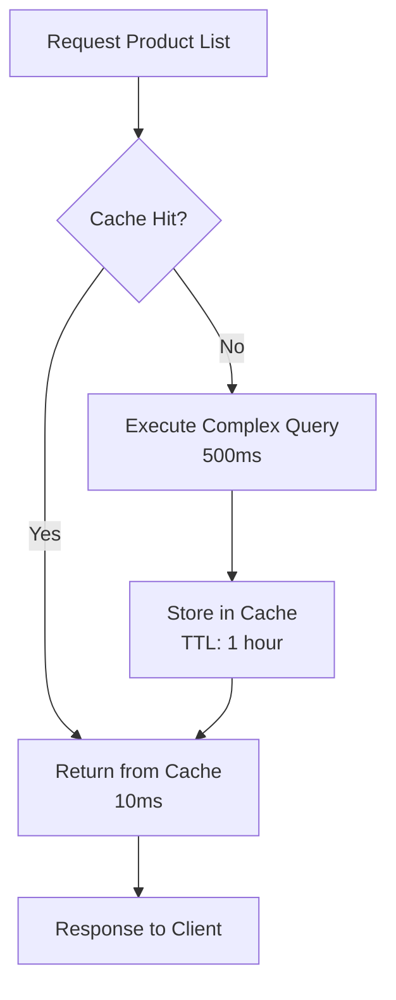

**Implementation:**

```javascript
async function getProductCatalog() {
  // Check cache
  const cached = await redis.get("products:catalog");
  if (cached) return JSON.parse(cached);

  // Cache miss - expensive query
  const products = await database.query(`
        SELECT p.*, 
               COUNT(o.id) as order_count,
               AVG(o.amount) as avg_order_value
        FROM products p
        LEFT JOIN orders o ON p.id = o.product_id
        GROUP BY p.id
    `);

  // Cache for 1 hour
  await redis.set("products:catalog", JSON.stringify(products), "EX", 3600);

  return products;
}
```

**Real-World Example: E-commerce Sale**

```
Scenario: MacBook sale starts
Expected: 1 million users will view product

Without caching:
- 1 million database queries
- Database overwhelmed
- 503 Service Unavailable errors
- Lost sales

With caching:
- 1 database query (cache miss)
- 999,999 cache hits
- Database unused
- All users served
- Sales successful
```

---

### Use Case 2: Session Storage

**Problem:**

```
Every API request needs user authentication
Without session cache:
  - Query database for user
  - Check permissions
  - Verify token
Takes: 50-100ms per request
With 1000 concurrent users: 1000 × 100ms of DB load per second
```

**Solution:**

```
Session Flow with Redis:
1. User logs in successfully
2. Generate session token
3. Store in Redis (not database!)

Every subsequent request:
1. Extract token from headers
2. Check Redis for session (microseconds)
3. Continue with request
```

**Why Redis, Not Database?**

| Storage        | Latency        | Load     |
| -------------- | -------------- | -------- |
| Database       | 50ms           | High     |
| Redis          | 0.001ms        | None     |
| **Difference** | 50,000x faster | 99% less |

**Implementation:**

```javascript
// After successful login
async function createSession(userId) {
  const token = generateToken();

  // Store in Redis, not database
  await redis.set(
    `session:${token}`,
    JSON.stringify({
      userId,
      loginTime: Date.now(),
      permissions: ["read", "write"],
    }),
    "EX",
    86400, // 24 hours
  );

  return token;
}

// Middleware for each request
async function checkSession(req, res, next) {
  const token = req.headers.authorization;

  // Fast Redis lookup
  const session = await redis.get(`session:${token}`);
  if (!session) {
    return res.status(401).json({ error: "Unauthorized" });
  }

  req.user = JSON.parse(session);
  next();
}
```

---

### Sessions vs JWT Tokens: When to Use Each

**This is often confusing:** Do I need caching for authentication?

**Answer:** Depends on your architecture.

**Traditional Web Apps (Use Sessions with Cache):**

```
Flow:
1. User logs in
2. Server generates session ID
3. Server stores session data in Redis: { sessionId: 1234 → { userId: 5, role: "admin" } }
4. Browser stores session ID in cookie
5. Every request: Browser sends ID, server looks up in Redis (fast!)

Pro: Full control, can revoke instantly, permissions changes take effect immediately
Con: Server-side state, doesn't scale infinitely
Use when: Server-rendered pages, single monolithic app
```

**Modern APIs (Use JWT Tokens, No Cache Needed):**

```
Flow:
1. User logs in
2. Server creates JWT token (signed with secret)
3. Token contains: { userId: 5, role: "admin", exp: 1hour }
4. Server sends token, client stores it
5. Every request: Client sends JWT, server verifies signature (no DB/cache needed!)

Pro: Stateless, scales infinitely, works across services
Con: Can't revoke immediately, permissions changes lag until token expires
Use when: Mobile apps, microservices, cross-domain APIs
```

**Hybrid: JWT + Blacklist (Best of Both Worlds):**

```
Flow:
1. User logs in → Get JWT token
2. User wants to logout → Server adds token ID to Redis blacklist
3. Subsequent requests: Check if token in blacklist first
4. If not blacklisted → Validate signature → Allow

Pro: Mostly stateless but can logout immediately
Con: Need to check blacklist (small overhead)
Use when: Need logout + stateless benefits
```

**Comparison Table:**

| Feature          | Sessions        | JWT          | JWT + Blacklist     |
| ---------------- | --------------- | ------------ | ------------------- |
| **Revocation**   | Instant ✓       | On expiry ✗  | Instant ✓           |
| **Stateless**    | No ✗            | Yes ✓        | Mostly ✓            |
| **Scales**       | Moderate        | Infinite     | Infinite            |
| **Cache needed** | Yes (Redis)     | No           | Minimal (blacklist) |
| **Best for**     | Traditional web | Mobile/APIs  | Hybrid systems      |
| **Logout speed** | Immediate       | Next request | Immediate           |

**In your caching lecture context:**

```
Sessions ARE a valid use of caching:
- They're not "sensitive data" (no credentials)
- Redis lookup is 50,000x faster than database
- Core caching principle: frequently accessed, expensive to compute

JWT tokens are an alternative that doesn't need caching:
- If using JWT, you don't need Redis for auth
- But you might add Redis blacklist for logout
```

---

### Use Case 3: API Response Caching

**Problem:**

```
Your backend calls external weather API
Your frontend calls your backend frequently
Result: Excessive external API calls

Weather API Rate Limit: 100 requests/hour
Reality: You're making 1000 requests/hour (from 1000 users)
Consequences:
  - Hit rate limit (429 errors)
  - High billing
  - Service blocks your IP
```

**Solution: Cache External Responses**

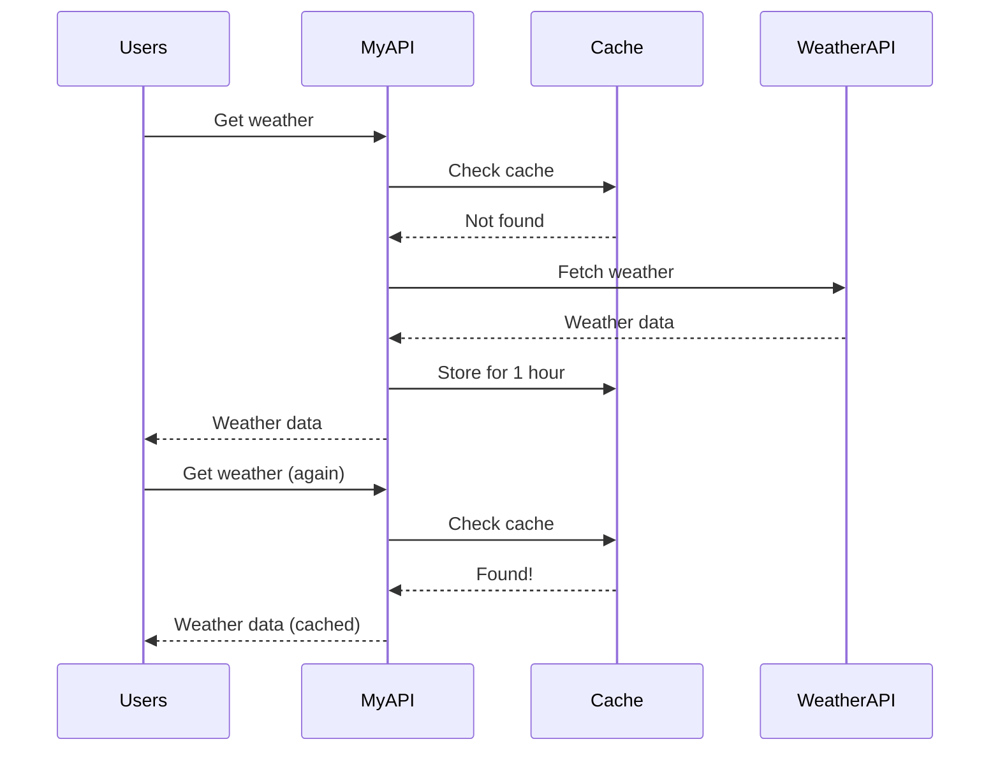

**Implementation:**

```javascript
async function getWeather(city) {
  const cacheKey = `weather:${city}`;

  // Check cache first
  const cached = await redis.get(cacheKey);
  if (cached) {
    return JSON.parse(cached);
  }

  // Cache miss - call external API
  const weather = await weatherAPI.getWeather(city);

  // Cache for 1 hour
  await redis.set(cacheKey, JSON.stringify(weather), "EX", 3600);

  return weather;
}
```

**Cost Benefit:**

```
Before caching:
- 1000 API calls/hour to weather service
- Billing: $0.01 per call = $10/hour
- Monthly: $7,200

After caching (1 hour TTL):
- ~10 API calls/hour (1 per user group)
- Billing: ~$0.10/hour
- Monthly: ~$72
- Savings: 99% reduction!
```

---

### Use Case 4: Rate Limiting

**How it works:**

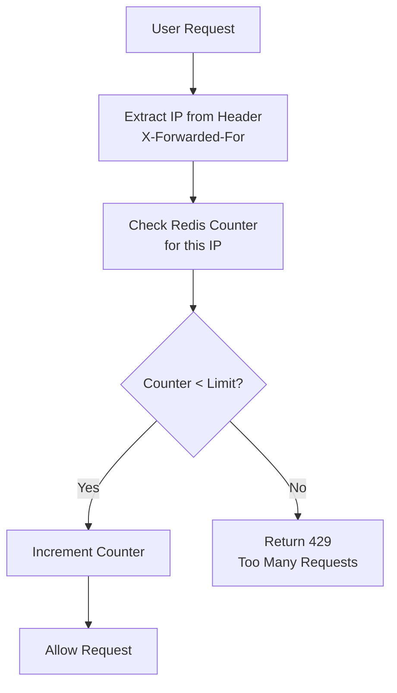

**Why Redis for Rate Limiting?**

```
Without Redis (using database):
- Query: "SELECT count FROM rate_limits WHERE ip = 123"
- Latency: 50ms per request
- With 1000 users: 50 seconds of DB time per second
- Database overwhelmed

With Redis:
- Query: Redis counter (atomic)
- Latency: 0.001ms per request
- With 1000 users: 1ms of Redis time per second
- Redis handles easily
```

**Implementation:**

```javascript
async function rateLimitMiddleware(req, res, next) {
  const ip = req.headers["x-forwarded-for"];
  const key = `rate_limit:${ip}:${currentMinute()}`;

  const count = await redis.incr(key);

  if (count === 1) {
    // First request this minute, set expiration
    await redis.expire(key, 60);
  }

  const maxRequests = 50; // 50 requests per minute

  if (count > maxRequests) {
    return res.status(429).json({
      error: "Too many requests",
      retryAfter: 60,
    });
  }

  next();
}
```

**Rate Limiting Architecture:**

```
IP: 192.168.1.5
Minute 1: [1, 2, 3, ..., 48] (48 requests)
→ Next request allowed ✓

IP: 192.168.1.6
Minute 1: [1, 2, 3, ..., 50] (50 requests)
→ Next request rejected ✗
→ Return 429 Too Many Requests

Minute 2:
Counter resets
All IPs can make requests again
```

**Other Uses:**

- Protect against brute force attacks
- Prevent API abuse
- Manage traffic spikes
- Fair resource allocation

---

### Use Case 5: Leaderboards & Counters

**Use Case:** Game leaderboard, real-time statistics

**Why Redis:**

- Native support for sorted sets
- Atomic operations
- Real-time updates

**Implementation:**

```javascript
// Update score
async function updateScore(userId, points) {
  await redis.zadd("leaderboard", points, userId);
}

// Get top 10
async function getTopPlayers() {
  return await redis.zrange("leaderboard", 0, 9, "WITHSCORES");
  // Returns: [userId1, score1, userId2, score2, ...]
}

// Get user rank
async function getUserRank(userId) {
  return (await redis.zrevrank("leaderboard", userId)) + 1;
}
```

---

## Implementation Guide

### Getting Started with Redis

#### Installation

**Local Development (Docker):**

```bash
docker run -d -p 6379:6379 redis:latest
```

**Production (Managed Services):**

- AWS ElastiCache
- Azure Cache for Redis
- Google Cloud Memorystore
- Heroku Redis

#### Language-Specific Libraries

| Language    | Library                 |
| ----------- | ----------------------- |
| **Node.js** | `node-redis`, `ioredis` |
| **Python**  | `redis-py`              |
| **Java**    | `Jedis`, `Lettuce`      |
| **Go**      | `go-redis`              |
| **Ruby**    | `redis-rb`              |
| **PHP**     | `predis`, `phpredis`    |

#### Example Setup (Node.js)

```javascript
const redis = require("redis");

const client = redis.createClient({
  host: process.env.REDIS_HOST || "localhost",
  port: process.env.REDIS_PORT || 6379,
  password: process.env.REDIS_PASSWORD,
  db: 0,
});

client.on("error", (err) => console.error("Redis Error:", err));
client.on("connect", () => console.log("Redis Connected"));

module.exports = client;
```

### Monitoring Cache Performance

**Key Metrics:**

```javascript
// Cache hit rate
const hitRate = (hits / (hits + misses)) * 100;

// Memory usage
const memoryUsage = redis.info("memory").used_memory;

// Eviction count
const evictions = redis.info("stats").evicted_keys;
```

**Good Targets:**

- Hit rate: 80%+ (varies by use case)
- Memory: Monitor growth
- Evictions: Minimal (tune TTL and policy)

---

## Summary: Caching Checklist

```
Caching Strategy Selection:
✓ Lazy Caching: Simple, general use cases
✓ Write-Through: Critical consistency needs
✓ Write-Behind: High-volume writes

Cache Eviction Policy:
✓ LRU: Most common, general purpose
✓ LFU: Popular items pattern
✓ TTL: Time-based expiration

Implementation:
✓ Choose cache technology (Redis/Memcached)
✓ Set appropriate TTL values
✓ Monitor hit rates
✓ Test under load
✓ Plan cache invalidation strategy

Use Cases:
✓ Database query results
✓ Session data
✓ External API responses
✓ Rate limiting counters
✓ Real-time data (leaderboards, stats)
```

---

## Key Takeaways

1. **Caching is about speed** - Serve data from faster storage (microseconds vs milliseconds)

2. **Cache is a subset** - Never replicate entire database, cache only what's accessed frequently

3. **Choose your strategy** based on consistency requirements:
   - Lazy: Simple but first request slower
   - Write-Through: Always fresh, higher write latency
   - Write-Behind: Fast writes, eventual consistency

4. **Eviction policies matter**:
   - **LRU**: Remove least recently used (most common)
   - **LFU**: Remove least frequently used
   - **TTL**: Auto-expire items based on time

5. **Redis is your go-to** for most use cases:
   - Rich data structures
   - Atomic operations
   - Persistence options
   - Battle-tested in production

6. **Common applications**:
   - Query result caching (1 query → 99 cache hits)
   - Session storage (faster than database by 50,000x)
   - API response caching (reduce external API calls)
   - Rate limiting (microseconds per request)
   - Real-time counters (atomic updates)

7. **Monitor effectiveness**:
   - Aim for 80%+ hit rate
   - Watch memory growth
   - Track evictions
   - Measure latency improvements

8. **Plan cache invalidation**:
   - TTL-based (automatic)
   - Event-based (manual invalidation)
   - Hybrid approach (TTL + manual)

9. **Be smart about sensitive data**:
   - ❌ Never cache: Passwords, credit cards, API keys, SSNs
   - ✓ DO cache: Sessions (userId + roles + permissions)
   - ✓ DO cache: JWT tokens (stateless, signature-verified)
   - Key principle: Cache identification, not authentication

10. **Test your caching strategy** before production deployment
